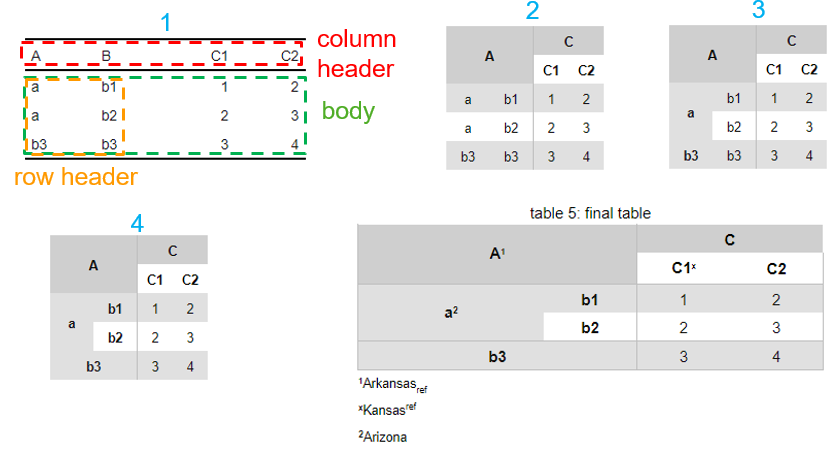
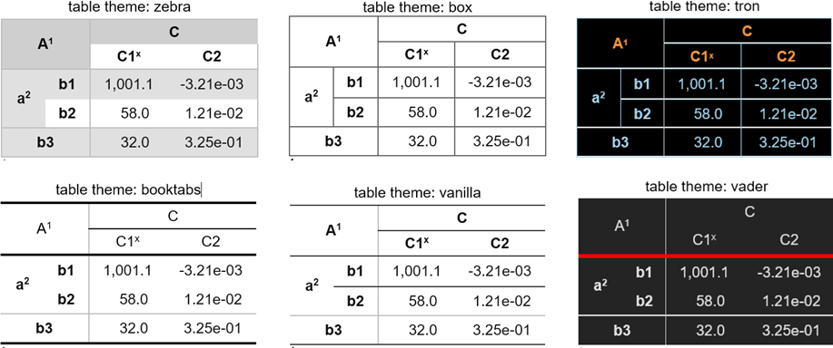

<style type="text/css">
h1.title {
font-size: ;
font-family: ;
color: ;
text-align: center;
}
h4.author {
font-size: ;
font-family: ;
color: ;
text-align: center;
}
h4.date {
font-size: ;
font-family: ;
color: ;
text-align: center;
}
</style>

# Acknowledgement
The development of this workflow is inspired by Dr. Wenfei Zhang's previous work in separating data analysis from document creation - saving analysis results in R script and including those results in a R markdown file for document generation.

This work was supervised by Dr. Donghui Zhang at Sanofi.

Thanks to the authors of those excellent R package [flextable](https://davidgohel.github.io/flextable), [kableExtra](https://haozhu233.github.io/kableExtra), knitr, and [bookdown](https://bookdown.org/yihui/bookdown).


# Who can benefit from this package
The primary purpose of this package is to help saving time for users of the following tasks:   

* Using R to carry out large data analysis project with many outputs, e.g. tables and figures, to save and manage.
* Using R markdown to create post-analysis documents containing many tables and figures from the first step.

In addition, it ensures consist formatting of the tables and numbers in all such documents created by different people in an organization.

# Background and Objective
## Non-statistical Work in Large Data Analysis Project
Significant amount of effort spent in a data analysis task is non-statistical. 

A large data analysis project can produce many outputs, e.g. tables and figure, that are reviewed later. Annotating and managing all outputs are time-consuming but very important for future query, review, and understanding.

More importantly, in compiling reports for such projects, many of those output tables and figures are included. Table  1 is one such example. If a report contains two dozen such tables, compiling, formatting, and cross-referencing those tables take lots of time.

<table style='border-collapse:collapse;'><thead><tr><td colspan="5" style="width:88px;height:18px;background-color:transparent;vertical-align: middle;transform: rotate(0deg);border-bottom: 1px solid rgba(255, 255, 255, 0.00);border-top: 1px solid rgba(255, 255, 255, 0.00);border-left: 1px solid rgba(255, 255, 255, 0.00);border-right: 1px solid rgba(255, 255, 255, 0.00);margin-bottom:0;margin-top:0;margin-left:0;margin-right:0;"><p style="margin:0;text-align:center;border-bottom: 0 solid rgba(0, 0, 0, 1.00);border-top: 0 solid rgba(0, 0, 0, 1.00);border-left: 0 solid rgba(0, 0, 0, 1.00);border-right: 0 solid rgba(0, 0, 0, 1.00);padding-bottom:0;padding-top:0;padding-left:0;padding-right:0;background-color:transparent;"><span style="font-family:'Arial';font-size:11px;font-weight:normal;font-style:normal;text-decoration:none;color:rgba(0, 0, 0, 1.00);background-color:transparent;">Table  1: Age and Sex statistics</span></p></td></tr><tr><td rowspan="2" style="width:88px;height:18px;background-clip: padding-box;background-color:rgba(207, 207, 207, 1.00);vertical-align: middle;transform: rotate(0deg);border-bottom: 0 solid rgba(0, 0, 0, 1.00);border-top: 1px solid rgba(190, 190, 190, 1.00);border-left: 1px solid rgba(190, 190, 190, 1.00);border-right: 1px solid rgba(190, 190, 190, 1.00);margin-bottom:0;margin-top:0;margin-left:0;margin-right:0;"><p style="margin:0;text-align:center;border-bottom: 0 solid rgba(0, 0, 0, 1.00);border-top: 0 solid rgba(0, 0, 0, 1.00);border-left: 0 solid rgba(0, 0, 0, 1.00);border-right: 0 solid rgba(0, 0, 0, 1.00);padding-bottom:2px;padding-top:2px;padding-left:2px;padding-right:2px;background-color:transparent;"><span style="font-family:'Arial';font-size:11px;font-weight:bold;font-style:normal;text-decoration:none;color:rgba(0, 0, 0, 1.00);background-color:transparent;">variable</span></p></td><td rowspan="2" style="width:77px;height:18px;background-clip: padding-box;background-color:rgba(207, 207, 207, 1.00);vertical-align: middle;transform: rotate(0deg);border-bottom: 0 solid rgba(0, 0, 0, 1.00);border-top: 1px solid rgba(190, 190, 190, 1.00);border-left: 1px solid rgba(190, 190, 190, 1.00);border-right: 1px solid rgba(190, 190, 190, 1.00);margin-bottom:0;margin-top:0;margin-left:0;margin-right:0;"><p style="margin:0;text-align:center;border-bottom: 0 solid rgba(0, 0, 0, 1.00);border-top: 0 solid rgba(0, 0, 0, 1.00);border-left: 0 solid rgba(0, 0, 0, 1.00);border-right: 0 solid rgba(0, 0, 0, 1.00);padding-bottom:2px;padding-top:2px;padding-left:2px;padding-right:2px;background-color:transparent;"><span style="font-family:'Arial';font-size:11px;font-weight:bold;font-style:normal;text-decoration:none;color:rgba(0, 0, 0, 1.00);background-color:transparent;">stats</span></p></td><td colspan="3" style="width:64px;height:18px;background-clip: padding-box;background-color:rgba(207, 207, 207, 1.00);vertical-align: middle;transform: rotate(0deg);border-bottom: 0 solid rgba(0, 0, 0, 1.00);border-top: 1px solid rgba(190, 190, 190, 1.00);border-left: 1px solid rgba(190, 190, 190, 1.00);border-right: 0 solid rgba(0, 0, 0, 1.00);margin-bottom:0;margin-top:0;margin-left:0;margin-right:0;"><p style="margin:0;text-align:center;border-bottom: 0 solid rgba(0, 0, 0, 1.00);border-top: 0 solid rgba(0, 0, 0, 1.00);border-left: 0 solid rgba(0, 0, 0, 1.00);border-right: 0 solid rgba(0, 0, 0, 1.00);padding-bottom:2px;padding-top:2px;padding-left:2px;padding-right:2px;background-color:transparent;"><span style="font-family:'Arial';font-size:11px;font-weight:bold;font-style:normal;text-decoration:none;color:rgba(0, 0, 0, 1.00);background-color:transparent;">subject</span><span style="font-family:'Arial';font-size:6px;font-weight:bold;font-style:normal;text-decoration:none;color:rgba(0, 0, 0, 1.00);background-color:transparent;position: relative;bottom:3px;">a</span></p></td></tr><tr><td style="width:64px;height:18px;background-color:transparent;vertical-align: middle;transform: rotate(0deg);border-bottom: 1px solid rgba(190, 190, 190, 1.00);border-top: 0 solid rgba(0, 0, 0, 1.00);border-left: 1px solid rgba(190, 190, 190, 1.00);border-right: 0 solid rgba(0, 0, 0, 1.00);margin-bottom:0;margin-top:0;margin-left:0;margin-right:0;"><p style="margin:0;text-align:center;border-bottom: 0 solid rgba(0, 0, 0, 1.00);border-top: 0 solid rgba(0, 0, 0, 1.00);border-left: 0 solid rgba(0, 0, 0, 1.00);border-right: 0 solid rgba(0, 0, 0, 1.00);padding-bottom:2px;padding-top:2px;padding-left:2px;padding-right:2px;background-color:transparent;"><span style="font-family:'Arial';font-size:11px;font-weight:bold;font-style:normal;text-decoration:none;color:rgba(0, 0, 0, 1.00);background-color:transparent;">case</span></p></td><td style="width:64px;height:18px;background-color:transparent;vertical-align: middle;transform: rotate(0deg);border-bottom: 1px solid rgba(190, 190, 190, 1.00);border-top: 0 solid rgba(0, 0, 0, 1.00);border-left: 0 solid rgba(0, 0, 0, 1.00);border-right: 0 solid rgba(0, 0, 0, 1.00);margin-bottom:0;margin-top:0;margin-left:0;margin-right:0;"><p style="margin:0;text-align:center;border-bottom: 0 solid rgba(0, 0, 0, 1.00);border-top: 0 solid rgba(0, 0, 0, 1.00);border-left: 0 solid rgba(0, 0, 0, 1.00);border-right: 0 solid rgba(0, 0, 0, 1.00);padding-bottom:2px;padding-top:2px;padding-left:2px;padding-right:2px;background-color:transparent;"><span style="font-family:'Arial';font-size:11px;font-weight:bold;font-style:normal;text-decoration:none;color:rgba(0, 0, 0, 1.00);background-color:transparent;">control</span></p></td><td style="width:70px;height:18px;background-color:transparent;vertical-align: middle;transform: rotate(0deg);border-bottom: 1px solid rgba(190, 190, 190, 1.00);border-top: 0 solid rgba(0, 0, 0, 1.00);border-left: 0 solid rgba(0, 0, 0, 1.00);border-right: 1px solid rgba(190, 190, 190, 1.00);margin-bottom:0;margin-top:0;margin-left:0;margin-right:0;"><p style="margin:0;text-align:center;border-bottom: 0 solid rgba(0, 0, 0, 1.00);border-top: 0 solid rgba(0, 0, 0, 1.00);border-left: 0 solid rgba(0, 0, 0, 1.00);border-right: 0 solid rgba(0, 0, 0, 1.00);padding-bottom:2px;padding-top:2px;padding-left:2px;padding-right:2px;background-color:transparent;"><span style="font-family:'Arial';font-size:11px;font-weight:bold;font-style:normal;text-decoration:none;color:rgba(0, 0, 0, 1.00);background-color:transparent;">all</span></p></td></tr></thead><tbody><tr><td rowspan="4" style="width:88px;height:18px;background-clip: padding-box;background-color:rgba(224, 224, 224, 1.00);vertical-align: middle;transform: rotate(0deg);border-bottom: 0 solid rgba(0, 0, 0, 1.00);border-top: 1px solid rgba(190, 190, 190, 1.00);border-left: 1px solid rgba(190, 190, 190, 1.00);border-right: 1px solid rgba(190, 190, 190, 1.00);margin-bottom:0;margin-top:0;margin-left:0;margin-right:0;"><p style="margin:0;text-align:center;border-bottom: 0 solid rgba(0, 0, 0, 1.00);border-top: 0 solid rgba(0, 0, 0, 1.00);border-left: 0 solid rgba(0, 0, 0, 1.00);border-right: 0 solid rgba(0, 0, 0, 1.00);padding-bottom:2px;padding-top:2px;padding-left:2px;padding-right:2px;background-color:transparent;"><span style="font-family:'Arial';font-size:11px;font-weight:bold;font-style:normal;text-decoration:none;color:rgba(17, 17, 17, 1.00);background-color:transparent;">Age (years)</span><span style="font-family:'Arial';font-size:7px;font-weight:bold;font-style:normal;text-decoration:none;color:rgba(17, 17, 17, 1.00);background-color:transparent;position: relative;bottom:3px;"></span><span style="font-family:'Arial';font-size:7px;font-weight:bold;font-style:normal;text-decoration:none;color:rgba(17, 17, 17, 1.00);background-color:transparent;position: relative;bottom:3px;">b</span></p></td><td style="width:77px;height:18px;background-clip: padding-box;background-color:rgba(224, 224, 224, 1.00);vertical-align: middle;transform: rotate(0deg);border-bottom: 0 solid rgba(0, 0, 0, 1.00);border-top: 1px solid rgba(190, 190, 190, 1.00);border-left: 1px solid rgba(190, 190, 190, 1.00);border-right: 1px solid rgba(190, 190, 190, 1.00);margin-bottom:0;margin-top:0;margin-left:0;margin-right:0;"><p style="margin:0;text-align:center;border-bottom: 0 solid rgba(0, 0, 0, 1.00);border-top: 0 solid rgba(0, 0, 0, 1.00);border-left: 0 solid rgba(0, 0, 0, 1.00);border-right: 0 solid rgba(0, 0, 0, 1.00);padding-bottom:2px;padding-top:2px;padding-left:2px;padding-right:2px;background-color:transparent;"><span style="font-family:'Arial';font-size:11px;font-weight:bold;font-style:normal;text-decoration:none;color:rgba(17, 17, 17, 1.00);background-color:transparent;">Number</span><span style="font-family:'Arial';font-size:7px;font-weight:bold;font-style:normal;text-decoration:none;color:rgba(17, 17, 17, 1.00);background-color:transparent;position: relative;bottom:3px;"></span></p></td><td style="width:64px;height:18px;background-clip: padding-box;background-color:rgba(224, 224, 224, 1.00);vertical-align: middle;transform: rotate(0deg);border-bottom: 0 solid rgba(0, 0, 0, 1.00);border-top: 1px solid rgba(190, 190, 190, 1.00);border-left: 1px solid rgba(190, 190, 190, 1.00);border-right: 0 solid rgba(0, 0, 0, 1.00);margin-bottom:0;margin-top:0;margin-left:0;margin-right:0;"><p style="margin:0;text-align:center;border-bottom: 0 solid rgba(0, 0, 0, 1.00);border-top: 0 solid rgba(0, 0, 0, 1.00);border-left: 0 solid rgba(0, 0, 0, 1.00);border-right: 0 solid rgba(0, 0, 0, 1.00);padding-bottom:2px;padding-top:2px;padding-left:2px;padding-right:2px;background-color:transparent;"><span style="font-family:'Arial';font-size:11px;font-weight:normal;font-style:normal;text-decoration:none;color:rgba(17, 17, 17, 1.00);background-color:transparent;">14</span><span style="font-family:'Arial';font-size:7px;font-weight:bold;font-style:normal;text-decoration:none;color:rgba(17, 17, 17, 1.00);background-color:transparent;position: relative;bottom:3px;"></span></p></td><td style="width:64px;height:18px;background-clip: padding-box;background-color:rgba(224, 224, 224, 1.00);vertical-align: middle;transform: rotate(0deg);border-bottom: 0 solid rgba(0, 0, 0, 1.00);border-top: 1px solid rgba(190, 190, 190, 1.00);border-left: 0 solid rgba(0, 0, 0, 1.00);border-right: 0 solid rgba(0, 0, 0, 1.00);margin-bottom:0;margin-top:0;margin-left:0;margin-right:0;"><p style="margin:0;text-align:center;border-bottom: 0 solid rgba(0, 0, 0, 1.00);border-top: 0 solid rgba(0, 0, 0, 1.00);border-left: 0 solid rgba(0, 0, 0, 1.00);border-right: 0 solid rgba(0, 0, 0, 1.00);padding-bottom:2px;padding-top:2px;padding-left:2px;padding-right:2px;background-color:transparent;"><span style="font-family:'Arial';font-size:11px;font-weight:normal;font-style:normal;text-decoration:none;color:rgba(17, 17, 17, 1.00);background-color:transparent;">12</span><span style="font-family:'Arial';font-size:7px;font-weight:bold;font-style:normal;text-decoration:none;color:rgba(17, 17, 17, 1.00);background-color:transparent;position: relative;bottom:3px;"></span></p></td><td style="width:70px;height:18px;background-clip: padding-box;background-color:rgba(224, 224, 224, 1.00);vertical-align: middle;transform: rotate(0deg);border-bottom: 0 solid rgba(0, 0, 0, 1.00);border-top: 1px solid rgba(190, 190, 190, 1.00);border-left: 0 solid rgba(0, 0, 0, 1.00);border-right: 1px solid rgba(190, 190, 190, 1.00);margin-bottom:0;margin-top:0;margin-left:0;margin-right:0;"><p style="margin:0;text-align:center;border-bottom: 0 solid rgba(0, 0, 0, 1.00);border-top: 0 solid rgba(0, 0, 0, 1.00);border-left: 0 solid rgba(0, 0, 0, 1.00);border-right: 0 solid rgba(0, 0, 0, 1.00);padding-bottom:2px;padding-top:2px;padding-left:2px;padding-right:2px;background-color:transparent;"><span style="font-family:'Arial';font-size:11px;font-weight:normal;font-style:normal;text-decoration:none;color:rgba(17, 17, 17, 1.00);background-color:transparent;">26</span><span style="font-family:'Arial';font-size:7px;font-weight:bold;font-style:normal;text-decoration:none;color:rgba(17, 17, 17, 1.00);background-color:transparent;position: relative;bottom:3px;"></span></p></td></tr><tr><td style="width:77px;height:18px;background-color:transparent;vertical-align: middle;transform: rotate(0deg);border-bottom: 0 solid rgba(0, 0, 0, 1.00);border-top: 0 solid rgba(0, 0, 0, 1.00);border-left: 1px solid rgba(190, 190, 190, 1.00);border-right: 1px solid rgba(190, 190, 190, 1.00);margin-bottom:0;margin-top:0;margin-left:0;margin-right:0;"><p style="margin:0;text-align:center;border-bottom: 0 solid rgba(0, 0, 0, 1.00);border-top: 0 solid rgba(0, 0, 0, 1.00);border-left: 0 solid rgba(0, 0, 0, 1.00);border-right: 0 solid rgba(0, 0, 0, 1.00);padding-bottom:2px;padding-top:2px;padding-left:2px;padding-right:2px;background-color:transparent;"><span style="font-family:'Arial';font-size:11px;font-weight:bold;font-style:normal;text-decoration:none;color:rgba(17, 17, 17, 1.00);background-color:transparent;">Mean (SD)</span><span style="font-family:'Arial';font-size:7px;font-weight:bold;font-style:normal;text-decoration:none;color:rgba(17, 17, 17, 1.00);background-color:transparent;position: relative;bottom:3px;"></span></p></td><td style="width:64px;height:18px;background-color:transparent;vertical-align: middle;transform: rotate(0deg);border-bottom: 0 solid rgba(0, 0, 0, 1.00);border-top: 0 solid rgba(0, 0, 0, 1.00);border-left: 1px solid rgba(190, 190, 190, 1.00);border-right: 0 solid rgba(0, 0, 0, 1.00);margin-bottom:0;margin-top:0;margin-left:0;margin-right:0;"><p style="margin:0;text-align:center;border-bottom: 0 solid rgba(0, 0, 0, 1.00);border-top: 0 solid rgba(0, 0, 0, 1.00);border-left: 0 solid rgba(0, 0, 0, 1.00);border-right: 0 solid rgba(0, 0, 0, 1.00);padding-bottom:2px;padding-top:2px;padding-left:2px;padding-right:2px;background-color:transparent;"><span style="font-family:'Arial';font-size:11px;font-weight:normal;font-style:normal;text-decoration:none;color:rgba(17, 17, 17, 1.00);background-color:transparent;">21 (9.7)</span><span style="font-family:'Arial';font-size:7px;font-weight:bold;font-style:normal;text-decoration:none;color:rgba(17, 17, 17, 1.00);background-color:transparent;position: relative;bottom:3px;"></span></p></td><td style="width:64px;height:18px;background-color:transparent;vertical-align: middle;transform: rotate(0deg);border-bottom: 0 solid rgba(0, 0, 0, 1.00);border-top: 0 solid rgba(0, 0, 0, 1.00);border-left: 0 solid rgba(0, 0, 0, 1.00);border-right: 0 solid rgba(0, 0, 0, 1.00);margin-bottom:0;margin-top:0;margin-left:0;margin-right:0;"><p style="margin:0;text-align:center;border-bottom: 0 solid rgba(0, 0, 0, 1.00);border-top: 0 solid rgba(0, 0, 0, 1.00);border-left: 0 solid rgba(0, 0, 0, 1.00);border-right: 0 solid rgba(0, 0, 0, 1.00);padding-bottom:2px;padding-top:2px;padding-left:2px;padding-right:2px;background-color:transparent;"><span style="font-family:'Arial';font-size:11px;font-weight:normal;font-style:normal;text-decoration:none;color:rgba(17, 17, 17, 1.00);background-color:transparent;">18.5 (9)</span><span style="font-family:'Arial';font-size:7px;font-weight:bold;font-style:normal;text-decoration:none;color:rgba(17, 17, 17, 1.00);background-color:transparent;position: relative;bottom:3px;"></span></p></td><td style="width:70px;height:18px;background-color:transparent;vertical-align: middle;transform: rotate(0deg);border-bottom: 0 solid rgba(0, 0, 0, 1.00);border-top: 0 solid rgba(0, 0, 0, 1.00);border-left: 0 solid rgba(0, 0, 0, 1.00);border-right: 1px solid rgba(190, 190, 190, 1.00);margin-bottom:0;margin-top:0;margin-left:0;margin-right:0;"><p style="margin:0;text-align:center;border-bottom: 0 solid rgba(0, 0, 0, 1.00);border-top: 0 solid rgba(0, 0, 0, 1.00);border-left: 0 solid rgba(0, 0, 0, 1.00);border-right: 0 solid rgba(0, 0, 0, 1.00);padding-bottom:2px;padding-top:2px;padding-left:2px;padding-right:2px;background-color:transparent;"><span style="font-family:'Arial';font-size:11px;font-weight:normal;font-style:normal;text-decoration:none;color:rgba(17, 17, 17, 1.00);background-color:transparent;">19.8 (9.3)</span><span style="font-family:'Arial';font-size:7px;font-weight:bold;font-style:normal;text-decoration:none;color:rgba(17, 17, 17, 1.00);background-color:transparent;position: relative;bottom:3px;"></span></p></td></tr><tr><td style="width:77px;height:18px;background-clip: padding-box;background-color:rgba(224, 224, 224, 1.00);vertical-align: middle;transform: rotate(0deg);border-bottom: 0 solid rgba(0, 0, 0, 1.00);border-top: 0 solid rgba(0, 0, 0, 1.00);border-left: 1px solid rgba(190, 190, 190, 1.00);border-right: 1px solid rgba(190, 190, 190, 1.00);margin-bottom:0;margin-top:0;margin-left:0;margin-right:0;"><p style="margin:0;text-align:center;border-bottom: 0 solid rgba(0, 0, 0, 1.00);border-top: 0 solid rgba(0, 0, 0, 1.00);border-left: 0 solid rgba(0, 0, 0, 1.00);border-right: 0 solid rgba(0, 0, 0, 1.00);padding-bottom:2px;padding-top:2px;padding-left:2px;padding-right:2px;background-color:transparent;"><span style="font-family:'Arial';font-size:11px;font-weight:bold;font-style:normal;text-decoration:none;color:rgba(17, 17, 17, 1.00);background-color:transparent;">Median</span><span style="font-family:'Arial';font-size:7px;font-weight:bold;font-style:normal;text-decoration:none;color:rgba(17, 17, 17, 1.00);background-color:transparent;position: relative;bottom:3px;"></span></p></td><td style="width:64px;height:18px;background-clip: padding-box;background-color:rgba(224, 224, 224, 1.00);vertical-align: middle;transform: rotate(0deg);border-bottom: 0 solid rgba(0, 0, 0, 1.00);border-top: 0 solid rgba(0, 0, 0, 1.00);border-left: 1px solid rgba(190, 190, 190, 1.00);border-right: 0 solid rgba(0, 0, 0, 1.00);margin-bottom:0;margin-top:0;margin-left:0;margin-right:0;"><p style="margin:0;text-align:center;border-bottom: 0 solid rgba(0, 0, 0, 1.00);border-top: 0 solid rgba(0, 0, 0, 1.00);border-left: 0 solid rgba(0, 0, 0, 1.00);border-right: 0 solid rgba(0, 0, 0, 1.00);padding-bottom:2px;padding-top:2px;padding-left:2px;padding-right:2px;background-color:transparent;"><span style="font-family:'Arial';font-size:11px;font-weight:normal;font-style:normal;text-decoration:none;color:rgba(17, 17, 17, 1.00);background-color:transparent;">21.7</span><span style="font-family:'Arial';font-size:7px;font-weight:bold;font-style:normal;text-decoration:none;color:rgba(17, 17, 17, 1.00);background-color:transparent;position: relative;bottom:3px;"></span></p></td><td style="width:64px;height:18px;background-clip: padding-box;background-color:rgba(224, 224, 224, 1.00);vertical-align: middle;transform: rotate(0deg);border-bottom: 0 solid rgba(0, 0, 0, 1.00);border-top: 0 solid rgba(0, 0, 0, 1.00);border-left: 0 solid rgba(0, 0, 0, 1.00);border-right: 0 solid rgba(0, 0, 0, 1.00);margin-bottom:0;margin-top:0;margin-left:0;margin-right:0;"><p style="margin:0;text-align:center;border-bottom: 0 solid rgba(0, 0, 0, 1.00);border-top: 0 solid rgba(0, 0, 0, 1.00);border-left: 0 solid rgba(0, 0, 0, 1.00);border-right: 0 solid rgba(0, 0, 0, 1.00);padding-bottom:2px;padding-top:2px;padding-left:2px;padding-right:2px;background-color:transparent;"><span style="font-family:'Arial';font-size:11px;font-weight:normal;font-style:normal;text-decoration:none;color:rgba(17, 17, 17, 1.00);background-color:transparent;">18.7</span><span style="font-family:'Arial';font-size:7px;font-weight:bold;font-style:normal;text-decoration:none;color:rgba(17, 17, 17, 1.00);background-color:transparent;position: relative;bottom:3px;"></span></p></td><td style="width:70px;height:18px;background-clip: padding-box;background-color:rgba(224, 224, 224, 1.00);vertical-align: middle;transform: rotate(0deg);border-bottom: 0 solid rgba(0, 0, 0, 1.00);border-top: 0 solid rgba(0, 0, 0, 1.00);border-left: 0 solid rgba(0, 0, 0, 1.00);border-right: 1px solid rgba(190, 190, 190, 1.00);margin-bottom:0;margin-top:0;margin-left:0;margin-right:0;"><p style="margin:0;text-align:center;border-bottom: 0 solid rgba(0, 0, 0, 1.00);border-top: 0 solid rgba(0, 0, 0, 1.00);border-left: 0 solid rgba(0, 0, 0, 1.00);border-right: 0 solid rgba(0, 0, 0, 1.00);padding-bottom:2px;padding-top:2px;padding-left:2px;padding-right:2px;background-color:transparent;"><span style="font-family:'Arial';font-size:11px;font-weight:normal;font-style:normal;text-decoration:none;color:rgba(17, 17, 17, 1.00);background-color:transparent;">21.4</span><span style="font-family:'Arial';font-size:7px;font-weight:bold;font-style:normal;text-decoration:none;color:rgba(17, 17, 17, 1.00);background-color:transparent;position: relative;bottom:3px;"></span></p></td></tr><tr><td style="width:77px;height:18px;background-color:transparent;vertical-align: middle;transform: rotate(0deg);border-bottom: 1px solid rgba(190, 190, 190, 1.00);border-top: 0 solid rgba(0, 0, 0, 1.00);border-left: 1px solid rgba(190, 190, 190, 1.00);border-right: 1px solid rgba(190, 190, 190, 1.00);margin-bottom:0;margin-top:0;margin-left:0;margin-right:0;"><p style="margin:0;text-align:center;border-bottom: 0 solid rgba(0, 0, 0, 1.00);border-top: 0 solid rgba(0, 0, 0, 1.00);border-left: 0 solid rgba(0, 0, 0, 1.00);border-right: 0 solid rgba(0, 0, 0, 1.00);padding-bottom:2px;padding-top:2px;padding-left:2px;padding-right:2px;background-color:transparent;"><span style="font-family:'Arial';font-size:11px;font-weight:bold;font-style:normal;text-decoration:none;color:rgba(17, 17, 17, 1.00);background-color:transparent;">Min : Max</span><span style="font-family:'Arial';font-size:7px;font-weight:bold;font-style:normal;text-decoration:none;color:rgba(17, 17, 17, 1.00);background-color:transparent;position: relative;bottom:3px;"></span></p></td><td style="width:64px;height:18px;background-color:transparent;vertical-align: middle;transform: rotate(0deg);border-bottom: 1px solid rgba(190, 190, 190, 1.00);border-top: 0 solid rgba(0, 0, 0, 1.00);border-left: 1px solid rgba(190, 190, 190, 1.00);border-right: 0 solid rgba(0, 0, 0, 1.00);margin-bottom:0;margin-top:0;margin-left:0;margin-right:0;"><p style="margin:0;text-align:center;border-bottom: 0 solid rgba(0, 0, 0, 1.00);border-top: 0 solid rgba(0, 0, 0, 1.00);border-left: 0 solid rgba(0, 0, 0, 1.00);border-right: 0 solid rgba(0, 0, 0, 1.00);padding-bottom:2px;padding-top:2px;padding-left:2px;padding-right:2px;background-color:transparent;"><span style="font-family:'Arial';font-size:11px;font-weight:normal;font-style:normal;text-decoration:none;color:rgba(17, 17, 17, 1.00);background-color:transparent;">4.3 : 33.4</span><span style="font-family:'Arial';font-size:7px;font-weight:bold;font-style:normal;text-decoration:none;color:rgba(17, 17, 17, 1.00);background-color:transparent;position: relative;bottom:3px;"></span></p></td><td style="width:64px;height:18px;background-color:transparent;vertical-align: middle;transform: rotate(0deg);border-bottom: 1px solid rgba(190, 190, 190, 1.00);border-top: 0 solid rgba(0, 0, 0, 1.00);border-left: 0 solid rgba(0, 0, 0, 1.00);border-right: 0 solid rgba(0, 0, 0, 1.00);margin-bottom:0;margin-top:0;margin-left:0;margin-right:0;"><p style="margin:0;text-align:center;border-bottom: 0 solid rgba(0, 0, 0, 1.00);border-top: 0 solid rgba(0, 0, 0, 1.00);border-left: 0 solid rgba(0, 0, 0, 1.00);border-right: 0 solid rgba(0, 0, 0, 1.00);padding-bottom:2px;padding-top:2px;padding-left:2px;padding-right:2px;background-color:transparent;"><span style="font-family:'Arial';font-size:11px;font-weight:normal;font-style:normal;text-decoration:none;color:rgba(17, 17, 17, 1.00);background-color:transparent;">4.6 : 34.4</span><span style="font-family:'Arial';font-size:7px;font-weight:bold;font-style:normal;text-decoration:none;color:rgba(17, 17, 17, 1.00);background-color:transparent;position: relative;bottom:3px;"></span></p></td><td style="width:70px;height:18px;background-color:transparent;vertical-align: middle;transform: rotate(0deg);border-bottom: 1px solid rgba(190, 190, 190, 1.00);border-top: 0 solid rgba(0, 0, 0, 1.00);border-left: 0 solid rgba(0, 0, 0, 1.00);border-right: 1px solid rgba(190, 190, 190, 1.00);margin-bottom:0;margin-top:0;margin-left:0;margin-right:0;"><p style="margin:0;text-align:center;border-bottom: 0 solid rgba(0, 0, 0, 1.00);border-top: 0 solid rgba(0, 0, 0, 1.00);border-left: 0 solid rgba(0, 0, 0, 1.00);border-right: 0 solid rgba(0, 0, 0, 1.00);padding-bottom:2px;padding-top:2px;padding-left:2px;padding-right:2px;background-color:transparent;"><span style="font-family:'Arial';font-size:11px;font-weight:normal;font-style:normal;text-decoration:none;color:rgba(17, 17, 17, 1.00);background-color:transparent;">4.3 : 34.4</span><span style="font-family:'Arial';font-size:7px;font-weight:bold;font-style:normal;text-decoration:none;color:rgba(17, 17, 17, 1.00);background-color:transparent;position: relative;bottom:3px;"></span></p></td></tr><tr><td rowspan="3" style="width:88px;height:18px;background-clip: padding-box;background-color:rgba(224, 224, 224, 1.00);vertical-align: middle;transform: rotate(0deg);border-bottom: 0 solid rgba(0, 0, 0, 1.00);border-top: 1px solid rgba(190, 190, 190, 1.00);border-left: 1px solid rgba(190, 190, 190, 1.00);border-right: 1px solid rgba(190, 190, 190, 1.00);margin-bottom:0;margin-top:0;margin-left:0;margin-right:0;"><p style="margin:0;text-align:center;border-bottom: 0 solid rgba(0, 0, 0, 1.00);border-top: 0 solid rgba(0, 0, 0, 1.00);border-left: 0 solid rgba(0, 0, 0, 1.00);border-right: 0 solid rgba(0, 0, 0, 1.00);padding-bottom:2px;padding-top:2px;padding-left:2px;padding-right:2px;background-color:transparent;"><span style="font-family:'Arial';font-size:11px;font-weight:bold;font-style:normal;text-decoration:none;color:rgba(17, 17, 17, 1.00);background-color:transparent;">Sex [n (%)]</span><span style="font-family:'Arial';font-size:7px;font-weight:bold;font-style:normal;text-decoration:none;color:rgba(17, 17, 17, 1.00);background-color:transparent;position: relative;bottom:3px;"></span></p></td><td style="width:77px;height:18px;background-clip: padding-box;background-color:rgba(224, 224, 224, 1.00);vertical-align: middle;transform: rotate(0deg);border-bottom: 0 solid rgba(0, 0, 0, 1.00);border-top: 1px solid rgba(190, 190, 190, 1.00);border-left: 1px solid rgba(190, 190, 190, 1.00);border-right: 1px solid rgba(190, 190, 190, 1.00);margin-bottom:0;margin-top:0;margin-left:0;margin-right:0;"><p style="margin:0;text-align:center;border-bottom: 0 solid rgba(0, 0, 0, 1.00);border-top: 0 solid rgba(0, 0, 0, 1.00);border-left: 0 solid rgba(0, 0, 0, 1.00);border-right: 0 solid rgba(0, 0, 0, 1.00);padding-bottom:2px;padding-top:2px;padding-left:2px;padding-right:2px;background-color:transparent;"><span style="font-family:'Arial';font-size:11px;font-weight:bold;font-style:normal;text-decoration:none;color:rgba(17, 17, 17, 1.00);background-color:transparent;">Number</span><span style="font-family:'Arial';font-size:7px;font-weight:bold;font-style:normal;text-decoration:none;color:rgba(17, 17, 17, 1.00);background-color:transparent;position: relative;bottom:3px;"></span></p></td><td style="width:64px;height:18px;background-clip: padding-box;background-color:rgba(224, 224, 224, 1.00);vertical-align: middle;transform: rotate(0deg);border-bottom: 0 solid rgba(0, 0, 0, 1.00);border-top: 1px solid rgba(190, 190, 190, 1.00);border-left: 1px solid rgba(190, 190, 190, 1.00);border-right: 0 solid rgba(0, 0, 0, 1.00);margin-bottom:0;margin-top:0;margin-left:0;margin-right:0;"><p style="margin:0;text-align:center;border-bottom: 0 solid rgba(0, 0, 0, 1.00);border-top: 0 solid rgba(0, 0, 0, 1.00);border-left: 0 solid rgba(0, 0, 0, 1.00);border-right: 0 solid rgba(0, 0, 0, 1.00);padding-bottom:2px;padding-top:2px;padding-left:2px;padding-right:2px;background-color:transparent;"><span style="font-family:'Arial';font-size:11px;font-weight:normal;font-style:normal;text-decoration:none;color:rgba(17, 17, 17, 1.00);background-color:transparent;">14</span><span style="font-family:'Arial';font-size:7px;font-weight:bold;font-style:normal;text-decoration:none;color:rgba(17, 17, 17, 1.00);background-color:transparent;position: relative;bottom:3px;"></span></p></td><td style="width:64px;height:18px;background-clip: padding-box;background-color:rgba(224, 224, 224, 1.00);vertical-align: middle;transform: rotate(0deg);border-bottom: 0 solid rgba(0, 0, 0, 1.00);border-top: 1px solid rgba(190, 190, 190, 1.00);border-left: 0 solid rgba(0, 0, 0, 1.00);border-right: 0 solid rgba(0, 0, 0, 1.00);margin-bottom:0;margin-top:0;margin-left:0;margin-right:0;"><p style="margin:0;text-align:center;border-bottom: 0 solid rgba(0, 0, 0, 1.00);border-top: 0 solid rgba(0, 0, 0, 1.00);border-left: 0 solid rgba(0, 0, 0, 1.00);border-right: 0 solid rgba(0, 0, 0, 1.00);padding-bottom:2px;padding-top:2px;padding-left:2px;padding-right:2px;background-color:transparent;"><span style="font-family:'Arial';font-size:11px;font-weight:normal;font-style:normal;text-decoration:none;color:rgba(17, 17, 17, 1.00);background-color:transparent;">13</span><span style="font-family:'Arial';font-size:7px;font-weight:bold;font-style:normal;text-decoration:none;color:rgba(17, 17, 17, 1.00);background-color:transparent;position: relative;bottom:3px;"></span></p></td><td style="width:70px;height:18px;background-clip: padding-box;background-color:rgba(224, 224, 224, 1.00);vertical-align: middle;transform: rotate(0deg);border-bottom: 0 solid rgba(0, 0, 0, 1.00);border-top: 1px solid rgba(190, 190, 190, 1.00);border-left: 0 solid rgba(0, 0, 0, 1.00);border-right: 1px solid rgba(190, 190, 190, 1.00);margin-bottom:0;margin-top:0;margin-left:0;margin-right:0;"><p style="margin:0;text-align:center;border-bottom: 0 solid rgba(0, 0, 0, 1.00);border-top: 0 solid rgba(0, 0, 0, 1.00);border-left: 0 solid rgba(0, 0, 0, 1.00);border-right: 0 solid rgba(0, 0, 0, 1.00);padding-bottom:2px;padding-top:2px;padding-left:2px;padding-right:2px;background-color:transparent;"><span style="font-family:'Arial';font-size:11px;font-weight:normal;font-style:normal;text-decoration:none;color:rgba(17, 17, 17, 1.00);background-color:transparent;">27</span><span style="font-family:'Arial';font-size:7px;font-weight:bold;font-style:normal;text-decoration:none;color:rgba(17, 17, 17, 1.00);background-color:transparent;position: relative;bottom:3px;"></span></p></td></tr><tr><td style="width:77px;height:18px;background-color:transparent;vertical-align: middle;transform: rotate(0deg);border-bottom: 0 solid rgba(0, 0, 0, 1.00);border-top: 0 solid rgba(0, 0, 0, 1.00);border-left: 1px solid rgba(190, 190, 190, 1.00);border-right: 1px solid rgba(190, 190, 190, 1.00);margin-bottom:0;margin-top:0;margin-left:0;margin-right:0;"><p style="margin:0;text-align:center;border-bottom: 0 solid rgba(0, 0, 0, 1.00);border-top: 0 solid rgba(0, 0, 0, 1.00);border-left: 0 solid rgba(0, 0, 0, 1.00);border-right: 0 solid rgba(0, 0, 0, 1.00);padding-bottom:2px;padding-top:2px;padding-left:2px;padding-right:2px;background-color:transparent;"><span style="font-family:'Arial';font-size:11px;font-weight:bold;font-style:normal;text-decoration:none;color:rgba(17, 17, 17, 1.00);background-color:transparent;">Female</span><span style="font-family:'Arial';font-size:7px;font-weight:bold;font-style:normal;text-decoration:none;color:rgba(17, 17, 17, 1.00);background-color:transparent;position: relative;bottom:3px;"></span></p></td><td style="width:64px;height:18px;background-color:transparent;vertical-align: middle;transform: rotate(0deg);border-bottom: 0 solid rgba(0, 0, 0, 1.00);border-top: 0 solid rgba(0, 0, 0, 1.00);border-left: 1px solid rgba(190, 190, 190, 1.00);border-right: 0 solid rgba(0, 0, 0, 1.00);margin-bottom:0;margin-top:0;margin-left:0;margin-right:0;"><p style="margin:0;text-align:center;border-bottom: 0 solid rgba(0, 0, 0, 1.00);border-top: 0 solid rgba(0, 0, 0, 1.00);border-left: 0 solid rgba(0, 0, 0, 1.00);border-right: 0 solid rgba(0, 0, 0, 1.00);padding-bottom:2px;padding-top:2px;padding-left:2px;padding-right:2px;background-color:transparent;"><span style="font-family:'Arial';font-size:11px;font-weight:normal;font-style:normal;text-decoration:none;color:rgba(17, 17, 17, 1.00);background-color:transparent;">6 (42.9%)</span><span style="font-family:'Arial';font-size:7px;font-weight:bold;font-style:normal;text-decoration:none;color:rgba(17, 17, 17, 1.00);background-color:transparent;position: relative;bottom:3px;"></span></p></td><td style="width:64px;height:18px;background-color:transparent;vertical-align: middle;transform: rotate(0deg);border-bottom: 0 solid rgba(0, 0, 0, 1.00);border-top: 0 solid rgba(0, 0, 0, 1.00);border-left: 0 solid rgba(0, 0, 0, 1.00);border-right: 0 solid rgba(0, 0, 0, 1.00);margin-bottom:0;margin-top:0;margin-left:0;margin-right:0;"><p style="margin:0;text-align:center;border-bottom: 0 solid rgba(0, 0, 0, 1.00);border-top: 0 solid rgba(0, 0, 0, 1.00);border-left: 0 solid rgba(0, 0, 0, 1.00);border-right: 0 solid rgba(0, 0, 0, 1.00);padding-bottom:2px;padding-top:2px;padding-left:2px;padding-right:2px;background-color:transparent;"><span style="font-family:'Arial';font-size:11px;font-weight:normal;font-style:normal;text-decoration:none;color:rgba(17, 17, 17, 1.00);background-color:transparent;">5 (38.5%)</span><span style="font-family:'Arial';font-size:7px;font-weight:bold;font-style:normal;text-decoration:none;color:rgba(17, 17, 17, 1.00);background-color:transparent;position: relative;bottom:3px;"></span></p></td><td style="width:70px;height:18px;background-color:transparent;vertical-align: middle;transform: rotate(0deg);border-bottom: 0 solid rgba(0, 0, 0, 1.00);border-top: 0 solid rgba(0, 0, 0, 1.00);border-left: 0 solid rgba(0, 0, 0, 1.00);border-right: 1px solid rgba(190, 190, 190, 1.00);margin-bottom:0;margin-top:0;margin-left:0;margin-right:0;"><p style="margin:0;text-align:center;border-bottom: 0 solid rgba(0, 0, 0, 1.00);border-top: 0 solid rgba(0, 0, 0, 1.00);border-left: 0 solid rgba(0, 0, 0, 1.00);border-right: 0 solid rgba(0, 0, 0, 1.00);padding-bottom:2px;padding-top:2px;padding-left:2px;padding-right:2px;background-color:transparent;"><span style="font-family:'Arial';font-size:11px;font-weight:normal;font-style:normal;text-decoration:none;color:rgba(17, 17, 17, 1.00);background-color:transparent;">11 (40.7%)</span><span style="font-family:'Arial';font-size:7px;font-weight:bold;font-style:normal;text-decoration:none;color:rgba(17, 17, 17, 1.00);background-color:transparent;position: relative;bottom:3px;"></span></p></td></tr><tr><td style="width:77px;height:18px;background-clip: padding-box;background-color:rgba(224, 224, 224, 1.00);vertical-align: middle;transform: rotate(0deg);border-bottom: 1px solid rgba(190, 190, 190, 1.00);border-top: 0 solid rgba(0, 0, 0, 1.00);border-left: 1px solid rgba(190, 190, 190, 1.00);border-right: 1px solid rgba(190, 190, 190, 1.00);margin-bottom:0;margin-top:0;margin-left:0;margin-right:0;"><p style="margin:0;text-align:center;border-bottom: 0 solid rgba(0, 0, 0, 1.00);border-top: 0 solid rgba(0, 0, 0, 1.00);border-left: 0 solid rgba(0, 0, 0, 1.00);border-right: 0 solid rgba(0, 0, 0, 1.00);padding-bottom:2px;padding-top:2px;padding-left:2px;padding-right:2px;background-color:transparent;"><span style="font-family:'Arial';font-size:11px;font-weight:bold;font-style:normal;text-decoration:none;color:rgba(17, 17, 17, 1.00);background-color:transparent;">Male</span><span style="font-family:'Arial';font-size:7px;font-weight:bold;font-style:normal;text-decoration:none;color:rgba(17, 17, 17, 1.00);background-color:transparent;position: relative;bottom:3px;"></span></p></td><td style="width:64px;height:18px;background-clip: padding-box;background-color:rgba(224, 224, 224, 1.00);vertical-align: middle;transform: rotate(0deg);border-bottom: 1px solid rgba(190, 190, 190, 1.00);border-top: 0 solid rgba(0, 0, 0, 1.00);border-left: 1px solid rgba(190, 190, 190, 1.00);border-right: 0 solid rgba(0, 0, 0, 1.00);margin-bottom:0;margin-top:0;margin-left:0;margin-right:0;"><p style="margin:0;text-align:center;border-bottom: 0 solid rgba(0, 0, 0, 1.00);border-top: 0 solid rgba(0, 0, 0, 1.00);border-left: 0 solid rgba(0, 0, 0, 1.00);border-right: 0 solid rgba(0, 0, 0, 1.00);padding-bottom:2px;padding-top:2px;padding-left:2px;padding-right:2px;background-color:transparent;"><span style="font-family:'Arial';font-size:11px;font-weight:normal;font-style:normal;text-decoration:none;color:rgba(17, 17, 17, 1.00);background-color:transparent;">8 (57.1%)</span><span style="font-family:'Arial';font-size:7px;font-weight:bold;font-style:normal;text-decoration:none;color:rgba(17, 17, 17, 1.00);background-color:transparent;position: relative;bottom:3px;"></span></p></td><td style="width:64px;height:18px;background-clip: padding-box;background-color:rgba(224, 224, 224, 1.00);vertical-align: middle;transform: rotate(0deg);border-bottom: 1px solid rgba(190, 190, 190, 1.00);border-top: 0 solid rgba(0, 0, 0, 1.00);border-left: 0 solid rgba(0, 0, 0, 1.00);border-right: 0 solid rgba(0, 0, 0, 1.00);margin-bottom:0;margin-top:0;margin-left:0;margin-right:0;"><p style="margin:0;text-align:center;border-bottom: 0 solid rgba(0, 0, 0, 1.00);border-top: 0 solid rgba(0, 0, 0, 1.00);border-left: 0 solid rgba(0, 0, 0, 1.00);border-right: 0 solid rgba(0, 0, 0, 1.00);padding-bottom:2px;padding-top:2px;padding-left:2px;padding-right:2px;background-color:transparent;"><span style="font-family:'Arial';font-size:11px;font-weight:normal;font-style:normal;text-decoration:none;color:rgba(17, 17, 17, 1.00);background-color:transparent;">8 (61.5%)</span><span style="font-family:'Arial';font-size:7px;font-weight:bold;font-style:normal;text-decoration:none;color:rgba(17, 17, 17, 1.00);background-color:transparent;position: relative;bottom:3px;"></span></p></td><td style="width:70px;height:18px;background-clip: padding-box;background-color:rgba(224, 224, 224, 1.00);vertical-align: middle;transform: rotate(0deg);border-bottom: 1px solid rgba(190, 190, 190, 1.00);border-top: 0 solid rgba(0, 0, 0, 1.00);border-left: 0 solid rgba(0, 0, 0, 1.00);border-right: 1px solid rgba(190, 190, 190, 1.00);margin-bottom:0;margin-top:0;margin-left:0;margin-right:0;"><p style="margin:0;text-align:center;border-bottom: 0 solid rgba(0, 0, 0, 1.00);border-top: 0 solid rgba(0, 0, 0, 1.00);border-left: 0 solid rgba(0, 0, 0, 1.00);border-right: 0 solid rgba(0, 0, 0, 1.00);padding-bottom:2px;padding-top:2px;padding-left:2px;padding-right:2px;background-color:transparent;"><span style="font-family:'Arial';font-size:11px;font-weight:normal;font-style:normal;text-decoration:none;color:rgba(17, 17, 17, 1.00);background-color:transparent;">16 (59.3%)</span><span style="font-family:'Arial';font-size:7px;font-weight:bold;font-style:normal;text-decoration:none;color:rgba(17, 17, 17, 1.00);background-color:transparent;position: relative;bottom:3px;"></span></p></td></tr></tbody><tfoot><tr><td colspan="5" style="width:88px;height:13px;background-color:transparent;vertical-align: middle;transform: rotate(0deg);border-bottom: 1px solid rgba(255, 255, 255, 0.00);border-top: 1px solid rgba(255, 255, 255, 0.00);border-left: 1px solid rgba(255, 255, 255, 0.00);border-right: 1px solid rgba(255, 255, 255, 0.00);margin-bottom:0;margin-top:0;margin-left:0;margin-right:0;"><p style="margin:0;text-align:left;border-bottom: 0 solid rgba(0, 0, 0, 1.00);border-top: 0 solid rgba(0, 0, 0, 1.00);border-left: 0 solid rgba(0, 0, 0, 1.00);border-right: 0 solid rgba(0, 0, 0, 1.00);padding-bottom:0;padding-top:0;padding-left:0;padding-right:0;background-color:transparent;"><span style="font-family:'Arial';font-size:7px;font-weight:bold;font-style:normal;text-decoration:none;color:rgba(17, 17, 17, 1.00);background-color:transparent;position: relative;bottom:3px;"></span><span style="font-family:'Arial';font-size:9px;font-weight:normal;font-style:normal;text-decoration:none;color:rgba(0, 0, 0, 1.00);background-color:transparent;">Note:</span></p></td></tr><tr><td colspan="5" style="width:88px;height:13px;background-color:transparent;vertical-align: middle;transform: rotate(0deg);border-bottom: 1px solid rgba(255, 255, 255, 0.00);border-top: 1px solid rgba(255, 255, 255, 0.00);border-left: 1px solid rgba(255, 255, 255, 0.00);border-right: 1px solid rgba(255, 255, 255, 0.00);margin-bottom:0;margin-top:0;margin-left:0;margin-right:0;"><p style="margin:0;text-align:left;border-bottom: 0 solid rgba(0, 0, 0, 1.00);border-top: 0 solid rgba(0, 0, 0, 1.00);border-left: 0 solid rgba(0, 0, 0, 1.00);border-right: 0 solid rgba(0, 0, 0, 1.00);padding-bottom:0;padding-top:0;padding-left:0;padding-right:0;background-color:transparent;"><span style="font-family:'Arial';font-size:6px;font-weight:bold;font-style:normal;text-decoration:none;color:rgba(0, 0, 0, 1.00);background-color:transparent;position: relative;bottom:3px;">a</span><span style="font-family:'Arial';font-size:9px;font-weight:normal;font-style:normal;text-decoration:none;color:rgba(0, 0, 0, 1.00);background-color:transparent;">Caucasian</span><span style="font-family:'Arial';font-size:7px;font-weight:normal;font-style:normal;text-decoration:none;color:rgba(0, 0, 0, 1.00);background-color:transparent;position: relative;bottom:3px;">ref_1</span><span style="font-family:'Arial';font-size:9px;font-weight:normal;font-style:normal;text-decoration:none;color:rgba(0, 0, 0, 1.00);background-color:transparent;"> only</span></p></td></tr><tr><td colspan="5" style="width:88px;height:13px;background-color:transparent;vertical-align: middle;transform: rotate(0deg);border-bottom: 1px solid rgba(255, 255, 255, 0.00);border-top: 1px solid rgba(255, 255, 255, 0.00);border-left: 1px solid rgba(255, 255, 255, 0.00);border-right: 1px solid rgba(255, 255, 255, 0.00);margin-bottom:0;margin-top:0;margin-left:0;margin-right:0;"><p style="margin:0;text-align:left;border-bottom: 0 solid rgba(0, 0, 0, 1.00);border-top: 0 solid rgba(0, 0, 0, 1.00);border-left: 0 solid rgba(0, 0, 0, 1.00);border-right: 0 solid rgba(0, 0, 0, 1.00);padding-bottom:0;padding-top:0;padding-left:0;padding-right:0;background-color:transparent;"><span style="font-family:'Arial';font-size:7px;font-weight:bold;font-style:normal;text-decoration:none;color:rgba(17, 17, 17, 1.00);background-color:transparent;position: relative;bottom:3px;">b</span><span style="font-family:'Arial';font-size:9px;font-weight:normal;font-style:normal;text-decoration:none;color:rgba(0, 0, 0, 1.00);background-color:transparent;">One control has no record</span></p></td></tr></tfoot></table>


## How to reduce non-statistical work
So the objective of this package is to help to reduce the portion of non-statistical work in this process; specifically:  

* It provides a way to systematically record the output from the data analysis R script, even including format information if the output is a table.
* It can automatically create the Rmd file to produce either docx, html, or pdf output.
* Numeric columns of the tables in the report are formatted automatically and properly based on the distribution of the column.   


# The Workflow
Figure \@ref(fig:figWF) includes four pictures dispicting the proposed workflow in conducting data analysis project:


1. In the data analysis R script, use `saveOutput()` to save each object you want to keep with a caption to explain what the object is. `saveOutput` saves either the current R workspace or the rds file of the object, depending on the flag `saveWorkspace`. A text or picture file, e.g. `csv` or `png`, of the object can also be saved via `ofName`. A number of formating options, if the object is a table, can also be saved through corresponding parameters of `saveOutput`.  

   `saveOutput` also enters all those information into a global data.frame, `OUTPUTS`, which is saved as an excel file at the end of R script.

2. The file explorer shows all the saved files and the excel file.

3. The content of the excel file can be manually edited. The `ofName` cells are imbedded with links to the file, and clicking opens the files directly.

4. Run function `createRmd()` to produce the Rmd file for the report in either html or docx format. `wfr` package provides a R markdown template file that can output docx, html, or pdf format depending by setting `oFormat` in the file. Appending to this Rmd template file, `createRmd` firstly adds a code chunk to read in the excel file, then one code chunk per row of the excel file for cross reference and display of the object in the row. If the object is a table, its numerical columns are automatically formatted based on the min, max, and median values of the column by [num2formattedStr]. Also see [showObj] for details on how it displays an object.

Based on this auto-generated Rmd file, users can focus on the text part of the report, saving significantly amount of time. A few lines of the Rmd file needs to be customized before knitting, i.e. `oFormat, isDocx, outputFileName, title, author`.


# Specific Functions
## showObj
It displays an object in knitr code chunk and set the caption with cross reference. Figure \@ref(fig:figSO) dispicts how it works:


1. Identifies the row containing the `objID` in the data.frame read in from the excel file.
2. Reads the object under `rImageFile` in that row.
3. Display the object if it's a figure, or pass it to `rmdTable` if a table, along with formatting info either passed in via `showObj` or read from other columns in that row of the data.frame.

Also note that the chunk labels are passed to `showObj` as `objID` whose default value is actually `NULL`, meaning it is not a required parameter. In knitting the Rmd file, `showObj` can grab the chunk label automatically if `objID` is not supplied. But by supplying `objID`, a chunk can be run alone, e.g. for debugging purpose if the display from `showObj` is wrong. To debug, just type `debugonce(showObj)` in R console, and read in necessary variables, e.g. `df1` and `isDocx`, and run the chunk.

## rmdTable
### How to build a table
This is a wrapper function to plot tables using either `flextable` or `kable` depending on a flag `isDocx`. If `isDocx` is `TRUE`, the default, `flextable` is used because `kable` cannot produce complex tables for Word document. Below are some examples on how to use this function.

Figure \@ref(fig:figRmdT1) shows the original table, the final table we want to create, and the intermediate tables; note the name of different sections of a table, esp. _row header_, the columns in the table body used as the header of rows.



The below code chunk shows how each of the table in Figure \@ref(fig:figRmdT1) are created, `df1` contains the content forming the original table. The header of `df1` has only one row, whereas the header of the final table have two rows. Therefore a new header needs to be created with two vectors, corresponding to the two rows in the final table. `rmdTable` **automatically merges neighboring cells in the header if their contents are identical**, e.g. the four `A` cells, and the two `C` cells as illustrated in intermediate table 2.

```{#numCode .R .numberLines}
df1=data.frame(A=c("a","a","b3"), B=c("b1","b2","b3"), C1=1:3, C2=2:4)
flextable(df1) #table 1

columnHeader=list(c('A','A','C','C'), c('A','A','C1','C2'))
rmdTable(df1,header = columnHeader) #2

rmdTable(df1,header = header, rowHeaderInd = 1) #3

rmdTable(df1,header = header, rowHeaderInd = 2) #4

footer=list(c("A","Arkansas$~ref$",'1','header'),
            c("C1","Kansas$^ref$",'x','header'),
            c('a',"Arizona",'2','body'))

rmdTable(df1,header = header,
           rowHeaderInd = 2,
           footer = footer,
           caption = "table 5: final table",
           colWidth = c(2,1,1,1),
           fontSize = 12) #5

# setting as character string
colWidth = "2,1,1,1"
header = "A | A | C | C || A | A | C1 | C2"
footer = "A|Arkansas$~ref$|1|header || 
         C1|Kansas$^ref$|x|header   || 
         a|Arizona|2|body"
```

`rowHeaderInd` is an integer and means column `1:rowHeaderInd` in the table body are going to be the row header. Setting `rowHeaderInd` has two effects on the row headers, as seen in intermediate table 2 and 4:

* Just like in the column header, __neighboring cells of identical content are collapsed into one multi-row/column cell__.
* Font becomes bold.

There are a number of additions in the final table. Probably the most important one is footer; it's a list of character vector which contains _the content of cell to tag_, _the content of footer_, _the tag symbol_, _the section of the table to identify the cell_. Some parameters can also be set as string so that they can be recorded into the excel file in Figure \@ref(fig:figWF), either manually or via `saveOutput`. See the documentation of `rmdTable` for a detailed explanation on `footer` and how to construct the strings.

### Table theme
Figure \@ref(fig:figTableTheme) lists all the themes available for docx output, which is based on `flextable` but with the addition of the light grey line inside the table. 



For html output, function `kable` is used, and only zebra, box, and vanilla are available. In addition, I have not found a way, using `kable`, to merge horizontal neighboring cells in the *first* row of header (the two `A`) and in the table *body* (the two `b3`), as figure \@ref(fig:figTableKable) shows. Although such needs for more table themes and merging those cells are rare, if really needed, `flextable` can be used for html output by just setting `isDocx = T` instead of the `isDocx = (oFormat != "html")` in the Rmd file produced by `createRmd`. The only drawback is that the cross-reference of flextable-produced tables is not URL-linked, i.e. not clickable.


## tRef and tCap
When `flextable` is used, that is, when the output format of the Rmd file is Word, the general way to do cross reference for tables, i.e. _`Table` `\@ref(tab:label)`_, does not work. Therefore, `tRef` and `tCap` are created to handle table cross reference in Rmd text and table caption, regardless of the output format.

* **`` `r tRef("label")` ``** replaces **`Table` `\@ref(tab:label)` ** in Rmd text
* To use `rmdTable`, parameter `caption` should be set as `tCap(original.caption,"label",isDocx)` to enable cross reference in caption, e.g. `caption = tCap("Age and Sex statistics","tab1",isDocx)` for Table  1.

## num2formattedStr
Each numerical column of the `dataDf` in `rmdTable` is formatted automatically by funtion `num2formattedSt`. This function makes decision on the following four aspects of formatting based on the min, median, max values of a numeric vector, so that the formatted numbers carry enough information and are in a length less than 10 characters. For example, for a numeric vector `v`, if `median(abs(v)) > 100`, it makes no sense to keep decimal digits.

* number of sinificant digits
* number of decimal points
* whether to apply 1000 separator ','
* whether to apply scientific notation

To illustrate, Table  2 is before formatting, and Table  3 is after formatting.

```r
df1 = read.csv("../inst/extdata/example.format.csv",check.names = F)

flextable(df1) %>% set_caption(caption=tCap("Auto-formatting on numbers using flextable","tabNoF",isDocx)) %>% autofit()
```

<table style='border-collapse:collapse;'><caption>Table  2: Auto-formatting on numbers using flextable</caption><thead><tr><td style="width:59px;height:23px;background-color:transparent;vertical-align: middle;transform: rotate(0deg);border-bottom: 2px solid rgba(0, 0, 0, 1.00);border-top: 2px solid rgba(0, 0, 0, 1.00);border-left: 0 solid rgba(0, 0, 0, 1.00);border-right: 0 solid rgba(0, 0, 0, 1.00);margin-bottom:0;margin-top:0;margin-left:0;margin-right:0;"><p style="margin:0;text-align:left;border-bottom: 0 solid rgba(0, 0, 0, 1.00);border-top: 0 solid rgba(0, 0, 0, 1.00);border-left: 0 solid rgba(0, 0, 0, 1.00);border-right: 0 solid rgba(0, 0, 0, 1.00);padding-bottom:2px;padding-top:2px;padding-left:5px;padding-right:5px;background-color:transparent;"><span style="font-family:'Arial';font-size:11px;font-weight:normal;font-style:normal;text-decoration:none;color:rgba(17, 17, 17, 1.00);background-color:transparent;">variable</span></p></td><td style="width:63px;height:23px;background-color:transparent;vertical-align: middle;transform: rotate(0deg);border-bottom: 2px solid rgba(0, 0, 0, 1.00);border-top: 2px solid rgba(0, 0, 0, 1.00);border-left: 0 solid rgba(0, 0, 0, 1.00);border-right: 0 solid rgba(0, 0, 0, 1.00);margin-bottom:0;margin-top:0;margin-left:0;margin-right:0;"><p style="margin:0;text-align:right;border-bottom: 0 solid rgba(0, 0, 0, 1.00);border-top: 0 solid rgba(0, 0, 0, 1.00);border-left: 0 solid rgba(0, 0, 0, 1.00);border-right: 0 solid rgba(0, 0, 0, 1.00);padding-bottom:2px;padding-top:2px;padding-left:5px;padding-right:5px;background-color:transparent;"><span style="font-family:'Arial';font-size:11px;font-weight:normal;font-style:normal;text-decoration:none;color:rgba(17, 17, 17, 1.00);background-color:transparent;">Estimate</span></p></td><td style="width:68px;height:23px;background-color:transparent;vertical-align: middle;transform: rotate(0deg);border-bottom: 2px solid rgba(0, 0, 0, 1.00);border-top: 2px solid rgba(0, 0, 0, 1.00);border-left: 0 solid rgba(0, 0, 0, 1.00);border-right: 0 solid rgba(0, 0, 0, 1.00);margin-bottom:0;margin-top:0;margin-left:0;margin-right:0;"><p style="margin:0;text-align:right;border-bottom: 0 solid rgba(0, 0, 0, 1.00);border-top: 0 solid rgba(0, 0, 0, 1.00);border-left: 0 solid rgba(0, 0, 0, 1.00);border-right: 0 solid rgba(0, 0, 0, 1.00);padding-bottom:2px;padding-top:2px;padding-left:5px;padding-right:5px;background-color:transparent;"><span style="font-family:'Arial';font-size:11px;font-weight:normal;font-style:normal;text-decoration:none;color:rgba(17, 17, 17, 1.00);background-color:transparent;">Std. Error</span></p></td><td style="width:55px;height:23px;background-color:transparent;vertical-align: middle;transform: rotate(0deg);border-bottom: 2px solid rgba(0, 0, 0, 1.00);border-top: 2px solid rgba(0, 0, 0, 1.00);border-left: 0 solid rgba(0, 0, 0, 1.00);border-right: 0 solid rgba(0, 0, 0, 1.00);margin-bottom:0;margin-top:0;margin-left:0;margin-right:0;"><p style="margin:0;text-align:right;border-bottom: 0 solid rgba(0, 0, 0, 1.00);border-top: 0 solid rgba(0, 0, 0, 1.00);border-left: 0 solid rgba(0, 0, 0, 1.00);border-right: 0 solid rgba(0, 0, 0, 1.00);padding-bottom:2px;padding-top:2px;padding-left:5px;padding-right:5px;background-color:transparent;"><span style="font-family:'Arial';font-size:11px;font-weight:normal;font-style:normal;text-decoration:none;color:rgba(17, 17, 17, 1.00);background-color:transparent;">z value</span></p></td><td style="width:56px;height:23px;background-color:transparent;vertical-align: middle;transform: rotate(0deg);border-bottom: 2px solid rgba(0, 0, 0, 1.00);border-top: 2px solid rgba(0, 0, 0, 1.00);border-left: 0 solid rgba(0, 0, 0, 1.00);border-right: 0 solid rgba(0, 0, 0, 1.00);margin-bottom:0;margin-top:0;margin-left:0;margin-right:0;"><p style="margin:0;text-align:right;border-bottom: 0 solid rgba(0, 0, 0, 1.00);border-top: 0 solid rgba(0, 0, 0, 1.00);border-left: 0 solid rgba(0, 0, 0, 1.00);border-right: 0 solid rgba(0, 0, 0, 1.00);padding-bottom:2px;padding-top:2px;padding-left:5px;padding-right:5px;background-color:transparent;"><span style="font-family:'Arial';font-size:11px;font-weight:normal;font-style:normal;text-decoration:none;color:rgba(17, 17, 17, 1.00);background-color:transparent;">Pr(&gt;|z|)</span></p></td></tr></thead><tbody><tr><td style="width:71px;height:23px;background-color:transparent;vertical-align: middle;transform: rotate(0deg);border-bottom: 0 solid rgba(0, 0, 0, 1.00);border-top: 0 solid rgba(0, 0, 0, 1.00);border-left: 0 solid rgba(0, 0, 0, 1.00);border-right: 0 solid rgba(0, 0, 0, 1.00);margin-bottom:0;margin-top:0;margin-left:0;margin-right:0;"><p style="margin:0;text-align:left;border-bottom: 0 solid rgba(0, 0, 0, 1.00);border-top: 0 solid rgba(0, 0, 0, 1.00);border-left: 0 solid rgba(0, 0, 0, 1.00);border-right: 0 solid rgba(0, 0, 0, 1.00);padding-bottom:2px;padding-top:2px;padding-left:5px;padding-right:5px;background-color:transparent;"><span style="font-family:'Arial';font-size:11px;font-weight:normal;font-style:normal;text-decoration:none;color:rgba(17, 17, 17, 1.00);background-color:transparent;">(Intercept)</span></p></td><td style="width:66px;height:23px;background-color:transparent;vertical-align: middle;transform: rotate(0deg);border-bottom: 0 solid rgba(0, 0, 0, 1.00);border-top: 0 solid rgba(0, 0, 0, 1.00);border-left: 0 solid rgba(0, 0, 0, 1.00);border-right: 0 solid rgba(0, 0, 0, 1.00);margin-bottom:0;margin-top:0;margin-left:0;margin-right:0;"><p style="margin:0;text-align:right;border-bottom: 0 solid rgba(0, 0, 0, 1.00);border-top: 0 solid rgba(0, 0, 0, 1.00);border-left: 0 solid rgba(0, 0, 0, 1.00);border-right: 0 solid rgba(0, 0, 0, 1.00);padding-bottom:2px;padding-top:2px;padding-left:5px;padding-right:5px;background-color:transparent;"><span style="font-family:'Arial';font-size:11px;font-weight:normal;font-style:normal;text-decoration:none;color:rgba(17, 17, 17, 1.00);background-color:transparent;">1131.217</span></p></td><td style="width:79px;height:23px;background-color:transparent;vertical-align: middle;transform: rotate(0deg);border-bottom: 0 solid rgba(0, 0, 0, 1.00);border-top: 0 solid rgba(0, 0, 0, 1.00);border-left: 0 solid rgba(0, 0, 0, 1.00);border-right: 0 solid rgba(0, 0, 0, 1.00);margin-bottom:0;margin-top:0;margin-left:0;margin-right:0;"><p style="margin:0;text-align:right;border-bottom: 0 solid rgba(0, 0, 0, 1.00);border-top: 0 solid rgba(0, 0, 0, 1.00);border-left: 0 solid rgba(0, 0, 0, 1.00);border-right: 0 solid rgba(0, 0, 0, 1.00);padding-bottom:2px;padding-top:2px;padding-left:5px;padding-right:5px;background-color:transparent;"><span style="font-family:'Arial';font-size:11px;font-weight:normal;font-style:normal;text-decoration:none;color:rgba(17, 17, 17, 1.00);background-color:transparent;">378760.729</span></p></td><td style="width:52px;height:23px;background-color:transparent;vertical-align: middle;transform: rotate(0deg);border-bottom: 0 solid rgba(0, 0, 0, 1.00);border-top: 0 solid rgba(0, 0, 0, 1.00);border-left: 0 solid rgba(0, 0, 0, 1.00);border-right: 0 solid rgba(0, 0, 0, 1.00);margin-bottom:0;margin-top:0;margin-left:0;margin-right:0;"><p style="margin:0;text-align:right;border-bottom: 0 solid rgba(0, 0, 0, 1.00);border-top: 0 solid rgba(0, 0, 0, 1.00);border-left: 0 solid rgba(0, 0, 0, 1.00);border-right: 0 solid rgba(0, 0, 0, 1.00);padding-bottom:2px;padding-top:2px;padding-left:5px;padding-right:5px;background-color:transparent;"><span style="font-family:'Arial';font-size:11px;font-weight:normal;font-style:normal;text-decoration:none;color:rgba(17, 17, 17, 1.00);background-color:transparent;">0.003</span></p></td><td style="width:48px;height:23px;background-color:transparent;vertical-align: middle;transform: rotate(0deg);border-bottom: 0 solid rgba(0, 0, 0, 1.00);border-top: 0 solid rgba(0, 0, 0, 1.00);border-left: 0 solid rgba(0, 0, 0, 1.00);border-right: 0 solid rgba(0, 0, 0, 1.00);margin-bottom:0;margin-top:0;margin-left:0;margin-right:0;"><p style="margin:0;text-align:right;border-bottom: 0 solid rgba(0, 0, 0, 1.00);border-top: 0 solid rgba(0, 0, 0, 1.00);border-left: 0 solid rgba(0, 0, 0, 1.00);border-right: 0 solid rgba(0, 0, 0, 1.00);padding-bottom:2px;padding-top:2px;padding-left:5px;padding-right:5px;background-color:transparent;"><span style="font-family:'Arial';font-size:11px;font-weight:normal;font-style:normal;text-decoration:none;color:rgba(17, 17, 17, 1.00);background-color:transparent;">0.998</span></p></td></tr><tr><td style="width:71px;height:23px;background-color:transparent;vertical-align: middle;transform: rotate(0deg);border-bottom: 0 solid rgba(0, 0, 0, 1.00);border-top: 0 solid rgba(0, 0, 0, 1.00);border-left: 0 solid rgba(0, 0, 0, 1.00);border-right: 0 solid rgba(0, 0, 0, 1.00);margin-bottom:0;margin-top:0;margin-left:0;margin-right:0;"><p style="margin:0;text-align:left;border-bottom: 0 solid rgba(0, 0, 0, 1.00);border-top: 0 solid rgba(0, 0, 0, 1.00);border-left: 0 solid rgba(0, 0, 0, 1.00);border-right: 0 solid rgba(0, 0, 0, 1.00);padding-bottom:2px;padding-top:2px;padding-left:5px;padding-right:5px;background-color:transparent;"><span style="font-family:'Arial';font-size:11px;font-weight:normal;font-style:normal;text-decoration:none;color:rgba(17, 17, 17, 1.00);background-color:transparent;">chr12_6</span></p></td><td style="width:66px;height:23px;background-color:transparent;vertical-align: middle;transform: rotate(0deg);border-bottom: 0 solid rgba(0, 0, 0, 1.00);border-top: 0 solid rgba(0, 0, 0, 1.00);border-left: 0 solid rgba(0, 0, 0, 1.00);border-right: 0 solid rgba(0, 0, 0, 1.00);margin-bottom:0;margin-top:0;margin-left:0;margin-right:0;"><p style="margin:0;text-align:right;border-bottom: 0 solid rgba(0, 0, 0, 1.00);border-top: 0 solid rgba(0, 0, 0, 1.00);border-left: 0 solid rgba(0, 0, 0, 1.00);border-right: 0 solid rgba(0, 0, 0, 1.00);padding-bottom:2px;padding-top:2px;padding-left:5px;padding-right:5px;background-color:transparent;"><span style="font-family:'Arial';font-size:11px;font-weight:normal;font-style:normal;text-decoration:none;color:rgba(17, 17, 17, 1.00);background-color:transparent;">-113.319</span></p></td><td style="width:79px;height:23px;background-color:transparent;vertical-align: middle;transform: rotate(0deg);border-bottom: 0 solid rgba(0, 0, 0, 1.00);border-top: 0 solid rgba(0, 0, 0, 1.00);border-left: 0 solid rgba(0, 0, 0, 1.00);border-right: 0 solid rgba(0, 0, 0, 1.00);margin-bottom:0;margin-top:0;margin-left:0;margin-right:0;"><p style="margin:0;text-align:right;border-bottom: 0 solid rgba(0, 0, 0, 1.00);border-top: 0 solid rgba(0, 0, 0, 1.00);border-left: 0 solid rgba(0, 0, 0, 1.00);border-right: 0 solid rgba(0, 0, 0, 1.00);padding-bottom:2px;padding-top:2px;padding-left:5px;padding-right:5px;background-color:transparent;"><span style="font-family:'Arial';font-size:11px;font-weight:normal;font-style:normal;text-decoration:none;color:rgba(17, 17, 17, 1.00);background-color:transparent;">35949.291</span></p></td><td style="width:52px;height:23px;background-color:transparent;vertical-align: middle;transform: rotate(0deg);border-bottom: 0 solid rgba(0, 0, 0, 1.00);border-top: 0 solid rgba(0, 0, 0, 1.00);border-left: 0 solid rgba(0, 0, 0, 1.00);border-right: 0 solid rgba(0, 0, 0, 1.00);margin-bottom:0;margin-top:0;margin-left:0;margin-right:0;"><p style="margin:0;text-align:right;border-bottom: 0 solid rgba(0, 0, 0, 1.00);border-top: 0 solid rgba(0, 0, 0, 1.00);border-left: 0 solid rgba(0, 0, 0, 1.00);border-right: 0 solid rgba(0, 0, 0, 1.00);padding-bottom:2px;padding-top:2px;padding-left:5px;padding-right:5px;background-color:transparent;"><span style="font-family:'Arial';font-size:11px;font-weight:normal;font-style:normal;text-decoration:none;color:rgba(17, 17, 17, 1.00);background-color:transparent;">-0.003</span></p></td><td style="width:48px;height:23px;background-color:transparent;vertical-align: middle;transform: rotate(0deg);border-bottom: 0 solid rgba(0, 0, 0, 1.00);border-top: 0 solid rgba(0, 0, 0, 1.00);border-left: 0 solid rgba(0, 0, 0, 1.00);border-right: 0 solid rgba(0, 0, 0, 1.00);margin-bottom:0;margin-top:0;margin-left:0;margin-right:0;"><p style="margin:0;text-align:right;border-bottom: 0 solid rgba(0, 0, 0, 1.00);border-top: 0 solid rgba(0, 0, 0, 1.00);border-left: 0 solid rgba(0, 0, 0, 1.00);border-right: 0 solid rgba(0, 0, 0, 1.00);padding-bottom:2px;padding-top:2px;padding-left:5px;padding-right:5px;background-color:transparent;"><span style="font-family:'Arial';font-size:11px;font-weight:normal;font-style:normal;text-decoration:none;color:rgba(17, 17, 17, 1.00);background-color:transparent;">0.997</span></p></td></tr><tr><td style="width:71px;height:23px;background-color:transparent;vertical-align: middle;transform: rotate(0deg);border-bottom: 0 solid rgba(0, 0, 0, 1.00);border-top: 0 solid rgba(0, 0, 0, 1.00);border-left: 0 solid rgba(0, 0, 0, 1.00);border-right: 0 solid rgba(0, 0, 0, 1.00);margin-bottom:0;margin-top:0;margin-left:0;margin-right:0;"><p style="margin:0;text-align:left;border-bottom: 0 solid rgba(0, 0, 0, 1.00);border-top: 0 solid rgba(0, 0, 0, 1.00);border-left: 0 solid rgba(0, 0, 0, 1.00);border-right: 0 solid rgba(0, 0, 0, 1.00);padding-bottom:2px;padding-top:2px;padding-left:5px;padding-right:5px;background-color:transparent;"><span style="font-family:'Arial';font-size:11px;font-weight:normal;font-style:normal;text-decoration:none;color:rgba(17, 17, 17, 1.00);background-color:transparent;">chr1_16</span></p></td><td style="width:66px;height:23px;background-color:transparent;vertical-align: middle;transform: rotate(0deg);border-bottom: 0 solid rgba(0, 0, 0, 1.00);border-top: 0 solid rgba(0, 0, 0, 1.00);border-left: 0 solid rgba(0, 0, 0, 1.00);border-right: 0 solid rgba(0, 0, 0, 1.00);margin-bottom:0;margin-top:0;margin-left:0;margin-right:0;"><p style="margin:0;text-align:right;border-bottom: 0 solid rgba(0, 0, 0, 1.00);border-top: 0 solid rgba(0, 0, 0, 1.00);border-left: 0 solid rgba(0, 0, 0, 1.00);border-right: 0 solid rgba(0, 0, 0, 1.00);padding-bottom:2px;padding-top:2px;padding-left:5px;padding-right:5px;background-color:transparent;"><span style="font-family:'Arial';font-size:11px;font-weight:normal;font-style:normal;text-decoration:none;color:rgba(17, 17, 17, 1.00);background-color:transparent;">8.226</span></p></td><td style="width:79px;height:23px;background-color:transparent;vertical-align: middle;transform: rotate(0deg);border-bottom: 0 solid rgba(0, 0, 0, 1.00);border-top: 0 solid rgba(0, 0, 0, 1.00);border-left: 0 solid rgba(0, 0, 0, 1.00);border-right: 0 solid rgba(0, 0, 0, 1.00);margin-bottom:0;margin-top:0;margin-left:0;margin-right:0;"><p style="margin:0;text-align:right;border-bottom: 0 solid rgba(0, 0, 0, 1.00);border-top: 0 solid rgba(0, 0, 0, 1.00);border-left: 0 solid rgba(0, 0, 0, 1.00);border-right: 0 solid rgba(0, 0, 0, 1.00);padding-bottom:2px;padding-top:2px;padding-left:5px;padding-right:5px;background-color:transparent;"><span style="font-family:'Arial';font-size:11px;font-weight:normal;font-style:normal;text-decoration:none;color:rgba(17, 17, 17, 1.00);background-color:transparent;">5506.544</span></p></td><td style="width:52px;height:23px;background-color:transparent;vertical-align: middle;transform: rotate(0deg);border-bottom: 0 solid rgba(0, 0, 0, 1.00);border-top: 0 solid rgba(0, 0, 0, 1.00);border-left: 0 solid rgba(0, 0, 0, 1.00);border-right: 0 solid rgba(0, 0, 0, 1.00);margin-bottom:0;margin-top:0;margin-left:0;margin-right:0;"><p style="margin:0;text-align:right;border-bottom: 0 solid rgba(0, 0, 0, 1.00);border-top: 0 solid rgba(0, 0, 0, 1.00);border-left: 0 solid rgba(0, 0, 0, 1.00);border-right: 0 solid rgba(0, 0, 0, 1.00);padding-bottom:2px;padding-top:2px;padding-left:5px;padding-right:5px;background-color:transparent;"><span style="font-family:'Arial';font-size:11px;font-weight:normal;font-style:normal;text-decoration:none;color:rgba(17, 17, 17, 1.00);background-color:transparent;">0.001</span></p></td><td style="width:48px;height:23px;background-color:transparent;vertical-align: middle;transform: rotate(0deg);border-bottom: 0 solid rgba(0, 0, 0, 1.00);border-top: 0 solid rgba(0, 0, 0, 1.00);border-left: 0 solid rgba(0, 0, 0, 1.00);border-right: 0 solid rgba(0, 0, 0, 1.00);margin-bottom:0;margin-top:0;margin-left:0;margin-right:0;"><p style="margin:0;text-align:right;border-bottom: 0 solid rgba(0, 0, 0, 1.00);border-top: 0 solid rgba(0, 0, 0, 1.00);border-left: 0 solid rgba(0, 0, 0, 1.00);border-right: 0 solid rgba(0, 0, 0, 1.00);padding-bottom:2px;padding-top:2px;padding-left:5px;padding-right:5px;background-color:transparent;"><span style="font-family:'Arial';font-size:11px;font-weight:normal;font-style:normal;text-decoration:none;color:rgba(17, 17, 17, 1.00);background-color:transparent;">0.999</span></p></td></tr><tr><td style="width:71px;height:23px;background-color:transparent;vertical-align: middle;transform: rotate(0deg);border-bottom: 0 solid rgba(0, 0, 0, 1.00);border-top: 0 solid rgba(0, 0, 0, 1.00);border-left: 0 solid rgba(0, 0, 0, 1.00);border-right: 0 solid rgba(0, 0, 0, 1.00);margin-bottom:0;margin-top:0;margin-left:0;margin-right:0;"><p style="margin:0;text-align:left;border-bottom: 0 solid rgba(0, 0, 0, 1.00);border-top: 0 solid rgba(0, 0, 0, 1.00);border-left: 0 solid rgba(0, 0, 0, 1.00);border-right: 0 solid rgba(0, 0, 0, 1.00);padding-bottom:2px;padding-top:2px;padding-left:5px;padding-right:5px;background-color:transparent;"><span style="font-family:'Arial';font-size:11px;font-weight:normal;font-style:normal;text-decoration:none;color:rgba(17, 17, 17, 1.00);background-color:transparent;">chr2_31</span></p></td><td style="width:66px;height:23px;background-color:transparent;vertical-align: middle;transform: rotate(0deg);border-bottom: 0 solid rgba(0, 0, 0, 1.00);border-top: 0 solid rgba(0, 0, 0, 1.00);border-left: 0 solid rgba(0, 0, 0, 1.00);border-right: 0 solid rgba(0, 0, 0, 1.00);margin-bottom:0;margin-top:0;margin-left:0;margin-right:0;"><p style="margin:0;text-align:right;border-bottom: 0 solid rgba(0, 0, 0, 1.00);border-top: 0 solid rgba(0, 0, 0, 1.00);border-left: 0 solid rgba(0, 0, 0, 1.00);border-right: 0 solid rgba(0, 0, 0, 1.00);padding-bottom:2px;padding-top:2px;padding-left:5px;padding-right:5px;background-color:transparent;"><span style="font-family:'Arial';font-size:11px;font-weight:normal;font-style:normal;text-decoration:none;color:rgba(17, 17, 17, 1.00);background-color:transparent;">-71.597</span></p></td><td style="width:79px;height:23px;background-color:transparent;vertical-align: middle;transform: rotate(0deg);border-bottom: 0 solid rgba(0, 0, 0, 1.00);border-top: 0 solid rgba(0, 0, 0, 1.00);border-left: 0 solid rgba(0, 0, 0, 1.00);border-right: 0 solid rgba(0, 0, 0, 1.00);margin-bottom:0;margin-top:0;margin-left:0;margin-right:0;"><p style="margin:0;text-align:right;border-bottom: 0 solid rgba(0, 0, 0, 1.00);border-top: 0 solid rgba(0, 0, 0, 1.00);border-left: 0 solid rgba(0, 0, 0, 1.00);border-right: 0 solid rgba(0, 0, 0, 1.00);padding-bottom:2px;padding-top:2px;padding-left:5px;padding-right:5px;background-color:transparent;"><span style="font-family:'Arial';font-size:11px;font-weight:normal;font-style:normal;text-decoration:none;color:rgba(17, 17, 17, 1.00);background-color:transparent;">22311.468</span></p></td><td style="width:52px;height:23px;background-color:transparent;vertical-align: middle;transform: rotate(0deg);border-bottom: 0 solid rgba(0, 0, 0, 1.00);border-top: 0 solid rgba(0, 0, 0, 1.00);border-left: 0 solid rgba(0, 0, 0, 1.00);border-right: 0 solid rgba(0, 0, 0, 1.00);margin-bottom:0;margin-top:0;margin-left:0;margin-right:0;"><p style="margin:0;text-align:right;border-bottom: 0 solid rgba(0, 0, 0, 1.00);border-top: 0 solid rgba(0, 0, 0, 1.00);border-left: 0 solid rgba(0, 0, 0, 1.00);border-right: 0 solid rgba(0, 0, 0, 1.00);padding-bottom:2px;padding-top:2px;padding-left:5px;padding-right:5px;background-color:transparent;"><span style="font-family:'Arial';font-size:11px;font-weight:normal;font-style:normal;text-decoration:none;color:rgba(17, 17, 17, 1.00);background-color:transparent;">-0.003</span></p></td><td style="width:48px;height:23px;background-color:transparent;vertical-align: middle;transform: rotate(0deg);border-bottom: 0 solid rgba(0, 0, 0, 1.00);border-top: 0 solid rgba(0, 0, 0, 1.00);border-left: 0 solid rgba(0, 0, 0, 1.00);border-right: 0 solid rgba(0, 0, 0, 1.00);margin-bottom:0;margin-top:0;margin-left:0;margin-right:0;"><p style="margin:0;text-align:right;border-bottom: 0 solid rgba(0, 0, 0, 1.00);border-top: 0 solid rgba(0, 0, 0, 1.00);border-left: 0 solid rgba(0, 0, 0, 1.00);border-right: 0 solid rgba(0, 0, 0, 1.00);padding-bottom:2px;padding-top:2px;padding-left:5px;padding-right:5px;background-color:transparent;"><span style="font-family:'Arial';font-size:11px;font-weight:normal;font-style:normal;text-decoration:none;color:rgba(17, 17, 17, 1.00);background-color:transparent;">0.997</span></p></td></tr><tr><td style="width:71px;height:23px;background-color:transparent;vertical-align: middle;transform: rotate(0deg);border-bottom: 0 solid rgba(0, 0, 0, 1.00);border-top: 0 solid rgba(0, 0, 0, 1.00);border-left: 0 solid rgba(0, 0, 0, 1.00);border-right: 0 solid rgba(0, 0, 0, 1.00);margin-bottom:0;margin-top:0;margin-left:0;margin-right:0;"><p style="margin:0;text-align:left;border-bottom: 0 solid rgba(0, 0, 0, 1.00);border-top: 0 solid rgba(0, 0, 0, 1.00);border-left: 0 solid rgba(0, 0, 0, 1.00);border-right: 0 solid rgba(0, 0, 0, 1.00);padding-bottom:2px;padding-top:2px;padding-left:5px;padding-right:5px;background-color:transparent;"><span style="font-family:'Arial';font-size:11px;font-weight:normal;font-style:normal;text-decoration:none;color:rgba(17, 17, 17, 1.00);background-color:transparent;">chr19_31</span></p></td><td style="width:66px;height:23px;background-color:transparent;vertical-align: middle;transform: rotate(0deg);border-bottom: 0 solid rgba(0, 0, 0, 1.00);border-top: 0 solid rgba(0, 0, 0, 1.00);border-left: 0 solid rgba(0, 0, 0, 1.00);border-right: 0 solid rgba(0, 0, 0, 1.00);margin-bottom:0;margin-top:0;margin-left:0;margin-right:0;"><p style="margin:0;text-align:right;border-bottom: 0 solid rgba(0, 0, 0, 1.00);border-top: 0 solid rgba(0, 0, 0, 1.00);border-left: 0 solid rgba(0, 0, 0, 1.00);border-right: 0 solid rgba(0, 0, 0, 1.00);padding-bottom:2px;padding-top:2px;padding-left:5px;padding-right:5px;background-color:transparent;"><span style="font-family:'Arial';font-size:11px;font-weight:normal;font-style:normal;text-decoration:none;color:rgba(17, 17, 17, 1.00);background-color:transparent;">-77.541</span></p></td><td style="width:79px;height:23px;background-color:transparent;vertical-align: middle;transform: rotate(0deg);border-bottom: 0 solid rgba(0, 0, 0, 1.00);border-top: 0 solid rgba(0, 0, 0, 1.00);border-left: 0 solid rgba(0, 0, 0, 1.00);border-right: 0 solid rgba(0, 0, 0, 1.00);margin-bottom:0;margin-top:0;margin-left:0;margin-right:0;"><p style="margin:0;text-align:right;border-bottom: 0 solid rgba(0, 0, 0, 1.00);border-top: 0 solid rgba(0, 0, 0, 1.00);border-left: 0 solid rgba(0, 0, 0, 1.00);border-right: 0 solid rgba(0, 0, 0, 1.00);padding-bottom:2px;padding-top:2px;padding-left:5px;padding-right:5px;background-color:transparent;"><span style="font-family:'Arial';font-size:11px;font-weight:normal;font-style:normal;text-decoration:none;color:rgba(17, 17, 17, 1.00);background-color:transparent;">24585.401</span></p></td><td style="width:52px;height:23px;background-color:transparent;vertical-align: middle;transform: rotate(0deg);border-bottom: 0 solid rgba(0, 0, 0, 1.00);border-top: 0 solid rgba(0, 0, 0, 1.00);border-left: 0 solid rgba(0, 0, 0, 1.00);border-right: 0 solid rgba(0, 0, 0, 1.00);margin-bottom:0;margin-top:0;margin-left:0;margin-right:0;"><p style="margin:0;text-align:right;border-bottom: 0 solid rgba(0, 0, 0, 1.00);border-top: 0 solid rgba(0, 0, 0, 1.00);border-left: 0 solid rgba(0, 0, 0, 1.00);border-right: 0 solid rgba(0, 0, 0, 1.00);padding-bottom:2px;padding-top:2px;padding-left:5px;padding-right:5px;background-color:transparent;"><span style="font-family:'Arial';font-size:11px;font-weight:normal;font-style:normal;text-decoration:none;color:rgba(17, 17, 17, 1.00);background-color:transparent;">-0.003</span></p></td><td style="width:48px;height:23px;background-color:transparent;vertical-align: middle;transform: rotate(0deg);border-bottom: 0 solid rgba(0, 0, 0, 1.00);border-top: 0 solid rgba(0, 0, 0, 1.00);border-left: 0 solid rgba(0, 0, 0, 1.00);border-right: 0 solid rgba(0, 0, 0, 1.00);margin-bottom:0;margin-top:0;margin-left:0;margin-right:0;"><p style="margin:0;text-align:right;border-bottom: 0 solid rgba(0, 0, 0, 1.00);border-top: 0 solid rgba(0, 0, 0, 1.00);border-left: 0 solid rgba(0, 0, 0, 1.00);border-right: 0 solid rgba(0, 0, 0, 1.00);padding-bottom:2px;padding-top:2px;padding-left:5px;padding-right:5px;background-color:transparent;"><span style="font-family:'Arial';font-size:11px;font-weight:normal;font-style:normal;text-decoration:none;color:rgba(17, 17, 17, 1.00);background-color:transparent;">0.997</span></p></td></tr><tr><td style="width:71px;height:23px;background-color:transparent;vertical-align: middle;transform: rotate(0deg);border-bottom: 0 solid rgba(0, 0, 0, 1.00);border-top: 0 solid rgba(0, 0, 0, 1.00);border-left: 0 solid rgba(0, 0, 0, 1.00);border-right: 0 solid rgba(0, 0, 0, 1.00);margin-bottom:0;margin-top:0;margin-left:0;margin-right:0;"><p style="margin:0;text-align:left;border-bottom: 0 solid rgba(0, 0, 0, 1.00);border-top: 0 solid rgba(0, 0, 0, 1.00);border-left: 0 solid rgba(0, 0, 0, 1.00);border-right: 0 solid rgba(0, 0, 0, 1.00);padding-bottom:2px;padding-top:2px;padding-left:5px;padding-right:5px;background-color:transparent;"><span style="font-family:'Arial';font-size:11px;font-weight:normal;font-style:normal;text-decoration:none;color:rgba(17, 17, 17, 1.00);background-color:transparent;">chr5_31</span></p></td><td style="width:66px;height:23px;background-color:transparent;vertical-align: middle;transform: rotate(0deg);border-bottom: 0 solid rgba(0, 0, 0, 1.00);border-top: 0 solid rgba(0, 0, 0, 1.00);border-left: 0 solid rgba(0, 0, 0, 1.00);border-right: 0 solid rgba(0, 0, 0, 1.00);margin-bottom:0;margin-top:0;margin-left:0;margin-right:0;"><p style="margin:0;text-align:right;border-bottom: 0 solid rgba(0, 0, 0, 1.00);border-top: 0 solid rgba(0, 0, 0, 1.00);border-left: 0 solid rgba(0, 0, 0, 1.00);border-right: 0 solid rgba(0, 0, 0, 1.00);padding-bottom:2px;padding-top:2px;padding-left:5px;padding-right:5px;background-color:transparent;"><span style="font-family:'Arial';font-size:11px;font-weight:normal;font-style:normal;text-decoration:none;color:rgba(17, 17, 17, 1.00);background-color:transparent;">80.417</span></p></td><td style="width:79px;height:23px;background-color:transparent;vertical-align: middle;transform: rotate(0deg);border-bottom: 0 solid rgba(0, 0, 0, 1.00);border-top: 0 solid rgba(0, 0, 0, 1.00);border-left: 0 solid rgba(0, 0, 0, 1.00);border-right: 0 solid rgba(0, 0, 0, 1.00);margin-bottom:0;margin-top:0;margin-left:0;margin-right:0;"><p style="margin:0;text-align:right;border-bottom: 0 solid rgba(0, 0, 0, 1.00);border-top: 0 solid rgba(0, 0, 0, 1.00);border-left: 0 solid rgba(0, 0, 0, 1.00);border-right: 0 solid rgba(0, 0, 0, 1.00);padding-bottom:2px;padding-top:2px;padding-left:5px;padding-right:5px;background-color:transparent;"><span style="font-family:'Arial';font-size:11px;font-weight:normal;font-style:normal;text-decoration:none;color:rgba(17, 17, 17, 1.00);background-color:transparent;">26666.898</span></p></td><td style="width:52px;height:23px;background-color:transparent;vertical-align: middle;transform: rotate(0deg);border-bottom: 0 solid rgba(0, 0, 0, 1.00);border-top: 0 solid rgba(0, 0, 0, 1.00);border-left: 0 solid rgba(0, 0, 0, 1.00);border-right: 0 solid rgba(0, 0, 0, 1.00);margin-bottom:0;margin-top:0;margin-left:0;margin-right:0;"><p style="margin:0;text-align:right;border-bottom: 0 solid rgba(0, 0, 0, 1.00);border-top: 0 solid rgba(0, 0, 0, 1.00);border-left: 0 solid rgba(0, 0, 0, 1.00);border-right: 0 solid rgba(0, 0, 0, 1.00);padding-bottom:2px;padding-top:2px;padding-left:5px;padding-right:5px;background-color:transparent;"><span style="font-family:'Arial';font-size:11px;font-weight:normal;font-style:normal;text-decoration:none;color:rgba(17, 17, 17, 1.00);background-color:transparent;">0.003</span></p></td><td style="width:48px;height:23px;background-color:transparent;vertical-align: middle;transform: rotate(0deg);border-bottom: 0 solid rgba(0, 0, 0, 1.00);border-top: 0 solid rgba(0, 0, 0, 1.00);border-left: 0 solid rgba(0, 0, 0, 1.00);border-right: 0 solid rgba(0, 0, 0, 1.00);margin-bottom:0;margin-top:0;margin-left:0;margin-right:0;"><p style="margin:0;text-align:right;border-bottom: 0 solid rgba(0, 0, 0, 1.00);border-top: 0 solid rgba(0, 0, 0, 1.00);border-left: 0 solid rgba(0, 0, 0, 1.00);border-right: 0 solid rgba(0, 0, 0, 1.00);padding-bottom:2px;padding-top:2px;padding-left:5px;padding-right:5px;background-color:transparent;"><span style="font-family:'Arial';font-size:11px;font-weight:normal;font-style:normal;text-decoration:none;color:rgba(17, 17, 17, 1.00);background-color:transparent;">0.998</span></p></td></tr><tr><td style="width:71px;height:23px;background-color:transparent;vertical-align: middle;transform: rotate(0deg);border-bottom: 0 solid rgba(0, 0, 0, 1.00);border-top: 0 solid rgba(0, 0, 0, 1.00);border-left: 0 solid rgba(0, 0, 0, 1.00);border-right: 0 solid rgba(0, 0, 0, 1.00);margin-bottom:0;margin-top:0;margin-left:0;margin-right:0;"><p style="margin:0;text-align:left;border-bottom: 0 solid rgba(0, 0, 0, 1.00);border-top: 0 solid rgba(0, 0, 0, 1.00);border-left: 0 solid rgba(0, 0, 0, 1.00);border-right: 0 solid rgba(0, 0, 0, 1.00);padding-bottom:2px;padding-top:2px;padding-left:5px;padding-right:5px;background-color:transparent;"><span style="font-family:'Arial';font-size:11px;font-weight:normal;font-style:normal;text-decoration:none;color:rgba(17, 17, 17, 1.00);background-color:transparent;">chr10_31</span></p></td><td style="width:66px;height:23px;background-color:transparent;vertical-align: middle;transform: rotate(0deg);border-bottom: 0 solid rgba(0, 0, 0, 1.00);border-top: 0 solid rgba(0, 0, 0, 1.00);border-left: 0 solid rgba(0, 0, 0, 1.00);border-right: 0 solid rgba(0, 0, 0, 1.00);margin-bottom:0;margin-top:0;margin-left:0;margin-right:0;"><p style="margin:0;text-align:right;border-bottom: 0 solid rgba(0, 0, 0, 1.00);border-top: 0 solid rgba(0, 0, 0, 1.00);border-left: 0 solid rgba(0, 0, 0, 1.00);border-right: 0 solid rgba(0, 0, 0, 1.00);padding-bottom:2px;padding-top:2px;padding-left:5px;padding-right:5px;background-color:transparent;"><span style="font-family:'Arial';font-size:11px;font-weight:normal;font-style:normal;text-decoration:none;color:rgba(17, 17, 17, 1.00);background-color:transparent;">41.732</span></p></td><td style="width:79px;height:23px;background-color:transparent;vertical-align: middle;transform: rotate(0deg);border-bottom: 0 solid rgba(0, 0, 0, 1.00);border-top: 0 solid rgba(0, 0, 0, 1.00);border-left: 0 solid rgba(0, 0, 0, 1.00);border-right: 0 solid rgba(0, 0, 0, 1.00);margin-bottom:0;margin-top:0;margin-left:0;margin-right:0;"><p style="margin:0;text-align:right;border-bottom: 0 solid rgba(0, 0, 0, 1.00);border-top: 0 solid rgba(0, 0, 0, 1.00);border-left: 0 solid rgba(0, 0, 0, 1.00);border-right: 0 solid rgba(0, 0, 0, 1.00);padding-bottom:2px;padding-top:2px;padding-left:5px;padding-right:5px;background-color:transparent;"><span style="font-family:'Arial';font-size:11px;font-weight:normal;font-style:normal;text-decoration:none;color:rgba(17, 17, 17, 1.00);background-color:transparent;">14357.733</span></p></td><td style="width:52px;height:23px;background-color:transparent;vertical-align: middle;transform: rotate(0deg);border-bottom: 0 solid rgba(0, 0, 0, 1.00);border-top: 0 solid rgba(0, 0, 0, 1.00);border-left: 0 solid rgba(0, 0, 0, 1.00);border-right: 0 solid rgba(0, 0, 0, 1.00);margin-bottom:0;margin-top:0;margin-left:0;margin-right:0;"><p style="margin:0;text-align:right;border-bottom: 0 solid rgba(0, 0, 0, 1.00);border-top: 0 solid rgba(0, 0, 0, 1.00);border-left: 0 solid rgba(0, 0, 0, 1.00);border-right: 0 solid rgba(0, 0, 0, 1.00);padding-bottom:2px;padding-top:2px;padding-left:5px;padding-right:5px;background-color:transparent;"><span style="font-family:'Arial';font-size:11px;font-weight:normal;font-style:normal;text-decoration:none;color:rgba(17, 17, 17, 1.00);background-color:transparent;">0.003</span></p></td><td style="width:48px;height:23px;background-color:transparent;vertical-align: middle;transform: rotate(0deg);border-bottom: 0 solid rgba(0, 0, 0, 1.00);border-top: 0 solid rgba(0, 0, 0, 1.00);border-left: 0 solid rgba(0, 0, 0, 1.00);border-right: 0 solid rgba(0, 0, 0, 1.00);margin-bottom:0;margin-top:0;margin-left:0;margin-right:0;"><p style="margin:0;text-align:right;border-bottom: 0 solid rgba(0, 0, 0, 1.00);border-top: 0 solid rgba(0, 0, 0, 1.00);border-left: 0 solid rgba(0, 0, 0, 1.00);border-right: 0 solid rgba(0, 0, 0, 1.00);padding-bottom:2px;padding-top:2px;padding-left:5px;padding-right:5px;background-color:transparent;"><span style="font-family:'Arial';font-size:11px;font-weight:normal;font-style:normal;text-decoration:none;color:rgba(17, 17, 17, 1.00);background-color:transparent;">0.998</span></p></td></tr><tr><td style="width:71px;height:23px;background-color:transparent;vertical-align: middle;transform: rotate(0deg);border-bottom: 2px solid rgba(0, 0, 0, 1.00);border-top: 0 solid rgba(0, 0, 0, 1.00);border-left: 0 solid rgba(0, 0, 0, 1.00);border-right: 0 solid rgba(0, 0, 0, 1.00);margin-bottom:0;margin-top:0;margin-left:0;margin-right:0;"><p style="margin:0;text-align:left;border-bottom: 0 solid rgba(0, 0, 0, 1.00);border-top: 0 solid rgba(0, 0, 0, 1.00);border-left: 0 solid rgba(0, 0, 0, 1.00);border-right: 0 solid rgba(0, 0, 0, 1.00);padding-bottom:2px;padding-top:2px;padding-left:5px;padding-right:5px;background-color:transparent;"><span style="font-family:'Arial';font-size:11px;font-weight:normal;font-style:normal;text-decoration:none;color:rgba(17, 17, 17, 1.00);background-color:transparent;">chr1_6</span></p></td><td style="width:66px;height:23px;background-color:transparent;vertical-align: middle;transform: rotate(0deg);border-bottom: 2px solid rgba(0, 0, 0, 1.00);border-top: 0 solid rgba(0, 0, 0, 1.00);border-left: 0 solid rgba(0, 0, 0, 1.00);border-right: 0 solid rgba(0, 0, 0, 1.00);margin-bottom:0;margin-top:0;margin-left:0;margin-right:0;"><p style="margin:0;text-align:right;border-bottom: 0 solid rgba(0, 0, 0, 1.00);border-top: 0 solid rgba(0, 0, 0, 1.00);border-left: 0 solid rgba(0, 0, 0, 1.00);border-right: 0 solid rgba(0, 0, 0, 1.00);padding-bottom:2px;padding-top:2px;padding-left:5px;padding-right:5px;background-color:transparent;"><span style="font-family:'Arial';font-size:11px;font-weight:normal;font-style:normal;text-decoration:none;color:rgba(17, 17, 17, 1.00);background-color:transparent;">-12.562</span></p></td><td style="width:79px;height:23px;background-color:transparent;vertical-align: middle;transform: rotate(0deg);border-bottom: 2px solid rgba(0, 0, 0, 1.00);border-top: 0 solid rgba(0, 0, 0, 1.00);border-left: 0 solid rgba(0, 0, 0, 1.00);border-right: 0 solid rgba(0, 0, 0, 1.00);margin-bottom:0;margin-top:0;margin-left:0;margin-right:0;"><p style="margin:0;text-align:right;border-bottom: 0 solid rgba(0, 0, 0, 1.00);border-top: 0 solid rgba(0, 0, 0, 1.00);border-left: 0 solid rgba(0, 0, 0, 1.00);border-right: 0 solid rgba(0, 0, 0, 1.00);padding-bottom:2px;padding-top:2px;padding-left:5px;padding-right:5px;background-color:transparent;"><span style="font-family:'Arial';font-size:11px;font-weight:normal;font-style:normal;text-decoration:none;color:rgba(17, 17, 17, 1.00);background-color:transparent;">6032.184</span></p></td><td style="width:52px;height:23px;background-color:transparent;vertical-align: middle;transform: rotate(0deg);border-bottom: 2px solid rgba(0, 0, 0, 1.00);border-top: 0 solid rgba(0, 0, 0, 1.00);border-left: 0 solid rgba(0, 0, 0, 1.00);border-right: 0 solid rgba(0, 0, 0, 1.00);margin-bottom:0;margin-top:0;margin-left:0;margin-right:0;"><p style="margin:0;text-align:right;border-bottom: 0 solid rgba(0, 0, 0, 1.00);border-top: 0 solid rgba(0, 0, 0, 1.00);border-left: 0 solid rgba(0, 0, 0, 1.00);border-right: 0 solid rgba(0, 0, 0, 1.00);padding-bottom:2px;padding-top:2px;padding-left:5px;padding-right:5px;background-color:transparent;"><span style="font-family:'Arial';font-size:11px;font-weight:normal;font-style:normal;text-decoration:none;color:rgba(17, 17, 17, 1.00);background-color:transparent;">-0.002</span></p></td><td style="width:48px;height:23px;background-color:transparent;vertical-align: middle;transform: rotate(0deg);border-bottom: 2px solid rgba(0, 0, 0, 1.00);border-top: 0 solid rgba(0, 0, 0, 1.00);border-left: 0 solid rgba(0, 0, 0, 1.00);border-right: 0 solid rgba(0, 0, 0, 1.00);margin-bottom:0;margin-top:0;margin-left:0;margin-right:0;"><p style="margin:0;text-align:right;border-bottom: 0 solid rgba(0, 0, 0, 1.00);border-top: 0 solid rgba(0, 0, 0, 1.00);border-left: 0 solid rgba(0, 0, 0, 1.00);border-right: 0 solid rgba(0, 0, 0, 1.00);padding-bottom:2px;padding-top:2px;padding-left:5px;padding-right:5px;background-color:transparent;"><span style="font-family:'Arial';font-size:11px;font-weight:normal;font-style:normal;text-decoration:none;color:rgba(17, 17, 17, 1.00);background-color:transparent;">0.998</span></p></td></tr></tbody></table>
<br>


```r
rmdTable(df1, caption = tCap("Auto-formatting on numbers using num2formattedStr","tabF",isDocx))
```

<table style='border-collapse:collapse;'><thead><tr><td colspan="5" style="width:66px;height:18px;background-color:transparent;vertical-align: middle;transform: rotate(0deg);border-bottom: 1px solid rgba(255, 255, 255, 0.00);border-top: 1px solid rgba(255, 255, 255, 0.00);border-left: 1px solid rgba(255, 255, 255, 0.00);border-right: 1px solid rgba(255, 255, 255, 0.00);margin-bottom:0;margin-top:0;margin-left:0;margin-right:0;"><p style="margin:0;text-align:center;border-bottom: 0 solid rgba(0, 0, 0, 1.00);border-top: 0 solid rgba(0, 0, 0, 1.00);border-left: 0 solid rgba(0, 0, 0, 1.00);border-right: 0 solid rgba(0, 0, 0, 1.00);padding-bottom:0;padding-top:0;padding-left:0;padding-right:0;background-color:transparent;"><span style="font-family:'Arial';font-size:11px;font-weight:normal;font-style:normal;text-decoration:none;color:rgba(0, 0, 0, 1.00);background-color:transparent;">Table  3: Auto-formatting on numbers using num2formattedStr</span></p></td></tr><tr><td style="width:66px;height:18px;background-clip: padding-box;background-color:rgba(207, 207, 207, 1.00);vertical-align: middle;transform: rotate(0deg);border-bottom: 1px solid rgba(190, 190, 190, 1.00);border-top: 1px solid rgba(190, 190, 190, 1.00);border-left: 1px solid rgba(190, 190, 190, 1.00);border-right: 0 solid rgba(0, 0, 0, 1.00);margin-bottom:0;margin-top:0;margin-left:0;margin-right:0;"><p style="margin:0;text-align:center;border-bottom: 0 solid rgba(0, 0, 0, 1.00);border-top: 0 solid rgba(0, 0, 0, 1.00);border-left: 0 solid rgba(0, 0, 0, 1.00);border-right: 0 solid rgba(0, 0, 0, 1.00);padding-bottom:2px;padding-top:2px;padding-left:2px;padding-right:2px;background-color:transparent;"><span style="font-family:'Arial';font-size:11px;font-weight:bold;font-style:normal;text-decoration:none;color:rgba(0, 0, 0, 1.00);background-color:transparent;">variable</span></p></td><td style="width:53px;height:18px;background-clip: padding-box;background-color:rgba(207, 207, 207, 1.00);vertical-align: middle;transform: rotate(0deg);border-bottom: 1px solid rgba(190, 190, 190, 1.00);border-top: 1px solid rgba(190, 190, 190, 1.00);border-left: 0 solid rgba(0, 0, 0, 1.00);border-right: 0 solid rgba(0, 0, 0, 1.00);margin-bottom:0;margin-top:0;margin-left:0;margin-right:0;"><p style="margin:0;text-align:center;border-bottom: 0 solid rgba(0, 0, 0, 1.00);border-top: 0 solid rgba(0, 0, 0, 1.00);border-left: 0 solid rgba(0, 0, 0, 1.00);border-right: 0 solid rgba(0, 0, 0, 1.00);padding-bottom:2px;padding-top:2px;padding-left:2px;padding-right:2px;background-color:transparent;"><span style="font-family:'Arial';font-size:11px;font-weight:bold;font-style:normal;text-decoration:none;color:rgba(0, 0, 0, 1.00);background-color:transparent;">Estimate</span></p></td><td style="width:56px;height:18px;background-clip: padding-box;background-color:rgba(207, 207, 207, 1.00);vertical-align: middle;transform: rotate(0deg);border-bottom: 1px solid rgba(190, 190, 190, 1.00);border-top: 1px solid rgba(190, 190, 190, 1.00);border-left: 0 solid rgba(0, 0, 0, 1.00);border-right: 0 solid rgba(0, 0, 0, 1.00);margin-bottom:0;margin-top:0;margin-left:0;margin-right:0;"><p style="margin:0;text-align:center;border-bottom: 0 solid rgba(0, 0, 0, 1.00);border-top: 0 solid rgba(0, 0, 0, 1.00);border-left: 0 solid rgba(0, 0, 0, 1.00);border-right: 0 solid rgba(0, 0, 0, 1.00);padding-bottom:2px;padding-top:2px;padding-left:2px;padding-right:2px;background-color:transparent;"><span style="font-family:'Arial';font-size:11px;font-weight:bold;font-style:normal;text-decoration:none;color:rgba(0, 0, 0, 1.00);background-color:transparent;">Std. Error</span></p></td><td style="width:63px;height:18px;background-clip: padding-box;background-color:rgba(207, 207, 207, 1.00);vertical-align: middle;transform: rotate(0deg);border-bottom: 1px solid rgba(190, 190, 190, 1.00);border-top: 1px solid rgba(190, 190, 190, 1.00);border-left: 0 solid rgba(0, 0, 0, 1.00);border-right: 0 solid rgba(0, 0, 0, 1.00);margin-bottom:0;margin-top:0;margin-left:0;margin-right:0;"><p style="margin:0;text-align:center;border-bottom: 0 solid rgba(0, 0, 0, 1.00);border-top: 0 solid rgba(0, 0, 0, 1.00);border-left: 0 solid rgba(0, 0, 0, 1.00);border-right: 0 solid rgba(0, 0, 0, 1.00);padding-bottom:2px;padding-top:2px;padding-left:2px;padding-right:2px;background-color:transparent;"><span style="font-family:'Arial';font-size:11px;font-weight:bold;font-style:normal;text-decoration:none;color:rgba(0, 0, 0, 1.00);background-color:transparent;">z value</span></p></td><td style="width:44px;height:18px;background-clip: padding-box;background-color:rgba(207, 207, 207, 1.00);vertical-align: middle;transform: rotate(0deg);border-bottom: 1px solid rgba(190, 190, 190, 1.00);border-top: 1px solid rgba(190, 190, 190, 1.00);border-left: 0 solid rgba(0, 0, 0, 1.00);border-right: 1px solid rgba(190, 190, 190, 1.00);margin-bottom:0;margin-top:0;margin-left:0;margin-right:0;"><p style="margin:0;text-align:center;border-bottom: 0 solid rgba(0, 0, 0, 1.00);border-top: 0 solid rgba(0, 0, 0, 1.00);border-left: 0 solid rgba(0, 0, 0, 1.00);border-right: 0 solid rgba(0, 0, 0, 1.00);padding-bottom:2px;padding-top:2px;padding-left:2px;padding-right:2px;background-color:transparent;"><span style="font-family:'Arial';font-size:11px;font-weight:bold;font-style:normal;text-decoration:none;color:rgba(0, 0, 0, 1.00);background-color:transparent;">Pr(&gt;|z|)</span></p></td></tr></thead><tbody><tr><td style="width:66px;height:18px;background-clip: padding-box;background-color:rgba(224, 224, 224, 1.00);vertical-align: middle;transform: rotate(0deg);border-bottom: 0 solid rgba(0, 0, 0, 1.00);border-top: 1px solid rgba(190, 190, 190, 1.00);border-left: 1px solid rgba(190, 190, 190, 1.00);border-right: 0 solid rgba(0, 0, 0, 1.00);margin-bottom:0;margin-top:0;margin-left:0;margin-right:0;"><p style="margin:0;text-align:center;border-bottom: 0 solid rgba(0, 0, 0, 1.00);border-top: 0 solid rgba(0, 0, 0, 1.00);border-left: 0 solid rgba(0, 0, 0, 1.00);border-right: 0 solid rgba(0, 0, 0, 1.00);padding-bottom:2px;padding-top:2px;padding-left:2px;padding-right:2px;background-color:transparent;"><span style="font-family:'Arial';font-size:11px;font-weight:normal;font-style:normal;text-decoration:none;color:rgba(17, 17, 17, 1.00);background-color:transparent;">(Intercept)</span></p></td><td style="width:53px;height:18px;background-clip: padding-box;background-color:rgba(224, 224, 224, 1.00);vertical-align: middle;transform: rotate(0deg);border-bottom: 0 solid rgba(0, 0, 0, 1.00);border-top: 1px solid rgba(190, 190, 190, 1.00);border-left: 0 solid rgba(0, 0, 0, 1.00);border-right: 0 solid rgba(0, 0, 0, 1.00);margin-bottom:0;margin-top:0;margin-left:0;margin-right:0;"><p style="margin:0;text-align:center;border-bottom: 0 solid rgba(0, 0, 0, 1.00);border-top: 0 solid rgba(0, 0, 0, 1.00);border-left: 0 solid rgba(0, 0, 0, 1.00);border-right: 0 solid rgba(0, 0, 0, 1.00);padding-bottom:2px;padding-top:2px;padding-left:2px;padding-right:2px;background-color:transparent;"><span style="font-family:'Arial';font-size:11px;font-weight:normal;font-style:normal;text-decoration:none;color:rgba(17, 17, 17, 1.00);background-color:transparent;">1,131.2</span></p></td><td style="width:56px;height:18px;background-clip: padding-box;background-color:rgba(224, 224, 224, 1.00);vertical-align: middle;transform: rotate(0deg);border-bottom: 0 solid rgba(0, 0, 0, 1.00);border-top: 1px solid rgba(190, 190, 190, 1.00);border-left: 0 solid rgba(0, 0, 0, 1.00);border-right: 0 solid rgba(0, 0, 0, 1.00);margin-bottom:0;margin-top:0;margin-left:0;margin-right:0;"><p style="margin:0;text-align:center;border-bottom: 0 solid rgba(0, 0, 0, 1.00);border-top: 0 solid rgba(0, 0, 0, 1.00);border-left: 0 solid rgba(0, 0, 0, 1.00);border-right: 0 solid rgba(0, 0, 0, 1.00);padding-bottom:2px;padding-top:2px;padding-left:2px;padding-right:2px;background-color:transparent;"><span style="font-family:'Arial';font-size:11px;font-weight:normal;font-style:normal;text-decoration:none;color:rgba(17, 17, 17, 1.00);background-color:transparent;">378,761</span></p></td><td style="width:63px;height:18px;background-clip: padding-box;background-color:rgba(224, 224, 224, 1.00);vertical-align: middle;transform: rotate(0deg);border-bottom: 0 solid rgba(0, 0, 0, 1.00);border-top: 1px solid rgba(190, 190, 190, 1.00);border-left: 0 solid rgba(0, 0, 0, 1.00);border-right: 0 solid rgba(0, 0, 0, 1.00);margin-bottom:0;margin-top:0;margin-left:0;margin-right:0;"><p style="margin:0;text-align:center;border-bottom: 0 solid rgba(0, 0, 0, 1.00);border-top: 0 solid rgba(0, 0, 0, 1.00);border-left: 0 solid rgba(0, 0, 0, 1.00);border-right: 0 solid rgba(0, 0, 0, 1.00);padding-bottom:2px;padding-top:2px;padding-left:2px;padding-right:2px;background-color:transparent;"><span style="font-family:'Arial';font-size:11px;font-weight:normal;font-style:normal;text-decoration:none;color:rgba(17, 17, 17, 1.00);background-color:transparent;"> 2.99e-03</span></p></td><td style="width:44px;height:18px;background-clip: padding-box;background-color:rgba(224, 224, 224, 1.00);vertical-align: middle;transform: rotate(0deg);border-bottom: 0 solid rgba(0, 0, 0, 1.00);border-top: 1px solid rgba(190, 190, 190, 1.00);border-left: 0 solid rgba(0, 0, 0, 1.00);border-right: 1px solid rgba(190, 190, 190, 1.00);margin-bottom:0;margin-top:0;margin-left:0;margin-right:0;"><p style="margin:0;text-align:center;border-bottom: 0 solid rgba(0, 0, 0, 1.00);border-top: 0 solid rgba(0, 0, 0, 1.00);border-left: 0 solid rgba(0, 0, 0, 1.00);border-right: 0 solid rgba(0, 0, 0, 1.00);padding-bottom:2px;padding-top:2px;padding-left:2px;padding-right:2px;background-color:transparent;"><span style="font-family:'Arial';font-size:11px;font-weight:normal;font-style:normal;text-decoration:none;color:rgba(17, 17, 17, 1.00);background-color:transparent;">0.998</span></p></td></tr><tr><td style="width:66px;height:18px;background-color:transparent;vertical-align: middle;transform: rotate(0deg);border-bottom: 0 solid rgba(0, 0, 0, 1.00);border-top: 0 solid rgba(0, 0, 0, 1.00);border-left: 1px solid rgba(190, 190, 190, 1.00);border-right: 0 solid rgba(0, 0, 0, 1.00);margin-bottom:0;margin-top:0;margin-left:0;margin-right:0;"><p style="margin:0;text-align:center;border-bottom: 0 solid rgba(0, 0, 0, 1.00);border-top: 0 solid rgba(0, 0, 0, 1.00);border-left: 0 solid rgba(0, 0, 0, 1.00);border-right: 0 solid rgba(0, 0, 0, 1.00);padding-bottom:2px;padding-top:2px;padding-left:2px;padding-right:2px;background-color:transparent;"><span style="font-family:'Arial';font-size:11px;font-weight:normal;font-style:normal;text-decoration:none;color:rgba(17, 17, 17, 1.00);background-color:transparent;">chr12_6</span></p></td><td style="width:53px;height:18px;background-color:transparent;vertical-align: middle;transform: rotate(0deg);border-bottom: 0 solid rgba(0, 0, 0, 1.00);border-top: 0 solid rgba(0, 0, 0, 1.00);border-left: 0 solid rgba(0, 0, 0, 1.00);border-right: 0 solid rgba(0, 0, 0, 1.00);margin-bottom:0;margin-top:0;margin-left:0;margin-right:0;"><p style="margin:0;text-align:center;border-bottom: 0 solid rgba(0, 0, 0, 1.00);border-top: 0 solid rgba(0, 0, 0, 1.00);border-left: 0 solid rgba(0, 0, 0, 1.00);border-right: 0 solid rgba(0, 0, 0, 1.00);padding-bottom:2px;padding-top:2px;padding-left:2px;padding-right:2px;background-color:transparent;"><span style="font-family:'Arial';font-size:11px;font-weight:normal;font-style:normal;text-decoration:none;color:rgba(17, 17, 17, 1.00);background-color:transparent;"> -113.3</span></p></td><td style="width:56px;height:18px;background-color:transparent;vertical-align: middle;transform: rotate(0deg);border-bottom: 0 solid rgba(0, 0, 0, 1.00);border-top: 0 solid rgba(0, 0, 0, 1.00);border-left: 0 solid rgba(0, 0, 0, 1.00);border-right: 0 solid rgba(0, 0, 0, 1.00);margin-bottom:0;margin-top:0;margin-left:0;margin-right:0;"><p style="margin:0;text-align:center;border-bottom: 0 solid rgba(0, 0, 0, 1.00);border-top: 0 solid rgba(0, 0, 0, 1.00);border-left: 0 solid rgba(0, 0, 0, 1.00);border-right: 0 solid rgba(0, 0, 0, 1.00);padding-bottom:2px;padding-top:2px;padding-left:2px;padding-right:2px;background-color:transparent;"><span style="font-family:'Arial';font-size:11px;font-weight:normal;font-style:normal;text-decoration:none;color:rgba(17, 17, 17, 1.00);background-color:transparent;"> 35,949</span></p></td><td style="width:63px;height:18px;background-color:transparent;vertical-align: middle;transform: rotate(0deg);border-bottom: 0 solid rgba(0, 0, 0, 1.00);border-top: 0 solid rgba(0, 0, 0, 1.00);border-left: 0 solid rgba(0, 0, 0, 1.00);border-right: 0 solid rgba(0, 0, 0, 1.00);margin-bottom:0;margin-top:0;margin-left:0;margin-right:0;"><p style="margin:0;text-align:center;border-bottom: 0 solid rgba(0, 0, 0, 1.00);border-top: 0 solid rgba(0, 0, 0, 1.00);border-left: 0 solid rgba(0, 0, 0, 1.00);border-right: 0 solid rgba(0, 0, 0, 1.00);padding-bottom:2px;padding-top:2px;padding-left:2px;padding-right:2px;background-color:transparent;"><span style="font-family:'Arial';font-size:11px;font-weight:normal;font-style:normal;text-decoration:none;color:rgba(17, 17, 17, 1.00);background-color:transparent;">-3.15e-03</span></p></td><td style="width:44px;height:18px;background-color:transparent;vertical-align: middle;transform: rotate(0deg);border-bottom: 0 solid rgba(0, 0, 0, 1.00);border-top: 0 solid rgba(0, 0, 0, 1.00);border-left: 0 solid rgba(0, 0, 0, 1.00);border-right: 1px solid rgba(190, 190, 190, 1.00);margin-bottom:0;margin-top:0;margin-left:0;margin-right:0;"><p style="margin:0;text-align:center;border-bottom: 0 solid rgba(0, 0, 0, 1.00);border-top: 0 solid rgba(0, 0, 0, 1.00);border-left: 0 solid rgba(0, 0, 0, 1.00);border-right: 0 solid rgba(0, 0, 0, 1.00);padding-bottom:2px;padding-top:2px;padding-left:2px;padding-right:2px;background-color:transparent;"><span style="font-family:'Arial';font-size:11px;font-weight:normal;font-style:normal;text-decoration:none;color:rgba(17, 17, 17, 1.00);background-color:transparent;">0.997</span></p></td></tr><tr><td style="width:66px;height:18px;background-clip: padding-box;background-color:rgba(224, 224, 224, 1.00);vertical-align: middle;transform: rotate(0deg);border-bottom: 0 solid rgba(0, 0, 0, 1.00);border-top: 0 solid rgba(0, 0, 0, 1.00);border-left: 1px solid rgba(190, 190, 190, 1.00);border-right: 0 solid rgba(0, 0, 0, 1.00);margin-bottom:0;margin-top:0;margin-left:0;margin-right:0;"><p style="margin:0;text-align:center;border-bottom: 0 solid rgba(0, 0, 0, 1.00);border-top: 0 solid rgba(0, 0, 0, 1.00);border-left: 0 solid rgba(0, 0, 0, 1.00);border-right: 0 solid rgba(0, 0, 0, 1.00);padding-bottom:2px;padding-top:2px;padding-left:2px;padding-right:2px;background-color:transparent;"><span style="font-family:'Arial';font-size:11px;font-weight:normal;font-style:normal;text-decoration:none;color:rgba(17, 17, 17, 1.00);background-color:transparent;">chr1_16</span></p></td><td style="width:53px;height:18px;background-clip: padding-box;background-color:rgba(224, 224, 224, 1.00);vertical-align: middle;transform: rotate(0deg);border-bottom: 0 solid rgba(0, 0, 0, 1.00);border-top: 0 solid rgba(0, 0, 0, 1.00);border-left: 0 solid rgba(0, 0, 0, 1.00);border-right: 0 solid rgba(0, 0, 0, 1.00);margin-bottom:0;margin-top:0;margin-left:0;margin-right:0;"><p style="margin:0;text-align:center;border-bottom: 0 solid rgba(0, 0, 0, 1.00);border-top: 0 solid rgba(0, 0, 0, 1.00);border-left: 0 solid rgba(0, 0, 0, 1.00);border-right: 0 solid rgba(0, 0, 0, 1.00);padding-bottom:2px;padding-top:2px;padding-left:2px;padding-right:2px;background-color:transparent;"><span style="font-family:'Arial';font-size:11px;font-weight:normal;font-style:normal;text-decoration:none;color:rgba(17, 17, 17, 1.00);background-color:transparent;">    8.2</span></p></td><td style="width:56px;height:18px;background-clip: padding-box;background-color:rgba(224, 224, 224, 1.00);vertical-align: middle;transform: rotate(0deg);border-bottom: 0 solid rgba(0, 0, 0, 1.00);border-top: 0 solid rgba(0, 0, 0, 1.00);border-left: 0 solid rgba(0, 0, 0, 1.00);border-right: 0 solid rgba(0, 0, 0, 1.00);margin-bottom:0;margin-top:0;margin-left:0;margin-right:0;"><p style="margin:0;text-align:center;border-bottom: 0 solid rgba(0, 0, 0, 1.00);border-top: 0 solid rgba(0, 0, 0, 1.00);border-left: 0 solid rgba(0, 0, 0, 1.00);border-right: 0 solid rgba(0, 0, 0, 1.00);padding-bottom:2px;padding-top:2px;padding-left:2px;padding-right:2px;background-color:transparent;"><span style="font-family:'Arial';font-size:11px;font-weight:normal;font-style:normal;text-decoration:none;color:rgba(17, 17, 17, 1.00);background-color:transparent;">  5,507</span></p></td><td style="width:63px;height:18px;background-clip: padding-box;background-color:rgba(224, 224, 224, 1.00);vertical-align: middle;transform: rotate(0deg);border-bottom: 0 solid rgba(0, 0, 0, 1.00);border-top: 0 solid rgba(0, 0, 0, 1.00);border-left: 0 solid rgba(0, 0, 0, 1.00);border-right: 0 solid rgba(0, 0, 0, 1.00);margin-bottom:0;margin-top:0;margin-left:0;margin-right:0;"><p style="margin:0;text-align:center;border-bottom: 0 solid rgba(0, 0, 0, 1.00);border-top: 0 solid rgba(0, 0, 0, 1.00);border-left: 0 solid rgba(0, 0, 0, 1.00);border-right: 0 solid rgba(0, 0, 0, 1.00);padding-bottom:2px;padding-top:2px;padding-left:2px;padding-right:2px;background-color:transparent;"><span style="font-family:'Arial';font-size:11px;font-weight:normal;font-style:normal;text-decoration:none;color:rgba(17, 17, 17, 1.00);background-color:transparent;"> 1.49e-03</span></p></td><td style="width:44px;height:18px;background-clip: padding-box;background-color:rgba(224, 224, 224, 1.00);vertical-align: middle;transform: rotate(0deg);border-bottom: 0 solid rgba(0, 0, 0, 1.00);border-top: 0 solid rgba(0, 0, 0, 1.00);border-left: 0 solid rgba(0, 0, 0, 1.00);border-right: 1px solid rgba(190, 190, 190, 1.00);margin-bottom:0;margin-top:0;margin-left:0;margin-right:0;"><p style="margin:0;text-align:center;border-bottom: 0 solid rgba(0, 0, 0, 1.00);border-top: 0 solid rgba(0, 0, 0, 1.00);border-left: 0 solid rgba(0, 0, 0, 1.00);border-right: 0 solid rgba(0, 0, 0, 1.00);padding-bottom:2px;padding-top:2px;padding-left:2px;padding-right:2px;background-color:transparent;"><span style="font-family:'Arial';font-size:11px;font-weight:normal;font-style:normal;text-decoration:none;color:rgba(17, 17, 17, 1.00);background-color:transparent;">0.999</span></p></td></tr><tr><td style="width:66px;height:18px;background-color:transparent;vertical-align: middle;transform: rotate(0deg);border-bottom: 0 solid rgba(0, 0, 0, 1.00);border-top: 0 solid rgba(0, 0, 0, 1.00);border-left: 1px solid rgba(190, 190, 190, 1.00);border-right: 0 solid rgba(0, 0, 0, 1.00);margin-bottom:0;margin-top:0;margin-left:0;margin-right:0;"><p style="margin:0;text-align:center;border-bottom: 0 solid rgba(0, 0, 0, 1.00);border-top: 0 solid rgba(0, 0, 0, 1.00);border-left: 0 solid rgba(0, 0, 0, 1.00);border-right: 0 solid rgba(0, 0, 0, 1.00);padding-bottom:2px;padding-top:2px;padding-left:2px;padding-right:2px;background-color:transparent;"><span style="font-family:'Arial';font-size:11px;font-weight:normal;font-style:normal;text-decoration:none;color:rgba(17, 17, 17, 1.00);background-color:transparent;">chr2_31</span></p></td><td style="width:53px;height:18px;background-color:transparent;vertical-align: middle;transform: rotate(0deg);border-bottom: 0 solid rgba(0, 0, 0, 1.00);border-top: 0 solid rgba(0, 0, 0, 1.00);border-left: 0 solid rgba(0, 0, 0, 1.00);border-right: 0 solid rgba(0, 0, 0, 1.00);margin-bottom:0;margin-top:0;margin-left:0;margin-right:0;"><p style="margin:0;text-align:center;border-bottom: 0 solid rgba(0, 0, 0, 1.00);border-top: 0 solid rgba(0, 0, 0, 1.00);border-left: 0 solid rgba(0, 0, 0, 1.00);border-right: 0 solid rgba(0, 0, 0, 1.00);padding-bottom:2px;padding-top:2px;padding-left:2px;padding-right:2px;background-color:transparent;"><span style="font-family:'Arial';font-size:11px;font-weight:normal;font-style:normal;text-decoration:none;color:rgba(17, 17, 17, 1.00);background-color:transparent;">  -71.6</span></p></td><td style="width:56px;height:18px;background-color:transparent;vertical-align: middle;transform: rotate(0deg);border-bottom: 0 solid rgba(0, 0, 0, 1.00);border-top: 0 solid rgba(0, 0, 0, 1.00);border-left: 0 solid rgba(0, 0, 0, 1.00);border-right: 0 solid rgba(0, 0, 0, 1.00);margin-bottom:0;margin-top:0;margin-left:0;margin-right:0;"><p style="margin:0;text-align:center;border-bottom: 0 solid rgba(0, 0, 0, 1.00);border-top: 0 solid rgba(0, 0, 0, 1.00);border-left: 0 solid rgba(0, 0, 0, 1.00);border-right: 0 solid rgba(0, 0, 0, 1.00);padding-bottom:2px;padding-top:2px;padding-left:2px;padding-right:2px;background-color:transparent;"><span style="font-family:'Arial';font-size:11px;font-weight:normal;font-style:normal;text-decoration:none;color:rgba(17, 17, 17, 1.00);background-color:transparent;"> 22,311</span></p></td><td style="width:63px;height:18px;background-color:transparent;vertical-align: middle;transform: rotate(0deg);border-bottom: 0 solid rgba(0, 0, 0, 1.00);border-top: 0 solid rgba(0, 0, 0, 1.00);border-left: 0 solid rgba(0, 0, 0, 1.00);border-right: 0 solid rgba(0, 0, 0, 1.00);margin-bottom:0;margin-top:0;margin-left:0;margin-right:0;"><p style="margin:0;text-align:center;border-bottom: 0 solid rgba(0, 0, 0, 1.00);border-top: 0 solid rgba(0, 0, 0, 1.00);border-left: 0 solid rgba(0, 0, 0, 1.00);border-right: 0 solid rgba(0, 0, 0, 1.00);padding-bottom:2px;padding-top:2px;padding-left:2px;padding-right:2px;background-color:transparent;"><span style="font-family:'Arial';font-size:11px;font-weight:normal;font-style:normal;text-decoration:none;color:rgba(17, 17, 17, 1.00);background-color:transparent;">-3.21e-03</span></p></td><td style="width:44px;height:18px;background-color:transparent;vertical-align: middle;transform: rotate(0deg);border-bottom: 0 solid rgba(0, 0, 0, 1.00);border-top: 0 solid rgba(0, 0, 0, 1.00);border-left: 0 solid rgba(0, 0, 0, 1.00);border-right: 1px solid rgba(190, 190, 190, 1.00);margin-bottom:0;margin-top:0;margin-left:0;margin-right:0;"><p style="margin:0;text-align:center;border-bottom: 0 solid rgba(0, 0, 0, 1.00);border-top: 0 solid rgba(0, 0, 0, 1.00);border-left: 0 solid rgba(0, 0, 0, 1.00);border-right: 0 solid rgba(0, 0, 0, 1.00);padding-bottom:2px;padding-top:2px;padding-left:2px;padding-right:2px;background-color:transparent;"><span style="font-family:'Arial';font-size:11px;font-weight:normal;font-style:normal;text-decoration:none;color:rgba(17, 17, 17, 1.00);background-color:transparent;">0.997</span></p></td></tr><tr><td style="width:66px;height:18px;background-clip: padding-box;background-color:rgba(224, 224, 224, 1.00);vertical-align: middle;transform: rotate(0deg);border-bottom: 0 solid rgba(0, 0, 0, 1.00);border-top: 0 solid rgba(0, 0, 0, 1.00);border-left: 1px solid rgba(190, 190, 190, 1.00);border-right: 0 solid rgba(0, 0, 0, 1.00);margin-bottom:0;margin-top:0;margin-left:0;margin-right:0;"><p style="margin:0;text-align:center;border-bottom: 0 solid rgba(0, 0, 0, 1.00);border-top: 0 solid rgba(0, 0, 0, 1.00);border-left: 0 solid rgba(0, 0, 0, 1.00);border-right: 0 solid rgba(0, 0, 0, 1.00);padding-bottom:2px;padding-top:2px;padding-left:2px;padding-right:2px;background-color:transparent;"><span style="font-family:'Arial';font-size:11px;font-weight:normal;font-style:normal;text-decoration:none;color:rgba(17, 17, 17, 1.00);background-color:transparent;">chr19_31</span></p></td><td style="width:53px;height:18px;background-clip: padding-box;background-color:rgba(224, 224, 224, 1.00);vertical-align: middle;transform: rotate(0deg);border-bottom: 0 solid rgba(0, 0, 0, 1.00);border-top: 0 solid rgba(0, 0, 0, 1.00);border-left: 0 solid rgba(0, 0, 0, 1.00);border-right: 0 solid rgba(0, 0, 0, 1.00);margin-bottom:0;margin-top:0;margin-left:0;margin-right:0;"><p style="margin:0;text-align:center;border-bottom: 0 solid rgba(0, 0, 0, 1.00);border-top: 0 solid rgba(0, 0, 0, 1.00);border-left: 0 solid rgba(0, 0, 0, 1.00);border-right: 0 solid rgba(0, 0, 0, 1.00);padding-bottom:2px;padding-top:2px;padding-left:2px;padding-right:2px;background-color:transparent;"><span style="font-family:'Arial';font-size:11px;font-weight:normal;font-style:normal;text-decoration:none;color:rgba(17, 17, 17, 1.00);background-color:transparent;">  -77.5</span></p></td><td style="width:56px;height:18px;background-clip: padding-box;background-color:rgba(224, 224, 224, 1.00);vertical-align: middle;transform: rotate(0deg);border-bottom: 0 solid rgba(0, 0, 0, 1.00);border-top: 0 solid rgba(0, 0, 0, 1.00);border-left: 0 solid rgba(0, 0, 0, 1.00);border-right: 0 solid rgba(0, 0, 0, 1.00);margin-bottom:0;margin-top:0;margin-left:0;margin-right:0;"><p style="margin:0;text-align:center;border-bottom: 0 solid rgba(0, 0, 0, 1.00);border-top: 0 solid rgba(0, 0, 0, 1.00);border-left: 0 solid rgba(0, 0, 0, 1.00);border-right: 0 solid rgba(0, 0, 0, 1.00);padding-bottom:2px;padding-top:2px;padding-left:2px;padding-right:2px;background-color:transparent;"><span style="font-family:'Arial';font-size:11px;font-weight:normal;font-style:normal;text-decoration:none;color:rgba(17, 17, 17, 1.00);background-color:transparent;"> 24,585</span></p></td><td style="width:63px;height:18px;background-clip: padding-box;background-color:rgba(224, 224, 224, 1.00);vertical-align: middle;transform: rotate(0deg);border-bottom: 0 solid rgba(0, 0, 0, 1.00);border-top: 0 solid rgba(0, 0, 0, 1.00);border-left: 0 solid rgba(0, 0, 0, 1.00);border-right: 0 solid rgba(0, 0, 0, 1.00);margin-bottom:0;margin-top:0;margin-left:0;margin-right:0;"><p style="margin:0;text-align:center;border-bottom: 0 solid rgba(0, 0, 0, 1.00);border-top: 0 solid rgba(0, 0, 0, 1.00);border-left: 0 solid rgba(0, 0, 0, 1.00);border-right: 0 solid rgba(0, 0, 0, 1.00);padding-bottom:2px;padding-top:2px;padding-left:2px;padding-right:2px;background-color:transparent;"><span style="font-family:'Arial';font-size:11px;font-weight:normal;font-style:normal;text-decoration:none;color:rgba(17, 17, 17, 1.00);background-color:transparent;">-3.15e-03</span></p></td><td style="width:44px;height:18px;background-clip: padding-box;background-color:rgba(224, 224, 224, 1.00);vertical-align: middle;transform: rotate(0deg);border-bottom: 0 solid rgba(0, 0, 0, 1.00);border-top: 0 solid rgba(0, 0, 0, 1.00);border-left: 0 solid rgba(0, 0, 0, 1.00);border-right: 1px solid rgba(190, 190, 190, 1.00);margin-bottom:0;margin-top:0;margin-left:0;margin-right:0;"><p style="margin:0;text-align:center;border-bottom: 0 solid rgba(0, 0, 0, 1.00);border-top: 0 solid rgba(0, 0, 0, 1.00);border-left: 0 solid rgba(0, 0, 0, 1.00);border-right: 0 solid rgba(0, 0, 0, 1.00);padding-bottom:2px;padding-top:2px;padding-left:2px;padding-right:2px;background-color:transparent;"><span style="font-family:'Arial';font-size:11px;font-weight:normal;font-style:normal;text-decoration:none;color:rgba(17, 17, 17, 1.00);background-color:transparent;">0.997</span></p></td></tr><tr><td style="width:66px;height:18px;background-color:transparent;vertical-align: middle;transform: rotate(0deg);border-bottom: 0 solid rgba(0, 0, 0, 1.00);border-top: 0 solid rgba(0, 0, 0, 1.00);border-left: 1px solid rgba(190, 190, 190, 1.00);border-right: 0 solid rgba(0, 0, 0, 1.00);margin-bottom:0;margin-top:0;margin-left:0;margin-right:0;"><p style="margin:0;text-align:center;border-bottom: 0 solid rgba(0, 0, 0, 1.00);border-top: 0 solid rgba(0, 0, 0, 1.00);border-left: 0 solid rgba(0, 0, 0, 1.00);border-right: 0 solid rgba(0, 0, 0, 1.00);padding-bottom:2px;padding-top:2px;padding-left:2px;padding-right:2px;background-color:transparent;"><span style="font-family:'Arial';font-size:11px;font-weight:normal;font-style:normal;text-decoration:none;color:rgba(17, 17, 17, 1.00);background-color:transparent;">chr5_31</span></p></td><td style="width:53px;height:18px;background-color:transparent;vertical-align: middle;transform: rotate(0deg);border-bottom: 0 solid rgba(0, 0, 0, 1.00);border-top: 0 solid rgba(0, 0, 0, 1.00);border-left: 0 solid rgba(0, 0, 0, 1.00);border-right: 0 solid rgba(0, 0, 0, 1.00);margin-bottom:0;margin-top:0;margin-left:0;margin-right:0;"><p style="margin:0;text-align:center;border-bottom: 0 solid rgba(0, 0, 0, 1.00);border-top: 0 solid rgba(0, 0, 0, 1.00);border-left: 0 solid rgba(0, 0, 0, 1.00);border-right: 0 solid rgba(0, 0, 0, 1.00);padding-bottom:2px;padding-top:2px;padding-left:2px;padding-right:2px;background-color:transparent;"><span style="font-family:'Arial';font-size:11px;font-weight:normal;font-style:normal;text-decoration:none;color:rgba(17, 17, 17, 1.00);background-color:transparent;">   80.4</span></p></td><td style="width:56px;height:18px;background-color:transparent;vertical-align: middle;transform: rotate(0deg);border-bottom: 0 solid rgba(0, 0, 0, 1.00);border-top: 0 solid rgba(0, 0, 0, 1.00);border-left: 0 solid rgba(0, 0, 0, 1.00);border-right: 0 solid rgba(0, 0, 0, 1.00);margin-bottom:0;margin-top:0;margin-left:0;margin-right:0;"><p style="margin:0;text-align:center;border-bottom: 0 solid rgba(0, 0, 0, 1.00);border-top: 0 solid rgba(0, 0, 0, 1.00);border-left: 0 solid rgba(0, 0, 0, 1.00);border-right: 0 solid rgba(0, 0, 0, 1.00);padding-bottom:2px;padding-top:2px;padding-left:2px;padding-right:2px;background-color:transparent;"><span style="font-family:'Arial';font-size:11px;font-weight:normal;font-style:normal;text-decoration:none;color:rgba(17, 17, 17, 1.00);background-color:transparent;"> 26,667</span></p></td><td style="width:63px;height:18px;background-color:transparent;vertical-align: middle;transform: rotate(0deg);border-bottom: 0 solid rgba(0, 0, 0, 1.00);border-top: 0 solid rgba(0, 0, 0, 1.00);border-left: 0 solid rgba(0, 0, 0, 1.00);border-right: 0 solid rgba(0, 0, 0, 1.00);margin-bottom:0;margin-top:0;margin-left:0;margin-right:0;"><p style="margin:0;text-align:center;border-bottom: 0 solid rgba(0, 0, 0, 1.00);border-top: 0 solid rgba(0, 0, 0, 1.00);border-left: 0 solid rgba(0, 0, 0, 1.00);border-right: 0 solid rgba(0, 0, 0, 1.00);padding-bottom:2px;padding-top:2px;padding-left:2px;padding-right:2px;background-color:transparent;"><span style="font-family:'Arial';font-size:11px;font-weight:normal;font-style:normal;text-decoration:none;color:rgba(17, 17, 17, 1.00);background-color:transparent;"> 3.02e-03</span></p></td><td style="width:44px;height:18px;background-color:transparent;vertical-align: middle;transform: rotate(0deg);border-bottom: 0 solid rgba(0, 0, 0, 1.00);border-top: 0 solid rgba(0, 0, 0, 1.00);border-left: 0 solid rgba(0, 0, 0, 1.00);border-right: 1px solid rgba(190, 190, 190, 1.00);margin-bottom:0;margin-top:0;margin-left:0;margin-right:0;"><p style="margin:0;text-align:center;border-bottom: 0 solid rgba(0, 0, 0, 1.00);border-top: 0 solid rgba(0, 0, 0, 1.00);border-left: 0 solid rgba(0, 0, 0, 1.00);border-right: 0 solid rgba(0, 0, 0, 1.00);padding-bottom:2px;padding-top:2px;padding-left:2px;padding-right:2px;background-color:transparent;"><span style="font-family:'Arial';font-size:11px;font-weight:normal;font-style:normal;text-decoration:none;color:rgba(17, 17, 17, 1.00);background-color:transparent;">0.998</span></p></td></tr><tr><td style="width:66px;height:18px;background-clip: padding-box;background-color:rgba(224, 224, 224, 1.00);vertical-align: middle;transform: rotate(0deg);border-bottom: 0 solid rgba(0, 0, 0, 1.00);border-top: 0 solid rgba(0, 0, 0, 1.00);border-left: 1px solid rgba(190, 190, 190, 1.00);border-right: 0 solid rgba(0, 0, 0, 1.00);margin-bottom:0;margin-top:0;margin-left:0;margin-right:0;"><p style="margin:0;text-align:center;border-bottom: 0 solid rgba(0, 0, 0, 1.00);border-top: 0 solid rgba(0, 0, 0, 1.00);border-left: 0 solid rgba(0, 0, 0, 1.00);border-right: 0 solid rgba(0, 0, 0, 1.00);padding-bottom:2px;padding-top:2px;padding-left:2px;padding-right:2px;background-color:transparent;"><span style="font-family:'Arial';font-size:11px;font-weight:normal;font-style:normal;text-decoration:none;color:rgba(17, 17, 17, 1.00);background-color:transparent;">chr10_31</span></p></td><td style="width:53px;height:18px;background-clip: padding-box;background-color:rgba(224, 224, 224, 1.00);vertical-align: middle;transform: rotate(0deg);border-bottom: 0 solid rgba(0, 0, 0, 1.00);border-top: 0 solid rgba(0, 0, 0, 1.00);border-left: 0 solid rgba(0, 0, 0, 1.00);border-right: 0 solid rgba(0, 0, 0, 1.00);margin-bottom:0;margin-top:0;margin-left:0;margin-right:0;"><p style="margin:0;text-align:center;border-bottom: 0 solid rgba(0, 0, 0, 1.00);border-top: 0 solid rgba(0, 0, 0, 1.00);border-left: 0 solid rgba(0, 0, 0, 1.00);border-right: 0 solid rgba(0, 0, 0, 1.00);padding-bottom:2px;padding-top:2px;padding-left:2px;padding-right:2px;background-color:transparent;"><span style="font-family:'Arial';font-size:11px;font-weight:normal;font-style:normal;text-decoration:none;color:rgba(17, 17, 17, 1.00);background-color:transparent;">   41.7</span></p></td><td style="width:56px;height:18px;background-clip: padding-box;background-color:rgba(224, 224, 224, 1.00);vertical-align: middle;transform: rotate(0deg);border-bottom: 0 solid rgba(0, 0, 0, 1.00);border-top: 0 solid rgba(0, 0, 0, 1.00);border-left: 0 solid rgba(0, 0, 0, 1.00);border-right: 0 solid rgba(0, 0, 0, 1.00);margin-bottom:0;margin-top:0;margin-left:0;margin-right:0;"><p style="margin:0;text-align:center;border-bottom: 0 solid rgba(0, 0, 0, 1.00);border-top: 0 solid rgba(0, 0, 0, 1.00);border-left: 0 solid rgba(0, 0, 0, 1.00);border-right: 0 solid rgba(0, 0, 0, 1.00);padding-bottom:2px;padding-top:2px;padding-left:2px;padding-right:2px;background-color:transparent;"><span style="font-family:'Arial';font-size:11px;font-weight:normal;font-style:normal;text-decoration:none;color:rgba(17, 17, 17, 1.00);background-color:transparent;"> 14,358</span></p></td><td style="width:63px;height:18px;background-clip: padding-box;background-color:rgba(224, 224, 224, 1.00);vertical-align: middle;transform: rotate(0deg);border-bottom: 0 solid rgba(0, 0, 0, 1.00);border-top: 0 solid rgba(0, 0, 0, 1.00);border-left: 0 solid rgba(0, 0, 0, 1.00);border-right: 0 solid rgba(0, 0, 0, 1.00);margin-bottom:0;margin-top:0;margin-left:0;margin-right:0;"><p style="margin:0;text-align:center;border-bottom: 0 solid rgba(0, 0, 0, 1.00);border-top: 0 solid rgba(0, 0, 0, 1.00);border-left: 0 solid rgba(0, 0, 0, 1.00);border-right: 0 solid rgba(0, 0, 0, 1.00);padding-bottom:2px;padding-top:2px;padding-left:2px;padding-right:2px;background-color:transparent;"><span style="font-family:'Arial';font-size:11px;font-weight:normal;font-style:normal;text-decoration:none;color:rgba(17, 17, 17, 1.00);background-color:transparent;"> 2.91e-03</span></p></td><td style="width:44px;height:18px;background-clip: padding-box;background-color:rgba(224, 224, 224, 1.00);vertical-align: middle;transform: rotate(0deg);border-bottom: 0 solid rgba(0, 0, 0, 1.00);border-top: 0 solid rgba(0, 0, 0, 1.00);border-left: 0 solid rgba(0, 0, 0, 1.00);border-right: 1px solid rgba(190, 190, 190, 1.00);margin-bottom:0;margin-top:0;margin-left:0;margin-right:0;"><p style="margin:0;text-align:center;border-bottom: 0 solid rgba(0, 0, 0, 1.00);border-top: 0 solid rgba(0, 0, 0, 1.00);border-left: 0 solid rgba(0, 0, 0, 1.00);border-right: 0 solid rgba(0, 0, 0, 1.00);padding-bottom:2px;padding-top:2px;padding-left:2px;padding-right:2px;background-color:transparent;"><span style="font-family:'Arial';font-size:11px;font-weight:normal;font-style:normal;text-decoration:none;color:rgba(17, 17, 17, 1.00);background-color:transparent;">0.998</span></p></td></tr><tr><td style="width:66px;height:18px;background-color:transparent;vertical-align: middle;transform: rotate(0deg);border-bottom: 1px solid rgba(190, 190, 190, 1.00);border-top: 0 solid rgba(0, 0, 0, 1.00);border-left: 1px solid rgba(190, 190, 190, 1.00);border-right: 0 solid rgba(0, 0, 0, 1.00);margin-bottom:0;margin-top:0;margin-left:0;margin-right:0;"><p style="margin:0;text-align:center;border-bottom: 0 solid rgba(0, 0, 0, 1.00);border-top: 0 solid rgba(0, 0, 0, 1.00);border-left: 0 solid rgba(0, 0, 0, 1.00);border-right: 0 solid rgba(0, 0, 0, 1.00);padding-bottom:2px;padding-top:2px;padding-left:2px;padding-right:2px;background-color:transparent;"><span style="font-family:'Arial';font-size:11px;font-weight:normal;font-style:normal;text-decoration:none;color:rgba(17, 17, 17, 1.00);background-color:transparent;">chr1_6</span></p></td><td style="width:53px;height:18px;background-color:transparent;vertical-align: middle;transform: rotate(0deg);border-bottom: 1px solid rgba(190, 190, 190, 1.00);border-top: 0 solid rgba(0, 0, 0, 1.00);border-left: 0 solid rgba(0, 0, 0, 1.00);border-right: 0 solid rgba(0, 0, 0, 1.00);margin-bottom:0;margin-top:0;margin-left:0;margin-right:0;"><p style="margin:0;text-align:center;border-bottom: 0 solid rgba(0, 0, 0, 1.00);border-top: 0 solid rgba(0, 0, 0, 1.00);border-left: 0 solid rgba(0, 0, 0, 1.00);border-right: 0 solid rgba(0, 0, 0, 1.00);padding-bottom:2px;padding-top:2px;padding-left:2px;padding-right:2px;background-color:transparent;"><span style="font-family:'Arial';font-size:11px;font-weight:normal;font-style:normal;text-decoration:none;color:rgba(17, 17, 17, 1.00);background-color:transparent;">  -12.6</span></p></td><td style="width:56px;height:18px;background-color:transparent;vertical-align: middle;transform: rotate(0deg);border-bottom: 1px solid rgba(190, 190, 190, 1.00);border-top: 0 solid rgba(0, 0, 0, 1.00);border-left: 0 solid rgba(0, 0, 0, 1.00);border-right: 0 solid rgba(0, 0, 0, 1.00);margin-bottom:0;margin-top:0;margin-left:0;margin-right:0;"><p style="margin:0;text-align:center;border-bottom: 0 solid rgba(0, 0, 0, 1.00);border-top: 0 solid rgba(0, 0, 0, 1.00);border-left: 0 solid rgba(0, 0, 0, 1.00);border-right: 0 solid rgba(0, 0, 0, 1.00);padding-bottom:2px;padding-top:2px;padding-left:2px;padding-right:2px;background-color:transparent;"><span style="font-family:'Arial';font-size:11px;font-weight:normal;font-style:normal;text-decoration:none;color:rgba(17, 17, 17, 1.00);background-color:transparent;">  6,032</span></p></td><td style="width:63px;height:18px;background-color:transparent;vertical-align: middle;transform: rotate(0deg);border-bottom: 1px solid rgba(190, 190, 190, 1.00);border-top: 0 solid rgba(0, 0, 0, 1.00);border-left: 0 solid rgba(0, 0, 0, 1.00);border-right: 0 solid rgba(0, 0, 0, 1.00);margin-bottom:0;margin-top:0;margin-left:0;margin-right:0;"><p style="margin:0;text-align:center;border-bottom: 0 solid rgba(0, 0, 0, 1.00);border-top: 0 solid rgba(0, 0, 0, 1.00);border-left: 0 solid rgba(0, 0, 0, 1.00);border-right: 0 solid rgba(0, 0, 0, 1.00);padding-bottom:2px;padding-top:2px;padding-left:2px;padding-right:2px;background-color:transparent;"><span style="font-family:'Arial';font-size:11px;font-weight:normal;font-style:normal;text-decoration:none;color:rgba(17, 17, 17, 1.00);background-color:transparent;">-2.08e-03</span></p></td><td style="width:44px;height:18px;background-color:transparent;vertical-align: middle;transform: rotate(0deg);border-bottom: 1px solid rgba(190, 190, 190, 1.00);border-top: 0 solid rgba(0, 0, 0, 1.00);border-left: 0 solid rgba(0, 0, 0, 1.00);border-right: 1px solid rgba(190, 190, 190, 1.00);margin-bottom:0;margin-top:0;margin-left:0;margin-right:0;"><p style="margin:0;text-align:center;border-bottom: 0 solid rgba(0, 0, 0, 1.00);border-top: 0 solid rgba(0, 0, 0, 1.00);border-left: 0 solid rgba(0, 0, 0, 1.00);border-right: 0 solid rgba(0, 0, 0, 1.00);padding-bottom:2px;padding-top:2px;padding-left:2px;padding-right:2px;background-color:transparent;"><span style="font-family:'Arial';font-size:11px;font-weight:normal;font-style:normal;text-decoration:none;color:rgba(17, 17, 17, 1.00);background-color:transparent;">0.998</span></p></td></tr></tbody></table>

## setWidths
For non-html output, this function properly and automatically sets the width of each column so that the width of the whole table does not exceed the maximum width set by `maxTableWidth`. The default value of `maxTableWidth` is 7.0 inches, which corresponds to "PAGE LAYOUT" > "size" > "letter" and "Margins" > "Moderate" in MS Word. 6.5 inches corresponds to  "Margins" > "Normal".

The width of the whole table is the sum of its column. However, computing such width can be very tricky:  

* The width of a table cell depends on the font family, font size, font type (bold, italic, etc), and table theme. For large and complex tables which barely fits the `maxTableWidth`, change of any those factors may mess up some columns. function `setWidths`  is only tested for font Arial, size 12 - 7, normal and bold type, and theme zebra. 

* The width of a column is the maximum width among all cells in that column, including header and table body. If the sum of column widths does not fit the `maxTableWidth`, there are a few options to reduce the column widths:  

    * Wrapping the long headers
    * Reducing the font size up to `minFontSize`
    * Wrapping the long columns in table body
        
In majority cases, the column widths set by `setWidths` does not need any manual adjustment. This function is called by [rmdTable] internally. See manual for its algorithm to determine the width of each column. Following are a few illustrations.

Table  4 sets `maxTableWith = 7`. The default font size is 11. The algorithm chooses wrapping headers over reducing font size. Headers are wrapped in a way so that

* headers of single word are not wrapped, even if they are much longer than its table body; 
* other headers whose lengths are greater than those of table body are all wrapped once, instead of some not being wrapped and some being wrapped twice. Such behavior is achieved by finding the non-letter character closest to the center of a header and using that as wrapping point. The length of the header is updated to be the length after wrapping after addition of a proper cell padding.

<table style='border-collapse:collapse;'><thead><tr><td colspan="11" style="width:60px;height:18px;background-color:transparent;vertical-align: middle;transform: rotate(0deg);border-bottom: 1px solid rgba(255, 255, 255, 0.00);border-top: 1px solid rgba(255, 255, 255, 0.00);border-left: 1px solid rgba(255, 255, 255, 0.00);border-right: 1px solid rgba(255, 255, 255, 0.00);margin-bottom:0;margin-top:0;margin-left:0;margin-right:0;"><p style="margin:0;text-align:center;border-bottom: 0 solid rgba(0, 0, 0, 1.00);border-top: 0 solid rgba(0, 0, 0, 1.00);border-left: 0 solid rgba(0, 0, 0, 1.00);border-right: 0 solid rgba(0, 0, 0, 1.00);padding-bottom:0;padding-top:0;padding-left:0;padding-right:0;background-color:transparent;"><span style="font-family:'Arial';font-size:11px;font-weight:normal;font-style:normal;text-decoration:none;color:rgba(0, 0, 0, 1.00);background-color:transparent;">Table  4: maxTableWidth is set as 7.0 inch (default)</span></p></td></tr><tr><td rowspan="2" style="width:60px;height:18px;background-clip: padding-box;background-color:rgba(207, 207, 207, 1.00);vertical-align: middle;transform: rotate(0deg);border-bottom: 0 solid rgba(0, 0, 0, 1.00);border-top: 1px solid rgba(190, 190, 190, 1.00);border-left: 1px solid rgba(190, 190, 190, 1.00);border-right: 1px solid rgba(190, 190, 190, 1.00);margin-bottom:0;margin-top:0;margin-left:0;margin-right:0;"><p style="margin:0;text-align:center;border-bottom: 0 solid rgba(0, 0, 0, 1.00);border-top: 0 solid rgba(0, 0, 0, 1.00);border-left: 0 solid rgba(0, 0, 0, 1.00);border-right: 0 solid rgba(0, 0, 0, 1.00);padding-bottom:2px;padding-top:2px;padding-left:2px;padding-right:2px;background-color:transparent;"><span style="font-family:'Arial';font-size:11px;font-weight:bold;font-style:normal;text-decoration:none;color:rgba(0, 0, 0, 1.00);background-color:transparent;">pathway</span></p></td><td rowspan="2" style="width:56px;height:18px;background-clip: padding-box;background-color:rgba(207, 207, 207, 1.00);vertical-align: middle;transform: rotate(0deg);border-bottom: 0 solid rgba(0, 0, 0, 1.00);border-top: 1px solid rgba(190, 190, 190, 1.00);border-left: 1px solid rgba(190, 190, 190, 1.00);border-right: 1px solid rgba(190, 190, 190, 1.00);margin-bottom:0;margin-top:0;margin-left:0;margin-right:0;"><p style="margin:0;text-align:center;border-bottom: 0 solid rgba(0, 0, 0, 1.00);border-top: 0 solid rgba(0, 0, 0, 1.00);border-left: 0 solid rgba(0, 0, 0, 1.00);border-right: 0 solid rgba(0, 0, 0, 1.00);padding-bottom:2px;padding-top:2px;padding-left:2px;padding-right:2px;background-color:transparent;"><span style="font-family:'Arial';font-size:11px;font-weight:bold;font-style:normal;text-decoration:none;color:rgba(0, 0, 0, 1.00);background-color:transparent;">gene</span></p></td><td colspan="3" style="width:28px;height:18px;background-clip: padding-box;background-color:rgba(207, 207, 207, 1.00);vertical-align: middle;transform: rotate(0deg);border-bottom: 0 solid rgba(0, 0, 0, 1.00);border-top: 1px solid rgba(190, 190, 190, 1.00);border-left: 1px solid rgba(190, 190, 190, 1.00);border-right: 0 solid rgba(0, 0, 0, 1.00);margin-bottom:0;margin-top:0;margin-left:0;margin-right:0;"><p style="margin:0;text-align:center;border-bottom: 0 solid rgba(0, 0, 0, 1.00);border-top: 0 solid rgba(0, 0, 0, 1.00);border-left: 0 solid rgba(0, 0, 0, 1.00);border-right: 0 solid rgba(0, 0, 0, 1.00);padding-bottom:2px;padding-top:2px;padding-left:2px;padding-right:2px;background-color:transparent;"><span style="font-family:'Arial';font-size:11px;font-weight:bold;font-style:normal;text-decoration:none;color:rgba(0, 0, 0, 1.00);background-color:transparent;">batch A</span></p></td><td colspan="3" style="width:28px;height:18px;background-clip: padding-box;background-color:rgba(207, 207, 207, 1.00);vertical-align: middle;transform: rotate(0deg);border-bottom: 0 solid rgba(0, 0, 0, 1.00);border-top: 1px solid rgba(190, 190, 190, 1.00);border-left: 1px solid rgba(190, 190, 190, 1.00);border-right: 0 solid rgba(0, 0, 0, 1.00);margin-bottom:0;margin-top:0;margin-left:0;margin-right:0;"><p style="margin:0;text-align:center;border-bottom: 0 solid rgba(0, 0, 0, 1.00);border-top: 0 solid rgba(0, 0, 0, 1.00);border-left: 0 solid rgba(0, 0, 0, 1.00);border-right: 0 solid rgba(0, 0, 0, 1.00);padding-bottom:2px;padding-top:2px;padding-left:2px;padding-right:2px;background-color:transparent;"><span style="font-family:'Arial';font-size:11px;font-weight:bold;font-style:normal;text-decoration:none;color:rgba(0, 0, 0, 1.00);background-color:transparent;">batch B</span></p></td><td colspan="3" style="width:47px;height:18px;background-clip: padding-box;background-color:rgba(207, 207, 207, 1.00);vertical-align: middle;transform: rotate(0deg);border-bottom: 0 solid rgba(0, 0, 0, 1.00);border-top: 1px solid rgba(190, 190, 190, 1.00);border-left: 1px solid rgba(190, 190, 190, 1.00);border-right: 0 solid rgba(0, 0, 0, 1.00);margin-bottom:0;margin-top:0;margin-left:0;margin-right:0;"><p style="margin:0;text-align:center;border-bottom: 0 solid rgba(0, 0, 0, 1.00);border-top: 0 solid rgba(0, 0, 0, 1.00);border-left: 0 solid rgba(0, 0, 0, 1.00);border-right: 0 solid rgba(0, 0, 0, 1.00);padding-bottom:2px;padding-top:2px;padding-left:2px;padding-right:2px;background-color:transparent;"><span style="font-family:'Arial';font-size:11px;font-weight:bold;font-style:normal;text-decoration:none;color:rgba(0, 0, 0, 1.00);background-color:transparent;">A vs B</span></p></td></tr><tr><td style="width:28px;height:18px;background-color:transparent;vertical-align: middle;transform: rotate(0deg);border-bottom: 1px solid rgba(190, 190, 190, 1.00);border-top: 0 solid rgba(0, 0, 0, 1.00);border-left: 1px solid rgba(190, 190, 190, 1.00);border-right: 0 solid rgba(0, 0, 0, 1.00);margin-bottom:0;margin-top:0;margin-left:0;margin-right:0;"><p style="margin:0;text-align:center;border-bottom: 0 solid rgba(0, 0, 0, 1.00);border-top: 0 solid rgba(0, 0, 0, 1.00);border-left: 0 solid rgba(0, 0, 0, 1.00);border-right: 0 solid rgba(0, 0, 0, 1.00);padding-bottom:2px;padding-top:2px;padding-left:2px;padding-right:2px;background-color:transparent;"><span style="font-family:'Arial';font-size:11px;font-weight:bold;font-style:normal;text-decoration:none;color:rgba(0, 0, 0, 1.00);background-color:transparent;">N</span></p></td><td style="width:41px;height:18px;background-color:transparent;vertical-align: middle;transform: rotate(0deg);border-bottom: 1px solid rgba(190, 190, 190, 1.00);border-top: 0 solid rgba(0, 0, 0, 1.00);border-left: 0 solid rgba(0, 0, 0, 1.00);border-right: 0 solid rgba(0, 0, 0, 1.00);margin-bottom:0;margin-top:0;margin-left:0;margin-right:0;"><p style="margin:0;text-align:center;border-bottom: 0 solid rgba(0, 0, 0, 1.00);border-top: 0 solid rgba(0, 0, 0, 1.00);border-left: 0 solid rgba(0, 0, 0, 1.00);border-right: 0 solid rgba(0, 0, 0, 1.00);padding-bottom:2px;padding-top:2px;padding-left:2px;padding-right:2px;background-color:transparent;"><span style="font-family:'Arial';font-size:11px;font-weight:bold;font-style:normal;text-decoration:none;color:rgba(0, 0, 0, 1.00);background-color:transparent;">Ct Mean</span><span style="font-family:'Arial';font-size:6px;font-weight:bold;font-style:normal;text-decoration:none;color:rgba(0, 0, 0, 1.00);background-color:transparent;position: relative;bottom:3px;">a</span></p></td><td style="width:44px;height:18px;background-color:transparent;vertical-align: middle;transform: rotate(0deg);border-bottom: 1px solid rgba(190, 190, 190, 1.00);border-top: 0 solid rgba(0, 0, 0, 1.00);border-left: 0 solid rgba(0, 0, 0, 1.00);border-right: 1px solid rgba(190, 190, 190, 1.00);margin-bottom:0;margin-top:0;margin-left:0;margin-right:0;"><p style="margin:0;text-align:center;border-bottom: 0 solid rgba(0, 0, 0, 1.00);border-top: 0 solid rgba(0, 0, 0, 1.00);border-left: 0 solid rgba(0, 0, 0, 1.00);border-right: 0 solid rgba(0, 0, 0, 1.00);padding-bottom:2px;padding-top:2px;padding-left:2px;padding-right:2px;background-color:transparent;"><span style="font-family:'Arial';font-size:11px;font-weight:bold;font-style:normal;text-decoration:none;color:rgba(0, 0, 0, 1.00);background-color:transparent;">Ct SEM</span></p></td><td style="width:28px;height:18px;background-color:transparent;vertical-align: middle;transform: rotate(0deg);border-bottom: 1px solid rgba(190, 190, 190, 1.00);border-top: 0 solid rgba(0, 0, 0, 1.00);border-left: 1px solid rgba(190, 190, 190, 1.00);border-right: 0 solid rgba(0, 0, 0, 1.00);margin-bottom:0;margin-top:0;margin-left:0;margin-right:0;"><p style="margin:0;text-align:center;border-bottom: 0 solid rgba(0, 0, 0, 1.00);border-top: 0 solid rgba(0, 0, 0, 1.00);border-left: 0 solid rgba(0, 0, 0, 1.00);border-right: 0 solid rgba(0, 0, 0, 1.00);padding-bottom:2px;padding-top:2px;padding-left:2px;padding-right:2px;background-color:transparent;"><span style="font-family:'Arial';font-size:11px;font-weight:bold;font-style:normal;text-decoration:none;color:rgba(0, 0, 0, 1.00);background-color:transparent;">N</span></p></td><td style="width:41px;height:18px;background-color:transparent;vertical-align: middle;transform: rotate(0deg);border-bottom: 1px solid rgba(190, 190, 190, 1.00);border-top: 0 solid rgba(0, 0, 0, 1.00);border-left: 0 solid rgba(0, 0, 0, 1.00);border-right: 0 solid rgba(0, 0, 0, 1.00);margin-bottom:0;margin-top:0;margin-left:0;margin-right:0;"><p style="margin:0;text-align:center;border-bottom: 0 solid rgba(0, 0, 0, 1.00);border-top: 0 solid rgba(0, 0, 0, 1.00);border-left: 0 solid rgba(0, 0, 0, 1.00);border-right: 0 solid rgba(0, 0, 0, 1.00);padding-bottom:2px;padding-top:2px;padding-left:2px;padding-right:2px;background-color:transparent;"><span style="font-family:'Arial';font-size:11px;font-weight:bold;font-style:normal;text-decoration:none;color:rgba(0, 0, 0, 1.00);background-color:transparent;">Ct Mean</span></p></td><td style="width:44px;height:18px;background-color:transparent;vertical-align: middle;transform: rotate(0deg);border-bottom: 1px solid rgba(190, 190, 190, 1.00);border-top: 0 solid rgba(0, 0, 0, 1.00);border-left: 0 solid rgba(0, 0, 0, 1.00);border-right: 1px solid rgba(190, 190, 190, 1.00);margin-bottom:0;margin-top:0;margin-left:0;margin-right:0;"><p style="margin:0;text-align:center;border-bottom: 0 solid rgba(0, 0, 0, 1.00);border-top: 0 solid rgba(0, 0, 0, 1.00);border-left: 0 solid rgba(0, 0, 0, 1.00);border-right: 0 solid rgba(0, 0, 0, 1.00);padding-bottom:2px;padding-top:2px;padding-left:2px;padding-right:2px;background-color:transparent;"><span style="font-family:'Arial';font-size:11px;font-weight:bold;font-style:normal;text-decoration:none;color:rgba(0, 0, 0, 1.00);background-color:transparent;">Ct SEM</span></p></td><td style="width:47px;height:18px;background-color:transparent;vertical-align: middle;transform: rotate(0deg);border-bottom: 1px solid rgba(190, 190, 190, 1.00);border-top: 0 solid rgba(0, 0, 0, 1.00);border-left: 1px solid rgba(190, 190, 190, 1.00);border-right: 0 solid rgba(0, 0, 0, 1.00);margin-bottom:0;margin-top:0;margin-left:0;margin-right:0;"><p style="margin:0;text-align:center;border-bottom: 0 solid rgba(0, 0, 0, 1.00);border-top: 0 solid rgba(0, 0, 0, 1.00);border-left: 0 solid rgba(0, 0, 0, 1.00);border-right: 0 solid rgba(0, 0, 0, 1.00);padding-bottom:2px;padding-top:2px;padding-left:2px;padding-right:2px;background-color:transparent;"><span style="font-family:'Arial';font-size:11px;font-weight:bold;font-style:normal;text-decoration:none;color:rgba(0, 0, 0, 1.00);background-color:transparent;">LS mean</span></p></td><td style="width:49px;height:18px;background-color:transparent;vertical-align: middle;transform: rotate(0deg);border-bottom: 1px solid rgba(190, 190, 190, 1.00);border-top: 0 solid rgba(0, 0, 0, 1.00);border-left: 0 solid rgba(0, 0, 0, 1.00);border-right: 0 solid rgba(0, 0, 0, 1.00);margin-bottom:0;margin-top:0;margin-left:0;margin-right:0;"><p style="margin:0;text-align:center;border-bottom: 0 solid rgba(0, 0, 0, 1.00);border-top: 0 solid rgba(0, 0, 0, 1.00);border-left: 0 solid rgba(0, 0, 0, 1.00);border-right: 0 solid rgba(0, 0, 0, 1.00);padding-bottom:2px;padding-top:2px;padding-left:2px;padding-right:2px;background-color:transparent;"><span style="font-family:'Arial';font-size:11px;font-weight:bold;font-style:normal;text-decoration:none;color:rgba(0, 0, 0, 1.00);background-color:transparent;">Fold change</span></p></td><td style="width:44px;height:18px;background-color:transparent;vertical-align: middle;transform: rotate(0deg);border-bottom: 1px solid rgba(190, 190, 190, 1.00);border-top: 0 solid rgba(0, 0, 0, 1.00);border-left: 0 solid rgba(0, 0, 0, 1.00);border-right: 1px solid rgba(190, 190, 190, 1.00);margin-bottom:0;margin-top:0;margin-left:0;margin-right:0;"><p style="margin:0;text-align:center;border-bottom: 0 solid rgba(0, 0, 0, 1.00);border-top: 0 solid rgba(0, 0, 0, 1.00);border-left: 0 solid rgba(0, 0, 0, 1.00);border-right: 0 solid rgba(0, 0, 0, 1.00);padding-bottom:2px;padding-top:2px;padding-left:2px;padding-right:2px;background-color:transparent;"><span style="font-family:'Arial';font-size:11px;font-weight:bold;font-style:normal;text-decoration:none;color:rgba(0, 0, 0, 1.00);background-color:transparent;">p-value</span></p></td></tr></thead><tbody><tr><td rowspan="3" style="width:60px;height:18px;background-clip: padding-box;background-color:rgba(224, 224, 224, 1.00);vertical-align: middle;transform: rotate(0deg);border-bottom: 0 solid rgba(0, 0, 0, 1.00);border-top: 1px solid rgba(190, 190, 190, 1.00);border-left: 1px solid rgba(190, 190, 190, 1.00);border-right: 1px solid rgba(190, 190, 190, 1.00);margin-bottom:0;margin-top:0;margin-left:0;margin-right:0;"><p style="margin:0;text-align:center;border-bottom: 0 solid rgba(0, 0, 0, 1.00);border-top: 0 solid rgba(0, 0, 0, 1.00);border-left: 0 solid rgba(0, 0, 0, 1.00);border-right: 0 solid rgba(0, 0, 0, 1.00);padding-bottom:2px;padding-top:2px;padding-left:2px;padding-right:2px;background-color:transparent;"><span style="font-family:'Arial';font-size:11px;font-weight:bold;font-style:normal;text-decoration:none;color:rgba(17, 17, 17, 1.00);background-color:transparent;">A</span></p></td><td style="width:56px;height:18px;background-clip: padding-box;background-color:rgba(224, 224, 224, 1.00);vertical-align: middle;transform: rotate(0deg);border-bottom: 0 solid rgba(0, 0, 0, 1.00);border-top: 1px solid rgba(190, 190, 190, 1.00);border-left: 1px solid rgba(190, 190, 190, 1.00);border-right: 1px solid rgba(190, 190, 190, 1.00);margin-bottom:0;margin-top:0;margin-left:0;margin-right:0;"><p style="margin:0;text-align:center;border-bottom: 0 solid rgba(0, 0, 0, 1.00);border-top: 0 solid rgba(0, 0, 0, 1.00);border-left: 0 solid rgba(0, 0, 0, 1.00);border-right: 0 solid rgba(0, 0, 0, 1.00);padding-bottom:2px;padding-top:2px;padding-left:2px;padding-right:2px;background-color:transparent;"><span style="font-family:'Arial';font-size:11px;font-weight:normal;font-style:normal;text-decoration:none;color:rgba(17, 17, 17, 1.00);background-color:transparent;">Gene 1</span><span style="font-family:'Arial';font-size:7px;font-weight:normal;font-style:normal;text-decoration:none;color:rgba(17, 17, 17, 1.00);background-color:transparent;position: relative;bottom:3px;">b</span></p></td><td style="width:28px;height:18px;background-clip: padding-box;background-color:rgba(224, 224, 224, 1.00);vertical-align: middle;transform: rotate(0deg);border-bottom: 0 solid rgba(0, 0, 0, 1.00);border-top: 1px solid rgba(190, 190, 190, 1.00);border-left: 1px solid rgba(190, 190, 190, 1.00);border-right: 0 solid rgba(0, 0, 0, 1.00);margin-bottom:0;margin-top:0;margin-left:0;margin-right:0;"><p style="margin:0;text-align:center;border-bottom: 0 solid rgba(0, 0, 0, 1.00);border-top: 0 solid rgba(0, 0, 0, 1.00);border-left: 0 solid rgba(0, 0, 0, 1.00);border-right: 0 solid rgba(0, 0, 0, 1.00);padding-bottom:2px;padding-top:2px;padding-left:2px;padding-right:2px;background-color:transparent;"><span style="font-family:'Arial';font-size:11px;font-weight:normal;font-style:normal;text-decoration:none;color:rgba(17, 17, 17, 1.00);background-color:transparent;">40</span></p></td><td style="width:41px;height:18px;background-clip: padding-box;background-color:rgba(224, 224, 224, 1.00);vertical-align: middle;transform: rotate(0deg);border-bottom: 0 solid rgba(0, 0, 0, 1.00);border-top: 1px solid rgba(190, 190, 190, 1.00);border-left: 0 solid rgba(0, 0, 0, 1.00);border-right: 0 solid rgba(0, 0, 0, 1.00);margin-bottom:0;margin-top:0;margin-left:0;margin-right:0;"><p style="margin:0;text-align:center;border-bottom: 0 solid rgba(0, 0, 0, 1.00);border-top: 0 solid rgba(0, 0, 0, 1.00);border-left: 0 solid rgba(0, 0, 0, 1.00);border-right: 0 solid rgba(0, 0, 0, 1.00);padding-bottom:2px;padding-top:2px;padding-left:2px;padding-right:2px;background-color:transparent;"><span style="font-family:'Arial';font-size:11px;font-weight:normal;font-style:normal;text-decoration:none;color:rgba(17, 17, 17, 1.00);background-color:transparent;"> 3.73</span></p></td><td style="width:44px;height:18px;background-clip: padding-box;background-color:rgba(224, 224, 224, 1.00);vertical-align: middle;transform: rotate(0deg);border-bottom: 0 solid rgba(0, 0, 0, 1.00);border-top: 1px solid rgba(190, 190, 190, 1.00);border-left: 0 solid rgba(0, 0, 0, 1.00);border-right: 1px solid rgba(190, 190, 190, 1.00);margin-bottom:0;margin-top:0;margin-left:0;margin-right:0;"><p style="margin:0;text-align:center;border-bottom: 0 solid rgba(0, 0, 0, 1.00);border-top: 0 solid rgba(0, 0, 0, 1.00);border-left: 0 solid rgba(0, 0, 0, 1.00);border-right: 0 solid rgba(0, 0, 0, 1.00);padding-bottom:2px;padding-top:2px;padding-left:2px;padding-right:2px;background-color:transparent;"><span style="font-family:'Arial';font-size:11px;font-weight:normal;font-style:normal;text-decoration:none;color:rgba(17, 17, 17, 1.00);background-color:transparent;">0.194</span></p></td><td style="width:28px;height:18px;background-clip: padding-box;background-color:rgba(224, 224, 224, 1.00);vertical-align: middle;transform: rotate(0deg);border-bottom: 0 solid rgba(0, 0, 0, 1.00);border-top: 1px solid rgba(190, 190, 190, 1.00);border-left: 1px solid rgba(190, 190, 190, 1.00);border-right: 0 solid rgba(0, 0, 0, 1.00);margin-bottom:0;margin-top:0;margin-left:0;margin-right:0;"><p style="margin:0;text-align:center;border-bottom: 0 solid rgba(0, 0, 0, 1.00);border-top: 0 solid rgba(0, 0, 0, 1.00);border-left: 0 solid rgba(0, 0, 0, 1.00);border-right: 0 solid rgba(0, 0, 0, 1.00);padding-bottom:2px;padding-top:2px;padding-left:2px;padding-right:2px;background-color:transparent;"><span style="font-family:'Arial';font-size:11px;font-weight:normal;font-style:normal;text-decoration:none;color:rgba(17, 17, 17, 1.00);background-color:transparent;">15</span></p></td><td style="width:41px;height:18px;background-clip: padding-box;background-color:rgba(224, 224, 224, 1.00);vertical-align: middle;transform: rotate(0deg);border-bottom: 0 solid rgba(0, 0, 0, 1.00);border-top: 1px solid rgba(190, 190, 190, 1.00);border-left: 0 solid rgba(0, 0, 0, 1.00);border-right: 0 solid rgba(0, 0, 0, 1.00);margin-bottom:0;margin-top:0;margin-left:0;margin-right:0;"><p style="margin:0;text-align:center;border-bottom: 0 solid rgba(0, 0, 0, 1.00);border-top: 0 solid rgba(0, 0, 0, 1.00);border-left: 0 solid rgba(0, 0, 0, 1.00);border-right: 0 solid rgba(0, 0, 0, 1.00);padding-bottom:2px;padding-top:2px;padding-left:2px;padding-right:2px;background-color:transparent;"><span style="font-family:'Arial';font-size:11px;font-weight:normal;font-style:normal;text-decoration:none;color:rgba(17, 17, 17, 1.00);background-color:transparent;"> 3.12</span></p></td><td style="width:44px;height:18px;background-clip: padding-box;background-color:rgba(224, 224, 224, 1.00);vertical-align: middle;transform: rotate(0deg);border-bottom: 0 solid rgba(0, 0, 0, 1.00);border-top: 1px solid rgba(190, 190, 190, 1.00);border-left: 0 solid rgba(0, 0, 0, 1.00);border-right: 1px solid rgba(190, 190, 190, 1.00);margin-bottom:0;margin-top:0;margin-left:0;margin-right:0;"><p style="margin:0;text-align:center;border-bottom: 0 solid rgba(0, 0, 0, 1.00);border-top: 0 solid rgba(0, 0, 0, 1.00);border-left: 0 solid rgba(0, 0, 0, 1.00);border-right: 0 solid rgba(0, 0, 0, 1.00);padding-bottom:2px;padding-top:2px;padding-left:2px;padding-right:2px;background-color:transparent;"><span style="font-family:'Arial';font-size:11px;font-weight:normal;font-style:normal;text-decoration:none;color:rgba(17, 17, 17, 1.00);background-color:transparent;">0.319</span></p></td><td style="width:47px;height:18px;background-clip: padding-box;background-color:rgba(224, 224, 224, 1.00);vertical-align: middle;transform: rotate(0deg);border-bottom: 0 solid rgba(0, 0, 0, 1.00);border-top: 1px solid rgba(190, 190, 190, 1.00);border-left: 1px solid rgba(190, 190, 190, 1.00);border-right: 0 solid rgba(0, 0, 0, 1.00);margin-bottom:0;margin-top:0;margin-left:0;margin-right:0;"><p style="margin:0;text-align:center;border-bottom: 0 solid rgba(0, 0, 0, 1.00);border-top: 0 solid rgba(0, 0, 0, 1.00);border-left: 0 solid rgba(0, 0, 0, 1.00);border-right: 0 solid rgba(0, 0, 0, 1.00);padding-bottom:2px;padding-top:2px;padding-left:2px;padding-right:2px;background-color:transparent;"><span style="font-family:'Arial';font-size:11px;font-weight:normal;font-style:normal;text-decoration:none;color:rgba(17, 17, 17, 1.00);background-color:transparent;"> 0.808</span></p></td><td style="width:49px;height:18px;background-clip: padding-box;background-color:rgba(224, 224, 224, 1.00);vertical-align: middle;transform: rotate(0deg);border-bottom: 0 solid rgba(0, 0, 0, 1.00);border-top: 1px solid rgba(190, 190, 190, 1.00);border-left: 0 solid rgba(0, 0, 0, 1.00);border-right: 0 solid rgba(0, 0, 0, 1.00);margin-bottom:0;margin-top:0;margin-left:0;margin-right:0;"><p style="margin:0;text-align:center;border-bottom: 0 solid rgba(0, 0, 0, 1.00);border-top: 0 solid rgba(0, 0, 0, 1.00);border-left: 0 solid rgba(0, 0, 0, 1.00);border-right: 0 solid rgba(0, 0, 0, 1.00);padding-bottom:2px;padding-top:2px;padding-left:2px;padding-right:2px;background-color:transparent;"><span style="font-family:'Arial';font-size:11px;font-weight:normal;font-style:normal;text-decoration:none;color:rgba(17, 17, 17, 1.00);background-color:transparent;"> 1.75</span></p></td><td style="width:44px;height:18px;background-clip: padding-box;background-color:rgba(224, 224, 224, 1.00);vertical-align: middle;transform: rotate(0deg);border-bottom: 0 solid rgba(0, 0, 0, 1.00);border-top: 1px solid rgba(190, 190, 190, 1.00);border-left: 0 solid rgba(0, 0, 0, 1.00);border-right: 1px solid rgba(190, 190, 190, 1.00);margin-bottom:0;margin-top:0;margin-left:0;margin-right:0;"><p style="margin:0;text-align:center;border-bottom: 0 solid rgba(0, 0, 0, 1.00);border-top: 0 solid rgba(0, 0, 0, 1.00);border-left: 0 solid rgba(0, 0, 0, 1.00);border-right: 0 solid rgba(0, 0, 0, 1.00);padding-bottom:2px;padding-top:2px;padding-left:2px;padding-right:2px;background-color:transparent;"><span style="font-family:'Arial';font-size:11px;font-weight:normal;font-style:normal;text-decoration:none;color:rgba(17, 17, 17, 1.00);background-color:transparent;">0.049</span></p></td></tr><tr><td style="width:56px;height:18px;background-color:transparent;vertical-align: middle;transform: rotate(0deg);border-bottom: 0 solid rgba(0, 0, 0, 1.00);border-top: 0 solid rgba(0, 0, 0, 1.00);border-left: 1px solid rgba(190, 190, 190, 1.00);border-right: 1px solid rgba(190, 190, 190, 1.00);margin-bottom:0;margin-top:0;margin-left:0;margin-right:0;"><p style="margin:0;text-align:center;border-bottom: 0 solid rgba(0, 0, 0, 1.00);border-top: 0 solid rgba(0, 0, 0, 1.00);border-left: 0 solid rgba(0, 0, 0, 1.00);border-right: 0 solid rgba(0, 0, 0, 1.00);padding-bottom:2px;padding-top:2px;padding-left:2px;padding-right:2px;background-color:transparent;"><span style="font-family:'Arial';font-size:11px;font-weight:normal;font-style:normal;text-decoration:none;color:rgba(17, 17, 17, 1.00);background-color:transparent;">Gene 2</span></p></td><td style="width:28px;height:18px;background-color:transparent;vertical-align: middle;transform: rotate(0deg);border-bottom: 0 solid rgba(0, 0, 0, 1.00);border-top: 0 solid rgba(0, 0, 0, 1.00);border-left: 1px solid rgba(190, 190, 190, 1.00);border-right: 0 solid rgba(0, 0, 0, 1.00);margin-bottom:0;margin-top:0;margin-left:0;margin-right:0;"><p style="margin:0;text-align:center;border-bottom: 0 solid rgba(0, 0, 0, 1.00);border-top: 0 solid rgba(0, 0, 0, 1.00);border-left: 0 solid rgba(0, 0, 0, 1.00);border-right: 0 solid rgba(0, 0, 0, 1.00);padding-bottom:2px;padding-top:2px;padding-left:2px;padding-right:2px;background-color:transparent;"><span style="font-family:'Arial';font-size:11px;font-weight:normal;font-style:normal;text-decoration:none;color:rgba(17, 17, 17, 1.00);background-color:transparent;">42</span></p></td><td style="width:41px;height:18px;background-color:transparent;vertical-align: middle;transform: rotate(0deg);border-bottom: 0 solid rgba(0, 0, 0, 1.00);border-top: 0 solid rgba(0, 0, 0, 1.00);border-left: 0 solid rgba(0, 0, 0, 1.00);border-right: 0 solid rgba(0, 0, 0, 1.00);margin-bottom:0;margin-top:0;margin-left:0;margin-right:0;"><p style="margin:0;text-align:center;border-bottom: 0 solid rgba(0, 0, 0, 1.00);border-top: 0 solid rgba(0, 0, 0, 1.00);border-left: 0 solid rgba(0, 0, 0, 1.00);border-right: 0 solid rgba(0, 0, 0, 1.00);padding-bottom:2px;padding-top:2px;padding-left:2px;padding-right:2px;background-color:transparent;"><span style="font-family:'Arial';font-size:11px;font-weight:normal;font-style:normal;text-decoration:none;color:rgba(17, 17, 17, 1.00);background-color:transparent;"> 2.41</span></p></td><td style="width:44px;height:18px;background-color:transparent;vertical-align: middle;transform: rotate(0deg);border-bottom: 0 solid rgba(0, 0, 0, 1.00);border-top: 0 solid rgba(0, 0, 0, 1.00);border-left: 0 solid rgba(0, 0, 0, 1.00);border-right: 1px solid rgba(190, 190, 190, 1.00);margin-bottom:0;margin-top:0;margin-left:0;margin-right:0;"><p style="margin:0;text-align:center;border-bottom: 0 solid rgba(0, 0, 0, 1.00);border-top: 0 solid rgba(0, 0, 0, 1.00);border-left: 0 solid rgba(0, 0, 0, 1.00);border-right: 0 solid rgba(0, 0, 0, 1.00);padding-bottom:2px;padding-top:2px;padding-left:2px;padding-right:2px;background-color:transparent;"><span style="font-family:'Arial';font-size:11px;font-weight:normal;font-style:normal;text-decoration:none;color:rgba(17, 17, 17, 1.00);background-color:transparent;">0.152</span></p></td><td style="width:28px;height:18px;background-color:transparent;vertical-align: middle;transform: rotate(0deg);border-bottom: 0 solid rgba(0, 0, 0, 1.00);border-top: 0 solid rgba(0, 0, 0, 1.00);border-left: 1px solid rgba(190, 190, 190, 1.00);border-right: 0 solid rgba(0, 0, 0, 1.00);margin-bottom:0;margin-top:0;margin-left:0;margin-right:0;"><p style="margin:0;text-align:center;border-bottom: 0 solid rgba(0, 0, 0, 1.00);border-top: 0 solid rgba(0, 0, 0, 1.00);border-left: 0 solid rgba(0, 0, 0, 1.00);border-right: 0 solid rgba(0, 0, 0, 1.00);padding-bottom:2px;padding-top:2px;padding-left:2px;padding-right:2px;background-color:transparent;"><span style="font-family:'Arial';font-size:11px;font-weight:normal;font-style:normal;text-decoration:none;color:rgba(17, 17, 17, 1.00);background-color:transparent;">15</span></p></td><td style="width:41px;height:18px;background-color:transparent;vertical-align: middle;transform: rotate(0deg);border-bottom: 0 solid rgba(0, 0, 0, 1.00);border-top: 0 solid rgba(0, 0, 0, 1.00);border-left: 0 solid rgba(0, 0, 0, 1.00);border-right: 0 solid rgba(0, 0, 0, 1.00);margin-bottom:0;margin-top:0;margin-left:0;margin-right:0;"><p style="margin:0;text-align:center;border-bottom: 0 solid rgba(0, 0, 0, 1.00);border-top: 0 solid rgba(0, 0, 0, 1.00);border-left: 0 solid rgba(0, 0, 0, 1.00);border-right: 0 solid rgba(0, 0, 0, 1.00);padding-bottom:2px;padding-top:2px;padding-left:2px;padding-right:2px;background-color:transparent;"><span style="font-family:'Arial';font-size:11px;font-weight:normal;font-style:normal;text-decoration:none;color:rgba(17, 17, 17, 1.00);background-color:transparent;"> 1.79</span></p></td><td style="width:44px;height:18px;background-color:transparent;vertical-align: middle;transform: rotate(0deg);border-bottom: 0 solid rgba(0, 0, 0, 1.00);border-top: 0 solid rgba(0, 0, 0, 1.00);border-left: 0 solid rgba(0, 0, 0, 1.00);border-right: 1px solid rgba(190, 190, 190, 1.00);margin-bottom:0;margin-top:0;margin-left:0;margin-right:0;"><p style="margin:0;text-align:center;border-bottom: 0 solid rgba(0, 0, 0, 1.00);border-top: 0 solid rgba(0, 0, 0, 1.00);border-left: 0 solid rgba(0, 0, 0, 1.00);border-right: 0 solid rgba(0, 0, 0, 1.00);padding-bottom:2px;padding-top:2px;padding-left:2px;padding-right:2px;background-color:transparent;"><span style="font-family:'Arial';font-size:11px;font-weight:normal;font-style:normal;text-decoration:none;color:rgba(17, 17, 17, 1.00);background-color:transparent;">0.164</span></p></td><td style="width:47px;height:18px;background-color:transparent;vertical-align: middle;transform: rotate(0deg);border-bottom: 0 solid rgba(0, 0, 0, 1.00);border-top: 0 solid rgba(0, 0, 0, 1.00);border-left: 1px solid rgba(190, 190, 190, 1.00);border-right: 0 solid rgba(0, 0, 0, 1.00);margin-bottom:0;margin-top:0;margin-left:0;margin-right:0;"><p style="margin:0;text-align:center;border-bottom: 0 solid rgba(0, 0, 0, 1.00);border-top: 0 solid rgba(0, 0, 0, 1.00);border-left: 0 solid rgba(0, 0, 0, 1.00);border-right: 0 solid rgba(0, 0, 0, 1.00);padding-bottom:2px;padding-top:2px;padding-left:2px;padding-right:2px;background-color:transparent;"><span style="font-family:'Arial';font-size:11px;font-weight:normal;font-style:normal;text-decoration:none;color:rgba(17, 17, 17, 1.00);background-color:transparent;"> 0.570</span></p></td><td style="width:49px;height:18px;background-color:transparent;vertical-align: middle;transform: rotate(0deg);border-bottom: 0 solid rgba(0, 0, 0, 1.00);border-top: 0 solid rgba(0, 0, 0, 1.00);border-left: 0 solid rgba(0, 0, 0, 1.00);border-right: 0 solid rgba(0, 0, 0, 1.00);margin-bottom:0;margin-top:0;margin-left:0;margin-right:0;"><p style="margin:0;text-align:center;border-bottom: 0 solid rgba(0, 0, 0, 1.00);border-top: 0 solid rgba(0, 0, 0, 1.00);border-left: 0 solid rgba(0, 0, 0, 1.00);border-right: 0 solid rgba(0, 0, 0, 1.00);padding-bottom:2px;padding-top:2px;padding-left:2px;padding-right:2px;background-color:transparent;"><span style="font-family:'Arial';font-size:11px;font-weight:normal;font-style:normal;text-decoration:none;color:rgba(17, 17, 17, 1.00);background-color:transparent;"> 1.49</span></p></td><td style="width:44px;height:18px;background-color:transparent;vertical-align: middle;transform: rotate(0deg);border-bottom: 0 solid rgba(0, 0, 0, 1.00);border-top: 0 solid rgba(0, 0, 0, 1.00);border-left: 0 solid rgba(0, 0, 0, 1.00);border-right: 1px solid rgba(190, 190, 190, 1.00);margin-bottom:0;margin-top:0;margin-left:0;margin-right:0;"><p style="margin:0;text-align:center;border-bottom: 0 solid rgba(0, 0, 0, 1.00);border-top: 0 solid rgba(0, 0, 0, 1.00);border-left: 0 solid rgba(0, 0, 0, 1.00);border-right: 0 solid rgba(0, 0, 0, 1.00);padding-bottom:2px;padding-top:2px;padding-left:2px;padding-right:2px;background-color:transparent;"><span style="font-family:'Arial';font-size:11px;font-weight:normal;font-style:normal;text-decoration:none;color:rgba(17, 17, 17, 1.00);background-color:transparent;">0.059</span></p></td></tr><tr><td style="width:56px;height:18px;background-clip: padding-box;background-color:rgba(224, 224, 224, 1.00);vertical-align: middle;transform: rotate(0deg);border-bottom: 1px solid rgba(190, 190, 190, 1.00);border-top: 0 solid rgba(0, 0, 0, 1.00);border-left: 1px solid rgba(190, 190, 190, 1.00);border-right: 1px solid rgba(190, 190, 190, 1.00);margin-bottom:0;margin-top:0;margin-left:0;margin-right:0;"><p style="margin:0;text-align:center;border-bottom: 0 solid rgba(0, 0, 0, 1.00);border-top: 0 solid rgba(0, 0, 0, 1.00);border-left: 0 solid rgba(0, 0, 0, 1.00);border-right: 0 solid rgba(0, 0, 0, 1.00);padding-bottom:2px;padding-top:2px;padding-left:2px;padding-right:2px;background-color:transparent;"><span style="font-family:'Arial';font-size:11px;font-weight:normal;font-style:normal;text-decoration:none;color:rgba(17, 17, 17, 1.00);background-color:transparent;">Gene 3</span></p></td><td style="width:28px;height:18px;background-clip: padding-box;background-color:rgba(224, 224, 224, 1.00);vertical-align: middle;transform: rotate(0deg);border-bottom: 1px solid rgba(190, 190, 190, 1.00);border-top: 0 solid rgba(0, 0, 0, 1.00);border-left: 1px solid rgba(190, 190, 190, 1.00);border-right: 0 solid rgba(0, 0, 0, 1.00);margin-bottom:0;margin-top:0;margin-left:0;margin-right:0;"><p style="margin:0;text-align:center;border-bottom: 0 solid rgba(0, 0, 0, 1.00);border-top: 0 solid rgba(0, 0, 0, 1.00);border-left: 0 solid rgba(0, 0, 0, 1.00);border-right: 0 solid rgba(0, 0, 0, 1.00);padding-bottom:2px;padding-top:2px;padding-left:2px;padding-right:2px;background-color:transparent;"><span style="font-family:'Arial';font-size:11px;font-weight:normal;font-style:normal;text-decoration:none;color:rgba(17, 17, 17, 1.00);background-color:transparent;">37</span></p></td><td style="width:41px;height:18px;background-clip: padding-box;background-color:rgba(224, 224, 224, 1.00);vertical-align: middle;transform: rotate(0deg);border-bottom: 1px solid rgba(190, 190, 190, 1.00);border-top: 0 solid rgba(0, 0, 0, 1.00);border-left: 0 solid rgba(0, 0, 0, 1.00);border-right: 0 solid rgba(0, 0, 0, 1.00);margin-bottom:0;margin-top:0;margin-left:0;margin-right:0;"><p style="margin:0;text-align:center;border-bottom: 0 solid rgba(0, 0, 0, 1.00);border-top: 0 solid rgba(0, 0, 0, 1.00);border-left: 0 solid rgba(0, 0, 0, 1.00);border-right: 0 solid rgba(0, 0, 0, 1.00);padding-bottom:2px;padding-top:2px;padding-left:2px;padding-right:2px;background-color:transparent;"><span style="font-family:'Arial';font-size:11px;font-weight:normal;font-style:normal;text-decoration:none;color:rgba(17, 17, 17, 1.00);background-color:transparent;"> 0.39</span></p></td><td style="width:44px;height:18px;background-clip: padding-box;background-color:rgba(224, 224, 224, 1.00);vertical-align: middle;transform: rotate(0deg);border-bottom: 1px solid rgba(190, 190, 190, 1.00);border-top: 0 solid rgba(0, 0, 0, 1.00);border-left: 0 solid rgba(0, 0, 0, 1.00);border-right: 1px solid rgba(190, 190, 190, 1.00);margin-bottom:0;margin-top:0;margin-left:0;margin-right:0;"><p style="margin:0;text-align:center;border-bottom: 0 solid rgba(0, 0, 0, 1.00);border-top: 0 solid rgba(0, 0, 0, 1.00);border-left: 0 solid rgba(0, 0, 0, 1.00);border-right: 0 solid rgba(0, 0, 0, 1.00);padding-bottom:2px;padding-top:2px;padding-left:2px;padding-right:2px;background-color:transparent;"><span style="font-family:'Arial';font-size:11px;font-weight:normal;font-style:normal;text-decoration:none;color:rgba(17, 17, 17, 1.00);background-color:transparent;">0.150</span></p></td><td style="width:28px;height:18px;background-clip: padding-box;background-color:rgba(224, 224, 224, 1.00);vertical-align: middle;transform: rotate(0deg);border-bottom: 1px solid rgba(190, 190, 190, 1.00);border-top: 0 solid rgba(0, 0, 0, 1.00);border-left: 1px solid rgba(190, 190, 190, 1.00);border-right: 0 solid rgba(0, 0, 0, 1.00);margin-bottom:0;margin-top:0;margin-left:0;margin-right:0;"><p style="margin:0;text-align:center;border-bottom: 0 solid rgba(0, 0, 0, 1.00);border-top: 0 solid rgba(0, 0, 0, 1.00);border-left: 0 solid rgba(0, 0, 0, 1.00);border-right: 0 solid rgba(0, 0, 0, 1.00);padding-bottom:2px;padding-top:2px;padding-left:2px;padding-right:2px;background-color:transparent;"><span style="font-family:'Arial';font-size:11px;font-weight:normal;font-style:normal;text-decoration:none;color:rgba(17, 17, 17, 1.00);background-color:transparent;">14</span></p></td><td style="width:41px;height:18px;background-clip: padding-box;background-color:rgba(224, 224, 224, 1.00);vertical-align: middle;transform: rotate(0deg);border-bottom: 1px solid rgba(190, 190, 190, 1.00);border-top: 0 solid rgba(0, 0, 0, 1.00);border-left: 0 solid rgba(0, 0, 0, 1.00);border-right: 0 solid rgba(0, 0, 0, 1.00);margin-bottom:0;margin-top:0;margin-left:0;margin-right:0;"><p style="margin:0;text-align:center;border-bottom: 0 solid rgba(0, 0, 0, 1.00);border-top: 0 solid rgba(0, 0, 0, 1.00);border-left: 0 solid rgba(0, 0, 0, 1.00);border-right: 0 solid rgba(0, 0, 0, 1.00);padding-bottom:2px;padding-top:2px;padding-left:2px;padding-right:2px;background-color:transparent;"><span style="font-family:'Arial';font-size:11px;font-weight:normal;font-style:normal;text-decoration:none;color:rgba(17, 17, 17, 1.00);background-color:transparent;">-0.18</span></p></td><td style="width:44px;height:18px;background-clip: padding-box;background-color:rgba(224, 224, 224, 1.00);vertical-align: middle;transform: rotate(0deg);border-bottom: 1px solid rgba(190, 190, 190, 1.00);border-top: 0 solid rgba(0, 0, 0, 1.00);border-left: 0 solid rgba(0, 0, 0, 1.00);border-right: 1px solid rgba(190, 190, 190, 1.00);margin-bottom:0;margin-top:0;margin-left:0;margin-right:0;"><p style="margin:0;text-align:center;border-bottom: 0 solid rgba(0, 0, 0, 1.00);border-top: 0 solid rgba(0, 0, 0, 1.00);border-left: 0 solid rgba(0, 0, 0, 1.00);border-right: 0 solid rgba(0, 0, 0, 1.00);padding-bottom:2px;padding-top:2px;padding-left:2px;padding-right:2px;background-color:transparent;"><span style="font-family:'Arial';font-size:11px;font-weight:normal;font-style:normal;text-decoration:none;color:rgba(17, 17, 17, 1.00);background-color:transparent;">0.158</span></p></td><td style="width:47px;height:18px;background-clip: padding-box;background-color:rgba(224, 224, 224, 1.00);vertical-align: middle;transform: rotate(0deg);border-bottom: 1px solid rgba(190, 190, 190, 1.00);border-top: 0 solid rgba(0, 0, 0, 1.00);border-left: 1px solid rgba(190, 190, 190, 1.00);border-right: 0 solid rgba(0, 0, 0, 1.00);margin-bottom:0;margin-top:0;margin-left:0;margin-right:0;"><p style="margin:0;text-align:center;border-bottom: 0 solid rgba(0, 0, 0, 1.00);border-top: 0 solid rgba(0, 0, 0, 1.00);border-left: 0 solid rgba(0, 0, 0, 1.00);border-right: 0 solid rgba(0, 0, 0, 1.00);padding-bottom:2px;padding-top:2px;padding-left:2px;padding-right:2px;background-color:transparent;"><span style="font-family:'Arial';font-size:11px;font-weight:normal;font-style:normal;text-decoration:none;color:rgba(17, 17, 17, 1.00);background-color:transparent;"> 0.540</span></p></td><td style="width:49px;height:18px;background-clip: padding-box;background-color:rgba(224, 224, 224, 1.00);vertical-align: middle;transform: rotate(0deg);border-bottom: 1px solid rgba(190, 190, 190, 1.00);border-top: 0 solid rgba(0, 0, 0, 1.00);border-left: 0 solid rgba(0, 0, 0, 1.00);border-right: 0 solid rgba(0, 0, 0, 1.00);margin-bottom:0;margin-top:0;margin-left:0;margin-right:0;"><p style="margin:0;text-align:center;border-bottom: 0 solid rgba(0, 0, 0, 1.00);border-top: 0 solid rgba(0, 0, 0, 1.00);border-left: 0 solid rgba(0, 0, 0, 1.00);border-right: 0 solid rgba(0, 0, 0, 1.00);padding-bottom:2px;padding-top:2px;padding-left:2px;padding-right:2px;background-color:transparent;"><span style="font-family:'Arial';font-size:11px;font-weight:normal;font-style:normal;text-decoration:none;color:rgba(17, 17, 17, 1.00);background-color:transparent;"> 1.45</span></p></td><td style="width:44px;height:18px;background-clip: padding-box;background-color:rgba(224, 224, 224, 1.00);vertical-align: middle;transform: rotate(0deg);border-bottom: 1px solid rgba(190, 190, 190, 1.00);border-top: 0 solid rgba(0, 0, 0, 1.00);border-left: 0 solid rgba(0, 0, 0, 1.00);border-right: 1px solid rgba(190, 190, 190, 1.00);margin-bottom:0;margin-top:0;margin-left:0;margin-right:0;"><p style="margin:0;text-align:center;border-bottom: 0 solid rgba(0, 0, 0, 1.00);border-top: 0 solid rgba(0, 0, 0, 1.00);border-left: 0 solid rgba(0, 0, 0, 1.00);border-right: 0 solid rgba(0, 0, 0, 1.00);padding-bottom:2px;padding-top:2px;padding-left:2px;padding-right:2px;background-color:transparent;"><span style="font-family:'Arial';font-size:11px;font-weight:normal;font-style:normal;text-decoration:none;color:rgba(17, 17, 17, 1.00);background-color:transparent;">0.083</span></p></td></tr><tr><td rowspan="3" style="width:60px;height:18px;background-color:transparent;vertical-align: middle;transform: rotate(0deg);border-bottom: 0 solid rgba(0, 0, 0, 1.00);border-top: 1px solid rgba(190, 190, 190, 1.00);border-left: 1px solid rgba(190, 190, 190, 1.00);border-right: 1px solid rgba(190, 190, 190, 1.00);margin-bottom:0;margin-top:0;margin-left:0;margin-right:0;"><p style="margin:0;text-align:center;border-bottom: 0 solid rgba(0, 0, 0, 1.00);border-top: 0 solid rgba(0, 0, 0, 1.00);border-left: 0 solid rgba(0, 0, 0, 1.00);border-right: 0 solid rgba(0, 0, 0, 1.00);padding-bottom:2px;padding-top:2px;padding-left:2px;padding-right:2px;background-color:transparent;"><span style="font-family:'Arial';font-size:11px;font-weight:bold;font-style:normal;text-decoration:none;color:rgba(17, 17, 17, 1.00);background-color:transparent;">B</span></p></td><td style="width:56px;height:18px;background-color:transparent;vertical-align: middle;transform: rotate(0deg);border-bottom: 0 solid rgba(0, 0, 0, 1.00);border-top: 1px solid rgba(190, 190, 190, 1.00);border-left: 1px solid rgba(190, 190, 190, 1.00);border-right: 1px solid rgba(190, 190, 190, 1.00);margin-bottom:0;margin-top:0;margin-left:0;margin-right:0;"><p style="margin:0;text-align:center;border-bottom: 0 solid rgba(0, 0, 0, 1.00);border-top: 0 solid rgba(0, 0, 0, 1.00);border-left: 0 solid rgba(0, 0, 0, 1.00);border-right: 0 solid rgba(0, 0, 0, 1.00);padding-bottom:2px;padding-top:2px;padding-left:2px;padding-right:2px;background-color:transparent;"><span style="font-family:'Arial';font-size:11px;font-weight:normal;font-style:normal;text-decoration:none;color:rgba(17, 17, 17, 1.00);background-color:transparent;">Gene 4</span></p></td><td style="width:28px;height:18px;background-color:transparent;vertical-align: middle;transform: rotate(0deg);border-bottom: 0 solid rgba(0, 0, 0, 1.00);border-top: 1px solid rgba(190, 190, 190, 1.00);border-left: 1px solid rgba(190, 190, 190, 1.00);border-right: 0 solid rgba(0, 0, 0, 1.00);margin-bottom:0;margin-top:0;margin-left:0;margin-right:0;"><p style="margin:0;text-align:center;border-bottom: 0 solid rgba(0, 0, 0, 1.00);border-top: 0 solid rgba(0, 0, 0, 1.00);border-left: 0 solid rgba(0, 0, 0, 1.00);border-right: 0 solid rgba(0, 0, 0, 1.00);padding-bottom:2px;padding-top:2px;padding-left:2px;padding-right:2px;background-color:transparent;"><span style="font-family:'Arial';font-size:11px;font-weight:normal;font-style:normal;text-decoration:none;color:rgba(17, 17, 17, 1.00);background-color:transparent;">36</span></p></td><td style="width:41px;height:18px;background-color:transparent;vertical-align: middle;transform: rotate(0deg);border-bottom: 0 solid rgba(0, 0, 0, 1.00);border-top: 1px solid rgba(190, 190, 190, 1.00);border-left: 0 solid rgba(0, 0, 0, 1.00);border-right: 0 solid rgba(0, 0, 0, 1.00);margin-bottom:0;margin-top:0;margin-left:0;margin-right:0;"><p style="margin:0;text-align:center;border-bottom: 0 solid rgba(0, 0, 0, 1.00);border-top: 0 solid rgba(0, 0, 0, 1.00);border-left: 0 solid rgba(0, 0, 0, 1.00);border-right: 0 solid rgba(0, 0, 0, 1.00);padding-bottom:2px;padding-top:2px;padding-left:2px;padding-right:2px;background-color:transparent;"><span style="font-family:'Arial';font-size:11px;font-weight:normal;font-style:normal;text-decoration:none;color:rgba(17, 17, 17, 1.00);background-color:transparent;"> 3.88</span></p></td><td style="width:44px;height:18px;background-color:transparent;vertical-align: middle;transform: rotate(0deg);border-bottom: 0 solid rgba(0, 0, 0, 1.00);border-top: 1px solid rgba(190, 190, 190, 1.00);border-left: 0 solid rgba(0, 0, 0, 1.00);border-right: 1px solid rgba(190, 190, 190, 1.00);margin-bottom:0;margin-top:0;margin-left:0;margin-right:0;"><p style="margin:0;text-align:center;border-bottom: 0 solid rgba(0, 0, 0, 1.00);border-top: 0 solid rgba(0, 0, 0, 1.00);border-left: 0 solid rgba(0, 0, 0, 1.00);border-right: 0 solid rgba(0, 0, 0, 1.00);padding-bottom:2px;padding-top:2px;padding-left:2px;padding-right:2px;background-color:transparent;"><span style="font-family:'Arial';font-size:11px;font-weight:normal;font-style:normal;text-decoration:none;color:rgba(17, 17, 17, 1.00);background-color:transparent;">0.151</span></p></td><td style="width:28px;height:18px;background-color:transparent;vertical-align: middle;transform: rotate(0deg);border-bottom: 0 solid rgba(0, 0, 0, 1.00);border-top: 1px solid rgba(190, 190, 190, 1.00);border-left: 1px solid rgba(190, 190, 190, 1.00);border-right: 0 solid rgba(0, 0, 0, 1.00);margin-bottom:0;margin-top:0;margin-left:0;margin-right:0;"><p style="margin:0;text-align:center;border-bottom: 0 solid rgba(0, 0, 0, 1.00);border-top: 0 solid rgba(0, 0, 0, 1.00);border-left: 0 solid rgba(0, 0, 0, 1.00);border-right: 0 solid rgba(0, 0, 0, 1.00);padding-bottom:2px;padding-top:2px;padding-left:2px;padding-right:2px;background-color:transparent;"><span style="font-family:'Arial';font-size:11px;font-weight:normal;font-style:normal;text-decoration:none;color:rgba(17, 17, 17, 1.00);background-color:transparent;">16</span></p></td><td style="width:41px;height:18px;background-color:transparent;vertical-align: middle;transform: rotate(0deg);border-bottom: 0 solid rgba(0, 0, 0, 1.00);border-top: 1px solid rgba(190, 190, 190, 1.00);border-left: 0 solid rgba(0, 0, 0, 1.00);border-right: 0 solid rgba(0, 0, 0, 1.00);margin-bottom:0;margin-top:0;margin-left:0;margin-right:0;"><p style="margin:0;text-align:center;border-bottom: 0 solid rgba(0, 0, 0, 1.00);border-top: 0 solid rgba(0, 0, 0, 1.00);border-left: 0 solid rgba(0, 0, 0, 1.00);border-right: 0 solid rgba(0, 0, 0, 1.00);padding-bottom:2px;padding-top:2px;padding-left:2px;padding-right:2px;background-color:transparent;"><span style="font-family:'Arial';font-size:11px;font-weight:normal;font-style:normal;text-decoration:none;color:rgba(17, 17, 17, 1.00);background-color:transparent;"> 3.42</span></p></td><td style="width:44px;height:18px;background-color:transparent;vertical-align: middle;transform: rotate(0deg);border-bottom: 0 solid rgba(0, 0, 0, 1.00);border-top: 1px solid rgba(190, 190, 190, 1.00);border-left: 0 solid rgba(0, 0, 0, 1.00);border-right: 1px solid rgba(190, 190, 190, 1.00);margin-bottom:0;margin-top:0;margin-left:0;margin-right:0;"><p style="margin:0;text-align:center;border-bottom: 0 solid rgba(0, 0, 0, 1.00);border-top: 0 solid rgba(0, 0, 0, 1.00);border-left: 0 solid rgba(0, 0, 0, 1.00);border-right: 0 solid rgba(0, 0, 0, 1.00);padding-bottom:2px;padding-top:2px;padding-left:2px;padding-right:2px;background-color:transparent;"><span style="font-family:'Arial';font-size:11px;font-weight:normal;font-style:normal;text-decoration:none;color:rgba(17, 17, 17, 1.00);background-color:transparent;">0.268</span></p></td><td style="width:47px;height:18px;background-color:transparent;vertical-align: middle;transform: rotate(0deg);border-bottom: 0 solid rgba(0, 0, 0, 1.00);border-top: 1px solid rgba(190, 190, 190, 1.00);border-left: 1px solid rgba(190, 190, 190, 1.00);border-right: 0 solid rgba(0, 0, 0, 1.00);margin-bottom:0;margin-top:0;margin-left:0;margin-right:0;"><p style="margin:0;text-align:center;border-bottom: 0 solid rgba(0, 0, 0, 1.00);border-top: 0 solid rgba(0, 0, 0, 1.00);border-left: 0 solid rgba(0, 0, 0, 1.00);border-right: 0 solid rgba(0, 0, 0, 1.00);padding-bottom:2px;padding-top:2px;padding-left:2px;padding-right:2px;background-color:transparent;"><span style="font-family:'Arial';font-size:11px;font-weight:normal;font-style:normal;text-decoration:none;color:rgba(17, 17, 17, 1.00);background-color:transparent;"> 0.647</span></p></td><td style="width:49px;height:18px;background-color:transparent;vertical-align: middle;transform: rotate(0deg);border-bottom: 0 solid rgba(0, 0, 0, 1.00);border-top: 1px solid rgba(190, 190, 190, 1.00);border-left: 0 solid rgba(0, 0, 0, 1.00);border-right: 0 solid rgba(0, 0, 0, 1.00);margin-bottom:0;margin-top:0;margin-left:0;margin-right:0;"><p style="margin:0;text-align:center;border-bottom: 0 solid rgba(0, 0, 0, 1.00);border-top: 0 solid rgba(0, 0, 0, 1.00);border-left: 0 solid rgba(0, 0, 0, 1.00);border-right: 0 solid rgba(0, 0, 0, 1.00);padding-bottom:2px;padding-top:2px;padding-left:2px;padding-right:2px;background-color:transparent;"><span style="font-family:'Arial';font-size:11px;font-weight:normal;font-style:normal;text-decoration:none;color:rgba(17, 17, 17, 1.00);background-color:transparent;"> 1.57</span></p></td><td style="width:44px;height:18px;background-color:transparent;vertical-align: middle;transform: rotate(0deg);border-bottom: 0 solid rgba(0, 0, 0, 1.00);border-top: 1px solid rgba(190, 190, 190, 1.00);border-left: 0 solid rgba(0, 0, 0, 1.00);border-right: 1px solid rgba(190, 190, 190, 1.00);margin-bottom:0;margin-top:0;margin-left:0;margin-right:0;"><p style="margin:0;text-align:center;border-bottom: 0 solid rgba(0, 0, 0, 1.00);border-top: 0 solid rgba(0, 0, 0, 1.00);border-left: 0 solid rgba(0, 0, 0, 1.00);border-right: 0 solid rgba(0, 0, 0, 1.00);padding-bottom:2px;padding-top:2px;padding-left:2px;padding-right:2px;background-color:transparent;"><span style="font-family:'Arial';font-size:11px;font-weight:normal;font-style:normal;text-decoration:none;color:rgba(17, 17, 17, 1.00);background-color:transparent;">0.095</span></p></td></tr><tr><td style="width:56px;height:18px;background-clip: padding-box;background-color:rgba(224, 224, 224, 1.00);vertical-align: middle;transform: rotate(0deg);border-bottom: 0 solid rgba(0, 0, 0, 1.00);border-top: 0 solid rgba(0, 0, 0, 1.00);border-left: 1px solid rgba(190, 190, 190, 1.00);border-right: 1px solid rgba(190, 190, 190, 1.00);margin-bottom:0;margin-top:0;margin-left:0;margin-right:0;"><p style="margin:0;text-align:center;border-bottom: 0 solid rgba(0, 0, 0, 1.00);border-top: 0 solid rgba(0, 0, 0, 1.00);border-left: 0 solid rgba(0, 0, 0, 1.00);border-right: 0 solid rgba(0, 0, 0, 1.00);padding-bottom:2px;padding-top:2px;padding-left:2px;padding-right:2px;background-color:transparent;"><span style="font-family:'Arial';font-size:11px;font-weight:normal;font-style:normal;text-decoration:none;color:rgba(17, 17, 17, 1.00);background-color:transparent;">Gene 5</span></p></td><td style="width:28px;height:18px;background-clip: padding-box;background-color:rgba(224, 224, 224, 1.00);vertical-align: middle;transform: rotate(0deg);border-bottom: 0 solid rgba(0, 0, 0, 1.00);border-top: 0 solid rgba(0, 0, 0, 1.00);border-left: 1px solid rgba(190, 190, 190, 1.00);border-right: 0 solid rgba(0, 0, 0, 1.00);margin-bottom:0;margin-top:0;margin-left:0;margin-right:0;"><p style="margin:0;text-align:center;border-bottom: 0 solid rgba(0, 0, 0, 1.00);border-top: 0 solid rgba(0, 0, 0, 1.00);border-left: 0 solid rgba(0, 0, 0, 1.00);border-right: 0 solid rgba(0, 0, 0, 1.00);padding-bottom:2px;padding-top:2px;padding-left:2px;padding-right:2px;background-color:transparent;"><span style="font-family:'Arial';font-size:11px;font-weight:normal;font-style:normal;text-decoration:none;color:rgba(17, 17, 17, 1.00);background-color:transparent;">40</span></p></td><td style="width:41px;height:18px;background-clip: padding-box;background-color:rgba(224, 224, 224, 1.00);vertical-align: middle;transform: rotate(0deg);border-bottom: 0 solid rgba(0, 0, 0, 1.00);border-top: 0 solid rgba(0, 0, 0, 1.00);border-left: 0 solid rgba(0, 0, 0, 1.00);border-right: 0 solid rgba(0, 0, 0, 1.00);margin-bottom:0;margin-top:0;margin-left:0;margin-right:0;"><p style="margin:0;text-align:center;border-bottom: 0 solid rgba(0, 0, 0, 1.00);border-top: 0 solid rgba(0, 0, 0, 1.00);border-left: 0 solid rgba(0, 0, 0, 1.00);border-right: 0 solid rgba(0, 0, 0, 1.00);padding-bottom:2px;padding-top:2px;padding-left:2px;padding-right:2px;background-color:transparent;"><span style="font-family:'Arial';font-size:11px;font-weight:normal;font-style:normal;text-decoration:none;color:rgba(17, 17, 17, 1.00);background-color:transparent;">-3.02</span></p></td><td style="width:44px;height:18px;background-clip: padding-box;background-color:rgba(224, 224, 224, 1.00);vertical-align: middle;transform: rotate(0deg);border-bottom: 0 solid rgba(0, 0, 0, 1.00);border-top: 0 solid rgba(0, 0, 0, 1.00);border-left: 0 solid rgba(0, 0, 0, 1.00);border-right: 1px solid rgba(190, 190, 190, 1.00);margin-bottom:0;margin-top:0;margin-left:0;margin-right:0;"><p style="margin:0;text-align:center;border-bottom: 0 solid rgba(0, 0, 0, 1.00);border-top: 0 solid rgba(0, 0, 0, 1.00);border-left: 0 solid rgba(0, 0, 0, 1.00);border-right: 0 solid rgba(0, 0, 0, 1.00);padding-bottom:2px;padding-top:2px;padding-left:2px;padding-right:2px;background-color:transparent;"><span style="font-family:'Arial';font-size:11px;font-weight:normal;font-style:normal;text-decoration:none;color:rgba(17, 17, 17, 1.00);background-color:transparent;">0.148</span></p></td><td style="width:28px;height:18px;background-clip: padding-box;background-color:rgba(224, 224, 224, 1.00);vertical-align: middle;transform: rotate(0deg);border-bottom: 0 solid rgba(0, 0, 0, 1.00);border-top: 0 solid rgba(0, 0, 0, 1.00);border-left: 1px solid rgba(190, 190, 190, 1.00);border-right: 0 solid rgba(0, 0, 0, 1.00);margin-bottom:0;margin-top:0;margin-left:0;margin-right:0;"><p style="margin:0;text-align:center;border-bottom: 0 solid rgba(0, 0, 0, 1.00);border-top: 0 solid rgba(0, 0, 0, 1.00);border-left: 0 solid rgba(0, 0, 0, 1.00);border-right: 0 solid rgba(0, 0, 0, 1.00);padding-bottom:2px;padding-top:2px;padding-left:2px;padding-right:2px;background-color:transparent;"><span style="font-family:'Arial';font-size:11px;font-weight:normal;font-style:normal;text-decoration:none;color:rgba(17, 17, 17, 1.00);background-color:transparent;">13</span></p></td><td style="width:41px;height:18px;background-clip: padding-box;background-color:rgba(224, 224, 224, 1.00);vertical-align: middle;transform: rotate(0deg);border-bottom: 0 solid rgba(0, 0, 0, 1.00);border-top: 0 solid rgba(0, 0, 0, 1.00);border-left: 0 solid rgba(0, 0, 0, 1.00);border-right: 0 solid rgba(0, 0, 0, 1.00);margin-bottom:0;margin-top:0;margin-left:0;margin-right:0;"><p style="margin:0;text-align:center;border-bottom: 0 solid rgba(0, 0, 0, 1.00);border-top: 0 solid rgba(0, 0, 0, 1.00);border-left: 0 solid rgba(0, 0, 0, 1.00);border-right: 0 solid rgba(0, 0, 0, 1.00);padding-bottom:2px;padding-top:2px;padding-left:2px;padding-right:2px;background-color:transparent;"><span style="font-family:'Arial';font-size:11px;font-weight:normal;font-style:normal;text-decoration:none;color:rgba(17, 17, 17, 1.00);background-color:transparent;">-1.86</span></p></td><td style="width:44px;height:18px;background-clip: padding-box;background-color:rgba(224, 224, 224, 1.00);vertical-align: middle;transform: rotate(0deg);border-bottom: 0 solid rgba(0, 0, 0, 1.00);border-top: 0 solid rgba(0, 0, 0, 1.00);border-left: 0 solid rgba(0, 0, 0, 1.00);border-right: 1px solid rgba(190, 190, 190, 1.00);margin-bottom:0;margin-top:0;margin-left:0;margin-right:0;"><p style="margin:0;text-align:center;border-bottom: 0 solid rgba(0, 0, 0, 1.00);border-top: 0 solid rgba(0, 0, 0, 1.00);border-left: 0 solid rgba(0, 0, 0, 1.00);border-right: 0 solid rgba(0, 0, 0, 1.00);padding-bottom:2px;padding-top:2px;padding-left:2px;padding-right:2px;background-color:transparent;"><span style="font-family:'Arial';font-size:11px;font-weight:normal;font-style:normal;text-decoration:none;color:rgba(17, 17, 17, 1.00);background-color:transparent;">0.722</span></p></td><td style="width:47px;height:18px;background-clip: padding-box;background-color:rgba(224, 224, 224, 1.00);vertical-align: middle;transform: rotate(0deg);border-bottom: 0 solid rgba(0, 0, 0, 1.00);border-top: 0 solid rgba(0, 0, 0, 1.00);border-left: 1px solid rgba(190, 190, 190, 1.00);border-right: 0 solid rgba(0, 0, 0, 1.00);margin-bottom:0;margin-top:0;margin-left:0;margin-right:0;"><p style="margin:0;text-align:center;border-bottom: 0 solid rgba(0, 0, 0, 1.00);border-top: 0 solid rgba(0, 0, 0, 1.00);border-left: 0 solid rgba(0, 0, 0, 1.00);border-right: 0 solid rgba(0, 0, 0, 1.00);padding-bottom:2px;padding-top:2px;padding-left:2px;padding-right:2px;background-color:transparent;"><span style="font-family:'Arial';font-size:11px;font-weight:normal;font-style:normal;text-decoration:none;color:rgba(17, 17, 17, 1.00);background-color:transparent;">-0.904</span></p></td><td style="width:49px;height:18px;background-clip: padding-box;background-color:rgba(224, 224, 224, 1.00);vertical-align: middle;transform: rotate(0deg);border-bottom: 0 solid rgba(0, 0, 0, 1.00);border-top: 0 solid rgba(0, 0, 0, 1.00);border-left: 0 solid rgba(0, 0, 0, 1.00);border-right: 0 solid rgba(0, 0, 0, 1.00);margin-bottom:0;margin-top:0;margin-left:0;margin-right:0;"><p style="margin:0;text-align:center;border-bottom: 0 solid rgba(0, 0, 0, 1.00);border-top: 0 solid rgba(0, 0, 0, 1.00);border-left: 0 solid rgba(0, 0, 0, 1.00);border-right: 0 solid rgba(0, 0, 0, 1.00);padding-bottom:2px;padding-top:2px;padding-left:2px;padding-right:2px;background-color:transparent;"><span style="font-family:'Arial';font-size:11px;font-weight:normal;font-style:normal;text-decoration:none;color:rgba(17, 17, 17, 1.00);background-color:transparent;">-1.87</span></p></td><td style="width:44px;height:18px;background-clip: padding-box;background-color:rgba(224, 224, 224, 1.00);vertical-align: middle;transform: rotate(0deg);border-bottom: 0 solid rgba(0, 0, 0, 1.00);border-top: 0 solid rgba(0, 0, 0, 1.00);border-left: 0 solid rgba(0, 0, 0, 1.00);border-right: 1px solid rgba(190, 190, 190, 1.00);margin-bottom:0;margin-top:0;margin-left:0;margin-right:0;"><p style="margin:0;text-align:center;border-bottom: 0 solid rgba(0, 0, 0, 1.00);border-top: 0 solid rgba(0, 0, 0, 1.00);border-left: 0 solid rgba(0, 0, 0, 1.00);border-right: 0 solid rgba(0, 0, 0, 1.00);padding-bottom:2px;padding-top:2px;padding-left:2px;padding-right:2px;background-color:transparent;"><span style="font-family:'Arial';font-size:11px;font-weight:normal;font-style:normal;text-decoration:none;color:rgba(17, 17, 17, 1.00);background-color:transparent;">0.098</span></p></td></tr><tr><td style="width:56px;height:18px;background-color:transparent;vertical-align: middle;transform: rotate(0deg);border-bottom: 1px solid rgba(190, 190, 190, 1.00);border-top: 0 solid rgba(0, 0, 0, 1.00);border-left: 1px solid rgba(190, 190, 190, 1.00);border-right: 1px solid rgba(190, 190, 190, 1.00);margin-bottom:0;margin-top:0;margin-left:0;margin-right:0;"><p style="margin:0;text-align:center;border-bottom: 0 solid rgba(0, 0, 0, 1.00);border-top: 0 solid rgba(0, 0, 0, 1.00);border-left: 0 solid rgba(0, 0, 0, 1.00);border-right: 0 solid rgba(0, 0, 0, 1.00);padding-bottom:2px;padding-top:2px;padding-left:2px;padding-right:2px;background-color:transparent;"><span style="font-family:'Arial';font-size:11px;font-weight:normal;font-style:normal;text-decoration:none;color:rgba(17, 17, 17, 1.00);background-color:transparent;">Gene 6</span></p></td><td style="width:28px;height:18px;background-color:transparent;vertical-align: middle;transform: rotate(0deg);border-bottom: 1px solid rgba(190, 190, 190, 1.00);border-top: 0 solid rgba(0, 0, 0, 1.00);border-left: 1px solid rgba(190, 190, 190, 1.00);border-right: 0 solid rgba(0, 0, 0, 1.00);margin-bottom:0;margin-top:0;margin-left:0;margin-right:0;"><p style="margin:0;text-align:center;border-bottom: 0 solid rgba(0, 0, 0, 1.00);border-top: 0 solid rgba(0, 0, 0, 1.00);border-left: 0 solid rgba(0, 0, 0, 1.00);border-right: 0 solid rgba(0, 0, 0, 1.00);padding-bottom:2px;padding-top:2px;padding-left:2px;padding-right:2px;background-color:transparent;"><span style="font-family:'Arial';font-size:11px;font-weight:normal;font-style:normal;text-decoration:none;color:rgba(17, 17, 17, 1.00);background-color:transparent;">40</span></p></td><td style="width:41px;height:18px;background-color:transparent;vertical-align: middle;transform: rotate(0deg);border-bottom: 1px solid rgba(190, 190, 190, 1.00);border-top: 0 solid rgba(0, 0, 0, 1.00);border-left: 0 solid rgba(0, 0, 0, 1.00);border-right: 0 solid rgba(0, 0, 0, 1.00);margin-bottom:0;margin-top:0;margin-left:0;margin-right:0;"><p style="margin:0;text-align:center;border-bottom: 0 solid rgba(0, 0, 0, 1.00);border-top: 0 solid rgba(0, 0, 0, 1.00);border-left: 0 solid rgba(0, 0, 0, 1.00);border-right: 0 solid rgba(0, 0, 0, 1.00);padding-bottom:2px;padding-top:2px;padding-left:2px;padding-right:2px;background-color:transparent;"><span style="font-family:'Arial';font-size:11px;font-weight:normal;font-style:normal;text-decoration:none;color:rgba(17, 17, 17, 1.00);background-color:transparent;"> 2.14</span></p></td><td style="width:44px;height:18px;background-color:transparent;vertical-align: middle;transform: rotate(0deg);border-bottom: 1px solid rgba(190, 190, 190, 1.00);border-top: 0 solid rgba(0, 0, 0, 1.00);border-left: 0 solid rgba(0, 0, 0, 1.00);border-right: 1px solid rgba(190, 190, 190, 1.00);margin-bottom:0;margin-top:0;margin-left:0;margin-right:0;"><p style="margin:0;text-align:center;border-bottom: 0 solid rgba(0, 0, 0, 1.00);border-top: 0 solid rgba(0, 0, 0, 1.00);border-left: 0 solid rgba(0, 0, 0, 1.00);border-right: 0 solid rgba(0, 0, 0, 1.00);padding-bottom:2px;padding-top:2px;padding-left:2px;padding-right:2px;background-color:transparent;"><span style="font-family:'Arial';font-size:11px;font-weight:normal;font-style:normal;text-decoration:none;color:rgba(17, 17, 17, 1.00);background-color:transparent;">0.231</span></p></td><td style="width:28px;height:18px;background-color:transparent;vertical-align: middle;transform: rotate(0deg);border-bottom: 1px solid rgba(190, 190, 190, 1.00);border-top: 0 solid rgba(0, 0, 0, 1.00);border-left: 1px solid rgba(190, 190, 190, 1.00);border-right: 0 solid rgba(0, 0, 0, 1.00);margin-bottom:0;margin-top:0;margin-left:0;margin-right:0;"><p style="margin:0;text-align:center;border-bottom: 0 solid rgba(0, 0, 0, 1.00);border-top: 0 solid rgba(0, 0, 0, 1.00);border-left: 0 solid rgba(0, 0, 0, 1.00);border-right: 0 solid rgba(0, 0, 0, 1.00);padding-bottom:2px;padding-top:2px;padding-left:2px;padding-right:2px;background-color:transparent;"><span style="font-family:'Arial';font-size:11px;font-weight:normal;font-style:normal;text-decoration:none;color:rgba(17, 17, 17, 1.00);background-color:transparent;">14</span></p></td><td style="width:41px;height:18px;background-color:transparent;vertical-align: middle;transform: rotate(0deg);border-bottom: 1px solid rgba(190, 190, 190, 1.00);border-top: 0 solid rgba(0, 0, 0, 1.00);border-left: 0 solid rgba(0, 0, 0, 1.00);border-right: 0 solid rgba(0, 0, 0, 1.00);margin-bottom:0;margin-top:0;margin-left:0;margin-right:0;"><p style="margin:0;text-align:center;border-bottom: 0 solid rgba(0, 0, 0, 1.00);border-top: 0 solid rgba(0, 0, 0, 1.00);border-left: 0 solid rgba(0, 0, 0, 1.00);border-right: 0 solid rgba(0, 0, 0, 1.00);padding-bottom:2px;padding-top:2px;padding-left:2px;padding-right:2px;background-color:transparent;"><span style="font-family:'Arial';font-size:11px;font-weight:normal;font-style:normal;text-decoration:none;color:rgba(17, 17, 17, 1.00);background-color:transparent;"> 1.19</span></p></td><td style="width:44px;height:18px;background-color:transparent;vertical-align: middle;transform: rotate(0deg);border-bottom: 1px solid rgba(190, 190, 190, 1.00);border-top: 0 solid rgba(0, 0, 0, 1.00);border-left: 0 solid rgba(0, 0, 0, 1.00);border-right: 1px solid rgba(190, 190, 190, 1.00);margin-bottom:0;margin-top:0;margin-left:0;margin-right:0;"><p style="margin:0;text-align:center;border-bottom: 0 solid rgba(0, 0, 0, 1.00);border-top: 0 solid rgba(0, 0, 0, 1.00);border-left: 0 solid rgba(0, 0, 0, 1.00);border-right: 0 solid rgba(0, 0, 0, 1.00);padding-bottom:2px;padding-top:2px;padding-left:2px;padding-right:2px;background-color:transparent;"><span style="font-family:'Arial';font-size:11px;font-weight:normal;font-style:normal;text-decoration:none;color:rgba(17, 17, 17, 1.00);background-color:transparent;">0.389</span></p></td><td style="width:47px;height:18px;background-color:transparent;vertical-align: middle;transform: rotate(0deg);border-bottom: 1px solid rgba(190, 190, 190, 1.00);border-top: 0 solid rgba(0, 0, 0, 1.00);border-left: 1px solid rgba(190, 190, 190, 1.00);border-right: 0 solid rgba(0, 0, 0, 1.00);margin-bottom:0;margin-top:0;margin-left:0;margin-right:0;"><p style="margin:0;text-align:center;border-bottom: 0 solid rgba(0, 0, 0, 1.00);border-top: 0 solid rgba(0, 0, 0, 1.00);border-left: 0 solid rgba(0, 0, 0, 1.00);border-right: 0 solid rgba(0, 0, 0, 1.00);padding-bottom:2px;padding-top:2px;padding-left:2px;padding-right:2px;background-color:transparent;"><span style="font-family:'Arial';font-size:11px;font-weight:normal;font-style:normal;text-decoration:none;color:rgba(17, 17, 17, 1.00);background-color:transparent;"> 0.982</span></p></td><td style="width:49px;height:18px;background-color:transparent;vertical-align: middle;transform: rotate(0deg);border-bottom: 1px solid rgba(190, 190, 190, 1.00);border-top: 0 solid rgba(0, 0, 0, 1.00);border-left: 0 solid rgba(0, 0, 0, 1.00);border-right: 0 solid rgba(0, 0, 0, 1.00);margin-bottom:0;margin-top:0;margin-left:0;margin-right:0;"><p style="margin:0;text-align:center;border-bottom: 0 solid rgba(0, 0, 0, 1.00);border-top: 0 solid rgba(0, 0, 0, 1.00);border-left: 0 solid rgba(0, 0, 0, 1.00);border-right: 0 solid rgba(0, 0, 0, 1.00);padding-bottom:2px;padding-top:2px;padding-left:2px;padding-right:2px;background-color:transparent;"><span style="font-family:'Arial';font-size:11px;font-weight:normal;font-style:normal;text-decoration:none;color:rgba(17, 17, 17, 1.00);background-color:transparent;"> 1.98</span></p></td><td style="width:44px;height:18px;background-color:transparent;vertical-align: middle;transform: rotate(0deg);border-bottom: 1px solid rgba(190, 190, 190, 1.00);border-top: 0 solid rgba(0, 0, 0, 1.00);border-left: 0 solid rgba(0, 0, 0, 1.00);border-right: 1px solid rgba(190, 190, 190, 1.00);margin-bottom:0;margin-top:0;margin-left:0;margin-right:0;"><p style="margin:0;text-align:center;border-bottom: 0 solid rgba(0, 0, 0, 1.00);border-top: 0 solid rgba(0, 0, 0, 1.00);border-left: 0 solid rgba(0, 0, 0, 1.00);border-right: 0 solid rgba(0, 0, 0, 1.00);padding-bottom:2px;padding-top:2px;padding-left:2px;padding-right:2px;background-color:transparent;"><span style="font-family:'Arial';font-size:11px;font-weight:normal;font-style:normal;text-decoration:none;color:rgba(17, 17, 17, 1.00);background-color:transparent;">0.103</span></p></td></tr></tbody><tfoot><tr><td colspan="11" style="width:60px;height:13px;background-color:transparent;vertical-align: middle;transform: rotate(0deg);border-bottom: 1px solid rgba(255, 255, 255, 0.00);border-top: 1px solid rgba(255, 255, 255, 0.00);border-left: 1px solid rgba(255, 255, 255, 0.00);border-right: 1px solid rgba(255, 255, 255, 0.00);margin-bottom:0;margin-top:0;margin-left:0;margin-right:0;"><p style="margin:0;text-align:left;border-bottom: 0 solid rgba(0, 0, 0, 1.00);border-top: 0 solid rgba(0, 0, 0, 1.00);border-left: 0 solid rgba(0, 0, 0, 1.00);border-right: 0 solid rgba(0, 0, 0, 1.00);padding-bottom:0;padding-top:0;padding-left:0;padding-right:0;background-color:transparent;"><span style="font-family:'Arial';font-size:6px;font-weight:bold;font-style:normal;text-decoration:none;color:rgba(0, 0, 0, 1.00);background-color:transparent;position: relative;bottom:3px;">a</span><span style="font-family:'Arial';font-size:9px;font-weight:normal;font-style:normal;text-decoration:none;color:rgba(0, 0, 0, 1.00);background-color:transparent;">Ct is calulated using median value as reference gene for each visit and patient,i.e., Ct = Ct - Ct</span><span style="font-family:'Arial';font-size:7px;font-weight:normal;font-style:normal;text-decoration:none;color:rgba(0, 0, 0, 1.00);background-color:transparent;position: relative;top:3px;">median</span></p></td></tr><tr><td colspan="11" style="width:60px;height:13px;background-color:transparent;vertical-align: middle;transform: rotate(0deg);border-bottom: 1px solid rgba(255, 255, 255, 0.00);border-top: 1px solid rgba(255, 255, 255, 0.00);border-left: 1px solid rgba(255, 255, 255, 0.00);border-right: 1px solid rgba(255, 255, 255, 0.00);margin-bottom:0;margin-top:0;margin-left:0;margin-right:0;"><p style="margin:0;text-align:left;border-bottom: 0 solid rgba(0, 0, 0, 1.00);border-top: 0 solid rgba(0, 0, 0, 1.00);border-left: 0 solid rgba(0, 0, 0, 1.00);border-right: 0 solid rgba(0, 0, 0, 1.00);padding-bottom:0;padding-top:0;padding-left:0;padding-right:0;background-color:transparent;"><span style="font-family:'Arial';font-size:7px;font-weight:normal;font-style:normal;text-decoration:none;color:rgba(17, 17, 17, 1.00);background-color:transparent;position: relative;bottom:3px;">b</span><span style="font-family:'Arial';font-size:9px;font-weight:normal;font-style:normal;text-decoration:none;color:rgba(0, 0, 0, 1.00);background-color:transparent;">Our target gene</span><span style="font-family:'Arial';font-size:7px;font-weight:normal;font-style:normal;text-decoration:none;color:rgba(0, 0, 0, 1.00);background-color:transparent;position: relative;bottom:3px;">ref</span></p></td></tr></tfoot></table>


 Table  5 sets `maxTableWith = 6.5`. The algorithm reduces font size by 1 to fit the table. Note that the font size of the table title and footer is not affected. The former has a minimum size 10, and the latter is set by `footerFontSize` in [rmdTable], which defaults at 9.

<table style='border-collapse:collapse;'><thead><tr><td colspan="11" style="width:45px;height:18px;background-color:transparent;vertical-align: middle;transform: rotate(0deg);border-bottom: 1px solid rgba(255, 255, 255, 0.00);border-top: 1px solid rgba(255, 255, 255, 0.00);border-left: 1px solid rgba(255, 255, 255, 0.00);border-right: 1px solid rgba(255, 255, 255, 0.00);margin-bottom:0;margin-top:0;margin-left:0;margin-right:0;"><p style="margin:0;text-align:center;border-bottom: 0 solid rgba(0, 0, 0, 1.00);border-top: 0 solid rgba(0, 0, 0, 1.00);border-left: 0 solid rgba(0, 0, 0, 1.00);border-right: 0 solid rgba(0, 0, 0, 1.00);padding-bottom:0;padding-top:0;padding-left:0;padding-right:0;background-color:transparent;"><span style="font-family:'Arial';font-size:10px;font-weight:normal;font-style:normal;text-decoration:none;color:rgba(0, 0, 0, 1.00);background-color:transparent;">Table  5: maxTableWidth is set as 6.5 inch </span></p></td></tr><tr><td rowspan="2" style="width:45px;height:18px;background-clip: padding-box;background-color:rgba(207, 207, 207, 1.00);vertical-align: middle;transform: rotate(0deg);border-bottom: 0 solid rgba(0, 0, 0, 1.00);border-top: 1px solid rgba(190, 190, 190, 1.00);border-left: 1px solid rgba(190, 190, 190, 1.00);border-right: 1px solid rgba(190, 190, 190, 1.00);margin-bottom:0;margin-top:0;margin-left:0;margin-right:0;"><p style="margin:0;text-align:center;border-bottom: 0 solid rgba(0, 0, 0, 1.00);border-top: 0 solid rgba(0, 0, 0, 1.00);border-left: 0 solid rgba(0, 0, 0, 1.00);border-right: 0 solid rgba(0, 0, 0, 1.00);padding-bottom:2px;padding-top:2px;padding-left:2px;padding-right:2px;background-color:transparent;"><span style="font-family:'Arial';font-size:10px;font-weight:bold;font-style:normal;text-decoration:none;color:rgba(0, 0, 0, 1.00);background-color:transparent;">pathway</span></p></td><td rowspan="2" style="width:51px;height:18px;background-clip: padding-box;background-color:rgba(207, 207, 207, 1.00);vertical-align: middle;transform: rotate(0deg);border-bottom: 0 solid rgba(0, 0, 0, 1.00);border-top: 1px solid rgba(190, 190, 190, 1.00);border-left: 1px solid rgba(190, 190, 190, 1.00);border-right: 1px solid rgba(190, 190, 190, 1.00);margin-bottom:0;margin-top:0;margin-left:0;margin-right:0;"><p style="margin:0;text-align:center;border-bottom: 0 solid rgba(0, 0, 0, 1.00);border-top: 0 solid rgba(0, 0, 0, 1.00);border-left: 0 solid rgba(0, 0, 0, 1.00);border-right: 0 solid rgba(0, 0, 0, 1.00);padding-bottom:2px;padding-top:2px;padding-left:2px;padding-right:2px;background-color:transparent;"><span style="font-family:'Arial';font-size:10px;font-weight:bold;font-style:normal;text-decoration:none;color:rgba(0, 0, 0, 1.00);background-color:transparent;">gene</span></p></td><td colspan="3" style="width:26px;height:18px;background-clip: padding-box;background-color:rgba(207, 207, 207, 1.00);vertical-align: middle;transform: rotate(0deg);border-bottom: 0 solid rgba(0, 0, 0, 1.00);border-top: 1px solid rgba(190, 190, 190, 1.00);border-left: 1px solid rgba(190, 190, 190, 1.00);border-right: 0 solid rgba(0, 0, 0, 1.00);margin-bottom:0;margin-top:0;margin-left:0;margin-right:0;"><p style="margin:0;text-align:center;border-bottom: 0 solid rgba(0, 0, 0, 1.00);border-top: 0 solid rgba(0, 0, 0, 1.00);border-left: 0 solid rgba(0, 0, 0, 1.00);border-right: 0 solid rgba(0, 0, 0, 1.00);padding-bottom:2px;padding-top:2px;padding-left:2px;padding-right:2px;background-color:transparent;"><span style="font-family:'Arial';font-size:10px;font-weight:bold;font-style:normal;text-decoration:none;color:rgba(0, 0, 0, 1.00);background-color:transparent;">batch A</span></p></td><td colspan="3" style="width:26px;height:18px;background-clip: padding-box;background-color:rgba(207, 207, 207, 1.00);vertical-align: middle;transform: rotate(0deg);border-bottom: 0 solid rgba(0, 0, 0, 1.00);border-top: 1px solid rgba(190, 190, 190, 1.00);border-left: 1px solid rgba(190, 190, 190, 1.00);border-right: 0 solid rgba(0, 0, 0, 1.00);margin-bottom:0;margin-top:0;margin-left:0;margin-right:0;"><p style="margin:0;text-align:center;border-bottom: 0 solid rgba(0, 0, 0, 1.00);border-top: 0 solid rgba(0, 0, 0, 1.00);border-left: 0 solid rgba(0, 0, 0, 1.00);border-right: 0 solid rgba(0, 0, 0, 1.00);padding-bottom:2px;padding-top:2px;padding-left:2px;padding-right:2px;background-color:transparent;"><span style="font-family:'Arial';font-size:10px;font-weight:bold;font-style:normal;text-decoration:none;color:rgba(0, 0, 0, 1.00);background-color:transparent;">batch B</span></p></td><td colspan="3" style="width:44px;height:18px;background-clip: padding-box;background-color:rgba(207, 207, 207, 1.00);vertical-align: middle;transform: rotate(0deg);border-bottom: 0 solid rgba(0, 0, 0, 1.00);border-top: 1px solid rgba(190, 190, 190, 1.00);border-left: 1px solid rgba(190, 190, 190, 1.00);border-right: 0 solid rgba(0, 0, 0, 1.00);margin-bottom:0;margin-top:0;margin-left:0;margin-right:0;"><p style="margin:0;text-align:center;border-bottom: 0 solid rgba(0, 0, 0, 1.00);border-top: 0 solid rgba(0, 0, 0, 1.00);border-left: 0 solid rgba(0, 0, 0, 1.00);border-right: 0 solid rgba(0, 0, 0, 1.00);padding-bottom:2px;padding-top:2px;padding-left:2px;padding-right:2px;background-color:transparent;"><span style="font-family:'Arial';font-size:10px;font-weight:bold;font-style:normal;text-decoration:none;color:rgba(0, 0, 0, 1.00);background-color:transparent;">A vs B</span></p></td></tr><tr><td style="width:26px;height:18px;background-color:transparent;vertical-align: middle;transform: rotate(0deg);border-bottom: 1px solid rgba(190, 190, 190, 1.00);border-top: 0 solid rgba(0, 0, 0, 1.00);border-left: 1px solid rgba(190, 190, 190, 1.00);border-right: 0 solid rgba(0, 0, 0, 1.00);margin-bottom:0;margin-top:0;margin-left:0;margin-right:0;"><p style="margin:0;text-align:center;border-bottom: 0 solid rgba(0, 0, 0, 1.00);border-top: 0 solid rgba(0, 0, 0, 1.00);border-left: 0 solid rgba(0, 0, 0, 1.00);border-right: 0 solid rgba(0, 0, 0, 1.00);padding-bottom:2px;padding-top:2px;padding-left:2px;padding-right:2px;background-color:transparent;"><span style="font-family:'Arial';font-size:10px;font-weight:bold;font-style:normal;text-decoration:none;color:rgba(0, 0, 0, 1.00);background-color:transparent;">N</span></p></td><td style="width:38px;height:18px;background-color:transparent;vertical-align: middle;transform: rotate(0deg);border-bottom: 1px solid rgba(190, 190, 190, 1.00);border-top: 0 solid rgba(0, 0, 0, 1.00);border-left: 0 solid rgba(0, 0, 0, 1.00);border-right: 0 solid rgba(0, 0, 0, 1.00);margin-bottom:0;margin-top:0;margin-left:0;margin-right:0;"><p style="margin:0;text-align:center;border-bottom: 0 solid rgba(0, 0, 0, 1.00);border-top: 0 solid rgba(0, 0, 0, 1.00);border-left: 0 solid rgba(0, 0, 0, 1.00);border-right: 0 solid rgba(0, 0, 0, 1.00);padding-bottom:2px;padding-top:2px;padding-left:2px;padding-right:2px;background-color:transparent;"><span style="font-family:'Arial';font-size:10px;font-weight:bold;font-style:normal;text-decoration:none;color:rgba(0, 0, 0, 1.00);background-color:transparent;">Ct Mean</span><span style="font-family:'Arial';font-size:6px;font-weight:bold;font-style:normal;text-decoration:none;color:rgba(0, 0, 0, 1.00);background-color:transparent;position: relative;bottom:3px;">a</span></p></td><td style="width:40px;height:18px;background-color:transparent;vertical-align: middle;transform: rotate(0deg);border-bottom: 1px solid rgba(190, 190, 190, 1.00);border-top: 0 solid rgba(0, 0, 0, 1.00);border-left: 0 solid rgba(0, 0, 0, 1.00);border-right: 1px solid rgba(190, 190, 190, 1.00);margin-bottom:0;margin-top:0;margin-left:0;margin-right:0;"><p style="margin:0;text-align:center;border-bottom: 0 solid rgba(0, 0, 0, 1.00);border-top: 0 solid rgba(0, 0, 0, 1.00);border-left: 0 solid rgba(0, 0, 0, 1.00);border-right: 0 solid rgba(0, 0, 0, 1.00);padding-bottom:2px;padding-top:2px;padding-left:2px;padding-right:2px;background-color:transparent;"><span style="font-family:'Arial';font-size:10px;font-weight:bold;font-style:normal;text-decoration:none;color:rgba(0, 0, 0, 1.00);background-color:transparent;">Ct SEM</span></p></td><td style="width:26px;height:18px;background-color:transparent;vertical-align: middle;transform: rotate(0deg);border-bottom: 1px solid rgba(190, 190, 190, 1.00);border-top: 0 solid rgba(0, 0, 0, 1.00);border-left: 1px solid rgba(190, 190, 190, 1.00);border-right: 0 solid rgba(0, 0, 0, 1.00);margin-bottom:0;margin-top:0;margin-left:0;margin-right:0;"><p style="margin:0;text-align:center;border-bottom: 0 solid rgba(0, 0, 0, 1.00);border-top: 0 solid rgba(0, 0, 0, 1.00);border-left: 0 solid rgba(0, 0, 0, 1.00);border-right: 0 solid rgba(0, 0, 0, 1.00);padding-bottom:2px;padding-top:2px;padding-left:2px;padding-right:2px;background-color:transparent;"><span style="font-family:'Arial';font-size:10px;font-weight:bold;font-style:normal;text-decoration:none;color:rgba(0, 0, 0, 1.00);background-color:transparent;">N</span></p></td><td style="width:38px;height:18px;background-color:transparent;vertical-align: middle;transform: rotate(0deg);border-bottom: 1px solid rgba(190, 190, 190, 1.00);border-top: 0 solid rgba(0, 0, 0, 1.00);border-left: 0 solid rgba(0, 0, 0, 1.00);border-right: 0 solid rgba(0, 0, 0, 1.00);margin-bottom:0;margin-top:0;margin-left:0;margin-right:0;"><p style="margin:0;text-align:center;border-bottom: 0 solid rgba(0, 0, 0, 1.00);border-top: 0 solid rgba(0, 0, 0, 1.00);border-left: 0 solid rgba(0, 0, 0, 1.00);border-right: 0 solid rgba(0, 0, 0, 1.00);padding-bottom:2px;padding-top:2px;padding-left:2px;padding-right:2px;background-color:transparent;"><span style="font-family:'Arial';font-size:10px;font-weight:bold;font-style:normal;text-decoration:none;color:rgba(0, 0, 0, 1.00);background-color:transparent;">Ct Mean</span></p></td><td style="width:40px;height:18px;background-color:transparent;vertical-align: middle;transform: rotate(0deg);border-bottom: 1px solid rgba(190, 190, 190, 1.00);border-top: 0 solid rgba(0, 0, 0, 1.00);border-left: 0 solid rgba(0, 0, 0, 1.00);border-right: 1px solid rgba(190, 190, 190, 1.00);margin-bottom:0;margin-top:0;margin-left:0;margin-right:0;"><p style="margin:0;text-align:center;border-bottom: 0 solid rgba(0, 0, 0, 1.00);border-top: 0 solid rgba(0, 0, 0, 1.00);border-left: 0 solid rgba(0, 0, 0, 1.00);border-right: 0 solid rgba(0, 0, 0, 1.00);padding-bottom:2px;padding-top:2px;padding-left:2px;padding-right:2px;background-color:transparent;"><span style="font-family:'Arial';font-size:10px;font-weight:bold;font-style:normal;text-decoration:none;color:rgba(0, 0, 0, 1.00);background-color:transparent;">Ct SEM</span></p></td><td style="width:44px;height:18px;background-color:transparent;vertical-align: middle;transform: rotate(0deg);border-bottom: 1px solid rgba(190, 190, 190, 1.00);border-top: 0 solid rgba(0, 0, 0, 1.00);border-left: 1px solid rgba(190, 190, 190, 1.00);border-right: 0 solid rgba(0, 0, 0, 1.00);margin-bottom:0;margin-top:0;margin-left:0;margin-right:0;"><p style="margin:0;text-align:center;border-bottom: 0 solid rgba(0, 0, 0, 1.00);border-top: 0 solid rgba(0, 0, 0, 1.00);border-left: 0 solid rgba(0, 0, 0, 1.00);border-right: 0 solid rgba(0, 0, 0, 1.00);padding-bottom:2px;padding-top:2px;padding-left:2px;padding-right:2px;background-color:transparent;"><span style="font-family:'Arial';font-size:10px;font-weight:bold;font-style:normal;text-decoration:none;color:rgba(0, 0, 0, 1.00);background-color:transparent;">LS mean</span></p></td><td style="width:45px;height:18px;background-color:transparent;vertical-align: middle;transform: rotate(0deg);border-bottom: 1px solid rgba(190, 190, 190, 1.00);border-top: 0 solid rgba(0, 0, 0, 1.00);border-left: 0 solid rgba(0, 0, 0, 1.00);border-right: 0 solid rgba(0, 0, 0, 1.00);margin-bottom:0;margin-top:0;margin-left:0;margin-right:0;"><p style="margin:0;text-align:center;border-bottom: 0 solid rgba(0, 0, 0, 1.00);border-top: 0 solid rgba(0, 0, 0, 1.00);border-left: 0 solid rgba(0, 0, 0, 1.00);border-right: 0 solid rgba(0, 0, 0, 1.00);padding-bottom:2px;padding-top:2px;padding-left:2px;padding-right:2px;background-color:transparent;"><span style="font-family:'Arial';font-size:10px;font-weight:bold;font-style:normal;text-decoration:none;color:rgba(0, 0, 0, 1.00);background-color:transparent;">Fold change</span></p></td><td style="width:40px;height:18px;background-color:transparent;vertical-align: middle;transform: rotate(0deg);border-bottom: 1px solid rgba(190, 190, 190, 1.00);border-top: 0 solid rgba(0, 0, 0, 1.00);border-left: 0 solid rgba(0, 0, 0, 1.00);border-right: 1px solid rgba(190, 190, 190, 1.00);margin-bottom:0;margin-top:0;margin-left:0;margin-right:0;"><p style="margin:0;text-align:center;border-bottom: 0 solid rgba(0, 0, 0, 1.00);border-top: 0 solid rgba(0, 0, 0, 1.00);border-left: 0 solid rgba(0, 0, 0, 1.00);border-right: 0 solid rgba(0, 0, 0, 1.00);padding-bottom:2px;padding-top:2px;padding-left:2px;padding-right:2px;background-color:transparent;"><span style="font-family:'Arial';font-size:10px;font-weight:bold;font-style:normal;text-decoration:none;color:rgba(0, 0, 0, 1.00);background-color:transparent;">p-value</span></p></td></tr></thead><tbody><tr><td rowspan="3" style="width:45px;height:18px;background-clip: padding-box;background-color:rgba(224, 224, 224, 1.00);vertical-align: middle;transform: rotate(0deg);border-bottom: 0 solid rgba(0, 0, 0, 1.00);border-top: 1px solid rgba(190, 190, 190, 1.00);border-left: 1px solid rgba(190, 190, 190, 1.00);border-right: 1px solid rgba(190, 190, 190, 1.00);margin-bottom:0;margin-top:0;margin-left:0;margin-right:0;"><p style="margin:0;text-align:center;border-bottom: 0 solid rgba(0, 0, 0, 1.00);border-top: 0 solid rgba(0, 0, 0, 1.00);border-left: 0 solid rgba(0, 0, 0, 1.00);border-right: 0 solid rgba(0, 0, 0, 1.00);padding-bottom:2px;padding-top:2px;padding-left:2px;padding-right:2px;background-color:transparent;"><span style="font-family:'Arial';font-size:10px;font-weight:bold;font-style:normal;text-decoration:none;color:rgba(17, 17, 17, 1.00);background-color:transparent;">A</span></p></td><td style="width:51px;height:18px;background-clip: padding-box;background-color:rgba(224, 224, 224, 1.00);vertical-align: middle;transform: rotate(0deg);border-bottom: 0 solid rgba(0, 0, 0, 1.00);border-top: 1px solid rgba(190, 190, 190, 1.00);border-left: 1px solid rgba(190, 190, 190, 1.00);border-right: 1px solid rgba(190, 190, 190, 1.00);margin-bottom:0;margin-top:0;margin-left:0;margin-right:0;"><p style="margin:0;text-align:center;border-bottom: 0 solid rgba(0, 0, 0, 1.00);border-top: 0 solid rgba(0, 0, 0, 1.00);border-left: 0 solid rgba(0, 0, 0, 1.00);border-right: 0 solid rgba(0, 0, 0, 1.00);padding-bottom:2px;padding-top:2px;padding-left:2px;padding-right:2px;background-color:transparent;"><span style="font-family:'Arial';font-size:10px;font-weight:normal;font-style:normal;text-decoration:none;color:rgba(17, 17, 17, 1.00);background-color:transparent;">Gene 1</span><span style="font-family:'Arial';font-size:7px;font-weight:normal;font-style:normal;text-decoration:none;color:rgba(17, 17, 17, 1.00);background-color:transparent;position: relative;bottom:3px;">b</span></p></td><td style="width:26px;height:18px;background-clip: padding-box;background-color:rgba(224, 224, 224, 1.00);vertical-align: middle;transform: rotate(0deg);border-bottom: 0 solid rgba(0, 0, 0, 1.00);border-top: 1px solid rgba(190, 190, 190, 1.00);border-left: 1px solid rgba(190, 190, 190, 1.00);border-right: 0 solid rgba(0, 0, 0, 1.00);margin-bottom:0;margin-top:0;margin-left:0;margin-right:0;"><p style="margin:0;text-align:center;border-bottom: 0 solid rgba(0, 0, 0, 1.00);border-top: 0 solid rgba(0, 0, 0, 1.00);border-left: 0 solid rgba(0, 0, 0, 1.00);border-right: 0 solid rgba(0, 0, 0, 1.00);padding-bottom:2px;padding-top:2px;padding-left:2px;padding-right:2px;background-color:transparent;"><span style="font-family:'Arial';font-size:10px;font-weight:normal;font-style:normal;text-decoration:none;color:rgba(17, 17, 17, 1.00);background-color:transparent;">40</span></p></td><td style="width:38px;height:18px;background-clip: padding-box;background-color:rgba(224, 224, 224, 1.00);vertical-align: middle;transform: rotate(0deg);border-bottom: 0 solid rgba(0, 0, 0, 1.00);border-top: 1px solid rgba(190, 190, 190, 1.00);border-left: 0 solid rgba(0, 0, 0, 1.00);border-right: 0 solid rgba(0, 0, 0, 1.00);margin-bottom:0;margin-top:0;margin-left:0;margin-right:0;"><p style="margin:0;text-align:center;border-bottom: 0 solid rgba(0, 0, 0, 1.00);border-top: 0 solid rgba(0, 0, 0, 1.00);border-left: 0 solid rgba(0, 0, 0, 1.00);border-right: 0 solid rgba(0, 0, 0, 1.00);padding-bottom:2px;padding-top:2px;padding-left:2px;padding-right:2px;background-color:transparent;"><span style="font-family:'Arial';font-size:10px;font-weight:normal;font-style:normal;text-decoration:none;color:rgba(17, 17, 17, 1.00);background-color:transparent;"> 3.73</span></p></td><td style="width:40px;height:18px;background-clip: padding-box;background-color:rgba(224, 224, 224, 1.00);vertical-align: middle;transform: rotate(0deg);border-bottom: 0 solid rgba(0, 0, 0, 1.00);border-top: 1px solid rgba(190, 190, 190, 1.00);border-left: 0 solid rgba(0, 0, 0, 1.00);border-right: 1px solid rgba(190, 190, 190, 1.00);margin-bottom:0;margin-top:0;margin-left:0;margin-right:0;"><p style="margin:0;text-align:center;border-bottom: 0 solid rgba(0, 0, 0, 1.00);border-top: 0 solid rgba(0, 0, 0, 1.00);border-left: 0 solid rgba(0, 0, 0, 1.00);border-right: 0 solid rgba(0, 0, 0, 1.00);padding-bottom:2px;padding-top:2px;padding-left:2px;padding-right:2px;background-color:transparent;"><span style="font-family:'Arial';font-size:10px;font-weight:normal;font-style:normal;text-decoration:none;color:rgba(17, 17, 17, 1.00);background-color:transparent;">0.194</span></p></td><td style="width:26px;height:18px;background-clip: padding-box;background-color:rgba(224, 224, 224, 1.00);vertical-align: middle;transform: rotate(0deg);border-bottom: 0 solid rgba(0, 0, 0, 1.00);border-top: 1px solid rgba(190, 190, 190, 1.00);border-left: 1px solid rgba(190, 190, 190, 1.00);border-right: 0 solid rgba(0, 0, 0, 1.00);margin-bottom:0;margin-top:0;margin-left:0;margin-right:0;"><p style="margin:0;text-align:center;border-bottom: 0 solid rgba(0, 0, 0, 1.00);border-top: 0 solid rgba(0, 0, 0, 1.00);border-left: 0 solid rgba(0, 0, 0, 1.00);border-right: 0 solid rgba(0, 0, 0, 1.00);padding-bottom:2px;padding-top:2px;padding-left:2px;padding-right:2px;background-color:transparent;"><span style="font-family:'Arial';font-size:10px;font-weight:normal;font-style:normal;text-decoration:none;color:rgba(17, 17, 17, 1.00);background-color:transparent;">15</span></p></td><td style="width:38px;height:18px;background-clip: padding-box;background-color:rgba(224, 224, 224, 1.00);vertical-align: middle;transform: rotate(0deg);border-bottom: 0 solid rgba(0, 0, 0, 1.00);border-top: 1px solid rgba(190, 190, 190, 1.00);border-left: 0 solid rgba(0, 0, 0, 1.00);border-right: 0 solid rgba(0, 0, 0, 1.00);margin-bottom:0;margin-top:0;margin-left:0;margin-right:0;"><p style="margin:0;text-align:center;border-bottom: 0 solid rgba(0, 0, 0, 1.00);border-top: 0 solid rgba(0, 0, 0, 1.00);border-left: 0 solid rgba(0, 0, 0, 1.00);border-right: 0 solid rgba(0, 0, 0, 1.00);padding-bottom:2px;padding-top:2px;padding-left:2px;padding-right:2px;background-color:transparent;"><span style="font-family:'Arial';font-size:10px;font-weight:normal;font-style:normal;text-decoration:none;color:rgba(17, 17, 17, 1.00);background-color:transparent;"> 3.12</span></p></td><td style="width:40px;height:18px;background-clip: padding-box;background-color:rgba(224, 224, 224, 1.00);vertical-align: middle;transform: rotate(0deg);border-bottom: 0 solid rgba(0, 0, 0, 1.00);border-top: 1px solid rgba(190, 190, 190, 1.00);border-left: 0 solid rgba(0, 0, 0, 1.00);border-right: 1px solid rgba(190, 190, 190, 1.00);margin-bottom:0;margin-top:0;margin-left:0;margin-right:0;"><p style="margin:0;text-align:center;border-bottom: 0 solid rgba(0, 0, 0, 1.00);border-top: 0 solid rgba(0, 0, 0, 1.00);border-left: 0 solid rgba(0, 0, 0, 1.00);border-right: 0 solid rgba(0, 0, 0, 1.00);padding-bottom:2px;padding-top:2px;padding-left:2px;padding-right:2px;background-color:transparent;"><span style="font-family:'Arial';font-size:10px;font-weight:normal;font-style:normal;text-decoration:none;color:rgba(17, 17, 17, 1.00);background-color:transparent;">0.319</span></p></td><td style="width:44px;height:18px;background-clip: padding-box;background-color:rgba(224, 224, 224, 1.00);vertical-align: middle;transform: rotate(0deg);border-bottom: 0 solid rgba(0, 0, 0, 1.00);border-top: 1px solid rgba(190, 190, 190, 1.00);border-left: 1px solid rgba(190, 190, 190, 1.00);border-right: 0 solid rgba(0, 0, 0, 1.00);margin-bottom:0;margin-top:0;margin-left:0;margin-right:0;"><p style="margin:0;text-align:center;border-bottom: 0 solid rgba(0, 0, 0, 1.00);border-top: 0 solid rgba(0, 0, 0, 1.00);border-left: 0 solid rgba(0, 0, 0, 1.00);border-right: 0 solid rgba(0, 0, 0, 1.00);padding-bottom:2px;padding-top:2px;padding-left:2px;padding-right:2px;background-color:transparent;"><span style="font-family:'Arial';font-size:10px;font-weight:normal;font-style:normal;text-decoration:none;color:rgba(17, 17, 17, 1.00);background-color:transparent;"> 0.808</span></p></td><td style="width:45px;height:18px;background-clip: padding-box;background-color:rgba(224, 224, 224, 1.00);vertical-align: middle;transform: rotate(0deg);border-bottom: 0 solid rgba(0, 0, 0, 1.00);border-top: 1px solid rgba(190, 190, 190, 1.00);border-left: 0 solid rgba(0, 0, 0, 1.00);border-right: 0 solid rgba(0, 0, 0, 1.00);margin-bottom:0;margin-top:0;margin-left:0;margin-right:0;"><p style="margin:0;text-align:center;border-bottom: 0 solid rgba(0, 0, 0, 1.00);border-top: 0 solid rgba(0, 0, 0, 1.00);border-left: 0 solid rgba(0, 0, 0, 1.00);border-right: 0 solid rgba(0, 0, 0, 1.00);padding-bottom:2px;padding-top:2px;padding-left:2px;padding-right:2px;background-color:transparent;"><span style="font-family:'Arial';font-size:10px;font-weight:normal;font-style:normal;text-decoration:none;color:rgba(17, 17, 17, 1.00);background-color:transparent;"> 1.75</span></p></td><td style="width:40px;height:18px;background-clip: padding-box;background-color:rgba(224, 224, 224, 1.00);vertical-align: middle;transform: rotate(0deg);border-bottom: 0 solid rgba(0, 0, 0, 1.00);border-top: 1px solid rgba(190, 190, 190, 1.00);border-left: 0 solid rgba(0, 0, 0, 1.00);border-right: 1px solid rgba(190, 190, 190, 1.00);margin-bottom:0;margin-top:0;margin-left:0;margin-right:0;"><p style="margin:0;text-align:center;border-bottom: 0 solid rgba(0, 0, 0, 1.00);border-top: 0 solid rgba(0, 0, 0, 1.00);border-left: 0 solid rgba(0, 0, 0, 1.00);border-right: 0 solid rgba(0, 0, 0, 1.00);padding-bottom:2px;padding-top:2px;padding-left:2px;padding-right:2px;background-color:transparent;"><span style="font-family:'Arial';font-size:10px;font-weight:normal;font-style:normal;text-decoration:none;color:rgba(17, 17, 17, 1.00);background-color:transparent;">0.049</span></p></td></tr><tr><td style="width:51px;height:18px;background-color:transparent;vertical-align: middle;transform: rotate(0deg);border-bottom: 0 solid rgba(0, 0, 0, 1.00);border-top: 0 solid rgba(0, 0, 0, 1.00);border-left: 1px solid rgba(190, 190, 190, 1.00);border-right: 1px solid rgba(190, 190, 190, 1.00);margin-bottom:0;margin-top:0;margin-left:0;margin-right:0;"><p style="margin:0;text-align:center;border-bottom: 0 solid rgba(0, 0, 0, 1.00);border-top: 0 solid rgba(0, 0, 0, 1.00);border-left: 0 solid rgba(0, 0, 0, 1.00);border-right: 0 solid rgba(0, 0, 0, 1.00);padding-bottom:2px;padding-top:2px;padding-left:2px;padding-right:2px;background-color:transparent;"><span style="font-family:'Arial';font-size:10px;font-weight:normal;font-style:normal;text-decoration:none;color:rgba(17, 17, 17, 1.00);background-color:transparent;">Gene 2</span></p></td><td style="width:26px;height:18px;background-color:transparent;vertical-align: middle;transform: rotate(0deg);border-bottom: 0 solid rgba(0, 0, 0, 1.00);border-top: 0 solid rgba(0, 0, 0, 1.00);border-left: 1px solid rgba(190, 190, 190, 1.00);border-right: 0 solid rgba(0, 0, 0, 1.00);margin-bottom:0;margin-top:0;margin-left:0;margin-right:0;"><p style="margin:0;text-align:center;border-bottom: 0 solid rgba(0, 0, 0, 1.00);border-top: 0 solid rgba(0, 0, 0, 1.00);border-left: 0 solid rgba(0, 0, 0, 1.00);border-right: 0 solid rgba(0, 0, 0, 1.00);padding-bottom:2px;padding-top:2px;padding-left:2px;padding-right:2px;background-color:transparent;"><span style="font-family:'Arial';font-size:10px;font-weight:normal;font-style:normal;text-decoration:none;color:rgba(17, 17, 17, 1.00);background-color:transparent;">42</span></p></td><td style="width:38px;height:18px;background-color:transparent;vertical-align: middle;transform: rotate(0deg);border-bottom: 0 solid rgba(0, 0, 0, 1.00);border-top: 0 solid rgba(0, 0, 0, 1.00);border-left: 0 solid rgba(0, 0, 0, 1.00);border-right: 0 solid rgba(0, 0, 0, 1.00);margin-bottom:0;margin-top:0;margin-left:0;margin-right:0;"><p style="margin:0;text-align:center;border-bottom: 0 solid rgba(0, 0, 0, 1.00);border-top: 0 solid rgba(0, 0, 0, 1.00);border-left: 0 solid rgba(0, 0, 0, 1.00);border-right: 0 solid rgba(0, 0, 0, 1.00);padding-bottom:2px;padding-top:2px;padding-left:2px;padding-right:2px;background-color:transparent;"><span style="font-family:'Arial';font-size:10px;font-weight:normal;font-style:normal;text-decoration:none;color:rgba(17, 17, 17, 1.00);background-color:transparent;"> 2.41</span></p></td><td style="width:40px;height:18px;background-color:transparent;vertical-align: middle;transform: rotate(0deg);border-bottom: 0 solid rgba(0, 0, 0, 1.00);border-top: 0 solid rgba(0, 0, 0, 1.00);border-left: 0 solid rgba(0, 0, 0, 1.00);border-right: 1px solid rgba(190, 190, 190, 1.00);margin-bottom:0;margin-top:0;margin-left:0;margin-right:0;"><p style="margin:0;text-align:center;border-bottom: 0 solid rgba(0, 0, 0, 1.00);border-top: 0 solid rgba(0, 0, 0, 1.00);border-left: 0 solid rgba(0, 0, 0, 1.00);border-right: 0 solid rgba(0, 0, 0, 1.00);padding-bottom:2px;padding-top:2px;padding-left:2px;padding-right:2px;background-color:transparent;"><span style="font-family:'Arial';font-size:10px;font-weight:normal;font-style:normal;text-decoration:none;color:rgba(17, 17, 17, 1.00);background-color:transparent;">0.152</span></p></td><td style="width:26px;height:18px;background-color:transparent;vertical-align: middle;transform: rotate(0deg);border-bottom: 0 solid rgba(0, 0, 0, 1.00);border-top: 0 solid rgba(0, 0, 0, 1.00);border-left: 1px solid rgba(190, 190, 190, 1.00);border-right: 0 solid rgba(0, 0, 0, 1.00);margin-bottom:0;margin-top:0;margin-left:0;margin-right:0;"><p style="margin:0;text-align:center;border-bottom: 0 solid rgba(0, 0, 0, 1.00);border-top: 0 solid rgba(0, 0, 0, 1.00);border-left: 0 solid rgba(0, 0, 0, 1.00);border-right: 0 solid rgba(0, 0, 0, 1.00);padding-bottom:2px;padding-top:2px;padding-left:2px;padding-right:2px;background-color:transparent;"><span style="font-family:'Arial';font-size:10px;font-weight:normal;font-style:normal;text-decoration:none;color:rgba(17, 17, 17, 1.00);background-color:transparent;">15</span></p></td><td style="width:38px;height:18px;background-color:transparent;vertical-align: middle;transform: rotate(0deg);border-bottom: 0 solid rgba(0, 0, 0, 1.00);border-top: 0 solid rgba(0, 0, 0, 1.00);border-left: 0 solid rgba(0, 0, 0, 1.00);border-right: 0 solid rgba(0, 0, 0, 1.00);margin-bottom:0;margin-top:0;margin-left:0;margin-right:0;"><p style="margin:0;text-align:center;border-bottom: 0 solid rgba(0, 0, 0, 1.00);border-top: 0 solid rgba(0, 0, 0, 1.00);border-left: 0 solid rgba(0, 0, 0, 1.00);border-right: 0 solid rgba(0, 0, 0, 1.00);padding-bottom:2px;padding-top:2px;padding-left:2px;padding-right:2px;background-color:transparent;"><span style="font-family:'Arial';font-size:10px;font-weight:normal;font-style:normal;text-decoration:none;color:rgba(17, 17, 17, 1.00);background-color:transparent;"> 1.79</span></p></td><td style="width:40px;height:18px;background-color:transparent;vertical-align: middle;transform: rotate(0deg);border-bottom: 0 solid rgba(0, 0, 0, 1.00);border-top: 0 solid rgba(0, 0, 0, 1.00);border-left: 0 solid rgba(0, 0, 0, 1.00);border-right: 1px solid rgba(190, 190, 190, 1.00);margin-bottom:0;margin-top:0;margin-left:0;margin-right:0;"><p style="margin:0;text-align:center;border-bottom: 0 solid rgba(0, 0, 0, 1.00);border-top: 0 solid rgba(0, 0, 0, 1.00);border-left: 0 solid rgba(0, 0, 0, 1.00);border-right: 0 solid rgba(0, 0, 0, 1.00);padding-bottom:2px;padding-top:2px;padding-left:2px;padding-right:2px;background-color:transparent;"><span style="font-family:'Arial';font-size:10px;font-weight:normal;font-style:normal;text-decoration:none;color:rgba(17, 17, 17, 1.00);background-color:transparent;">0.164</span></p></td><td style="width:44px;height:18px;background-color:transparent;vertical-align: middle;transform: rotate(0deg);border-bottom: 0 solid rgba(0, 0, 0, 1.00);border-top: 0 solid rgba(0, 0, 0, 1.00);border-left: 1px solid rgba(190, 190, 190, 1.00);border-right: 0 solid rgba(0, 0, 0, 1.00);margin-bottom:0;margin-top:0;margin-left:0;margin-right:0;"><p style="margin:0;text-align:center;border-bottom: 0 solid rgba(0, 0, 0, 1.00);border-top: 0 solid rgba(0, 0, 0, 1.00);border-left: 0 solid rgba(0, 0, 0, 1.00);border-right: 0 solid rgba(0, 0, 0, 1.00);padding-bottom:2px;padding-top:2px;padding-left:2px;padding-right:2px;background-color:transparent;"><span style="font-family:'Arial';font-size:10px;font-weight:normal;font-style:normal;text-decoration:none;color:rgba(17, 17, 17, 1.00);background-color:transparent;"> 0.570</span></p></td><td style="width:45px;height:18px;background-color:transparent;vertical-align: middle;transform: rotate(0deg);border-bottom: 0 solid rgba(0, 0, 0, 1.00);border-top: 0 solid rgba(0, 0, 0, 1.00);border-left: 0 solid rgba(0, 0, 0, 1.00);border-right: 0 solid rgba(0, 0, 0, 1.00);margin-bottom:0;margin-top:0;margin-left:0;margin-right:0;"><p style="margin:0;text-align:center;border-bottom: 0 solid rgba(0, 0, 0, 1.00);border-top: 0 solid rgba(0, 0, 0, 1.00);border-left: 0 solid rgba(0, 0, 0, 1.00);border-right: 0 solid rgba(0, 0, 0, 1.00);padding-bottom:2px;padding-top:2px;padding-left:2px;padding-right:2px;background-color:transparent;"><span style="font-family:'Arial';font-size:10px;font-weight:normal;font-style:normal;text-decoration:none;color:rgba(17, 17, 17, 1.00);background-color:transparent;"> 1.49</span></p></td><td style="width:40px;height:18px;background-color:transparent;vertical-align: middle;transform: rotate(0deg);border-bottom: 0 solid rgba(0, 0, 0, 1.00);border-top: 0 solid rgba(0, 0, 0, 1.00);border-left: 0 solid rgba(0, 0, 0, 1.00);border-right: 1px solid rgba(190, 190, 190, 1.00);margin-bottom:0;margin-top:0;margin-left:0;margin-right:0;"><p style="margin:0;text-align:center;border-bottom: 0 solid rgba(0, 0, 0, 1.00);border-top: 0 solid rgba(0, 0, 0, 1.00);border-left: 0 solid rgba(0, 0, 0, 1.00);border-right: 0 solid rgba(0, 0, 0, 1.00);padding-bottom:2px;padding-top:2px;padding-left:2px;padding-right:2px;background-color:transparent;"><span style="font-family:'Arial';font-size:10px;font-weight:normal;font-style:normal;text-decoration:none;color:rgba(17, 17, 17, 1.00);background-color:transparent;">0.059</span></p></td></tr><tr><td style="width:51px;height:18px;background-clip: padding-box;background-color:rgba(224, 224, 224, 1.00);vertical-align: middle;transform: rotate(0deg);border-bottom: 1px solid rgba(190, 190, 190, 1.00);border-top: 0 solid rgba(0, 0, 0, 1.00);border-left: 1px solid rgba(190, 190, 190, 1.00);border-right: 1px solid rgba(190, 190, 190, 1.00);margin-bottom:0;margin-top:0;margin-left:0;margin-right:0;"><p style="margin:0;text-align:center;border-bottom: 0 solid rgba(0, 0, 0, 1.00);border-top: 0 solid rgba(0, 0, 0, 1.00);border-left: 0 solid rgba(0, 0, 0, 1.00);border-right: 0 solid rgba(0, 0, 0, 1.00);padding-bottom:2px;padding-top:2px;padding-left:2px;padding-right:2px;background-color:transparent;"><span style="font-family:'Arial';font-size:10px;font-weight:normal;font-style:normal;text-decoration:none;color:rgba(17, 17, 17, 1.00);background-color:transparent;">Gene 3</span></p></td><td style="width:26px;height:18px;background-clip: padding-box;background-color:rgba(224, 224, 224, 1.00);vertical-align: middle;transform: rotate(0deg);border-bottom: 1px solid rgba(190, 190, 190, 1.00);border-top: 0 solid rgba(0, 0, 0, 1.00);border-left: 1px solid rgba(190, 190, 190, 1.00);border-right: 0 solid rgba(0, 0, 0, 1.00);margin-bottom:0;margin-top:0;margin-left:0;margin-right:0;"><p style="margin:0;text-align:center;border-bottom: 0 solid rgba(0, 0, 0, 1.00);border-top: 0 solid rgba(0, 0, 0, 1.00);border-left: 0 solid rgba(0, 0, 0, 1.00);border-right: 0 solid rgba(0, 0, 0, 1.00);padding-bottom:2px;padding-top:2px;padding-left:2px;padding-right:2px;background-color:transparent;"><span style="font-family:'Arial';font-size:10px;font-weight:normal;font-style:normal;text-decoration:none;color:rgba(17, 17, 17, 1.00);background-color:transparent;">37</span></p></td><td style="width:38px;height:18px;background-clip: padding-box;background-color:rgba(224, 224, 224, 1.00);vertical-align: middle;transform: rotate(0deg);border-bottom: 1px solid rgba(190, 190, 190, 1.00);border-top: 0 solid rgba(0, 0, 0, 1.00);border-left: 0 solid rgba(0, 0, 0, 1.00);border-right: 0 solid rgba(0, 0, 0, 1.00);margin-bottom:0;margin-top:0;margin-left:0;margin-right:0;"><p style="margin:0;text-align:center;border-bottom: 0 solid rgba(0, 0, 0, 1.00);border-top: 0 solid rgba(0, 0, 0, 1.00);border-left: 0 solid rgba(0, 0, 0, 1.00);border-right: 0 solid rgba(0, 0, 0, 1.00);padding-bottom:2px;padding-top:2px;padding-left:2px;padding-right:2px;background-color:transparent;"><span style="font-family:'Arial';font-size:10px;font-weight:normal;font-style:normal;text-decoration:none;color:rgba(17, 17, 17, 1.00);background-color:transparent;"> 0.39</span></p></td><td style="width:40px;height:18px;background-clip: padding-box;background-color:rgba(224, 224, 224, 1.00);vertical-align: middle;transform: rotate(0deg);border-bottom: 1px solid rgba(190, 190, 190, 1.00);border-top: 0 solid rgba(0, 0, 0, 1.00);border-left: 0 solid rgba(0, 0, 0, 1.00);border-right: 1px solid rgba(190, 190, 190, 1.00);margin-bottom:0;margin-top:0;margin-left:0;margin-right:0;"><p style="margin:0;text-align:center;border-bottom: 0 solid rgba(0, 0, 0, 1.00);border-top: 0 solid rgba(0, 0, 0, 1.00);border-left: 0 solid rgba(0, 0, 0, 1.00);border-right: 0 solid rgba(0, 0, 0, 1.00);padding-bottom:2px;padding-top:2px;padding-left:2px;padding-right:2px;background-color:transparent;"><span style="font-family:'Arial';font-size:10px;font-weight:normal;font-style:normal;text-decoration:none;color:rgba(17, 17, 17, 1.00);background-color:transparent;">0.150</span></p></td><td style="width:26px;height:18px;background-clip: padding-box;background-color:rgba(224, 224, 224, 1.00);vertical-align: middle;transform: rotate(0deg);border-bottom: 1px solid rgba(190, 190, 190, 1.00);border-top: 0 solid rgba(0, 0, 0, 1.00);border-left: 1px solid rgba(190, 190, 190, 1.00);border-right: 0 solid rgba(0, 0, 0, 1.00);margin-bottom:0;margin-top:0;margin-left:0;margin-right:0;"><p style="margin:0;text-align:center;border-bottom: 0 solid rgba(0, 0, 0, 1.00);border-top: 0 solid rgba(0, 0, 0, 1.00);border-left: 0 solid rgba(0, 0, 0, 1.00);border-right: 0 solid rgba(0, 0, 0, 1.00);padding-bottom:2px;padding-top:2px;padding-left:2px;padding-right:2px;background-color:transparent;"><span style="font-family:'Arial';font-size:10px;font-weight:normal;font-style:normal;text-decoration:none;color:rgba(17, 17, 17, 1.00);background-color:transparent;">14</span></p></td><td style="width:38px;height:18px;background-clip: padding-box;background-color:rgba(224, 224, 224, 1.00);vertical-align: middle;transform: rotate(0deg);border-bottom: 1px solid rgba(190, 190, 190, 1.00);border-top: 0 solid rgba(0, 0, 0, 1.00);border-left: 0 solid rgba(0, 0, 0, 1.00);border-right: 0 solid rgba(0, 0, 0, 1.00);margin-bottom:0;margin-top:0;margin-left:0;margin-right:0;"><p style="margin:0;text-align:center;border-bottom: 0 solid rgba(0, 0, 0, 1.00);border-top: 0 solid rgba(0, 0, 0, 1.00);border-left: 0 solid rgba(0, 0, 0, 1.00);border-right: 0 solid rgba(0, 0, 0, 1.00);padding-bottom:2px;padding-top:2px;padding-left:2px;padding-right:2px;background-color:transparent;"><span style="font-family:'Arial';font-size:10px;font-weight:normal;font-style:normal;text-decoration:none;color:rgba(17, 17, 17, 1.00);background-color:transparent;">-0.18</span></p></td><td style="width:40px;height:18px;background-clip: padding-box;background-color:rgba(224, 224, 224, 1.00);vertical-align: middle;transform: rotate(0deg);border-bottom: 1px solid rgba(190, 190, 190, 1.00);border-top: 0 solid rgba(0, 0, 0, 1.00);border-left: 0 solid rgba(0, 0, 0, 1.00);border-right: 1px solid rgba(190, 190, 190, 1.00);margin-bottom:0;margin-top:0;margin-left:0;margin-right:0;"><p style="margin:0;text-align:center;border-bottom: 0 solid rgba(0, 0, 0, 1.00);border-top: 0 solid rgba(0, 0, 0, 1.00);border-left: 0 solid rgba(0, 0, 0, 1.00);border-right: 0 solid rgba(0, 0, 0, 1.00);padding-bottom:2px;padding-top:2px;padding-left:2px;padding-right:2px;background-color:transparent;"><span style="font-family:'Arial';font-size:10px;font-weight:normal;font-style:normal;text-decoration:none;color:rgba(17, 17, 17, 1.00);background-color:transparent;">0.158</span></p></td><td style="width:44px;height:18px;background-clip: padding-box;background-color:rgba(224, 224, 224, 1.00);vertical-align: middle;transform: rotate(0deg);border-bottom: 1px solid rgba(190, 190, 190, 1.00);border-top: 0 solid rgba(0, 0, 0, 1.00);border-left: 1px solid rgba(190, 190, 190, 1.00);border-right: 0 solid rgba(0, 0, 0, 1.00);margin-bottom:0;margin-top:0;margin-left:0;margin-right:0;"><p style="margin:0;text-align:center;border-bottom: 0 solid rgba(0, 0, 0, 1.00);border-top: 0 solid rgba(0, 0, 0, 1.00);border-left: 0 solid rgba(0, 0, 0, 1.00);border-right: 0 solid rgba(0, 0, 0, 1.00);padding-bottom:2px;padding-top:2px;padding-left:2px;padding-right:2px;background-color:transparent;"><span style="font-family:'Arial';font-size:10px;font-weight:normal;font-style:normal;text-decoration:none;color:rgba(17, 17, 17, 1.00);background-color:transparent;"> 0.540</span></p></td><td style="width:45px;height:18px;background-clip: padding-box;background-color:rgba(224, 224, 224, 1.00);vertical-align: middle;transform: rotate(0deg);border-bottom: 1px solid rgba(190, 190, 190, 1.00);border-top: 0 solid rgba(0, 0, 0, 1.00);border-left: 0 solid rgba(0, 0, 0, 1.00);border-right: 0 solid rgba(0, 0, 0, 1.00);margin-bottom:0;margin-top:0;margin-left:0;margin-right:0;"><p style="margin:0;text-align:center;border-bottom: 0 solid rgba(0, 0, 0, 1.00);border-top: 0 solid rgba(0, 0, 0, 1.00);border-left: 0 solid rgba(0, 0, 0, 1.00);border-right: 0 solid rgba(0, 0, 0, 1.00);padding-bottom:2px;padding-top:2px;padding-left:2px;padding-right:2px;background-color:transparent;"><span style="font-family:'Arial';font-size:10px;font-weight:normal;font-style:normal;text-decoration:none;color:rgba(17, 17, 17, 1.00);background-color:transparent;"> 1.45</span></p></td><td style="width:40px;height:18px;background-clip: padding-box;background-color:rgba(224, 224, 224, 1.00);vertical-align: middle;transform: rotate(0deg);border-bottom: 1px solid rgba(190, 190, 190, 1.00);border-top: 0 solid rgba(0, 0, 0, 1.00);border-left: 0 solid rgba(0, 0, 0, 1.00);border-right: 1px solid rgba(190, 190, 190, 1.00);margin-bottom:0;margin-top:0;margin-left:0;margin-right:0;"><p style="margin:0;text-align:center;border-bottom: 0 solid rgba(0, 0, 0, 1.00);border-top: 0 solid rgba(0, 0, 0, 1.00);border-left: 0 solid rgba(0, 0, 0, 1.00);border-right: 0 solid rgba(0, 0, 0, 1.00);padding-bottom:2px;padding-top:2px;padding-left:2px;padding-right:2px;background-color:transparent;"><span style="font-family:'Arial';font-size:10px;font-weight:normal;font-style:normal;text-decoration:none;color:rgba(17, 17, 17, 1.00);background-color:transparent;">0.083</span></p></td></tr><tr><td rowspan="3" style="width:45px;height:18px;background-color:transparent;vertical-align: middle;transform: rotate(0deg);border-bottom: 0 solid rgba(0, 0, 0, 1.00);border-top: 1px solid rgba(190, 190, 190, 1.00);border-left: 1px solid rgba(190, 190, 190, 1.00);border-right: 1px solid rgba(190, 190, 190, 1.00);margin-bottom:0;margin-top:0;margin-left:0;margin-right:0;"><p style="margin:0;text-align:center;border-bottom: 0 solid rgba(0, 0, 0, 1.00);border-top: 0 solid rgba(0, 0, 0, 1.00);border-left: 0 solid rgba(0, 0, 0, 1.00);border-right: 0 solid rgba(0, 0, 0, 1.00);padding-bottom:2px;padding-top:2px;padding-left:2px;padding-right:2px;background-color:transparent;"><span style="font-family:'Arial';font-size:10px;font-weight:bold;font-style:normal;text-decoration:none;color:rgba(17, 17, 17, 1.00);background-color:transparent;">B</span></p></td><td style="width:51px;height:18px;background-color:transparent;vertical-align: middle;transform: rotate(0deg);border-bottom: 0 solid rgba(0, 0, 0, 1.00);border-top: 1px solid rgba(190, 190, 190, 1.00);border-left: 1px solid rgba(190, 190, 190, 1.00);border-right: 1px solid rgba(190, 190, 190, 1.00);margin-bottom:0;margin-top:0;margin-left:0;margin-right:0;"><p style="margin:0;text-align:center;border-bottom: 0 solid rgba(0, 0, 0, 1.00);border-top: 0 solid rgba(0, 0, 0, 1.00);border-left: 0 solid rgba(0, 0, 0, 1.00);border-right: 0 solid rgba(0, 0, 0, 1.00);padding-bottom:2px;padding-top:2px;padding-left:2px;padding-right:2px;background-color:transparent;"><span style="font-family:'Arial';font-size:10px;font-weight:normal;font-style:normal;text-decoration:none;color:rgba(17, 17, 17, 1.00);background-color:transparent;">Gene 4</span></p></td><td style="width:26px;height:18px;background-color:transparent;vertical-align: middle;transform: rotate(0deg);border-bottom: 0 solid rgba(0, 0, 0, 1.00);border-top: 1px solid rgba(190, 190, 190, 1.00);border-left: 1px solid rgba(190, 190, 190, 1.00);border-right: 0 solid rgba(0, 0, 0, 1.00);margin-bottom:0;margin-top:0;margin-left:0;margin-right:0;"><p style="margin:0;text-align:center;border-bottom: 0 solid rgba(0, 0, 0, 1.00);border-top: 0 solid rgba(0, 0, 0, 1.00);border-left: 0 solid rgba(0, 0, 0, 1.00);border-right: 0 solid rgba(0, 0, 0, 1.00);padding-bottom:2px;padding-top:2px;padding-left:2px;padding-right:2px;background-color:transparent;"><span style="font-family:'Arial';font-size:10px;font-weight:normal;font-style:normal;text-decoration:none;color:rgba(17, 17, 17, 1.00);background-color:transparent;">36</span></p></td><td style="width:38px;height:18px;background-color:transparent;vertical-align: middle;transform: rotate(0deg);border-bottom: 0 solid rgba(0, 0, 0, 1.00);border-top: 1px solid rgba(190, 190, 190, 1.00);border-left: 0 solid rgba(0, 0, 0, 1.00);border-right: 0 solid rgba(0, 0, 0, 1.00);margin-bottom:0;margin-top:0;margin-left:0;margin-right:0;"><p style="margin:0;text-align:center;border-bottom: 0 solid rgba(0, 0, 0, 1.00);border-top: 0 solid rgba(0, 0, 0, 1.00);border-left: 0 solid rgba(0, 0, 0, 1.00);border-right: 0 solid rgba(0, 0, 0, 1.00);padding-bottom:2px;padding-top:2px;padding-left:2px;padding-right:2px;background-color:transparent;"><span style="font-family:'Arial';font-size:10px;font-weight:normal;font-style:normal;text-decoration:none;color:rgba(17, 17, 17, 1.00);background-color:transparent;"> 3.88</span></p></td><td style="width:40px;height:18px;background-color:transparent;vertical-align: middle;transform: rotate(0deg);border-bottom: 0 solid rgba(0, 0, 0, 1.00);border-top: 1px solid rgba(190, 190, 190, 1.00);border-left: 0 solid rgba(0, 0, 0, 1.00);border-right: 1px solid rgba(190, 190, 190, 1.00);margin-bottom:0;margin-top:0;margin-left:0;margin-right:0;"><p style="margin:0;text-align:center;border-bottom: 0 solid rgba(0, 0, 0, 1.00);border-top: 0 solid rgba(0, 0, 0, 1.00);border-left: 0 solid rgba(0, 0, 0, 1.00);border-right: 0 solid rgba(0, 0, 0, 1.00);padding-bottom:2px;padding-top:2px;padding-left:2px;padding-right:2px;background-color:transparent;"><span style="font-family:'Arial';font-size:10px;font-weight:normal;font-style:normal;text-decoration:none;color:rgba(17, 17, 17, 1.00);background-color:transparent;">0.151</span></p></td><td style="width:26px;height:18px;background-color:transparent;vertical-align: middle;transform: rotate(0deg);border-bottom: 0 solid rgba(0, 0, 0, 1.00);border-top: 1px solid rgba(190, 190, 190, 1.00);border-left: 1px solid rgba(190, 190, 190, 1.00);border-right: 0 solid rgba(0, 0, 0, 1.00);margin-bottom:0;margin-top:0;margin-left:0;margin-right:0;"><p style="margin:0;text-align:center;border-bottom: 0 solid rgba(0, 0, 0, 1.00);border-top: 0 solid rgba(0, 0, 0, 1.00);border-left: 0 solid rgba(0, 0, 0, 1.00);border-right: 0 solid rgba(0, 0, 0, 1.00);padding-bottom:2px;padding-top:2px;padding-left:2px;padding-right:2px;background-color:transparent;"><span style="font-family:'Arial';font-size:10px;font-weight:normal;font-style:normal;text-decoration:none;color:rgba(17, 17, 17, 1.00);background-color:transparent;">16</span></p></td><td style="width:38px;height:18px;background-color:transparent;vertical-align: middle;transform: rotate(0deg);border-bottom: 0 solid rgba(0, 0, 0, 1.00);border-top: 1px solid rgba(190, 190, 190, 1.00);border-left: 0 solid rgba(0, 0, 0, 1.00);border-right: 0 solid rgba(0, 0, 0, 1.00);margin-bottom:0;margin-top:0;margin-left:0;margin-right:0;"><p style="margin:0;text-align:center;border-bottom: 0 solid rgba(0, 0, 0, 1.00);border-top: 0 solid rgba(0, 0, 0, 1.00);border-left: 0 solid rgba(0, 0, 0, 1.00);border-right: 0 solid rgba(0, 0, 0, 1.00);padding-bottom:2px;padding-top:2px;padding-left:2px;padding-right:2px;background-color:transparent;"><span style="font-family:'Arial';font-size:10px;font-weight:normal;font-style:normal;text-decoration:none;color:rgba(17, 17, 17, 1.00);background-color:transparent;"> 3.42</span></p></td><td style="width:40px;height:18px;background-color:transparent;vertical-align: middle;transform: rotate(0deg);border-bottom: 0 solid rgba(0, 0, 0, 1.00);border-top: 1px solid rgba(190, 190, 190, 1.00);border-left: 0 solid rgba(0, 0, 0, 1.00);border-right: 1px solid rgba(190, 190, 190, 1.00);margin-bottom:0;margin-top:0;margin-left:0;margin-right:0;"><p style="margin:0;text-align:center;border-bottom: 0 solid rgba(0, 0, 0, 1.00);border-top: 0 solid rgba(0, 0, 0, 1.00);border-left: 0 solid rgba(0, 0, 0, 1.00);border-right: 0 solid rgba(0, 0, 0, 1.00);padding-bottom:2px;padding-top:2px;padding-left:2px;padding-right:2px;background-color:transparent;"><span style="font-family:'Arial';font-size:10px;font-weight:normal;font-style:normal;text-decoration:none;color:rgba(17, 17, 17, 1.00);background-color:transparent;">0.268</span></p></td><td style="width:44px;height:18px;background-color:transparent;vertical-align: middle;transform: rotate(0deg);border-bottom: 0 solid rgba(0, 0, 0, 1.00);border-top: 1px solid rgba(190, 190, 190, 1.00);border-left: 1px solid rgba(190, 190, 190, 1.00);border-right: 0 solid rgba(0, 0, 0, 1.00);margin-bottom:0;margin-top:0;margin-left:0;margin-right:0;"><p style="margin:0;text-align:center;border-bottom: 0 solid rgba(0, 0, 0, 1.00);border-top: 0 solid rgba(0, 0, 0, 1.00);border-left: 0 solid rgba(0, 0, 0, 1.00);border-right: 0 solid rgba(0, 0, 0, 1.00);padding-bottom:2px;padding-top:2px;padding-left:2px;padding-right:2px;background-color:transparent;"><span style="font-family:'Arial';font-size:10px;font-weight:normal;font-style:normal;text-decoration:none;color:rgba(17, 17, 17, 1.00);background-color:transparent;"> 0.647</span></p></td><td style="width:45px;height:18px;background-color:transparent;vertical-align: middle;transform: rotate(0deg);border-bottom: 0 solid rgba(0, 0, 0, 1.00);border-top: 1px solid rgba(190, 190, 190, 1.00);border-left: 0 solid rgba(0, 0, 0, 1.00);border-right: 0 solid rgba(0, 0, 0, 1.00);margin-bottom:0;margin-top:0;margin-left:0;margin-right:0;"><p style="margin:0;text-align:center;border-bottom: 0 solid rgba(0, 0, 0, 1.00);border-top: 0 solid rgba(0, 0, 0, 1.00);border-left: 0 solid rgba(0, 0, 0, 1.00);border-right: 0 solid rgba(0, 0, 0, 1.00);padding-bottom:2px;padding-top:2px;padding-left:2px;padding-right:2px;background-color:transparent;"><span style="font-family:'Arial';font-size:10px;font-weight:normal;font-style:normal;text-decoration:none;color:rgba(17, 17, 17, 1.00);background-color:transparent;"> 1.57</span></p></td><td style="width:40px;height:18px;background-color:transparent;vertical-align: middle;transform: rotate(0deg);border-bottom: 0 solid rgba(0, 0, 0, 1.00);border-top: 1px solid rgba(190, 190, 190, 1.00);border-left: 0 solid rgba(0, 0, 0, 1.00);border-right: 1px solid rgba(190, 190, 190, 1.00);margin-bottom:0;margin-top:0;margin-left:0;margin-right:0;"><p style="margin:0;text-align:center;border-bottom: 0 solid rgba(0, 0, 0, 1.00);border-top: 0 solid rgba(0, 0, 0, 1.00);border-left: 0 solid rgba(0, 0, 0, 1.00);border-right: 0 solid rgba(0, 0, 0, 1.00);padding-bottom:2px;padding-top:2px;padding-left:2px;padding-right:2px;background-color:transparent;"><span style="font-family:'Arial';font-size:10px;font-weight:normal;font-style:normal;text-decoration:none;color:rgba(17, 17, 17, 1.00);background-color:transparent;">0.095</span></p></td></tr><tr><td style="width:51px;height:18px;background-clip: padding-box;background-color:rgba(224, 224, 224, 1.00);vertical-align: middle;transform: rotate(0deg);border-bottom: 0 solid rgba(0, 0, 0, 1.00);border-top: 0 solid rgba(0, 0, 0, 1.00);border-left: 1px solid rgba(190, 190, 190, 1.00);border-right: 1px solid rgba(190, 190, 190, 1.00);margin-bottom:0;margin-top:0;margin-left:0;margin-right:0;"><p style="margin:0;text-align:center;border-bottom: 0 solid rgba(0, 0, 0, 1.00);border-top: 0 solid rgba(0, 0, 0, 1.00);border-left: 0 solid rgba(0, 0, 0, 1.00);border-right: 0 solid rgba(0, 0, 0, 1.00);padding-bottom:2px;padding-top:2px;padding-left:2px;padding-right:2px;background-color:transparent;"><span style="font-family:'Arial';font-size:10px;font-weight:normal;font-style:normal;text-decoration:none;color:rgba(17, 17, 17, 1.00);background-color:transparent;">Gene 5</span></p></td><td style="width:26px;height:18px;background-clip: padding-box;background-color:rgba(224, 224, 224, 1.00);vertical-align: middle;transform: rotate(0deg);border-bottom: 0 solid rgba(0, 0, 0, 1.00);border-top: 0 solid rgba(0, 0, 0, 1.00);border-left: 1px solid rgba(190, 190, 190, 1.00);border-right: 0 solid rgba(0, 0, 0, 1.00);margin-bottom:0;margin-top:0;margin-left:0;margin-right:0;"><p style="margin:0;text-align:center;border-bottom: 0 solid rgba(0, 0, 0, 1.00);border-top: 0 solid rgba(0, 0, 0, 1.00);border-left: 0 solid rgba(0, 0, 0, 1.00);border-right: 0 solid rgba(0, 0, 0, 1.00);padding-bottom:2px;padding-top:2px;padding-left:2px;padding-right:2px;background-color:transparent;"><span style="font-family:'Arial';font-size:10px;font-weight:normal;font-style:normal;text-decoration:none;color:rgba(17, 17, 17, 1.00);background-color:transparent;">40</span></p></td><td style="width:38px;height:18px;background-clip: padding-box;background-color:rgba(224, 224, 224, 1.00);vertical-align: middle;transform: rotate(0deg);border-bottom: 0 solid rgba(0, 0, 0, 1.00);border-top: 0 solid rgba(0, 0, 0, 1.00);border-left: 0 solid rgba(0, 0, 0, 1.00);border-right: 0 solid rgba(0, 0, 0, 1.00);margin-bottom:0;margin-top:0;margin-left:0;margin-right:0;"><p style="margin:0;text-align:center;border-bottom: 0 solid rgba(0, 0, 0, 1.00);border-top: 0 solid rgba(0, 0, 0, 1.00);border-left: 0 solid rgba(0, 0, 0, 1.00);border-right: 0 solid rgba(0, 0, 0, 1.00);padding-bottom:2px;padding-top:2px;padding-left:2px;padding-right:2px;background-color:transparent;"><span style="font-family:'Arial';font-size:10px;font-weight:normal;font-style:normal;text-decoration:none;color:rgba(17, 17, 17, 1.00);background-color:transparent;">-3.02</span></p></td><td style="width:40px;height:18px;background-clip: padding-box;background-color:rgba(224, 224, 224, 1.00);vertical-align: middle;transform: rotate(0deg);border-bottom: 0 solid rgba(0, 0, 0, 1.00);border-top: 0 solid rgba(0, 0, 0, 1.00);border-left: 0 solid rgba(0, 0, 0, 1.00);border-right: 1px solid rgba(190, 190, 190, 1.00);margin-bottom:0;margin-top:0;margin-left:0;margin-right:0;"><p style="margin:0;text-align:center;border-bottom: 0 solid rgba(0, 0, 0, 1.00);border-top: 0 solid rgba(0, 0, 0, 1.00);border-left: 0 solid rgba(0, 0, 0, 1.00);border-right: 0 solid rgba(0, 0, 0, 1.00);padding-bottom:2px;padding-top:2px;padding-left:2px;padding-right:2px;background-color:transparent;"><span style="font-family:'Arial';font-size:10px;font-weight:normal;font-style:normal;text-decoration:none;color:rgba(17, 17, 17, 1.00);background-color:transparent;">0.148</span></p></td><td style="width:26px;height:18px;background-clip: padding-box;background-color:rgba(224, 224, 224, 1.00);vertical-align: middle;transform: rotate(0deg);border-bottom: 0 solid rgba(0, 0, 0, 1.00);border-top: 0 solid rgba(0, 0, 0, 1.00);border-left: 1px solid rgba(190, 190, 190, 1.00);border-right: 0 solid rgba(0, 0, 0, 1.00);margin-bottom:0;margin-top:0;margin-left:0;margin-right:0;"><p style="margin:0;text-align:center;border-bottom: 0 solid rgba(0, 0, 0, 1.00);border-top: 0 solid rgba(0, 0, 0, 1.00);border-left: 0 solid rgba(0, 0, 0, 1.00);border-right: 0 solid rgba(0, 0, 0, 1.00);padding-bottom:2px;padding-top:2px;padding-left:2px;padding-right:2px;background-color:transparent;"><span style="font-family:'Arial';font-size:10px;font-weight:normal;font-style:normal;text-decoration:none;color:rgba(17, 17, 17, 1.00);background-color:transparent;">13</span></p></td><td style="width:38px;height:18px;background-clip: padding-box;background-color:rgba(224, 224, 224, 1.00);vertical-align: middle;transform: rotate(0deg);border-bottom: 0 solid rgba(0, 0, 0, 1.00);border-top: 0 solid rgba(0, 0, 0, 1.00);border-left: 0 solid rgba(0, 0, 0, 1.00);border-right: 0 solid rgba(0, 0, 0, 1.00);margin-bottom:0;margin-top:0;margin-left:0;margin-right:0;"><p style="margin:0;text-align:center;border-bottom: 0 solid rgba(0, 0, 0, 1.00);border-top: 0 solid rgba(0, 0, 0, 1.00);border-left: 0 solid rgba(0, 0, 0, 1.00);border-right: 0 solid rgba(0, 0, 0, 1.00);padding-bottom:2px;padding-top:2px;padding-left:2px;padding-right:2px;background-color:transparent;"><span style="font-family:'Arial';font-size:10px;font-weight:normal;font-style:normal;text-decoration:none;color:rgba(17, 17, 17, 1.00);background-color:transparent;">-1.86</span></p></td><td style="width:40px;height:18px;background-clip: padding-box;background-color:rgba(224, 224, 224, 1.00);vertical-align: middle;transform: rotate(0deg);border-bottom: 0 solid rgba(0, 0, 0, 1.00);border-top: 0 solid rgba(0, 0, 0, 1.00);border-left: 0 solid rgba(0, 0, 0, 1.00);border-right: 1px solid rgba(190, 190, 190, 1.00);margin-bottom:0;margin-top:0;margin-left:0;margin-right:0;"><p style="margin:0;text-align:center;border-bottom: 0 solid rgba(0, 0, 0, 1.00);border-top: 0 solid rgba(0, 0, 0, 1.00);border-left: 0 solid rgba(0, 0, 0, 1.00);border-right: 0 solid rgba(0, 0, 0, 1.00);padding-bottom:2px;padding-top:2px;padding-left:2px;padding-right:2px;background-color:transparent;"><span style="font-family:'Arial';font-size:10px;font-weight:normal;font-style:normal;text-decoration:none;color:rgba(17, 17, 17, 1.00);background-color:transparent;">0.722</span></p></td><td style="width:44px;height:18px;background-clip: padding-box;background-color:rgba(224, 224, 224, 1.00);vertical-align: middle;transform: rotate(0deg);border-bottom: 0 solid rgba(0, 0, 0, 1.00);border-top: 0 solid rgba(0, 0, 0, 1.00);border-left: 1px solid rgba(190, 190, 190, 1.00);border-right: 0 solid rgba(0, 0, 0, 1.00);margin-bottom:0;margin-top:0;margin-left:0;margin-right:0;"><p style="margin:0;text-align:center;border-bottom: 0 solid rgba(0, 0, 0, 1.00);border-top: 0 solid rgba(0, 0, 0, 1.00);border-left: 0 solid rgba(0, 0, 0, 1.00);border-right: 0 solid rgba(0, 0, 0, 1.00);padding-bottom:2px;padding-top:2px;padding-left:2px;padding-right:2px;background-color:transparent;"><span style="font-family:'Arial';font-size:10px;font-weight:normal;font-style:normal;text-decoration:none;color:rgba(17, 17, 17, 1.00);background-color:transparent;">-0.904</span></p></td><td style="width:45px;height:18px;background-clip: padding-box;background-color:rgba(224, 224, 224, 1.00);vertical-align: middle;transform: rotate(0deg);border-bottom: 0 solid rgba(0, 0, 0, 1.00);border-top: 0 solid rgba(0, 0, 0, 1.00);border-left: 0 solid rgba(0, 0, 0, 1.00);border-right: 0 solid rgba(0, 0, 0, 1.00);margin-bottom:0;margin-top:0;margin-left:0;margin-right:0;"><p style="margin:0;text-align:center;border-bottom: 0 solid rgba(0, 0, 0, 1.00);border-top: 0 solid rgba(0, 0, 0, 1.00);border-left: 0 solid rgba(0, 0, 0, 1.00);border-right: 0 solid rgba(0, 0, 0, 1.00);padding-bottom:2px;padding-top:2px;padding-left:2px;padding-right:2px;background-color:transparent;"><span style="font-family:'Arial';font-size:10px;font-weight:normal;font-style:normal;text-decoration:none;color:rgba(17, 17, 17, 1.00);background-color:transparent;">-1.87</span></p></td><td style="width:40px;height:18px;background-clip: padding-box;background-color:rgba(224, 224, 224, 1.00);vertical-align: middle;transform: rotate(0deg);border-bottom: 0 solid rgba(0, 0, 0, 1.00);border-top: 0 solid rgba(0, 0, 0, 1.00);border-left: 0 solid rgba(0, 0, 0, 1.00);border-right: 1px solid rgba(190, 190, 190, 1.00);margin-bottom:0;margin-top:0;margin-left:0;margin-right:0;"><p style="margin:0;text-align:center;border-bottom: 0 solid rgba(0, 0, 0, 1.00);border-top: 0 solid rgba(0, 0, 0, 1.00);border-left: 0 solid rgba(0, 0, 0, 1.00);border-right: 0 solid rgba(0, 0, 0, 1.00);padding-bottom:2px;padding-top:2px;padding-left:2px;padding-right:2px;background-color:transparent;"><span style="font-family:'Arial';font-size:10px;font-weight:normal;font-style:normal;text-decoration:none;color:rgba(17, 17, 17, 1.00);background-color:transparent;">0.098</span></p></td></tr><tr><td style="width:51px;height:18px;background-color:transparent;vertical-align: middle;transform: rotate(0deg);border-bottom: 1px solid rgba(190, 190, 190, 1.00);border-top: 0 solid rgba(0, 0, 0, 1.00);border-left: 1px solid rgba(190, 190, 190, 1.00);border-right: 1px solid rgba(190, 190, 190, 1.00);margin-bottom:0;margin-top:0;margin-left:0;margin-right:0;"><p style="margin:0;text-align:center;border-bottom: 0 solid rgba(0, 0, 0, 1.00);border-top: 0 solid rgba(0, 0, 0, 1.00);border-left: 0 solid rgba(0, 0, 0, 1.00);border-right: 0 solid rgba(0, 0, 0, 1.00);padding-bottom:2px;padding-top:2px;padding-left:2px;padding-right:2px;background-color:transparent;"><span style="font-family:'Arial';font-size:10px;font-weight:normal;font-style:normal;text-decoration:none;color:rgba(17, 17, 17, 1.00);background-color:transparent;">Gene 6</span></p></td><td style="width:26px;height:18px;background-color:transparent;vertical-align: middle;transform: rotate(0deg);border-bottom: 1px solid rgba(190, 190, 190, 1.00);border-top: 0 solid rgba(0, 0, 0, 1.00);border-left: 1px solid rgba(190, 190, 190, 1.00);border-right: 0 solid rgba(0, 0, 0, 1.00);margin-bottom:0;margin-top:0;margin-left:0;margin-right:0;"><p style="margin:0;text-align:center;border-bottom: 0 solid rgba(0, 0, 0, 1.00);border-top: 0 solid rgba(0, 0, 0, 1.00);border-left: 0 solid rgba(0, 0, 0, 1.00);border-right: 0 solid rgba(0, 0, 0, 1.00);padding-bottom:2px;padding-top:2px;padding-left:2px;padding-right:2px;background-color:transparent;"><span style="font-family:'Arial';font-size:10px;font-weight:normal;font-style:normal;text-decoration:none;color:rgba(17, 17, 17, 1.00);background-color:transparent;">40</span></p></td><td style="width:38px;height:18px;background-color:transparent;vertical-align: middle;transform: rotate(0deg);border-bottom: 1px solid rgba(190, 190, 190, 1.00);border-top: 0 solid rgba(0, 0, 0, 1.00);border-left: 0 solid rgba(0, 0, 0, 1.00);border-right: 0 solid rgba(0, 0, 0, 1.00);margin-bottom:0;margin-top:0;margin-left:0;margin-right:0;"><p style="margin:0;text-align:center;border-bottom: 0 solid rgba(0, 0, 0, 1.00);border-top: 0 solid rgba(0, 0, 0, 1.00);border-left: 0 solid rgba(0, 0, 0, 1.00);border-right: 0 solid rgba(0, 0, 0, 1.00);padding-bottom:2px;padding-top:2px;padding-left:2px;padding-right:2px;background-color:transparent;"><span style="font-family:'Arial';font-size:10px;font-weight:normal;font-style:normal;text-decoration:none;color:rgba(17, 17, 17, 1.00);background-color:transparent;"> 2.14</span></p></td><td style="width:40px;height:18px;background-color:transparent;vertical-align: middle;transform: rotate(0deg);border-bottom: 1px solid rgba(190, 190, 190, 1.00);border-top: 0 solid rgba(0, 0, 0, 1.00);border-left: 0 solid rgba(0, 0, 0, 1.00);border-right: 1px solid rgba(190, 190, 190, 1.00);margin-bottom:0;margin-top:0;margin-left:0;margin-right:0;"><p style="margin:0;text-align:center;border-bottom: 0 solid rgba(0, 0, 0, 1.00);border-top: 0 solid rgba(0, 0, 0, 1.00);border-left: 0 solid rgba(0, 0, 0, 1.00);border-right: 0 solid rgba(0, 0, 0, 1.00);padding-bottom:2px;padding-top:2px;padding-left:2px;padding-right:2px;background-color:transparent;"><span style="font-family:'Arial';font-size:10px;font-weight:normal;font-style:normal;text-decoration:none;color:rgba(17, 17, 17, 1.00);background-color:transparent;">0.231</span></p></td><td style="width:26px;height:18px;background-color:transparent;vertical-align: middle;transform: rotate(0deg);border-bottom: 1px solid rgba(190, 190, 190, 1.00);border-top: 0 solid rgba(0, 0, 0, 1.00);border-left: 1px solid rgba(190, 190, 190, 1.00);border-right: 0 solid rgba(0, 0, 0, 1.00);margin-bottom:0;margin-top:0;margin-left:0;margin-right:0;"><p style="margin:0;text-align:center;border-bottom: 0 solid rgba(0, 0, 0, 1.00);border-top: 0 solid rgba(0, 0, 0, 1.00);border-left: 0 solid rgba(0, 0, 0, 1.00);border-right: 0 solid rgba(0, 0, 0, 1.00);padding-bottom:2px;padding-top:2px;padding-left:2px;padding-right:2px;background-color:transparent;"><span style="font-family:'Arial';font-size:10px;font-weight:normal;font-style:normal;text-decoration:none;color:rgba(17, 17, 17, 1.00);background-color:transparent;">14</span></p></td><td style="width:38px;height:18px;background-color:transparent;vertical-align: middle;transform: rotate(0deg);border-bottom: 1px solid rgba(190, 190, 190, 1.00);border-top: 0 solid rgba(0, 0, 0, 1.00);border-left: 0 solid rgba(0, 0, 0, 1.00);border-right: 0 solid rgba(0, 0, 0, 1.00);margin-bottom:0;margin-top:0;margin-left:0;margin-right:0;"><p style="margin:0;text-align:center;border-bottom: 0 solid rgba(0, 0, 0, 1.00);border-top: 0 solid rgba(0, 0, 0, 1.00);border-left: 0 solid rgba(0, 0, 0, 1.00);border-right: 0 solid rgba(0, 0, 0, 1.00);padding-bottom:2px;padding-top:2px;padding-left:2px;padding-right:2px;background-color:transparent;"><span style="font-family:'Arial';font-size:10px;font-weight:normal;font-style:normal;text-decoration:none;color:rgba(17, 17, 17, 1.00);background-color:transparent;"> 1.19</span></p></td><td style="width:40px;height:18px;background-color:transparent;vertical-align: middle;transform: rotate(0deg);border-bottom: 1px solid rgba(190, 190, 190, 1.00);border-top: 0 solid rgba(0, 0, 0, 1.00);border-left: 0 solid rgba(0, 0, 0, 1.00);border-right: 1px solid rgba(190, 190, 190, 1.00);margin-bottom:0;margin-top:0;margin-left:0;margin-right:0;"><p style="margin:0;text-align:center;border-bottom: 0 solid rgba(0, 0, 0, 1.00);border-top: 0 solid rgba(0, 0, 0, 1.00);border-left: 0 solid rgba(0, 0, 0, 1.00);border-right: 0 solid rgba(0, 0, 0, 1.00);padding-bottom:2px;padding-top:2px;padding-left:2px;padding-right:2px;background-color:transparent;"><span style="font-family:'Arial';font-size:10px;font-weight:normal;font-style:normal;text-decoration:none;color:rgba(17, 17, 17, 1.00);background-color:transparent;">0.389</span></p></td><td style="width:44px;height:18px;background-color:transparent;vertical-align: middle;transform: rotate(0deg);border-bottom: 1px solid rgba(190, 190, 190, 1.00);border-top: 0 solid rgba(0, 0, 0, 1.00);border-left: 1px solid rgba(190, 190, 190, 1.00);border-right: 0 solid rgba(0, 0, 0, 1.00);margin-bottom:0;margin-top:0;margin-left:0;margin-right:0;"><p style="margin:0;text-align:center;border-bottom: 0 solid rgba(0, 0, 0, 1.00);border-top: 0 solid rgba(0, 0, 0, 1.00);border-left: 0 solid rgba(0, 0, 0, 1.00);border-right: 0 solid rgba(0, 0, 0, 1.00);padding-bottom:2px;padding-top:2px;padding-left:2px;padding-right:2px;background-color:transparent;"><span style="font-family:'Arial';font-size:10px;font-weight:normal;font-style:normal;text-decoration:none;color:rgba(17, 17, 17, 1.00);background-color:transparent;"> 0.982</span></p></td><td style="width:45px;height:18px;background-color:transparent;vertical-align: middle;transform: rotate(0deg);border-bottom: 1px solid rgba(190, 190, 190, 1.00);border-top: 0 solid rgba(0, 0, 0, 1.00);border-left: 0 solid rgba(0, 0, 0, 1.00);border-right: 0 solid rgba(0, 0, 0, 1.00);margin-bottom:0;margin-top:0;margin-left:0;margin-right:0;"><p style="margin:0;text-align:center;border-bottom: 0 solid rgba(0, 0, 0, 1.00);border-top: 0 solid rgba(0, 0, 0, 1.00);border-left: 0 solid rgba(0, 0, 0, 1.00);border-right: 0 solid rgba(0, 0, 0, 1.00);padding-bottom:2px;padding-top:2px;padding-left:2px;padding-right:2px;background-color:transparent;"><span style="font-family:'Arial';font-size:10px;font-weight:normal;font-style:normal;text-decoration:none;color:rgba(17, 17, 17, 1.00);background-color:transparent;"> 1.98</span></p></td><td style="width:40px;height:18px;background-color:transparent;vertical-align: middle;transform: rotate(0deg);border-bottom: 1px solid rgba(190, 190, 190, 1.00);border-top: 0 solid rgba(0, 0, 0, 1.00);border-left: 0 solid rgba(0, 0, 0, 1.00);border-right: 1px solid rgba(190, 190, 190, 1.00);margin-bottom:0;margin-top:0;margin-left:0;margin-right:0;"><p style="margin:0;text-align:center;border-bottom: 0 solid rgba(0, 0, 0, 1.00);border-top: 0 solid rgba(0, 0, 0, 1.00);border-left: 0 solid rgba(0, 0, 0, 1.00);border-right: 0 solid rgba(0, 0, 0, 1.00);padding-bottom:2px;padding-top:2px;padding-left:2px;padding-right:2px;background-color:transparent;"><span style="font-family:'Arial';font-size:10px;font-weight:normal;font-style:normal;text-decoration:none;color:rgba(17, 17, 17, 1.00);background-color:transparent;">0.103</span></p></td></tr></tbody><tfoot><tr><td colspan="11" style="width:45px;height:13px;background-color:transparent;vertical-align: middle;transform: rotate(0deg);border-bottom: 1px solid rgba(255, 255, 255, 0.00);border-top: 1px solid rgba(255, 255, 255, 0.00);border-left: 1px solid rgba(255, 255, 255, 0.00);border-right: 1px solid rgba(255, 255, 255, 0.00);margin-bottom:0;margin-top:0;margin-left:0;margin-right:0;"><p style="margin:0;text-align:left;border-bottom: 0 solid rgba(0, 0, 0, 1.00);border-top: 0 solid rgba(0, 0, 0, 1.00);border-left: 0 solid rgba(0, 0, 0, 1.00);border-right: 0 solid rgba(0, 0, 0, 1.00);padding-bottom:0;padding-top:0;padding-left:0;padding-right:0;background-color:transparent;"><span style="font-family:'Arial';font-size:6px;font-weight:bold;font-style:normal;text-decoration:none;color:rgba(0, 0, 0, 1.00);background-color:transparent;position: relative;bottom:3px;">a</span><span style="font-family:'Arial';font-size:9px;font-weight:normal;font-style:normal;text-decoration:none;color:rgba(0, 0, 0, 1.00);background-color:transparent;">Ct is calulated using median value as reference gene for each visit and patient,i.e., Ct = Ct - Ct</span><span style="font-family:'Arial';font-size:7px;font-weight:normal;font-style:normal;text-decoration:none;color:rgba(0, 0, 0, 1.00);background-color:transparent;position: relative;top:3px;">median</span></p></td></tr><tr><td colspan="11" style="width:45px;height:13px;background-color:transparent;vertical-align: middle;transform: rotate(0deg);border-bottom: 1px solid rgba(255, 255, 255, 0.00);border-top: 1px solid rgba(255, 255, 255, 0.00);border-left: 1px solid rgba(255, 255, 255, 0.00);border-right: 1px solid rgba(255, 255, 255, 0.00);margin-bottom:0;margin-top:0;margin-left:0;margin-right:0;"><p style="margin:0;text-align:left;border-bottom: 0 solid rgba(0, 0, 0, 1.00);border-top: 0 solid rgba(0, 0, 0, 1.00);border-left: 0 solid rgba(0, 0, 0, 1.00);border-right: 0 solid rgba(0, 0, 0, 1.00);padding-bottom:0;padding-top:0;padding-left:0;padding-right:0;background-color:transparent;"><span style="font-family:'Arial';font-size:7px;font-weight:normal;font-style:normal;text-decoration:none;color:rgba(17, 17, 17, 1.00);background-color:transparent;position: relative;bottom:3px;">b</span><span style="font-family:'Arial';font-size:9px;font-weight:normal;font-style:normal;text-decoration:none;color:rgba(0, 0, 0, 1.00);background-color:transparent;">Our target gene</span><span style="font-family:'Arial';font-size:7px;font-weight:normal;font-style:normal;text-decoration:none;color:rgba(0, 0, 0, 1.00);background-color:transparent;position: relative;bottom:3px;">ref</span></p></td></tr></tfoot></table>


 Table  6 sets `maxTableWith = 6.5` and `minFontSize = 9`. Due to some long cells in table body, reducing the font size to 9 still does not fit 6.5 inches. The long columns of table body, i.e. _pathway_ and _gene_, are wrapped in a way that   
 
 * columns in `rowHeaderInds`, e.g. _pathway_, may be wrapped more than once if each of its cells spans multiple cells.
 * other columns are wrapped as little as possible to avoid unnecessary wrapping; for example, "_Gene 4 w/ long names_" is not wrapped.
 
<table style='border-collapse:collapse;'><thead><tr><td colspan="11" style="width:64px;height:18px;background-color:transparent;vertical-align: middle;transform: rotate(0deg);border-bottom: 1px solid rgba(255, 255, 255, 0.00);border-top: 1px solid rgba(255, 255, 255, 0.00);border-left: 1px solid rgba(255, 255, 255, 0.00);border-right: 1px solid rgba(255, 255, 255, 0.00);margin-bottom:0;margin-top:0;margin-left:0;margin-right:0;"><p style="margin:0;text-align:center;border-bottom: 0 solid rgba(0, 0, 0, 1.00);border-top: 0 solid rgba(0, 0, 0, 1.00);border-left: 0 solid rgba(0, 0, 0, 1.00);border-right: 0 solid rgba(0, 0, 0, 1.00);padding-bottom:0;padding-top:0;padding-left:0;padding-right:0;background-color:transparent;"><span style="font-family:'Arial';font-size:10px;font-weight:normal;font-style:normal;text-decoration:none;color:rgba(0, 0, 0, 1.00);background-color:transparent;">Table  6: maxTableWidth is set as 6.5 inch </span></p></td></tr><tr><td rowspan="2" style="width:64px;height:18px;background-clip: padding-box;background-color:rgba(207, 207, 207, 1.00);vertical-align: middle;transform: rotate(0deg);border-bottom: 0 solid rgba(0, 0, 0, 1.00);border-top: 1px solid rgba(190, 190, 190, 1.00);border-left: 1px solid rgba(190, 190, 190, 1.00);border-right: 1px solid rgba(190, 190, 190, 1.00);margin-bottom:0;margin-top:0;margin-left:0;margin-right:0;"><p style="margin:0;text-align:center;border-bottom: 0 solid rgba(0, 0, 0, 1.00);border-top: 0 solid rgba(0, 0, 0, 1.00);border-left: 0 solid rgba(0, 0, 0, 1.00);border-right: 0 solid rgba(0, 0, 0, 1.00);padding-bottom:2px;padding-top:2px;padding-left:2px;padding-right:2px;background-color:transparent;"><span style="font-family:'Arial';font-size:9px;font-weight:bold;font-style:normal;text-decoration:none;color:rgba(0, 0, 0, 1.00);background-color:transparent;">pathway</span></p></td><td rowspan="2" style="width:96px;height:18px;background-clip: padding-box;background-color:rgba(207, 207, 207, 1.00);vertical-align: middle;transform: rotate(0deg);border-bottom: 0 solid rgba(0, 0, 0, 1.00);border-top: 1px solid rgba(190, 190, 190, 1.00);border-left: 1px solid rgba(190, 190, 190, 1.00);border-right: 1px solid rgba(190, 190, 190, 1.00);margin-bottom:0;margin-top:0;margin-left:0;margin-right:0;"><p style="margin:0;text-align:center;border-bottom: 0 solid rgba(0, 0, 0, 1.00);border-top: 0 solid rgba(0, 0, 0, 1.00);border-left: 0 solid rgba(0, 0, 0, 1.00);border-right: 0 solid rgba(0, 0, 0, 1.00);padding-bottom:2px;padding-top:2px;padding-left:2px;padding-right:2px;background-color:transparent;"><span style="font-family:'Arial';font-size:9px;font-weight:bold;font-style:normal;text-decoration:none;color:rgba(0, 0, 0, 1.00);background-color:transparent;">gene</span></p></td><td colspan="3" style="width:24px;height:18px;background-clip: padding-box;background-color:rgba(207, 207, 207, 1.00);vertical-align: middle;transform: rotate(0deg);border-bottom: 0 solid rgba(0, 0, 0, 1.00);border-top: 1px solid rgba(190, 190, 190, 1.00);border-left: 1px solid rgba(190, 190, 190, 1.00);border-right: 0 solid rgba(0, 0, 0, 1.00);margin-bottom:0;margin-top:0;margin-left:0;margin-right:0;"><p style="margin:0;text-align:center;border-bottom: 0 solid rgba(0, 0, 0, 1.00);border-top: 0 solid rgba(0, 0, 0, 1.00);border-left: 0 solid rgba(0, 0, 0, 1.00);border-right: 0 solid rgba(0, 0, 0, 1.00);padding-bottom:2px;padding-top:2px;padding-left:2px;padding-right:2px;background-color:transparent;"><span style="font-family:'Arial';font-size:9px;font-weight:bold;font-style:normal;text-decoration:none;color:rgba(0, 0, 0, 1.00);background-color:transparent;">batch A</span></p></td><td colspan="3" style="width:24px;height:18px;background-clip: padding-box;background-color:rgba(207, 207, 207, 1.00);vertical-align: middle;transform: rotate(0deg);border-bottom: 0 solid rgba(0, 0, 0, 1.00);border-top: 1px solid rgba(190, 190, 190, 1.00);border-left: 1px solid rgba(190, 190, 190, 1.00);border-right: 0 solid rgba(0, 0, 0, 1.00);margin-bottom:0;margin-top:0;margin-left:0;margin-right:0;"><p style="margin:0;text-align:center;border-bottom: 0 solid rgba(0, 0, 0, 1.00);border-top: 0 solid rgba(0, 0, 0, 1.00);border-left: 0 solid rgba(0, 0, 0, 1.00);border-right: 0 solid rgba(0, 0, 0, 1.00);padding-bottom:2px;padding-top:2px;padding-left:2px;padding-right:2px;background-color:transparent;"><span style="font-family:'Arial';font-size:9px;font-weight:bold;font-style:normal;text-decoration:none;color:rgba(0, 0, 0, 1.00);background-color:transparent;">batch B</span></p></td><td colspan="3" style="width:40px;height:18px;background-clip: padding-box;background-color:rgba(207, 207, 207, 1.00);vertical-align: middle;transform: rotate(0deg);border-bottom: 0 solid rgba(0, 0, 0, 1.00);border-top: 1px solid rgba(190, 190, 190, 1.00);border-left: 1px solid rgba(190, 190, 190, 1.00);border-right: 0 solid rgba(0, 0, 0, 1.00);margin-bottom:0;margin-top:0;margin-left:0;margin-right:0;"><p style="margin:0;text-align:center;border-bottom: 0 solid rgba(0, 0, 0, 1.00);border-top: 0 solid rgba(0, 0, 0, 1.00);border-left: 0 solid rgba(0, 0, 0, 1.00);border-right: 0 solid rgba(0, 0, 0, 1.00);padding-bottom:2px;padding-top:2px;padding-left:2px;padding-right:2px;background-color:transparent;"><span style="font-family:'Arial';font-size:9px;font-weight:bold;font-style:normal;text-decoration:none;color:rgba(0, 0, 0, 1.00);background-color:transparent;">A vs B</span></p></td></tr><tr><td style="width:24px;height:18px;background-color:transparent;vertical-align: middle;transform: rotate(0deg);border-bottom: 1px solid rgba(190, 190, 190, 1.00);border-top: 0 solid rgba(0, 0, 0, 1.00);border-left: 1px solid rgba(190, 190, 190, 1.00);border-right: 0 solid rgba(0, 0, 0, 1.00);margin-bottom:0;margin-top:0;margin-left:0;margin-right:0;"><p style="margin:0;text-align:center;border-bottom: 0 solid rgba(0, 0, 0, 1.00);border-top: 0 solid rgba(0, 0, 0, 1.00);border-left: 0 solid rgba(0, 0, 0, 1.00);border-right: 0 solid rgba(0, 0, 0, 1.00);padding-bottom:2px;padding-top:2px;padding-left:2px;padding-right:2px;background-color:transparent;"><span style="font-family:'Arial';font-size:9px;font-weight:bold;font-style:normal;text-decoration:none;color:rgba(0, 0, 0, 1.00);background-color:transparent;">N</span></p></td><td style="width:35px;height:18px;background-color:transparent;vertical-align: middle;transform: rotate(0deg);border-bottom: 1px solid rgba(190, 190, 190, 1.00);border-top: 0 solid rgba(0, 0, 0, 1.00);border-left: 0 solid rgba(0, 0, 0, 1.00);border-right: 0 solid rgba(0, 0, 0, 1.00);margin-bottom:0;margin-top:0;margin-left:0;margin-right:0;"><p style="margin:0;text-align:center;border-bottom: 0 solid rgba(0, 0, 0, 1.00);border-top: 0 solid rgba(0, 0, 0, 1.00);border-left: 0 solid rgba(0, 0, 0, 1.00);border-right: 0 solid rgba(0, 0, 0, 1.00);padding-bottom:2px;padding-top:2px;padding-left:2px;padding-right:2px;background-color:transparent;"><span style="font-family:'Arial';font-size:9px;font-weight:bold;font-style:normal;text-decoration:none;color:rgba(0, 0, 0, 1.00);background-color:transparent;">Ct Mean</span><span style="font-family:'Arial';font-size:6px;font-weight:bold;font-style:normal;text-decoration:none;color:rgba(0, 0, 0, 1.00);background-color:transparent;position: relative;bottom:3px;">a</span></p></td><td style="width:37px;height:18px;background-color:transparent;vertical-align: middle;transform: rotate(0deg);border-bottom: 1px solid rgba(190, 190, 190, 1.00);border-top: 0 solid rgba(0, 0, 0, 1.00);border-left: 0 solid rgba(0, 0, 0, 1.00);border-right: 1px solid rgba(190, 190, 190, 1.00);margin-bottom:0;margin-top:0;margin-left:0;margin-right:0;"><p style="margin:0;text-align:center;border-bottom: 0 solid rgba(0, 0, 0, 1.00);border-top: 0 solid rgba(0, 0, 0, 1.00);border-left: 0 solid rgba(0, 0, 0, 1.00);border-right: 0 solid rgba(0, 0, 0, 1.00);padding-bottom:2px;padding-top:2px;padding-left:2px;padding-right:2px;background-color:transparent;"><span style="font-family:'Arial';font-size:9px;font-weight:bold;font-style:normal;text-decoration:none;color:rgba(0, 0, 0, 1.00);background-color:transparent;">Ct SEM</span></p></td><td style="width:24px;height:18px;background-color:transparent;vertical-align: middle;transform: rotate(0deg);border-bottom: 1px solid rgba(190, 190, 190, 1.00);border-top: 0 solid rgba(0, 0, 0, 1.00);border-left: 1px solid rgba(190, 190, 190, 1.00);border-right: 0 solid rgba(0, 0, 0, 1.00);margin-bottom:0;margin-top:0;margin-left:0;margin-right:0;"><p style="margin:0;text-align:center;border-bottom: 0 solid rgba(0, 0, 0, 1.00);border-top: 0 solid rgba(0, 0, 0, 1.00);border-left: 0 solid rgba(0, 0, 0, 1.00);border-right: 0 solid rgba(0, 0, 0, 1.00);padding-bottom:2px;padding-top:2px;padding-left:2px;padding-right:2px;background-color:transparent;"><span style="font-family:'Arial';font-size:9px;font-weight:bold;font-style:normal;text-decoration:none;color:rgba(0, 0, 0, 1.00);background-color:transparent;">N</span></p></td><td style="width:35px;height:18px;background-color:transparent;vertical-align: middle;transform: rotate(0deg);border-bottom: 1px solid rgba(190, 190, 190, 1.00);border-top: 0 solid rgba(0, 0, 0, 1.00);border-left: 0 solid rgba(0, 0, 0, 1.00);border-right: 0 solid rgba(0, 0, 0, 1.00);margin-bottom:0;margin-top:0;margin-left:0;margin-right:0;"><p style="margin:0;text-align:center;border-bottom: 0 solid rgba(0, 0, 0, 1.00);border-top: 0 solid rgba(0, 0, 0, 1.00);border-left: 0 solid rgba(0, 0, 0, 1.00);border-right: 0 solid rgba(0, 0, 0, 1.00);padding-bottom:2px;padding-top:2px;padding-left:2px;padding-right:2px;background-color:transparent;"><span style="font-family:'Arial';font-size:9px;font-weight:bold;font-style:normal;text-decoration:none;color:rgba(0, 0, 0, 1.00);background-color:transparent;">Ct Mean</span></p></td><td style="width:37px;height:18px;background-color:transparent;vertical-align: middle;transform: rotate(0deg);border-bottom: 1px solid rgba(190, 190, 190, 1.00);border-top: 0 solid rgba(0, 0, 0, 1.00);border-left: 0 solid rgba(0, 0, 0, 1.00);border-right: 1px solid rgba(190, 190, 190, 1.00);margin-bottom:0;margin-top:0;margin-left:0;margin-right:0;"><p style="margin:0;text-align:center;border-bottom: 0 solid rgba(0, 0, 0, 1.00);border-top: 0 solid rgba(0, 0, 0, 1.00);border-left: 0 solid rgba(0, 0, 0, 1.00);border-right: 0 solid rgba(0, 0, 0, 1.00);padding-bottom:2px;padding-top:2px;padding-left:2px;padding-right:2px;background-color:transparent;"><span style="font-family:'Arial';font-size:9px;font-weight:bold;font-style:normal;text-decoration:none;color:rgba(0, 0, 0, 1.00);background-color:transparent;">Ct SEM</span></p></td><td style="width:40px;height:18px;background-color:transparent;vertical-align: middle;transform: rotate(0deg);border-bottom: 1px solid rgba(190, 190, 190, 1.00);border-top: 0 solid rgba(0, 0, 0, 1.00);border-left: 1px solid rgba(190, 190, 190, 1.00);border-right: 0 solid rgba(0, 0, 0, 1.00);margin-bottom:0;margin-top:0;margin-left:0;margin-right:0;"><p style="margin:0;text-align:center;border-bottom: 0 solid rgba(0, 0, 0, 1.00);border-top: 0 solid rgba(0, 0, 0, 1.00);border-left: 0 solid rgba(0, 0, 0, 1.00);border-right: 0 solid rgba(0, 0, 0, 1.00);padding-bottom:2px;padding-top:2px;padding-left:2px;padding-right:2px;background-color:transparent;"><span style="font-family:'Arial';font-size:9px;font-weight:bold;font-style:normal;text-decoration:none;color:rgba(0, 0, 0, 1.00);background-color:transparent;">LS mean</span></p></td><td style="width:41px;height:18px;background-color:transparent;vertical-align: middle;transform: rotate(0deg);border-bottom: 1px solid rgba(190, 190, 190, 1.00);border-top: 0 solid rgba(0, 0, 0, 1.00);border-left: 0 solid rgba(0, 0, 0, 1.00);border-right: 0 solid rgba(0, 0, 0, 1.00);margin-bottom:0;margin-top:0;margin-left:0;margin-right:0;"><p style="margin:0;text-align:center;border-bottom: 0 solid rgba(0, 0, 0, 1.00);border-top: 0 solid rgba(0, 0, 0, 1.00);border-left: 0 solid rgba(0, 0, 0, 1.00);border-right: 0 solid rgba(0, 0, 0, 1.00);padding-bottom:2px;padding-top:2px;padding-left:2px;padding-right:2px;background-color:transparent;"><span style="font-family:'Arial';font-size:9px;font-weight:bold;font-style:normal;text-decoration:none;color:rgba(0, 0, 0, 1.00);background-color:transparent;">Fold change</span></p></td><td style="width:37px;height:18px;background-color:transparent;vertical-align: middle;transform: rotate(0deg);border-bottom: 1px solid rgba(190, 190, 190, 1.00);border-top: 0 solid rgba(0, 0, 0, 1.00);border-left: 0 solid rgba(0, 0, 0, 1.00);border-right: 1px solid rgba(190, 190, 190, 1.00);margin-bottom:0;margin-top:0;margin-left:0;margin-right:0;"><p style="margin:0;text-align:center;border-bottom: 0 solid rgba(0, 0, 0, 1.00);border-top: 0 solid rgba(0, 0, 0, 1.00);border-left: 0 solid rgba(0, 0, 0, 1.00);border-right: 0 solid rgba(0, 0, 0, 1.00);padding-bottom:2px;padding-top:2px;padding-left:2px;padding-right:2px;background-color:transparent;"><span style="font-family:'Arial';font-size:9px;font-weight:bold;font-style:normal;text-decoration:none;color:rgba(0, 0, 0, 1.00);background-color:transparent;">p-value</span></p></td></tr></thead><tbody><tr><td rowspan="3" style="width:64px;height:18px;background-clip: padding-box;background-color:rgba(224, 224, 224, 1.00);vertical-align: middle;transform: rotate(0deg);border-bottom: 0 solid rgba(0, 0, 0, 1.00);border-top: 1px solid rgba(190, 190, 190, 1.00);border-left: 1px solid rgba(190, 190, 190, 1.00);border-right: 1px solid rgba(190, 190, 190, 1.00);margin-bottom:0;margin-top:0;margin-left:0;margin-right:0;"><p style="margin:0;text-align:center;border-bottom: 0 solid rgba(0, 0, 0, 1.00);border-top: 0 solid rgba(0, 0, 0, 1.00);border-left: 0 solid rgba(0, 0, 0, 1.00);border-right: 0 solid rgba(0, 0, 0, 1.00);padding-bottom:2px;padding-top:2px;padding-left:2px;padding-right:2px;background-color:transparent;"><span style="font-family:'Arial';font-size:9px;font-weight:bold;font-style:normal;text-decoration:none;color:rgba(17, 17, 17, 1.00);background-color:transparent;">Insulin signal transduction pathway</span></p></td><td style="width:96px;height:18px;background-clip: padding-box;background-color:rgba(224, 224, 224, 1.00);vertical-align: middle;transform: rotate(0deg);border-bottom: 0 solid rgba(0, 0, 0, 1.00);border-top: 1px solid rgba(190, 190, 190, 1.00);border-left: 1px solid rgba(190, 190, 190, 1.00);border-right: 1px solid rgba(190, 190, 190, 1.00);margin-bottom:0;margin-top:0;margin-left:0;margin-right:0;"><p style="margin:0;text-align:center;border-bottom: 0 solid rgba(0, 0, 0, 1.00);border-top: 0 solid rgba(0, 0, 0, 1.00);border-left: 0 solid rgba(0, 0, 0, 1.00);border-right: 0 solid rgba(0, 0, 0, 1.00);padding-bottom:2px;padding-top:2px;padding-left:2px;padding-right:2px;background-color:transparent;"><span style="font-family:'Arial';font-size:9px;font-weight:normal;font-style:normal;text-decoration:none;color:rgba(17, 17, 17, 1.00);background-color:transparent;">Gene 1</span><span style="font-family:'Arial';font-size:7px;font-weight:normal;font-style:normal;text-decoration:none;color:rgba(17, 17, 17, 1.00);background-color:transparent;position: relative;bottom:3px;">b</span></p></td><td style="width:24px;height:18px;background-clip: padding-box;background-color:rgba(224, 224, 224, 1.00);vertical-align: middle;transform: rotate(0deg);border-bottom: 0 solid rgba(0, 0, 0, 1.00);border-top: 1px solid rgba(190, 190, 190, 1.00);border-left: 1px solid rgba(190, 190, 190, 1.00);border-right: 0 solid rgba(0, 0, 0, 1.00);margin-bottom:0;margin-top:0;margin-left:0;margin-right:0;"><p style="margin:0;text-align:center;border-bottom: 0 solid rgba(0, 0, 0, 1.00);border-top: 0 solid rgba(0, 0, 0, 1.00);border-left: 0 solid rgba(0, 0, 0, 1.00);border-right: 0 solid rgba(0, 0, 0, 1.00);padding-bottom:2px;padding-top:2px;padding-left:2px;padding-right:2px;background-color:transparent;"><span style="font-family:'Arial';font-size:9px;font-weight:normal;font-style:normal;text-decoration:none;color:rgba(17, 17, 17, 1.00);background-color:transparent;">40</span></p></td><td style="width:35px;height:18px;background-clip: padding-box;background-color:rgba(224, 224, 224, 1.00);vertical-align: middle;transform: rotate(0deg);border-bottom: 0 solid rgba(0, 0, 0, 1.00);border-top: 1px solid rgba(190, 190, 190, 1.00);border-left: 0 solid rgba(0, 0, 0, 1.00);border-right: 0 solid rgba(0, 0, 0, 1.00);margin-bottom:0;margin-top:0;margin-left:0;margin-right:0;"><p style="margin:0;text-align:center;border-bottom: 0 solid rgba(0, 0, 0, 1.00);border-top: 0 solid rgba(0, 0, 0, 1.00);border-left: 0 solid rgba(0, 0, 0, 1.00);border-right: 0 solid rgba(0, 0, 0, 1.00);padding-bottom:2px;padding-top:2px;padding-left:2px;padding-right:2px;background-color:transparent;"><span style="font-family:'Arial';font-size:9px;font-weight:normal;font-style:normal;text-decoration:none;color:rgba(17, 17, 17, 1.00);background-color:transparent;"> 3.73</span></p></td><td style="width:37px;height:18px;background-clip: padding-box;background-color:rgba(224, 224, 224, 1.00);vertical-align: middle;transform: rotate(0deg);border-bottom: 0 solid rgba(0, 0, 0, 1.00);border-top: 1px solid rgba(190, 190, 190, 1.00);border-left: 0 solid rgba(0, 0, 0, 1.00);border-right: 1px solid rgba(190, 190, 190, 1.00);margin-bottom:0;margin-top:0;margin-left:0;margin-right:0;"><p style="margin:0;text-align:center;border-bottom: 0 solid rgba(0, 0, 0, 1.00);border-top: 0 solid rgba(0, 0, 0, 1.00);border-left: 0 solid rgba(0, 0, 0, 1.00);border-right: 0 solid rgba(0, 0, 0, 1.00);padding-bottom:2px;padding-top:2px;padding-left:2px;padding-right:2px;background-color:transparent;"><span style="font-family:'Arial';font-size:9px;font-weight:normal;font-style:normal;text-decoration:none;color:rgba(17, 17, 17, 1.00);background-color:transparent;">0.194</span></p></td><td style="width:24px;height:18px;background-clip: padding-box;background-color:rgba(224, 224, 224, 1.00);vertical-align: middle;transform: rotate(0deg);border-bottom: 0 solid rgba(0, 0, 0, 1.00);border-top: 1px solid rgba(190, 190, 190, 1.00);border-left: 1px solid rgba(190, 190, 190, 1.00);border-right: 0 solid rgba(0, 0, 0, 1.00);margin-bottom:0;margin-top:0;margin-left:0;margin-right:0;"><p style="margin:0;text-align:center;border-bottom: 0 solid rgba(0, 0, 0, 1.00);border-top: 0 solid rgba(0, 0, 0, 1.00);border-left: 0 solid rgba(0, 0, 0, 1.00);border-right: 0 solid rgba(0, 0, 0, 1.00);padding-bottom:2px;padding-top:2px;padding-left:2px;padding-right:2px;background-color:transparent;"><span style="font-family:'Arial';font-size:9px;font-weight:normal;font-style:normal;text-decoration:none;color:rgba(17, 17, 17, 1.00);background-color:transparent;">15</span></p></td><td style="width:35px;height:18px;background-clip: padding-box;background-color:rgba(224, 224, 224, 1.00);vertical-align: middle;transform: rotate(0deg);border-bottom: 0 solid rgba(0, 0, 0, 1.00);border-top: 1px solid rgba(190, 190, 190, 1.00);border-left: 0 solid rgba(0, 0, 0, 1.00);border-right: 0 solid rgba(0, 0, 0, 1.00);margin-bottom:0;margin-top:0;margin-left:0;margin-right:0;"><p style="margin:0;text-align:center;border-bottom: 0 solid rgba(0, 0, 0, 1.00);border-top: 0 solid rgba(0, 0, 0, 1.00);border-left: 0 solid rgba(0, 0, 0, 1.00);border-right: 0 solid rgba(0, 0, 0, 1.00);padding-bottom:2px;padding-top:2px;padding-left:2px;padding-right:2px;background-color:transparent;"><span style="font-family:'Arial';font-size:9px;font-weight:normal;font-style:normal;text-decoration:none;color:rgba(17, 17, 17, 1.00);background-color:transparent;"> 3.12</span></p></td><td style="width:37px;height:18px;background-clip: padding-box;background-color:rgba(224, 224, 224, 1.00);vertical-align: middle;transform: rotate(0deg);border-bottom: 0 solid rgba(0, 0, 0, 1.00);border-top: 1px solid rgba(190, 190, 190, 1.00);border-left: 0 solid rgba(0, 0, 0, 1.00);border-right: 1px solid rgba(190, 190, 190, 1.00);margin-bottom:0;margin-top:0;margin-left:0;margin-right:0;"><p style="margin:0;text-align:center;border-bottom: 0 solid rgba(0, 0, 0, 1.00);border-top: 0 solid rgba(0, 0, 0, 1.00);border-left: 0 solid rgba(0, 0, 0, 1.00);border-right: 0 solid rgba(0, 0, 0, 1.00);padding-bottom:2px;padding-top:2px;padding-left:2px;padding-right:2px;background-color:transparent;"><span style="font-family:'Arial';font-size:9px;font-weight:normal;font-style:normal;text-decoration:none;color:rgba(17, 17, 17, 1.00);background-color:transparent;">0.319</span></p></td><td style="width:40px;height:18px;background-clip: padding-box;background-color:rgba(224, 224, 224, 1.00);vertical-align: middle;transform: rotate(0deg);border-bottom: 0 solid rgba(0, 0, 0, 1.00);border-top: 1px solid rgba(190, 190, 190, 1.00);border-left: 1px solid rgba(190, 190, 190, 1.00);border-right: 0 solid rgba(0, 0, 0, 1.00);margin-bottom:0;margin-top:0;margin-left:0;margin-right:0;"><p style="margin:0;text-align:center;border-bottom: 0 solid rgba(0, 0, 0, 1.00);border-top: 0 solid rgba(0, 0, 0, 1.00);border-left: 0 solid rgba(0, 0, 0, 1.00);border-right: 0 solid rgba(0, 0, 0, 1.00);padding-bottom:2px;padding-top:2px;padding-left:2px;padding-right:2px;background-color:transparent;"><span style="font-family:'Arial';font-size:9px;font-weight:normal;font-style:normal;text-decoration:none;color:rgba(17, 17, 17, 1.00);background-color:transparent;"> 0.808</span></p></td><td style="width:41px;height:18px;background-clip: padding-box;background-color:rgba(224, 224, 224, 1.00);vertical-align: middle;transform: rotate(0deg);border-bottom: 0 solid rgba(0, 0, 0, 1.00);border-top: 1px solid rgba(190, 190, 190, 1.00);border-left: 0 solid rgba(0, 0, 0, 1.00);border-right: 0 solid rgba(0, 0, 0, 1.00);margin-bottom:0;margin-top:0;margin-left:0;margin-right:0;"><p style="margin:0;text-align:center;border-bottom: 0 solid rgba(0, 0, 0, 1.00);border-top: 0 solid rgba(0, 0, 0, 1.00);border-left: 0 solid rgba(0, 0, 0, 1.00);border-right: 0 solid rgba(0, 0, 0, 1.00);padding-bottom:2px;padding-top:2px;padding-left:2px;padding-right:2px;background-color:transparent;"><span style="font-family:'Arial';font-size:9px;font-weight:normal;font-style:normal;text-decoration:none;color:rgba(17, 17, 17, 1.00);background-color:transparent;"> 1.75</span></p></td><td style="width:37px;height:18px;background-clip: padding-box;background-color:rgba(224, 224, 224, 1.00);vertical-align: middle;transform: rotate(0deg);border-bottom: 0 solid rgba(0, 0, 0, 1.00);border-top: 1px solid rgba(190, 190, 190, 1.00);border-left: 0 solid rgba(0, 0, 0, 1.00);border-right: 1px solid rgba(190, 190, 190, 1.00);margin-bottom:0;margin-top:0;margin-left:0;margin-right:0;"><p style="margin:0;text-align:center;border-bottom: 0 solid rgba(0, 0, 0, 1.00);border-top: 0 solid rgba(0, 0, 0, 1.00);border-left: 0 solid rgba(0, 0, 0, 1.00);border-right: 0 solid rgba(0, 0, 0, 1.00);padding-bottom:2px;padding-top:2px;padding-left:2px;padding-right:2px;background-color:transparent;"><span style="font-family:'Arial';font-size:9px;font-weight:normal;font-style:normal;text-decoration:none;color:rgba(17, 17, 17, 1.00);background-color:transparent;">0.049</span></p></td></tr><tr><td style="width:96px;height:18px;background-color:transparent;vertical-align: middle;transform: rotate(0deg);border-bottom: 0 solid rgba(0, 0, 0, 1.00);border-top: 0 solid rgba(0, 0, 0, 1.00);border-left: 1px solid rgba(190, 190, 190, 1.00);border-right: 1px solid rgba(190, 190, 190, 1.00);margin-bottom:0;margin-top:0;margin-left:0;margin-right:0;"><p style="margin:0;text-align:center;border-bottom: 0 solid rgba(0, 0, 0, 1.00);border-top: 0 solid rgba(0, 0, 0, 1.00);border-left: 0 solid rgba(0, 0, 0, 1.00);border-right: 0 solid rgba(0, 0, 0, 1.00);padding-bottom:2px;padding-top:2px;padding-left:2px;padding-right:2px;background-color:transparent;"><span style="font-family:'Arial';font-size:9px;font-weight:normal;font-style:normal;text-decoration:none;color:rgba(17, 17, 17, 1.00);background-color:transparent;">Gene 2 has a long long name here</span></p></td><td style="width:24px;height:18px;background-color:transparent;vertical-align: middle;transform: rotate(0deg);border-bottom: 0 solid rgba(0, 0, 0, 1.00);border-top: 0 solid rgba(0, 0, 0, 1.00);border-left: 1px solid rgba(190, 190, 190, 1.00);border-right: 0 solid rgba(0, 0, 0, 1.00);margin-bottom:0;margin-top:0;margin-left:0;margin-right:0;"><p style="margin:0;text-align:center;border-bottom: 0 solid rgba(0, 0, 0, 1.00);border-top: 0 solid rgba(0, 0, 0, 1.00);border-left: 0 solid rgba(0, 0, 0, 1.00);border-right: 0 solid rgba(0, 0, 0, 1.00);padding-bottom:2px;padding-top:2px;padding-left:2px;padding-right:2px;background-color:transparent;"><span style="font-family:'Arial';font-size:9px;font-weight:normal;font-style:normal;text-decoration:none;color:rgba(17, 17, 17, 1.00);background-color:transparent;">42</span></p></td><td style="width:35px;height:18px;background-color:transparent;vertical-align: middle;transform: rotate(0deg);border-bottom: 0 solid rgba(0, 0, 0, 1.00);border-top: 0 solid rgba(0, 0, 0, 1.00);border-left: 0 solid rgba(0, 0, 0, 1.00);border-right: 0 solid rgba(0, 0, 0, 1.00);margin-bottom:0;margin-top:0;margin-left:0;margin-right:0;"><p style="margin:0;text-align:center;border-bottom: 0 solid rgba(0, 0, 0, 1.00);border-top: 0 solid rgba(0, 0, 0, 1.00);border-left: 0 solid rgba(0, 0, 0, 1.00);border-right: 0 solid rgba(0, 0, 0, 1.00);padding-bottom:2px;padding-top:2px;padding-left:2px;padding-right:2px;background-color:transparent;"><span style="font-family:'Arial';font-size:9px;font-weight:normal;font-style:normal;text-decoration:none;color:rgba(17, 17, 17, 1.00);background-color:transparent;"> 2.41</span></p></td><td style="width:37px;height:18px;background-color:transparent;vertical-align: middle;transform: rotate(0deg);border-bottom: 0 solid rgba(0, 0, 0, 1.00);border-top: 0 solid rgba(0, 0, 0, 1.00);border-left: 0 solid rgba(0, 0, 0, 1.00);border-right: 1px solid rgba(190, 190, 190, 1.00);margin-bottom:0;margin-top:0;margin-left:0;margin-right:0;"><p style="margin:0;text-align:center;border-bottom: 0 solid rgba(0, 0, 0, 1.00);border-top: 0 solid rgba(0, 0, 0, 1.00);border-left: 0 solid rgba(0, 0, 0, 1.00);border-right: 0 solid rgba(0, 0, 0, 1.00);padding-bottom:2px;padding-top:2px;padding-left:2px;padding-right:2px;background-color:transparent;"><span style="font-family:'Arial';font-size:9px;font-weight:normal;font-style:normal;text-decoration:none;color:rgba(17, 17, 17, 1.00);background-color:transparent;">0.152</span></p></td><td style="width:24px;height:18px;background-color:transparent;vertical-align: middle;transform: rotate(0deg);border-bottom: 0 solid rgba(0, 0, 0, 1.00);border-top: 0 solid rgba(0, 0, 0, 1.00);border-left: 1px solid rgba(190, 190, 190, 1.00);border-right: 0 solid rgba(0, 0, 0, 1.00);margin-bottom:0;margin-top:0;margin-left:0;margin-right:0;"><p style="margin:0;text-align:center;border-bottom: 0 solid rgba(0, 0, 0, 1.00);border-top: 0 solid rgba(0, 0, 0, 1.00);border-left: 0 solid rgba(0, 0, 0, 1.00);border-right: 0 solid rgba(0, 0, 0, 1.00);padding-bottom:2px;padding-top:2px;padding-left:2px;padding-right:2px;background-color:transparent;"><span style="font-family:'Arial';font-size:9px;font-weight:normal;font-style:normal;text-decoration:none;color:rgba(17, 17, 17, 1.00);background-color:transparent;">15</span></p></td><td style="width:35px;height:18px;background-color:transparent;vertical-align: middle;transform: rotate(0deg);border-bottom: 0 solid rgba(0, 0, 0, 1.00);border-top: 0 solid rgba(0, 0, 0, 1.00);border-left: 0 solid rgba(0, 0, 0, 1.00);border-right: 0 solid rgba(0, 0, 0, 1.00);margin-bottom:0;margin-top:0;margin-left:0;margin-right:0;"><p style="margin:0;text-align:center;border-bottom: 0 solid rgba(0, 0, 0, 1.00);border-top: 0 solid rgba(0, 0, 0, 1.00);border-left: 0 solid rgba(0, 0, 0, 1.00);border-right: 0 solid rgba(0, 0, 0, 1.00);padding-bottom:2px;padding-top:2px;padding-left:2px;padding-right:2px;background-color:transparent;"><span style="font-family:'Arial';font-size:9px;font-weight:normal;font-style:normal;text-decoration:none;color:rgba(17, 17, 17, 1.00);background-color:transparent;"> 1.79</span></p></td><td style="width:37px;height:18px;background-color:transparent;vertical-align: middle;transform: rotate(0deg);border-bottom: 0 solid rgba(0, 0, 0, 1.00);border-top: 0 solid rgba(0, 0, 0, 1.00);border-left: 0 solid rgba(0, 0, 0, 1.00);border-right: 1px solid rgba(190, 190, 190, 1.00);margin-bottom:0;margin-top:0;margin-left:0;margin-right:0;"><p style="margin:0;text-align:center;border-bottom: 0 solid rgba(0, 0, 0, 1.00);border-top: 0 solid rgba(0, 0, 0, 1.00);border-left: 0 solid rgba(0, 0, 0, 1.00);border-right: 0 solid rgba(0, 0, 0, 1.00);padding-bottom:2px;padding-top:2px;padding-left:2px;padding-right:2px;background-color:transparent;"><span style="font-family:'Arial';font-size:9px;font-weight:normal;font-style:normal;text-decoration:none;color:rgba(17, 17, 17, 1.00);background-color:transparent;">0.164</span></p></td><td style="width:40px;height:18px;background-color:transparent;vertical-align: middle;transform: rotate(0deg);border-bottom: 0 solid rgba(0, 0, 0, 1.00);border-top: 0 solid rgba(0, 0, 0, 1.00);border-left: 1px solid rgba(190, 190, 190, 1.00);border-right: 0 solid rgba(0, 0, 0, 1.00);margin-bottom:0;margin-top:0;margin-left:0;margin-right:0;"><p style="margin:0;text-align:center;border-bottom: 0 solid rgba(0, 0, 0, 1.00);border-top: 0 solid rgba(0, 0, 0, 1.00);border-left: 0 solid rgba(0, 0, 0, 1.00);border-right: 0 solid rgba(0, 0, 0, 1.00);padding-bottom:2px;padding-top:2px;padding-left:2px;padding-right:2px;background-color:transparent;"><span style="font-family:'Arial';font-size:9px;font-weight:normal;font-style:normal;text-decoration:none;color:rgba(17, 17, 17, 1.00);background-color:transparent;"> 0.570</span></p></td><td style="width:41px;height:18px;background-color:transparent;vertical-align: middle;transform: rotate(0deg);border-bottom: 0 solid rgba(0, 0, 0, 1.00);border-top: 0 solid rgba(0, 0, 0, 1.00);border-left: 0 solid rgba(0, 0, 0, 1.00);border-right: 0 solid rgba(0, 0, 0, 1.00);margin-bottom:0;margin-top:0;margin-left:0;margin-right:0;"><p style="margin:0;text-align:center;border-bottom: 0 solid rgba(0, 0, 0, 1.00);border-top: 0 solid rgba(0, 0, 0, 1.00);border-left: 0 solid rgba(0, 0, 0, 1.00);border-right: 0 solid rgba(0, 0, 0, 1.00);padding-bottom:2px;padding-top:2px;padding-left:2px;padding-right:2px;background-color:transparent;"><span style="font-family:'Arial';font-size:9px;font-weight:normal;font-style:normal;text-decoration:none;color:rgba(17, 17, 17, 1.00);background-color:transparent;"> 1.49</span></p></td><td style="width:37px;height:18px;background-color:transparent;vertical-align: middle;transform: rotate(0deg);border-bottom: 0 solid rgba(0, 0, 0, 1.00);border-top: 0 solid rgba(0, 0, 0, 1.00);border-left: 0 solid rgba(0, 0, 0, 1.00);border-right: 1px solid rgba(190, 190, 190, 1.00);margin-bottom:0;margin-top:0;margin-left:0;margin-right:0;"><p style="margin:0;text-align:center;border-bottom: 0 solid rgba(0, 0, 0, 1.00);border-top: 0 solid rgba(0, 0, 0, 1.00);border-left: 0 solid rgba(0, 0, 0, 1.00);border-right: 0 solid rgba(0, 0, 0, 1.00);padding-bottom:2px;padding-top:2px;padding-left:2px;padding-right:2px;background-color:transparent;"><span style="font-family:'Arial';font-size:9px;font-weight:normal;font-style:normal;text-decoration:none;color:rgba(17, 17, 17, 1.00);background-color:transparent;">0.059</span></p></td></tr><tr><td style="width:96px;height:18px;background-clip: padding-box;background-color:rgba(224, 224, 224, 1.00);vertical-align: middle;transform: rotate(0deg);border-bottom: 1px solid rgba(190, 190, 190, 1.00);border-top: 0 solid rgba(0, 0, 0, 1.00);border-left: 1px solid rgba(190, 190, 190, 1.00);border-right: 1px solid rgba(190, 190, 190, 1.00);margin-bottom:0;margin-top:0;margin-left:0;margin-right:0;"><p style="margin:0;text-align:center;border-bottom: 0 solid rgba(0, 0, 0, 1.00);border-top: 0 solid rgba(0, 0, 0, 1.00);border-left: 0 solid rgba(0, 0, 0, 1.00);border-right: 0 solid rgba(0, 0, 0, 1.00);padding-bottom:2px;padding-top:2px;padding-left:2px;padding-right:2px;background-color:transparent;"><span style="font-family:'Arial';font-size:9px;font-weight:normal;font-style:normal;text-decoration:none;color:rgba(17, 17, 17, 1.00);background-color:transparent;">Gene 3</span></p></td><td style="width:24px;height:18px;background-clip: padding-box;background-color:rgba(224, 224, 224, 1.00);vertical-align: middle;transform: rotate(0deg);border-bottom: 1px solid rgba(190, 190, 190, 1.00);border-top: 0 solid rgba(0, 0, 0, 1.00);border-left: 1px solid rgba(190, 190, 190, 1.00);border-right: 0 solid rgba(0, 0, 0, 1.00);margin-bottom:0;margin-top:0;margin-left:0;margin-right:0;"><p style="margin:0;text-align:center;border-bottom: 0 solid rgba(0, 0, 0, 1.00);border-top: 0 solid rgba(0, 0, 0, 1.00);border-left: 0 solid rgba(0, 0, 0, 1.00);border-right: 0 solid rgba(0, 0, 0, 1.00);padding-bottom:2px;padding-top:2px;padding-left:2px;padding-right:2px;background-color:transparent;"><span style="font-family:'Arial';font-size:9px;font-weight:normal;font-style:normal;text-decoration:none;color:rgba(17, 17, 17, 1.00);background-color:transparent;">37</span></p></td><td style="width:35px;height:18px;background-clip: padding-box;background-color:rgba(224, 224, 224, 1.00);vertical-align: middle;transform: rotate(0deg);border-bottom: 1px solid rgba(190, 190, 190, 1.00);border-top: 0 solid rgba(0, 0, 0, 1.00);border-left: 0 solid rgba(0, 0, 0, 1.00);border-right: 0 solid rgba(0, 0, 0, 1.00);margin-bottom:0;margin-top:0;margin-left:0;margin-right:0;"><p style="margin:0;text-align:center;border-bottom: 0 solid rgba(0, 0, 0, 1.00);border-top: 0 solid rgba(0, 0, 0, 1.00);border-left: 0 solid rgba(0, 0, 0, 1.00);border-right: 0 solid rgba(0, 0, 0, 1.00);padding-bottom:2px;padding-top:2px;padding-left:2px;padding-right:2px;background-color:transparent;"><span style="font-family:'Arial';font-size:9px;font-weight:normal;font-style:normal;text-decoration:none;color:rgba(17, 17, 17, 1.00);background-color:transparent;"> 0.39</span></p></td><td style="width:37px;height:18px;background-clip: padding-box;background-color:rgba(224, 224, 224, 1.00);vertical-align: middle;transform: rotate(0deg);border-bottom: 1px solid rgba(190, 190, 190, 1.00);border-top: 0 solid rgba(0, 0, 0, 1.00);border-left: 0 solid rgba(0, 0, 0, 1.00);border-right: 1px solid rgba(190, 190, 190, 1.00);margin-bottom:0;margin-top:0;margin-left:0;margin-right:0;"><p style="margin:0;text-align:center;border-bottom: 0 solid rgba(0, 0, 0, 1.00);border-top: 0 solid rgba(0, 0, 0, 1.00);border-left: 0 solid rgba(0, 0, 0, 1.00);border-right: 0 solid rgba(0, 0, 0, 1.00);padding-bottom:2px;padding-top:2px;padding-left:2px;padding-right:2px;background-color:transparent;"><span style="font-family:'Arial';font-size:9px;font-weight:normal;font-style:normal;text-decoration:none;color:rgba(17, 17, 17, 1.00);background-color:transparent;">0.150</span></p></td><td style="width:24px;height:18px;background-clip: padding-box;background-color:rgba(224, 224, 224, 1.00);vertical-align: middle;transform: rotate(0deg);border-bottom: 1px solid rgba(190, 190, 190, 1.00);border-top: 0 solid rgba(0, 0, 0, 1.00);border-left: 1px solid rgba(190, 190, 190, 1.00);border-right: 0 solid rgba(0, 0, 0, 1.00);margin-bottom:0;margin-top:0;margin-left:0;margin-right:0;"><p style="margin:0;text-align:center;border-bottom: 0 solid rgba(0, 0, 0, 1.00);border-top: 0 solid rgba(0, 0, 0, 1.00);border-left: 0 solid rgba(0, 0, 0, 1.00);border-right: 0 solid rgba(0, 0, 0, 1.00);padding-bottom:2px;padding-top:2px;padding-left:2px;padding-right:2px;background-color:transparent;"><span style="font-family:'Arial';font-size:9px;font-weight:normal;font-style:normal;text-decoration:none;color:rgba(17, 17, 17, 1.00);background-color:transparent;">14</span></p></td><td style="width:35px;height:18px;background-clip: padding-box;background-color:rgba(224, 224, 224, 1.00);vertical-align: middle;transform: rotate(0deg);border-bottom: 1px solid rgba(190, 190, 190, 1.00);border-top: 0 solid rgba(0, 0, 0, 1.00);border-left: 0 solid rgba(0, 0, 0, 1.00);border-right: 0 solid rgba(0, 0, 0, 1.00);margin-bottom:0;margin-top:0;margin-left:0;margin-right:0;"><p style="margin:0;text-align:center;border-bottom: 0 solid rgba(0, 0, 0, 1.00);border-top: 0 solid rgba(0, 0, 0, 1.00);border-left: 0 solid rgba(0, 0, 0, 1.00);border-right: 0 solid rgba(0, 0, 0, 1.00);padding-bottom:2px;padding-top:2px;padding-left:2px;padding-right:2px;background-color:transparent;"><span style="font-family:'Arial';font-size:9px;font-weight:normal;font-style:normal;text-decoration:none;color:rgba(17, 17, 17, 1.00);background-color:transparent;">-0.18</span></p></td><td style="width:37px;height:18px;background-clip: padding-box;background-color:rgba(224, 224, 224, 1.00);vertical-align: middle;transform: rotate(0deg);border-bottom: 1px solid rgba(190, 190, 190, 1.00);border-top: 0 solid rgba(0, 0, 0, 1.00);border-left: 0 solid rgba(0, 0, 0, 1.00);border-right: 1px solid rgba(190, 190, 190, 1.00);margin-bottom:0;margin-top:0;margin-left:0;margin-right:0;"><p style="margin:0;text-align:center;border-bottom: 0 solid rgba(0, 0, 0, 1.00);border-top: 0 solid rgba(0, 0, 0, 1.00);border-left: 0 solid rgba(0, 0, 0, 1.00);border-right: 0 solid rgba(0, 0, 0, 1.00);padding-bottom:2px;padding-top:2px;padding-left:2px;padding-right:2px;background-color:transparent;"><span style="font-family:'Arial';font-size:9px;font-weight:normal;font-style:normal;text-decoration:none;color:rgba(17, 17, 17, 1.00);background-color:transparent;">0.158</span></p></td><td style="width:40px;height:18px;background-clip: padding-box;background-color:rgba(224, 224, 224, 1.00);vertical-align: middle;transform: rotate(0deg);border-bottom: 1px solid rgba(190, 190, 190, 1.00);border-top: 0 solid rgba(0, 0, 0, 1.00);border-left: 1px solid rgba(190, 190, 190, 1.00);border-right: 0 solid rgba(0, 0, 0, 1.00);margin-bottom:0;margin-top:0;margin-left:0;margin-right:0;"><p style="margin:0;text-align:center;border-bottom: 0 solid rgba(0, 0, 0, 1.00);border-top: 0 solid rgba(0, 0, 0, 1.00);border-left: 0 solid rgba(0, 0, 0, 1.00);border-right: 0 solid rgba(0, 0, 0, 1.00);padding-bottom:2px;padding-top:2px;padding-left:2px;padding-right:2px;background-color:transparent;"><span style="font-family:'Arial';font-size:9px;font-weight:normal;font-style:normal;text-decoration:none;color:rgba(17, 17, 17, 1.00);background-color:transparent;"> 0.540</span></p></td><td style="width:41px;height:18px;background-clip: padding-box;background-color:rgba(224, 224, 224, 1.00);vertical-align: middle;transform: rotate(0deg);border-bottom: 1px solid rgba(190, 190, 190, 1.00);border-top: 0 solid rgba(0, 0, 0, 1.00);border-left: 0 solid rgba(0, 0, 0, 1.00);border-right: 0 solid rgba(0, 0, 0, 1.00);margin-bottom:0;margin-top:0;margin-left:0;margin-right:0;"><p style="margin:0;text-align:center;border-bottom: 0 solid rgba(0, 0, 0, 1.00);border-top: 0 solid rgba(0, 0, 0, 1.00);border-left: 0 solid rgba(0, 0, 0, 1.00);border-right: 0 solid rgba(0, 0, 0, 1.00);padding-bottom:2px;padding-top:2px;padding-left:2px;padding-right:2px;background-color:transparent;"><span style="font-family:'Arial';font-size:9px;font-weight:normal;font-style:normal;text-decoration:none;color:rgba(17, 17, 17, 1.00);background-color:transparent;"> 1.45</span></p></td><td style="width:37px;height:18px;background-clip: padding-box;background-color:rgba(224, 224, 224, 1.00);vertical-align: middle;transform: rotate(0deg);border-bottom: 1px solid rgba(190, 190, 190, 1.00);border-top: 0 solid rgba(0, 0, 0, 1.00);border-left: 0 solid rgba(0, 0, 0, 1.00);border-right: 1px solid rgba(190, 190, 190, 1.00);margin-bottom:0;margin-top:0;margin-left:0;margin-right:0;"><p style="margin:0;text-align:center;border-bottom: 0 solid rgba(0, 0, 0, 1.00);border-top: 0 solid rgba(0, 0, 0, 1.00);border-left: 0 solid rgba(0, 0, 0, 1.00);border-right: 0 solid rgba(0, 0, 0, 1.00);padding-bottom:2px;padding-top:2px;padding-left:2px;padding-right:2px;background-color:transparent;"><span style="font-family:'Arial';font-size:9px;font-weight:normal;font-style:normal;text-decoration:none;color:rgba(17, 17, 17, 1.00);background-color:transparent;">0.083</span></p></td></tr><tr><td rowspan="3" style="width:64px;height:18px;background-color:transparent;vertical-align: middle;transform: rotate(0deg);border-bottom: 0 solid rgba(0, 0, 0, 1.00);border-top: 1px solid rgba(190, 190, 190, 1.00);border-left: 1px solid rgba(190, 190, 190, 1.00);border-right: 1px solid rgba(190, 190, 190, 1.00);margin-bottom:0;margin-top:0;margin-left:0;margin-right:0;"><p style="margin:0;text-align:center;border-bottom: 0 solid rgba(0, 0, 0, 1.00);border-top: 0 solid rgba(0, 0, 0, 1.00);border-left: 0 solid rgba(0, 0, 0, 1.00);border-right: 0 solid rgba(0, 0, 0, 1.00);padding-bottom:2px;padding-top:2px;padding-left:2px;padding-right:2px;background-color:transparent;"><span style="font-family:'Arial';font-size:9px;font-weight:bold;font-style:normal;text-decoration:none;color:rgba(17, 17, 17, 1.00);background-color:transparent;">Apoptosis Through Death Receptors</span></p></td><td style="width:96px;height:18px;background-color:transparent;vertical-align: middle;transform: rotate(0deg);border-bottom: 0 solid rgba(0, 0, 0, 1.00);border-top: 1px solid rgba(190, 190, 190, 1.00);border-left: 1px solid rgba(190, 190, 190, 1.00);border-right: 1px solid rgba(190, 190, 190, 1.00);margin-bottom:0;margin-top:0;margin-left:0;margin-right:0;"><p style="margin:0;text-align:center;border-bottom: 0 solid rgba(0, 0, 0, 1.00);border-top: 0 solid rgba(0, 0, 0, 1.00);border-left: 0 solid rgba(0, 0, 0, 1.00);border-right: 0 solid rgba(0, 0, 0, 1.00);padding-bottom:2px;padding-top:2px;padding-left:2px;padding-right:2px;background-color:transparent;"><span style="font-family:'Arial';font-size:9px;font-weight:normal;font-style:normal;text-decoration:none;color:rgba(17, 17, 17, 1.00);background-color:transparent;">Gene 4 w/ long names</span></p></td><td style="width:24px;height:18px;background-color:transparent;vertical-align: middle;transform: rotate(0deg);border-bottom: 0 solid rgba(0, 0, 0, 1.00);border-top: 1px solid rgba(190, 190, 190, 1.00);border-left: 1px solid rgba(190, 190, 190, 1.00);border-right: 0 solid rgba(0, 0, 0, 1.00);margin-bottom:0;margin-top:0;margin-left:0;margin-right:0;"><p style="margin:0;text-align:center;border-bottom: 0 solid rgba(0, 0, 0, 1.00);border-top: 0 solid rgba(0, 0, 0, 1.00);border-left: 0 solid rgba(0, 0, 0, 1.00);border-right: 0 solid rgba(0, 0, 0, 1.00);padding-bottom:2px;padding-top:2px;padding-left:2px;padding-right:2px;background-color:transparent;"><span style="font-family:'Arial';font-size:9px;font-weight:normal;font-style:normal;text-decoration:none;color:rgba(17, 17, 17, 1.00);background-color:transparent;">36</span></p></td><td style="width:35px;height:18px;background-color:transparent;vertical-align: middle;transform: rotate(0deg);border-bottom: 0 solid rgba(0, 0, 0, 1.00);border-top: 1px solid rgba(190, 190, 190, 1.00);border-left: 0 solid rgba(0, 0, 0, 1.00);border-right: 0 solid rgba(0, 0, 0, 1.00);margin-bottom:0;margin-top:0;margin-left:0;margin-right:0;"><p style="margin:0;text-align:center;border-bottom: 0 solid rgba(0, 0, 0, 1.00);border-top: 0 solid rgba(0, 0, 0, 1.00);border-left: 0 solid rgba(0, 0, 0, 1.00);border-right: 0 solid rgba(0, 0, 0, 1.00);padding-bottom:2px;padding-top:2px;padding-left:2px;padding-right:2px;background-color:transparent;"><span style="font-family:'Arial';font-size:9px;font-weight:normal;font-style:normal;text-decoration:none;color:rgba(17, 17, 17, 1.00);background-color:transparent;"> 3.88</span></p></td><td style="width:37px;height:18px;background-color:transparent;vertical-align: middle;transform: rotate(0deg);border-bottom: 0 solid rgba(0, 0, 0, 1.00);border-top: 1px solid rgba(190, 190, 190, 1.00);border-left: 0 solid rgba(0, 0, 0, 1.00);border-right: 1px solid rgba(190, 190, 190, 1.00);margin-bottom:0;margin-top:0;margin-left:0;margin-right:0;"><p style="margin:0;text-align:center;border-bottom: 0 solid rgba(0, 0, 0, 1.00);border-top: 0 solid rgba(0, 0, 0, 1.00);border-left: 0 solid rgba(0, 0, 0, 1.00);border-right: 0 solid rgba(0, 0, 0, 1.00);padding-bottom:2px;padding-top:2px;padding-left:2px;padding-right:2px;background-color:transparent;"><span style="font-family:'Arial';font-size:9px;font-weight:normal;font-style:normal;text-decoration:none;color:rgba(17, 17, 17, 1.00);background-color:transparent;">0.151</span></p></td><td style="width:24px;height:18px;background-color:transparent;vertical-align: middle;transform: rotate(0deg);border-bottom: 0 solid rgba(0, 0, 0, 1.00);border-top: 1px solid rgba(190, 190, 190, 1.00);border-left: 1px solid rgba(190, 190, 190, 1.00);border-right: 0 solid rgba(0, 0, 0, 1.00);margin-bottom:0;margin-top:0;margin-left:0;margin-right:0;"><p style="margin:0;text-align:center;border-bottom: 0 solid rgba(0, 0, 0, 1.00);border-top: 0 solid rgba(0, 0, 0, 1.00);border-left: 0 solid rgba(0, 0, 0, 1.00);border-right: 0 solid rgba(0, 0, 0, 1.00);padding-bottom:2px;padding-top:2px;padding-left:2px;padding-right:2px;background-color:transparent;"><span style="font-family:'Arial';font-size:9px;font-weight:normal;font-style:normal;text-decoration:none;color:rgba(17, 17, 17, 1.00);background-color:transparent;">16</span></p></td><td style="width:35px;height:18px;background-color:transparent;vertical-align: middle;transform: rotate(0deg);border-bottom: 0 solid rgba(0, 0, 0, 1.00);border-top: 1px solid rgba(190, 190, 190, 1.00);border-left: 0 solid rgba(0, 0, 0, 1.00);border-right: 0 solid rgba(0, 0, 0, 1.00);margin-bottom:0;margin-top:0;margin-left:0;margin-right:0;"><p style="margin:0;text-align:center;border-bottom: 0 solid rgba(0, 0, 0, 1.00);border-top: 0 solid rgba(0, 0, 0, 1.00);border-left: 0 solid rgba(0, 0, 0, 1.00);border-right: 0 solid rgba(0, 0, 0, 1.00);padding-bottom:2px;padding-top:2px;padding-left:2px;padding-right:2px;background-color:transparent;"><span style="font-family:'Arial';font-size:9px;font-weight:normal;font-style:normal;text-decoration:none;color:rgba(17, 17, 17, 1.00);background-color:transparent;"> 3.42</span></p></td><td style="width:37px;height:18px;background-color:transparent;vertical-align: middle;transform: rotate(0deg);border-bottom: 0 solid rgba(0, 0, 0, 1.00);border-top: 1px solid rgba(190, 190, 190, 1.00);border-left: 0 solid rgba(0, 0, 0, 1.00);border-right: 1px solid rgba(190, 190, 190, 1.00);margin-bottom:0;margin-top:0;margin-left:0;margin-right:0;"><p style="margin:0;text-align:center;border-bottom: 0 solid rgba(0, 0, 0, 1.00);border-top: 0 solid rgba(0, 0, 0, 1.00);border-left: 0 solid rgba(0, 0, 0, 1.00);border-right: 0 solid rgba(0, 0, 0, 1.00);padding-bottom:2px;padding-top:2px;padding-left:2px;padding-right:2px;background-color:transparent;"><span style="font-family:'Arial';font-size:9px;font-weight:normal;font-style:normal;text-decoration:none;color:rgba(17, 17, 17, 1.00);background-color:transparent;">0.268</span></p></td><td style="width:40px;height:18px;background-color:transparent;vertical-align: middle;transform: rotate(0deg);border-bottom: 0 solid rgba(0, 0, 0, 1.00);border-top: 1px solid rgba(190, 190, 190, 1.00);border-left: 1px solid rgba(190, 190, 190, 1.00);border-right: 0 solid rgba(0, 0, 0, 1.00);margin-bottom:0;margin-top:0;margin-left:0;margin-right:0;"><p style="margin:0;text-align:center;border-bottom: 0 solid rgba(0, 0, 0, 1.00);border-top: 0 solid rgba(0, 0, 0, 1.00);border-left: 0 solid rgba(0, 0, 0, 1.00);border-right: 0 solid rgba(0, 0, 0, 1.00);padding-bottom:2px;padding-top:2px;padding-left:2px;padding-right:2px;background-color:transparent;"><span style="font-family:'Arial';font-size:9px;font-weight:normal;font-style:normal;text-decoration:none;color:rgba(17, 17, 17, 1.00);background-color:transparent;"> 0.647</span></p></td><td style="width:41px;height:18px;background-color:transparent;vertical-align: middle;transform: rotate(0deg);border-bottom: 0 solid rgba(0, 0, 0, 1.00);border-top: 1px solid rgba(190, 190, 190, 1.00);border-left: 0 solid rgba(0, 0, 0, 1.00);border-right: 0 solid rgba(0, 0, 0, 1.00);margin-bottom:0;margin-top:0;margin-left:0;margin-right:0;"><p style="margin:0;text-align:center;border-bottom: 0 solid rgba(0, 0, 0, 1.00);border-top: 0 solid rgba(0, 0, 0, 1.00);border-left: 0 solid rgba(0, 0, 0, 1.00);border-right: 0 solid rgba(0, 0, 0, 1.00);padding-bottom:2px;padding-top:2px;padding-left:2px;padding-right:2px;background-color:transparent;"><span style="font-family:'Arial';font-size:9px;font-weight:normal;font-style:normal;text-decoration:none;color:rgba(17, 17, 17, 1.00);background-color:transparent;"> 1.57</span></p></td><td style="width:37px;height:18px;background-color:transparent;vertical-align: middle;transform: rotate(0deg);border-bottom: 0 solid rgba(0, 0, 0, 1.00);border-top: 1px solid rgba(190, 190, 190, 1.00);border-left: 0 solid rgba(0, 0, 0, 1.00);border-right: 1px solid rgba(190, 190, 190, 1.00);margin-bottom:0;margin-top:0;margin-left:0;margin-right:0;"><p style="margin:0;text-align:center;border-bottom: 0 solid rgba(0, 0, 0, 1.00);border-top: 0 solid rgba(0, 0, 0, 1.00);border-left: 0 solid rgba(0, 0, 0, 1.00);border-right: 0 solid rgba(0, 0, 0, 1.00);padding-bottom:2px;padding-top:2px;padding-left:2px;padding-right:2px;background-color:transparent;"><span style="font-family:'Arial';font-size:9px;font-weight:normal;font-style:normal;text-decoration:none;color:rgba(17, 17, 17, 1.00);background-color:transparent;">0.095</span></p></td></tr><tr><td style="width:96px;height:18px;background-clip: padding-box;background-color:rgba(224, 224, 224, 1.00);vertical-align: middle;transform: rotate(0deg);border-bottom: 0 solid rgba(0, 0, 0, 1.00);border-top: 0 solid rgba(0, 0, 0, 1.00);border-left: 1px solid rgba(190, 190, 190, 1.00);border-right: 1px solid rgba(190, 190, 190, 1.00);margin-bottom:0;margin-top:0;margin-left:0;margin-right:0;"><p style="margin:0;text-align:center;border-bottom: 0 solid rgba(0, 0, 0, 1.00);border-top: 0 solid rgba(0, 0, 0, 1.00);border-left: 0 solid rgba(0, 0, 0, 1.00);border-right: 0 solid rgba(0, 0, 0, 1.00);padding-bottom:2px;padding-top:2px;padding-left:2px;padding-right:2px;background-color:transparent;"><span style="font-family:'Arial';font-size:9px;font-weight:normal;font-style:normal;text-decoration:none;color:rgba(17, 17, 17, 1.00);background-color:transparent;">Gene 5</span></p></td><td style="width:24px;height:18px;background-clip: padding-box;background-color:rgba(224, 224, 224, 1.00);vertical-align: middle;transform: rotate(0deg);border-bottom: 0 solid rgba(0, 0, 0, 1.00);border-top: 0 solid rgba(0, 0, 0, 1.00);border-left: 1px solid rgba(190, 190, 190, 1.00);border-right: 0 solid rgba(0, 0, 0, 1.00);margin-bottom:0;margin-top:0;margin-left:0;margin-right:0;"><p style="margin:0;text-align:center;border-bottom: 0 solid rgba(0, 0, 0, 1.00);border-top: 0 solid rgba(0, 0, 0, 1.00);border-left: 0 solid rgba(0, 0, 0, 1.00);border-right: 0 solid rgba(0, 0, 0, 1.00);padding-bottom:2px;padding-top:2px;padding-left:2px;padding-right:2px;background-color:transparent;"><span style="font-family:'Arial';font-size:9px;font-weight:normal;font-style:normal;text-decoration:none;color:rgba(17, 17, 17, 1.00);background-color:transparent;">40</span></p></td><td style="width:35px;height:18px;background-clip: padding-box;background-color:rgba(224, 224, 224, 1.00);vertical-align: middle;transform: rotate(0deg);border-bottom: 0 solid rgba(0, 0, 0, 1.00);border-top: 0 solid rgba(0, 0, 0, 1.00);border-left: 0 solid rgba(0, 0, 0, 1.00);border-right: 0 solid rgba(0, 0, 0, 1.00);margin-bottom:0;margin-top:0;margin-left:0;margin-right:0;"><p style="margin:0;text-align:center;border-bottom: 0 solid rgba(0, 0, 0, 1.00);border-top: 0 solid rgba(0, 0, 0, 1.00);border-left: 0 solid rgba(0, 0, 0, 1.00);border-right: 0 solid rgba(0, 0, 0, 1.00);padding-bottom:2px;padding-top:2px;padding-left:2px;padding-right:2px;background-color:transparent;"><span style="font-family:'Arial';font-size:9px;font-weight:normal;font-style:normal;text-decoration:none;color:rgba(17, 17, 17, 1.00);background-color:transparent;">-3.02</span></p></td><td style="width:37px;height:18px;background-clip: padding-box;background-color:rgba(224, 224, 224, 1.00);vertical-align: middle;transform: rotate(0deg);border-bottom: 0 solid rgba(0, 0, 0, 1.00);border-top: 0 solid rgba(0, 0, 0, 1.00);border-left: 0 solid rgba(0, 0, 0, 1.00);border-right: 1px solid rgba(190, 190, 190, 1.00);margin-bottom:0;margin-top:0;margin-left:0;margin-right:0;"><p style="margin:0;text-align:center;border-bottom: 0 solid rgba(0, 0, 0, 1.00);border-top: 0 solid rgba(0, 0, 0, 1.00);border-left: 0 solid rgba(0, 0, 0, 1.00);border-right: 0 solid rgba(0, 0, 0, 1.00);padding-bottom:2px;padding-top:2px;padding-left:2px;padding-right:2px;background-color:transparent;"><span style="font-family:'Arial';font-size:9px;font-weight:normal;font-style:normal;text-decoration:none;color:rgba(17, 17, 17, 1.00);background-color:transparent;">0.148</span></p></td><td style="width:24px;height:18px;background-clip: padding-box;background-color:rgba(224, 224, 224, 1.00);vertical-align: middle;transform: rotate(0deg);border-bottom: 0 solid rgba(0, 0, 0, 1.00);border-top: 0 solid rgba(0, 0, 0, 1.00);border-left: 1px solid rgba(190, 190, 190, 1.00);border-right: 0 solid rgba(0, 0, 0, 1.00);margin-bottom:0;margin-top:0;margin-left:0;margin-right:0;"><p style="margin:0;text-align:center;border-bottom: 0 solid rgba(0, 0, 0, 1.00);border-top: 0 solid rgba(0, 0, 0, 1.00);border-left: 0 solid rgba(0, 0, 0, 1.00);border-right: 0 solid rgba(0, 0, 0, 1.00);padding-bottom:2px;padding-top:2px;padding-left:2px;padding-right:2px;background-color:transparent;"><span style="font-family:'Arial';font-size:9px;font-weight:normal;font-style:normal;text-decoration:none;color:rgba(17, 17, 17, 1.00);background-color:transparent;">13</span></p></td><td style="width:35px;height:18px;background-clip: padding-box;background-color:rgba(224, 224, 224, 1.00);vertical-align: middle;transform: rotate(0deg);border-bottom: 0 solid rgba(0, 0, 0, 1.00);border-top: 0 solid rgba(0, 0, 0, 1.00);border-left: 0 solid rgba(0, 0, 0, 1.00);border-right: 0 solid rgba(0, 0, 0, 1.00);margin-bottom:0;margin-top:0;margin-left:0;margin-right:0;"><p style="margin:0;text-align:center;border-bottom: 0 solid rgba(0, 0, 0, 1.00);border-top: 0 solid rgba(0, 0, 0, 1.00);border-left: 0 solid rgba(0, 0, 0, 1.00);border-right: 0 solid rgba(0, 0, 0, 1.00);padding-bottom:2px;padding-top:2px;padding-left:2px;padding-right:2px;background-color:transparent;"><span style="font-family:'Arial';font-size:9px;font-weight:normal;font-style:normal;text-decoration:none;color:rgba(17, 17, 17, 1.00);background-color:transparent;">-1.86</span></p></td><td style="width:37px;height:18px;background-clip: padding-box;background-color:rgba(224, 224, 224, 1.00);vertical-align: middle;transform: rotate(0deg);border-bottom: 0 solid rgba(0, 0, 0, 1.00);border-top: 0 solid rgba(0, 0, 0, 1.00);border-left: 0 solid rgba(0, 0, 0, 1.00);border-right: 1px solid rgba(190, 190, 190, 1.00);margin-bottom:0;margin-top:0;margin-left:0;margin-right:0;"><p style="margin:0;text-align:center;border-bottom: 0 solid rgba(0, 0, 0, 1.00);border-top: 0 solid rgba(0, 0, 0, 1.00);border-left: 0 solid rgba(0, 0, 0, 1.00);border-right: 0 solid rgba(0, 0, 0, 1.00);padding-bottom:2px;padding-top:2px;padding-left:2px;padding-right:2px;background-color:transparent;"><span style="font-family:'Arial';font-size:9px;font-weight:normal;font-style:normal;text-decoration:none;color:rgba(17, 17, 17, 1.00);background-color:transparent;">0.722</span></p></td><td style="width:40px;height:18px;background-clip: padding-box;background-color:rgba(224, 224, 224, 1.00);vertical-align: middle;transform: rotate(0deg);border-bottom: 0 solid rgba(0, 0, 0, 1.00);border-top: 0 solid rgba(0, 0, 0, 1.00);border-left: 1px solid rgba(190, 190, 190, 1.00);border-right: 0 solid rgba(0, 0, 0, 1.00);margin-bottom:0;margin-top:0;margin-left:0;margin-right:0;"><p style="margin:0;text-align:center;border-bottom: 0 solid rgba(0, 0, 0, 1.00);border-top: 0 solid rgba(0, 0, 0, 1.00);border-left: 0 solid rgba(0, 0, 0, 1.00);border-right: 0 solid rgba(0, 0, 0, 1.00);padding-bottom:2px;padding-top:2px;padding-left:2px;padding-right:2px;background-color:transparent;"><span style="font-family:'Arial';font-size:9px;font-weight:normal;font-style:normal;text-decoration:none;color:rgba(17, 17, 17, 1.00);background-color:transparent;">-0.904</span></p></td><td style="width:41px;height:18px;background-clip: padding-box;background-color:rgba(224, 224, 224, 1.00);vertical-align: middle;transform: rotate(0deg);border-bottom: 0 solid rgba(0, 0, 0, 1.00);border-top: 0 solid rgba(0, 0, 0, 1.00);border-left: 0 solid rgba(0, 0, 0, 1.00);border-right: 0 solid rgba(0, 0, 0, 1.00);margin-bottom:0;margin-top:0;margin-left:0;margin-right:0;"><p style="margin:0;text-align:center;border-bottom: 0 solid rgba(0, 0, 0, 1.00);border-top: 0 solid rgba(0, 0, 0, 1.00);border-left: 0 solid rgba(0, 0, 0, 1.00);border-right: 0 solid rgba(0, 0, 0, 1.00);padding-bottom:2px;padding-top:2px;padding-left:2px;padding-right:2px;background-color:transparent;"><span style="font-family:'Arial';font-size:9px;font-weight:normal;font-style:normal;text-decoration:none;color:rgba(17, 17, 17, 1.00);background-color:transparent;">-1.87</span></p></td><td style="width:37px;height:18px;background-clip: padding-box;background-color:rgba(224, 224, 224, 1.00);vertical-align: middle;transform: rotate(0deg);border-bottom: 0 solid rgba(0, 0, 0, 1.00);border-top: 0 solid rgba(0, 0, 0, 1.00);border-left: 0 solid rgba(0, 0, 0, 1.00);border-right: 1px solid rgba(190, 190, 190, 1.00);margin-bottom:0;margin-top:0;margin-left:0;margin-right:0;"><p style="margin:0;text-align:center;border-bottom: 0 solid rgba(0, 0, 0, 1.00);border-top: 0 solid rgba(0, 0, 0, 1.00);border-left: 0 solid rgba(0, 0, 0, 1.00);border-right: 0 solid rgba(0, 0, 0, 1.00);padding-bottom:2px;padding-top:2px;padding-left:2px;padding-right:2px;background-color:transparent;"><span style="font-family:'Arial';font-size:9px;font-weight:normal;font-style:normal;text-decoration:none;color:rgba(17, 17, 17, 1.00);background-color:transparent;">0.098</span></p></td></tr><tr><td style="width:96px;height:18px;background-color:transparent;vertical-align: middle;transform: rotate(0deg);border-bottom: 1px solid rgba(190, 190, 190, 1.00);border-top: 0 solid rgba(0, 0, 0, 1.00);border-left: 1px solid rgba(190, 190, 190, 1.00);border-right: 1px solid rgba(190, 190, 190, 1.00);margin-bottom:0;margin-top:0;margin-left:0;margin-right:0;"><p style="margin:0;text-align:center;border-bottom: 0 solid rgba(0, 0, 0, 1.00);border-top: 0 solid rgba(0, 0, 0, 1.00);border-left: 0 solid rgba(0, 0, 0, 1.00);border-right: 0 solid rgba(0, 0, 0, 1.00);padding-bottom:2px;padding-top:2px;padding-left:2px;padding-right:2px;background-color:transparent;"><span style="font-family:'Arial';font-size:9px;font-weight:normal;font-style:normal;text-decoration:none;color:rgba(17, 17, 17, 1.00);background-color:transparent;">Gene 6</span></p></td><td style="width:24px;height:18px;background-color:transparent;vertical-align: middle;transform: rotate(0deg);border-bottom: 1px solid rgba(190, 190, 190, 1.00);border-top: 0 solid rgba(0, 0, 0, 1.00);border-left: 1px solid rgba(190, 190, 190, 1.00);border-right: 0 solid rgba(0, 0, 0, 1.00);margin-bottom:0;margin-top:0;margin-left:0;margin-right:0;"><p style="margin:0;text-align:center;border-bottom: 0 solid rgba(0, 0, 0, 1.00);border-top: 0 solid rgba(0, 0, 0, 1.00);border-left: 0 solid rgba(0, 0, 0, 1.00);border-right: 0 solid rgba(0, 0, 0, 1.00);padding-bottom:2px;padding-top:2px;padding-left:2px;padding-right:2px;background-color:transparent;"><span style="font-family:'Arial';font-size:9px;font-weight:normal;font-style:normal;text-decoration:none;color:rgba(17, 17, 17, 1.00);background-color:transparent;">40</span></p></td><td style="width:35px;height:18px;background-color:transparent;vertical-align: middle;transform: rotate(0deg);border-bottom: 1px solid rgba(190, 190, 190, 1.00);border-top: 0 solid rgba(0, 0, 0, 1.00);border-left: 0 solid rgba(0, 0, 0, 1.00);border-right: 0 solid rgba(0, 0, 0, 1.00);margin-bottom:0;margin-top:0;margin-left:0;margin-right:0;"><p style="margin:0;text-align:center;border-bottom: 0 solid rgba(0, 0, 0, 1.00);border-top: 0 solid rgba(0, 0, 0, 1.00);border-left: 0 solid rgba(0, 0, 0, 1.00);border-right: 0 solid rgba(0, 0, 0, 1.00);padding-bottom:2px;padding-top:2px;padding-left:2px;padding-right:2px;background-color:transparent;"><span style="font-family:'Arial';font-size:9px;font-weight:normal;font-style:normal;text-decoration:none;color:rgba(17, 17, 17, 1.00);background-color:transparent;"> 2.14</span></p></td><td style="width:37px;height:18px;background-color:transparent;vertical-align: middle;transform: rotate(0deg);border-bottom: 1px solid rgba(190, 190, 190, 1.00);border-top: 0 solid rgba(0, 0, 0, 1.00);border-left: 0 solid rgba(0, 0, 0, 1.00);border-right: 1px solid rgba(190, 190, 190, 1.00);margin-bottom:0;margin-top:0;margin-left:0;margin-right:0;"><p style="margin:0;text-align:center;border-bottom: 0 solid rgba(0, 0, 0, 1.00);border-top: 0 solid rgba(0, 0, 0, 1.00);border-left: 0 solid rgba(0, 0, 0, 1.00);border-right: 0 solid rgba(0, 0, 0, 1.00);padding-bottom:2px;padding-top:2px;padding-left:2px;padding-right:2px;background-color:transparent;"><span style="font-family:'Arial';font-size:9px;font-weight:normal;font-style:normal;text-decoration:none;color:rgba(17, 17, 17, 1.00);background-color:transparent;">0.231</span></p></td><td style="width:24px;height:18px;background-color:transparent;vertical-align: middle;transform: rotate(0deg);border-bottom: 1px solid rgba(190, 190, 190, 1.00);border-top: 0 solid rgba(0, 0, 0, 1.00);border-left: 1px solid rgba(190, 190, 190, 1.00);border-right: 0 solid rgba(0, 0, 0, 1.00);margin-bottom:0;margin-top:0;margin-left:0;margin-right:0;"><p style="margin:0;text-align:center;border-bottom: 0 solid rgba(0, 0, 0, 1.00);border-top: 0 solid rgba(0, 0, 0, 1.00);border-left: 0 solid rgba(0, 0, 0, 1.00);border-right: 0 solid rgba(0, 0, 0, 1.00);padding-bottom:2px;padding-top:2px;padding-left:2px;padding-right:2px;background-color:transparent;"><span style="font-family:'Arial';font-size:9px;font-weight:normal;font-style:normal;text-decoration:none;color:rgba(17, 17, 17, 1.00);background-color:transparent;">14</span></p></td><td style="width:35px;height:18px;background-color:transparent;vertical-align: middle;transform: rotate(0deg);border-bottom: 1px solid rgba(190, 190, 190, 1.00);border-top: 0 solid rgba(0, 0, 0, 1.00);border-left: 0 solid rgba(0, 0, 0, 1.00);border-right: 0 solid rgba(0, 0, 0, 1.00);margin-bottom:0;margin-top:0;margin-left:0;margin-right:0;"><p style="margin:0;text-align:center;border-bottom: 0 solid rgba(0, 0, 0, 1.00);border-top: 0 solid rgba(0, 0, 0, 1.00);border-left: 0 solid rgba(0, 0, 0, 1.00);border-right: 0 solid rgba(0, 0, 0, 1.00);padding-bottom:2px;padding-top:2px;padding-left:2px;padding-right:2px;background-color:transparent;"><span style="font-family:'Arial';font-size:9px;font-weight:normal;font-style:normal;text-decoration:none;color:rgba(17, 17, 17, 1.00);background-color:transparent;"> 1.19</span></p></td><td style="width:37px;height:18px;background-color:transparent;vertical-align: middle;transform: rotate(0deg);border-bottom: 1px solid rgba(190, 190, 190, 1.00);border-top: 0 solid rgba(0, 0, 0, 1.00);border-left: 0 solid rgba(0, 0, 0, 1.00);border-right: 1px solid rgba(190, 190, 190, 1.00);margin-bottom:0;margin-top:0;margin-left:0;margin-right:0;"><p style="margin:0;text-align:center;border-bottom: 0 solid rgba(0, 0, 0, 1.00);border-top: 0 solid rgba(0, 0, 0, 1.00);border-left: 0 solid rgba(0, 0, 0, 1.00);border-right: 0 solid rgba(0, 0, 0, 1.00);padding-bottom:2px;padding-top:2px;padding-left:2px;padding-right:2px;background-color:transparent;"><span style="font-family:'Arial';font-size:9px;font-weight:normal;font-style:normal;text-decoration:none;color:rgba(17, 17, 17, 1.00);background-color:transparent;">0.389</span></p></td><td style="width:40px;height:18px;background-color:transparent;vertical-align: middle;transform: rotate(0deg);border-bottom: 1px solid rgba(190, 190, 190, 1.00);border-top: 0 solid rgba(0, 0, 0, 1.00);border-left: 1px solid rgba(190, 190, 190, 1.00);border-right: 0 solid rgba(0, 0, 0, 1.00);margin-bottom:0;margin-top:0;margin-left:0;margin-right:0;"><p style="margin:0;text-align:center;border-bottom: 0 solid rgba(0, 0, 0, 1.00);border-top: 0 solid rgba(0, 0, 0, 1.00);border-left: 0 solid rgba(0, 0, 0, 1.00);border-right: 0 solid rgba(0, 0, 0, 1.00);padding-bottom:2px;padding-top:2px;padding-left:2px;padding-right:2px;background-color:transparent;"><span style="font-family:'Arial';font-size:9px;font-weight:normal;font-style:normal;text-decoration:none;color:rgba(17, 17, 17, 1.00);background-color:transparent;"> 0.982</span></p></td><td style="width:41px;height:18px;background-color:transparent;vertical-align: middle;transform: rotate(0deg);border-bottom: 1px solid rgba(190, 190, 190, 1.00);border-top: 0 solid rgba(0, 0, 0, 1.00);border-left: 0 solid rgba(0, 0, 0, 1.00);border-right: 0 solid rgba(0, 0, 0, 1.00);margin-bottom:0;margin-top:0;margin-left:0;margin-right:0;"><p style="margin:0;text-align:center;border-bottom: 0 solid rgba(0, 0, 0, 1.00);border-top: 0 solid rgba(0, 0, 0, 1.00);border-left: 0 solid rgba(0, 0, 0, 1.00);border-right: 0 solid rgba(0, 0, 0, 1.00);padding-bottom:2px;padding-top:2px;padding-left:2px;padding-right:2px;background-color:transparent;"><span style="font-family:'Arial';font-size:9px;font-weight:normal;font-style:normal;text-decoration:none;color:rgba(17, 17, 17, 1.00);background-color:transparent;"> 1.98</span></p></td><td style="width:37px;height:18px;background-color:transparent;vertical-align: middle;transform: rotate(0deg);border-bottom: 1px solid rgba(190, 190, 190, 1.00);border-top: 0 solid rgba(0, 0, 0, 1.00);border-left: 0 solid rgba(0, 0, 0, 1.00);border-right: 1px solid rgba(190, 190, 190, 1.00);margin-bottom:0;margin-top:0;margin-left:0;margin-right:0;"><p style="margin:0;text-align:center;border-bottom: 0 solid rgba(0, 0, 0, 1.00);border-top: 0 solid rgba(0, 0, 0, 1.00);border-left: 0 solid rgba(0, 0, 0, 1.00);border-right: 0 solid rgba(0, 0, 0, 1.00);padding-bottom:2px;padding-top:2px;padding-left:2px;padding-right:2px;background-color:transparent;"><span style="font-family:'Arial';font-size:9px;font-weight:normal;font-style:normal;text-decoration:none;color:rgba(17, 17, 17, 1.00);background-color:transparent;">0.103</span></p></td></tr></tbody><tfoot><tr><td colspan="11" style="width:64px;height:13px;background-color:transparent;vertical-align: middle;transform: rotate(0deg);border-bottom: 1px solid rgba(255, 255, 255, 0.00);border-top: 1px solid rgba(255, 255, 255, 0.00);border-left: 1px solid rgba(255, 255, 255, 0.00);border-right: 1px solid rgba(255, 255, 255, 0.00);margin-bottom:0;margin-top:0;margin-left:0;margin-right:0;"><p style="margin:0;text-align:left;border-bottom: 0 solid rgba(0, 0, 0, 1.00);border-top: 0 solid rgba(0, 0, 0, 1.00);border-left: 0 solid rgba(0, 0, 0, 1.00);border-right: 0 solid rgba(0, 0, 0, 1.00);padding-bottom:0;padding-top:0;padding-left:0;padding-right:0;background-color:transparent;"><span style="font-family:'Arial';font-size:6px;font-weight:bold;font-style:normal;text-decoration:none;color:rgba(0, 0, 0, 1.00);background-color:transparent;position: relative;bottom:3px;">a</span><span style="font-family:'Arial';font-size:9px;font-weight:normal;font-style:normal;text-decoration:none;color:rgba(0, 0, 0, 1.00);background-color:transparent;">Ct is calulated using median value as reference gene for each visit and patient,i.e., Ct = Ct - Ct</span><span style="font-family:'Arial';font-size:7px;font-weight:normal;font-style:normal;text-decoration:none;color:rgba(0, 0, 0, 1.00);background-color:transparent;position: relative;top:3px;">median</span></p></td></tr><tr><td colspan="11" style="width:64px;height:13px;background-color:transparent;vertical-align: middle;transform: rotate(0deg);border-bottom: 1px solid rgba(255, 255, 255, 0.00);border-top: 1px solid rgba(255, 255, 255, 0.00);border-left: 1px solid rgba(255, 255, 255, 0.00);border-right: 1px solid rgba(255, 255, 255, 0.00);margin-bottom:0;margin-top:0;margin-left:0;margin-right:0;"><p style="margin:0;text-align:left;border-bottom: 0 solid rgba(0, 0, 0, 1.00);border-top: 0 solid rgba(0, 0, 0, 1.00);border-left: 0 solid rgba(0, 0, 0, 1.00);border-right: 0 solid rgba(0, 0, 0, 1.00);padding-bottom:0;padding-top:0;padding-left:0;padding-right:0;background-color:transparent;"><span style="font-family:'Arial';font-size:7px;font-weight:normal;font-style:normal;text-decoration:none;color:rgba(17, 17, 17, 1.00);background-color:transparent;position: relative;bottom:3px;">b</span><span style="font-family:'Arial';font-size:9px;font-weight:normal;font-style:normal;text-decoration:none;color:rgba(0, 0, 0, 1.00);background-color:transparent;">Our target gene</span><span style="font-family:'Arial';font-size:7px;font-weight:normal;font-style:normal;text-decoration:none;color:rgba(0, 0, 0, 1.00);background-color:transparent;position: relative;bottom:3px;">ref</span></p></td></tr></tfoot></table>

 Table  7 does not reduce font size since the algorithm sees column _pathway_ can be wrapped multiple times.

<table style='border-collapse:collapse;'><thead><tr><td colspan="10" style="width:76px;height:18px;background-color:transparent;vertical-align: middle;transform: rotate(0deg);border-bottom: 1px solid rgba(255, 255, 255, 0.00);border-top: 1px solid rgba(255, 255, 255, 0.00);border-left: 1px solid rgba(255, 255, 255, 0.00);border-right: 1px solid rgba(255, 255, 255, 0.00);margin-bottom:0;margin-top:0;margin-left:0;margin-right:0;"><p style="margin:0;text-align:center;border-bottom: 0 solid rgba(0, 0, 0, 1.00);border-top: 0 solid rgba(0, 0, 0, 1.00);border-left: 0 solid rgba(0, 0, 0, 1.00);border-right: 0 solid rgba(0, 0, 0, 1.00);padding-bottom:0;padding-top:0;padding-left:0;padding-right:0;background-color:transparent;"><span style="font-family:'Arial';font-size:11px;font-weight:normal;font-style:normal;text-decoration:none;color:rgba(0, 0, 0, 1.00);background-color:transparent;">Table  8: maxTableWidth is set as 6.5 inch </span></p></td></tr><tr><td rowspan="2" style="width:76px;height:18px;background-clip: padding-box;background-color:rgba(207, 207, 207, 1.00);vertical-align: middle;transform: rotate(0deg);border-bottom: 0 solid rgba(0, 0, 0, 1.00);border-top: 1px solid rgba(190, 190, 190, 1.00);border-left: 1px solid rgba(190, 190, 190, 1.00);border-right: 1px solid rgba(190, 190, 190, 1.00);margin-bottom:0;margin-top:0;margin-left:0;margin-right:0;"><p style="margin:0;text-align:center;border-bottom: 0 solid rgba(0, 0, 0, 1.00);border-top: 0 solid rgba(0, 0, 0, 1.00);border-left: 0 solid rgba(0, 0, 0, 1.00);border-right: 0 solid rgba(0, 0, 0, 1.00);padding-bottom:2px;padding-top:2px;padding-left:2px;padding-right:2px;background-color:transparent;"><span style="font-family:'Arial';font-size:11px;font-weight:bold;font-style:normal;text-decoration:none;color:rgba(0, 0, 0, 1.00);background-color:transparent;">pathway</span></p></td><td colspan="3" style="width:28px;height:18px;background-clip: padding-box;background-color:rgba(207, 207, 207, 1.00);vertical-align: middle;transform: rotate(0deg);border-bottom: 0 solid rgba(0, 0, 0, 1.00);border-top: 1px solid rgba(190, 190, 190, 1.00);border-left: 1px solid rgba(190, 190, 190, 1.00);border-right: 0 solid rgba(0, 0, 0, 1.00);margin-bottom:0;margin-top:0;margin-left:0;margin-right:0;"><p style="margin:0;text-align:center;border-bottom: 0 solid rgba(0, 0, 0, 1.00);border-top: 0 solid rgba(0, 0, 0, 1.00);border-left: 0 solid rgba(0, 0, 0, 1.00);border-right: 0 solid rgba(0, 0, 0, 1.00);padding-bottom:2px;padding-top:2px;padding-left:2px;padding-right:2px;background-color:transparent;"><span style="font-family:'Arial';font-size:11px;font-weight:bold;font-style:normal;text-decoration:none;color:rgba(0, 0, 0, 1.00);background-color:transparent;">batch A</span></p></td><td colspan="3" style="width:28px;height:18px;background-clip: padding-box;background-color:rgba(207, 207, 207, 1.00);vertical-align: middle;transform: rotate(0deg);border-bottom: 0 solid rgba(0, 0, 0, 1.00);border-top: 1px solid rgba(190, 190, 190, 1.00);border-left: 1px solid rgba(190, 190, 190, 1.00);border-right: 0 solid rgba(0, 0, 0, 1.00);margin-bottom:0;margin-top:0;margin-left:0;margin-right:0;"><p style="margin:0;text-align:center;border-bottom: 0 solid rgba(0, 0, 0, 1.00);border-top: 0 solid rgba(0, 0, 0, 1.00);border-left: 0 solid rgba(0, 0, 0, 1.00);border-right: 0 solid rgba(0, 0, 0, 1.00);padding-bottom:2px;padding-top:2px;padding-left:2px;padding-right:2px;background-color:transparent;"><span style="font-family:'Arial';font-size:11px;font-weight:bold;font-style:normal;text-decoration:none;color:rgba(0, 0, 0, 1.00);background-color:transparent;">batch B</span></p></td><td colspan="3" style="width:47px;height:18px;background-clip: padding-box;background-color:rgba(207, 207, 207, 1.00);vertical-align: middle;transform: rotate(0deg);border-bottom: 0 solid rgba(0, 0, 0, 1.00);border-top: 1px solid rgba(190, 190, 190, 1.00);border-left: 1px solid rgba(190, 190, 190, 1.00);border-right: 0 solid rgba(0, 0, 0, 1.00);margin-bottom:0;margin-top:0;margin-left:0;margin-right:0;"><p style="margin:0;text-align:center;border-bottom: 0 solid rgba(0, 0, 0, 1.00);border-top: 0 solid rgba(0, 0, 0, 1.00);border-left: 0 solid rgba(0, 0, 0, 1.00);border-right: 0 solid rgba(0, 0, 0, 1.00);padding-bottom:2px;padding-top:2px;padding-left:2px;padding-right:2px;background-color:transparent;"><span style="font-family:'Arial';font-size:11px;font-weight:bold;font-style:normal;text-decoration:none;color:rgba(0, 0, 0, 1.00);background-color:transparent;">A vs B</span></p></td></tr><tr><td style="width:28px;height:18px;background-color:transparent;vertical-align: middle;transform: rotate(0deg);border-bottom: 1px solid rgba(190, 190, 190, 1.00);border-top: 0 solid rgba(0, 0, 0, 1.00);border-left: 1px solid rgba(190, 190, 190, 1.00);border-right: 0 solid rgba(0, 0, 0, 1.00);margin-bottom:0;margin-top:0;margin-left:0;margin-right:0;"><p style="margin:0;text-align:center;border-bottom: 0 solid rgba(0, 0, 0, 1.00);border-top: 0 solid rgba(0, 0, 0, 1.00);border-left: 0 solid rgba(0, 0, 0, 1.00);border-right: 0 solid rgba(0, 0, 0, 1.00);padding-bottom:2px;padding-top:2px;padding-left:2px;padding-right:2px;background-color:transparent;"><span style="font-family:'Arial';font-size:11px;font-weight:bold;font-style:normal;text-decoration:none;color:rgba(0, 0, 0, 1.00);background-color:transparent;">N</span></p></td><td style="width:41px;height:18px;background-color:transparent;vertical-align: middle;transform: rotate(0deg);border-bottom: 1px solid rgba(190, 190, 190, 1.00);border-top: 0 solid rgba(0, 0, 0, 1.00);border-left: 0 solid rgba(0, 0, 0, 1.00);border-right: 0 solid rgba(0, 0, 0, 1.00);margin-bottom:0;margin-top:0;margin-left:0;margin-right:0;"><p style="margin:0;text-align:center;border-bottom: 0 solid rgba(0, 0, 0, 1.00);border-top: 0 solid rgba(0, 0, 0, 1.00);border-left: 0 solid rgba(0, 0, 0, 1.00);border-right: 0 solid rgba(0, 0, 0, 1.00);padding-bottom:2px;padding-top:2px;padding-left:2px;padding-right:2px;background-color:transparent;"><span style="font-family:'Arial';font-size:11px;font-weight:bold;font-style:normal;text-decoration:none;color:rgba(0, 0, 0, 1.00);background-color:transparent;">Ct Mean</span><span style="font-family:'Arial';font-size:6px;font-weight:bold;font-style:normal;text-decoration:none;color:rgba(0, 0, 0, 1.00);background-color:transparent;position: relative;bottom:3px;">a</span></p></td><td style="width:44px;height:18px;background-color:transparent;vertical-align: middle;transform: rotate(0deg);border-bottom: 1px solid rgba(190, 190, 190, 1.00);border-top: 0 solid rgba(0, 0, 0, 1.00);border-left: 0 solid rgba(0, 0, 0, 1.00);border-right: 1px solid rgba(190, 190, 190, 1.00);margin-bottom:0;margin-top:0;margin-left:0;margin-right:0;"><p style="margin:0;text-align:center;border-bottom: 0 solid rgba(0, 0, 0, 1.00);border-top: 0 solid rgba(0, 0, 0, 1.00);border-left: 0 solid rgba(0, 0, 0, 1.00);border-right: 0 solid rgba(0, 0, 0, 1.00);padding-bottom:2px;padding-top:2px;padding-left:2px;padding-right:2px;background-color:transparent;"><span style="font-family:'Arial';font-size:11px;font-weight:bold;font-style:normal;text-decoration:none;color:rgba(0, 0, 0, 1.00);background-color:transparent;">Ct SEM</span></p></td><td style="width:28px;height:18px;background-color:transparent;vertical-align: middle;transform: rotate(0deg);border-bottom: 1px solid rgba(190, 190, 190, 1.00);border-top: 0 solid rgba(0, 0, 0, 1.00);border-left: 1px solid rgba(190, 190, 190, 1.00);border-right: 0 solid rgba(0, 0, 0, 1.00);margin-bottom:0;margin-top:0;margin-left:0;margin-right:0;"><p style="margin:0;text-align:center;border-bottom: 0 solid rgba(0, 0, 0, 1.00);border-top: 0 solid rgba(0, 0, 0, 1.00);border-left: 0 solid rgba(0, 0, 0, 1.00);border-right: 0 solid rgba(0, 0, 0, 1.00);padding-bottom:2px;padding-top:2px;padding-left:2px;padding-right:2px;background-color:transparent;"><span style="font-family:'Arial';font-size:11px;font-weight:bold;font-style:normal;text-decoration:none;color:rgba(0, 0, 0, 1.00);background-color:transparent;">N</span></p></td><td style="width:41px;height:18px;background-color:transparent;vertical-align: middle;transform: rotate(0deg);border-bottom: 1px solid rgba(190, 190, 190, 1.00);border-top: 0 solid rgba(0, 0, 0, 1.00);border-left: 0 solid rgba(0, 0, 0, 1.00);border-right: 0 solid rgba(0, 0, 0, 1.00);margin-bottom:0;margin-top:0;margin-left:0;margin-right:0;"><p style="margin:0;text-align:center;border-bottom: 0 solid rgba(0, 0, 0, 1.00);border-top: 0 solid rgba(0, 0, 0, 1.00);border-left: 0 solid rgba(0, 0, 0, 1.00);border-right: 0 solid rgba(0, 0, 0, 1.00);padding-bottom:2px;padding-top:2px;padding-left:2px;padding-right:2px;background-color:transparent;"><span style="font-family:'Arial';font-size:11px;font-weight:bold;font-style:normal;text-decoration:none;color:rgba(0, 0, 0, 1.00);background-color:transparent;">Ct Mean</span></p></td><td style="width:44px;height:18px;background-color:transparent;vertical-align: middle;transform: rotate(0deg);border-bottom: 1px solid rgba(190, 190, 190, 1.00);border-top: 0 solid rgba(0, 0, 0, 1.00);border-left: 0 solid rgba(0, 0, 0, 1.00);border-right: 1px solid rgba(190, 190, 190, 1.00);margin-bottom:0;margin-top:0;margin-left:0;margin-right:0;"><p style="margin:0;text-align:center;border-bottom: 0 solid rgba(0, 0, 0, 1.00);border-top: 0 solid rgba(0, 0, 0, 1.00);border-left: 0 solid rgba(0, 0, 0, 1.00);border-right: 0 solid rgba(0, 0, 0, 1.00);padding-bottom:2px;padding-top:2px;padding-left:2px;padding-right:2px;background-color:transparent;"><span style="font-family:'Arial';font-size:11px;font-weight:bold;font-style:normal;text-decoration:none;color:rgba(0, 0, 0, 1.00);background-color:transparent;">Ct SEM</span></p></td><td style="width:47px;height:18px;background-color:transparent;vertical-align: middle;transform: rotate(0deg);border-bottom: 1px solid rgba(190, 190, 190, 1.00);border-top: 0 solid rgba(0, 0, 0, 1.00);border-left: 1px solid rgba(190, 190, 190, 1.00);border-right: 0 solid rgba(0, 0, 0, 1.00);margin-bottom:0;margin-top:0;margin-left:0;margin-right:0;"><p style="margin:0;text-align:center;border-bottom: 0 solid rgba(0, 0, 0, 1.00);border-top: 0 solid rgba(0, 0, 0, 1.00);border-left: 0 solid rgba(0, 0, 0, 1.00);border-right: 0 solid rgba(0, 0, 0, 1.00);padding-bottom:2px;padding-top:2px;padding-left:2px;padding-right:2px;background-color:transparent;"><span style="font-family:'Arial';font-size:11px;font-weight:bold;font-style:normal;text-decoration:none;color:rgba(0, 0, 0, 1.00);background-color:transparent;">LS mean</span></p></td><td style="width:49px;height:18px;background-color:transparent;vertical-align: middle;transform: rotate(0deg);border-bottom: 1px solid rgba(190, 190, 190, 1.00);border-top: 0 solid rgba(0, 0, 0, 1.00);border-left: 0 solid rgba(0, 0, 0, 1.00);border-right: 0 solid rgba(0, 0, 0, 1.00);margin-bottom:0;margin-top:0;margin-left:0;margin-right:0;"><p style="margin:0;text-align:center;border-bottom: 0 solid rgba(0, 0, 0, 1.00);border-top: 0 solid rgba(0, 0, 0, 1.00);border-left: 0 solid rgba(0, 0, 0, 1.00);border-right: 0 solid rgba(0, 0, 0, 1.00);padding-bottom:2px;padding-top:2px;padding-left:2px;padding-right:2px;background-color:transparent;"><span style="font-family:'Arial';font-size:11px;font-weight:bold;font-style:normal;text-decoration:none;color:rgba(0, 0, 0, 1.00);background-color:transparent;">Fold change</span></p></td><td style="width:44px;height:18px;background-color:transparent;vertical-align: middle;transform: rotate(0deg);border-bottom: 1px solid rgba(190, 190, 190, 1.00);border-top: 0 solid rgba(0, 0, 0, 1.00);border-left: 0 solid rgba(0, 0, 0, 1.00);border-right: 1px solid rgba(190, 190, 190, 1.00);margin-bottom:0;margin-top:0;margin-left:0;margin-right:0;"><p style="margin:0;text-align:center;border-bottom: 0 solid rgba(0, 0, 0, 1.00);border-top: 0 solid rgba(0, 0, 0, 1.00);border-left: 0 solid rgba(0, 0, 0, 1.00);border-right: 0 solid rgba(0, 0, 0, 1.00);padding-bottom:2px;padding-top:2px;padding-left:2px;padding-right:2px;background-color:transparent;"><span style="font-family:'Arial';font-size:11px;font-weight:bold;font-style:normal;text-decoration:none;color:rgba(0, 0, 0, 1.00);background-color:transparent;">p-value</span></p></td></tr></thead><tbody><tr><td rowspan="3" style="width:76px;height:18px;background-clip: padding-box;background-color:rgba(224, 224, 224, 1.00);vertical-align: middle;transform: rotate(0deg);border-bottom: 0 solid rgba(0, 0, 0, 1.00);border-top: 1px solid rgba(190, 190, 190, 1.00);border-left: 1px solid rgba(190, 190, 190, 1.00);border-right: 1px solid rgba(190, 190, 190, 1.00);margin-bottom:0;margin-top:0;margin-left:0;margin-right:0;"><p style="margin:0;text-align:center;border-bottom: 0 solid rgba(0, 0, 0, 1.00);border-top: 0 solid rgba(0, 0, 0, 1.00);border-left: 0 solid rgba(0, 0, 0, 1.00);border-right: 0 solid rgba(0, 0, 0, 1.00);padding-bottom:2px;padding-top:2px;padding-left:2px;padding-right:2px;background-color:transparent;"><span style="font-family:'Arial';font-size:11px;font-weight:bold;font-style:normal;text-decoration:none;color:rgba(17, 17, 17, 1.00);background-color:transparent;">Insulin signal transduction pathway</span></p></td><td style="width:28px;height:18px;background-clip: padding-box;background-color:rgba(224, 224, 224, 1.00);vertical-align: middle;transform: rotate(0deg);border-bottom: 0 solid rgba(0, 0, 0, 1.00);border-top: 1px solid rgba(190, 190, 190, 1.00);border-left: 1px solid rgba(190, 190, 190, 1.00);border-right: 0 solid rgba(0, 0, 0, 1.00);margin-bottom:0;margin-top:0;margin-left:0;margin-right:0;"><p style="margin:0;text-align:center;border-bottom: 0 solid rgba(0, 0, 0, 1.00);border-top: 0 solid rgba(0, 0, 0, 1.00);border-left: 0 solid rgba(0, 0, 0, 1.00);border-right: 0 solid rgba(0, 0, 0, 1.00);padding-bottom:2px;padding-top:2px;padding-left:2px;padding-right:2px;background-color:transparent;"><span style="font-family:'Arial';font-size:11px;font-weight:normal;font-style:normal;text-decoration:none;color:rgba(17, 17, 17, 1.00);background-color:transparent;">40</span></p></td><td style="width:41px;height:18px;background-clip: padding-box;background-color:rgba(224, 224, 224, 1.00);vertical-align: middle;transform: rotate(0deg);border-bottom: 0 solid rgba(0, 0, 0, 1.00);border-top: 1px solid rgba(190, 190, 190, 1.00);border-left: 0 solid rgba(0, 0, 0, 1.00);border-right: 0 solid rgba(0, 0, 0, 1.00);margin-bottom:0;margin-top:0;margin-left:0;margin-right:0;"><p style="margin:0;text-align:center;border-bottom: 0 solid rgba(0, 0, 0, 1.00);border-top: 0 solid rgba(0, 0, 0, 1.00);border-left: 0 solid rgba(0, 0, 0, 1.00);border-right: 0 solid rgba(0, 0, 0, 1.00);padding-bottom:2px;padding-top:2px;padding-left:2px;padding-right:2px;background-color:transparent;"><span style="font-family:'Arial';font-size:11px;font-weight:normal;font-style:normal;text-decoration:none;color:rgba(17, 17, 17, 1.00);background-color:transparent;"> 3.73</span></p></td><td style="width:44px;height:18px;background-clip: padding-box;background-color:rgba(224, 224, 224, 1.00);vertical-align: middle;transform: rotate(0deg);border-bottom: 0 solid rgba(0, 0, 0, 1.00);border-top: 1px solid rgba(190, 190, 190, 1.00);border-left: 0 solid rgba(0, 0, 0, 1.00);border-right: 1px solid rgba(190, 190, 190, 1.00);margin-bottom:0;margin-top:0;margin-left:0;margin-right:0;"><p style="margin:0;text-align:center;border-bottom: 0 solid rgba(0, 0, 0, 1.00);border-top: 0 solid rgba(0, 0, 0, 1.00);border-left: 0 solid rgba(0, 0, 0, 1.00);border-right: 0 solid rgba(0, 0, 0, 1.00);padding-bottom:2px;padding-top:2px;padding-left:2px;padding-right:2px;background-color:transparent;"><span style="font-family:'Arial';font-size:11px;font-weight:normal;font-style:normal;text-decoration:none;color:rgba(17, 17, 17, 1.00);background-color:transparent;">0.194</span></p></td><td style="width:28px;height:18px;background-clip: padding-box;background-color:rgba(224, 224, 224, 1.00);vertical-align: middle;transform: rotate(0deg);border-bottom: 0 solid rgba(0, 0, 0, 1.00);border-top: 1px solid rgba(190, 190, 190, 1.00);border-left: 1px solid rgba(190, 190, 190, 1.00);border-right: 0 solid rgba(0, 0, 0, 1.00);margin-bottom:0;margin-top:0;margin-left:0;margin-right:0;"><p style="margin:0;text-align:center;border-bottom: 0 solid rgba(0, 0, 0, 1.00);border-top: 0 solid rgba(0, 0, 0, 1.00);border-left: 0 solid rgba(0, 0, 0, 1.00);border-right: 0 solid rgba(0, 0, 0, 1.00);padding-bottom:2px;padding-top:2px;padding-left:2px;padding-right:2px;background-color:transparent;"><span style="font-family:'Arial';font-size:11px;font-weight:normal;font-style:normal;text-decoration:none;color:rgba(17, 17, 17, 1.00);background-color:transparent;">15</span></p></td><td style="width:41px;height:18px;background-clip: padding-box;background-color:rgba(224, 224, 224, 1.00);vertical-align: middle;transform: rotate(0deg);border-bottom: 0 solid rgba(0, 0, 0, 1.00);border-top: 1px solid rgba(190, 190, 190, 1.00);border-left: 0 solid rgba(0, 0, 0, 1.00);border-right: 0 solid rgba(0, 0, 0, 1.00);margin-bottom:0;margin-top:0;margin-left:0;margin-right:0;"><p style="margin:0;text-align:center;border-bottom: 0 solid rgba(0, 0, 0, 1.00);border-top: 0 solid rgba(0, 0, 0, 1.00);border-left: 0 solid rgba(0, 0, 0, 1.00);border-right: 0 solid rgba(0, 0, 0, 1.00);padding-bottom:2px;padding-top:2px;padding-left:2px;padding-right:2px;background-color:transparent;"><span style="font-family:'Arial';font-size:11px;font-weight:normal;font-style:normal;text-decoration:none;color:rgba(17, 17, 17, 1.00);background-color:transparent;"> 3.12</span></p></td><td style="width:44px;height:18px;background-clip: padding-box;background-color:rgba(224, 224, 224, 1.00);vertical-align: middle;transform: rotate(0deg);border-bottom: 0 solid rgba(0, 0, 0, 1.00);border-top: 1px solid rgba(190, 190, 190, 1.00);border-left: 0 solid rgba(0, 0, 0, 1.00);border-right: 1px solid rgba(190, 190, 190, 1.00);margin-bottom:0;margin-top:0;margin-left:0;margin-right:0;"><p style="margin:0;text-align:center;border-bottom: 0 solid rgba(0, 0, 0, 1.00);border-top: 0 solid rgba(0, 0, 0, 1.00);border-left: 0 solid rgba(0, 0, 0, 1.00);border-right: 0 solid rgba(0, 0, 0, 1.00);padding-bottom:2px;padding-top:2px;padding-left:2px;padding-right:2px;background-color:transparent;"><span style="font-family:'Arial';font-size:11px;font-weight:normal;font-style:normal;text-decoration:none;color:rgba(17, 17, 17, 1.00);background-color:transparent;">0.319</span></p></td><td style="width:47px;height:18px;background-clip: padding-box;background-color:rgba(224, 224, 224, 1.00);vertical-align: middle;transform: rotate(0deg);border-bottom: 0 solid rgba(0, 0, 0, 1.00);border-top: 1px solid rgba(190, 190, 190, 1.00);border-left: 1px solid rgba(190, 190, 190, 1.00);border-right: 0 solid rgba(0, 0, 0, 1.00);margin-bottom:0;margin-top:0;margin-left:0;margin-right:0;"><p style="margin:0;text-align:center;border-bottom: 0 solid rgba(0, 0, 0, 1.00);border-top: 0 solid rgba(0, 0, 0, 1.00);border-left: 0 solid rgba(0, 0, 0, 1.00);border-right: 0 solid rgba(0, 0, 0, 1.00);padding-bottom:2px;padding-top:2px;padding-left:2px;padding-right:2px;background-color:transparent;"><span style="font-family:'Arial';font-size:11px;font-weight:normal;font-style:normal;text-decoration:none;color:rgba(17, 17, 17, 1.00);background-color:transparent;"> 0.808</span></p></td><td style="width:49px;height:18px;background-clip: padding-box;background-color:rgba(224, 224, 224, 1.00);vertical-align: middle;transform: rotate(0deg);border-bottom: 0 solid rgba(0, 0, 0, 1.00);border-top: 1px solid rgba(190, 190, 190, 1.00);border-left: 0 solid rgba(0, 0, 0, 1.00);border-right: 0 solid rgba(0, 0, 0, 1.00);margin-bottom:0;margin-top:0;margin-left:0;margin-right:0;"><p style="margin:0;text-align:center;border-bottom: 0 solid rgba(0, 0, 0, 1.00);border-top: 0 solid rgba(0, 0, 0, 1.00);border-left: 0 solid rgba(0, 0, 0, 1.00);border-right: 0 solid rgba(0, 0, 0, 1.00);padding-bottom:2px;padding-top:2px;padding-left:2px;padding-right:2px;background-color:transparent;"><span style="font-family:'Arial';font-size:11px;font-weight:normal;font-style:normal;text-decoration:none;color:rgba(17, 17, 17, 1.00);background-color:transparent;"> 1.75</span></p></td><td style="width:44px;height:18px;background-clip: padding-box;background-color:rgba(224, 224, 224, 1.00);vertical-align: middle;transform: rotate(0deg);border-bottom: 0 solid rgba(0, 0, 0, 1.00);border-top: 1px solid rgba(190, 190, 190, 1.00);border-left: 0 solid rgba(0, 0, 0, 1.00);border-right: 1px solid rgba(190, 190, 190, 1.00);margin-bottom:0;margin-top:0;margin-left:0;margin-right:0;"><p style="margin:0;text-align:center;border-bottom: 0 solid rgba(0, 0, 0, 1.00);border-top: 0 solid rgba(0, 0, 0, 1.00);border-left: 0 solid rgba(0, 0, 0, 1.00);border-right: 0 solid rgba(0, 0, 0, 1.00);padding-bottom:2px;padding-top:2px;padding-left:2px;padding-right:2px;background-color:transparent;"><span style="font-family:'Arial';font-size:11px;font-weight:normal;font-style:normal;text-decoration:none;color:rgba(17, 17, 17, 1.00);background-color:transparent;">0.049</span></p></td></tr><tr><td style="width:28px;height:18px;background-color:transparent;vertical-align: middle;transform: rotate(0deg);border-bottom: 0 solid rgba(0, 0, 0, 1.00);border-top: 0 solid rgba(0, 0, 0, 1.00);border-left: 1px solid rgba(190, 190, 190, 1.00);border-right: 0 solid rgba(0, 0, 0, 1.00);margin-bottom:0;margin-top:0;margin-left:0;margin-right:0;"><p style="margin:0;text-align:center;border-bottom: 0 solid rgba(0, 0, 0, 1.00);border-top: 0 solid rgba(0, 0, 0, 1.00);border-left: 0 solid rgba(0, 0, 0, 1.00);border-right: 0 solid rgba(0, 0, 0, 1.00);padding-bottom:2px;padding-top:2px;padding-left:2px;padding-right:2px;background-color:transparent;"><span style="font-family:'Arial';font-size:11px;font-weight:normal;font-style:normal;text-decoration:none;color:rgba(17, 17, 17, 1.00);background-color:transparent;">42</span></p></td><td style="width:41px;height:18px;background-color:transparent;vertical-align: middle;transform: rotate(0deg);border-bottom: 0 solid rgba(0, 0, 0, 1.00);border-top: 0 solid rgba(0, 0, 0, 1.00);border-left: 0 solid rgba(0, 0, 0, 1.00);border-right: 0 solid rgba(0, 0, 0, 1.00);margin-bottom:0;margin-top:0;margin-left:0;margin-right:0;"><p style="margin:0;text-align:center;border-bottom: 0 solid rgba(0, 0, 0, 1.00);border-top: 0 solid rgba(0, 0, 0, 1.00);border-left: 0 solid rgba(0, 0, 0, 1.00);border-right: 0 solid rgba(0, 0, 0, 1.00);padding-bottom:2px;padding-top:2px;padding-left:2px;padding-right:2px;background-color:transparent;"><span style="font-family:'Arial';font-size:11px;font-weight:normal;font-style:normal;text-decoration:none;color:rgba(17, 17, 17, 1.00);background-color:transparent;"> 2.41</span></p></td><td style="width:44px;height:18px;background-color:transparent;vertical-align: middle;transform: rotate(0deg);border-bottom: 0 solid rgba(0, 0, 0, 1.00);border-top: 0 solid rgba(0, 0, 0, 1.00);border-left: 0 solid rgba(0, 0, 0, 1.00);border-right: 1px solid rgba(190, 190, 190, 1.00);margin-bottom:0;margin-top:0;margin-left:0;margin-right:0;"><p style="margin:0;text-align:center;border-bottom: 0 solid rgba(0, 0, 0, 1.00);border-top: 0 solid rgba(0, 0, 0, 1.00);border-left: 0 solid rgba(0, 0, 0, 1.00);border-right: 0 solid rgba(0, 0, 0, 1.00);padding-bottom:2px;padding-top:2px;padding-left:2px;padding-right:2px;background-color:transparent;"><span style="font-family:'Arial';font-size:11px;font-weight:normal;font-style:normal;text-decoration:none;color:rgba(17, 17, 17, 1.00);background-color:transparent;">0.152</span></p></td><td style="width:28px;height:18px;background-color:transparent;vertical-align: middle;transform: rotate(0deg);border-bottom: 0 solid rgba(0, 0, 0, 1.00);border-top: 0 solid rgba(0, 0, 0, 1.00);border-left: 1px solid rgba(190, 190, 190, 1.00);border-right: 0 solid rgba(0, 0, 0, 1.00);margin-bottom:0;margin-top:0;margin-left:0;margin-right:0;"><p style="margin:0;text-align:center;border-bottom: 0 solid rgba(0, 0, 0, 1.00);border-top: 0 solid rgba(0, 0, 0, 1.00);border-left: 0 solid rgba(0, 0, 0, 1.00);border-right: 0 solid rgba(0, 0, 0, 1.00);padding-bottom:2px;padding-top:2px;padding-left:2px;padding-right:2px;background-color:transparent;"><span style="font-family:'Arial';font-size:11px;font-weight:normal;font-style:normal;text-decoration:none;color:rgba(17, 17, 17, 1.00);background-color:transparent;">15</span></p></td><td style="width:41px;height:18px;background-color:transparent;vertical-align: middle;transform: rotate(0deg);border-bottom: 0 solid rgba(0, 0, 0, 1.00);border-top: 0 solid rgba(0, 0, 0, 1.00);border-left: 0 solid rgba(0, 0, 0, 1.00);border-right: 0 solid rgba(0, 0, 0, 1.00);margin-bottom:0;margin-top:0;margin-left:0;margin-right:0;"><p style="margin:0;text-align:center;border-bottom: 0 solid rgba(0, 0, 0, 1.00);border-top: 0 solid rgba(0, 0, 0, 1.00);border-left: 0 solid rgba(0, 0, 0, 1.00);border-right: 0 solid rgba(0, 0, 0, 1.00);padding-bottom:2px;padding-top:2px;padding-left:2px;padding-right:2px;background-color:transparent;"><span style="font-family:'Arial';font-size:11px;font-weight:normal;font-style:normal;text-decoration:none;color:rgba(17, 17, 17, 1.00);background-color:transparent;"> 1.79</span></p></td><td style="width:44px;height:18px;background-color:transparent;vertical-align: middle;transform: rotate(0deg);border-bottom: 0 solid rgba(0, 0, 0, 1.00);border-top: 0 solid rgba(0, 0, 0, 1.00);border-left: 0 solid rgba(0, 0, 0, 1.00);border-right: 1px solid rgba(190, 190, 190, 1.00);margin-bottom:0;margin-top:0;margin-left:0;margin-right:0;"><p style="margin:0;text-align:center;border-bottom: 0 solid rgba(0, 0, 0, 1.00);border-top: 0 solid rgba(0, 0, 0, 1.00);border-left: 0 solid rgba(0, 0, 0, 1.00);border-right: 0 solid rgba(0, 0, 0, 1.00);padding-bottom:2px;padding-top:2px;padding-left:2px;padding-right:2px;background-color:transparent;"><span style="font-family:'Arial';font-size:11px;font-weight:normal;font-style:normal;text-decoration:none;color:rgba(17, 17, 17, 1.00);background-color:transparent;">0.164</span></p></td><td style="width:47px;height:18px;background-color:transparent;vertical-align: middle;transform: rotate(0deg);border-bottom: 0 solid rgba(0, 0, 0, 1.00);border-top: 0 solid rgba(0, 0, 0, 1.00);border-left: 1px solid rgba(190, 190, 190, 1.00);border-right: 0 solid rgba(0, 0, 0, 1.00);margin-bottom:0;margin-top:0;margin-left:0;margin-right:0;"><p style="margin:0;text-align:center;border-bottom: 0 solid rgba(0, 0, 0, 1.00);border-top: 0 solid rgba(0, 0, 0, 1.00);border-left: 0 solid rgba(0, 0, 0, 1.00);border-right: 0 solid rgba(0, 0, 0, 1.00);padding-bottom:2px;padding-top:2px;padding-left:2px;padding-right:2px;background-color:transparent;"><span style="font-family:'Arial';font-size:11px;font-weight:normal;font-style:normal;text-decoration:none;color:rgba(17, 17, 17, 1.00);background-color:transparent;"> 0.570</span></p></td><td style="width:49px;height:18px;background-color:transparent;vertical-align: middle;transform: rotate(0deg);border-bottom: 0 solid rgba(0, 0, 0, 1.00);border-top: 0 solid rgba(0, 0, 0, 1.00);border-left: 0 solid rgba(0, 0, 0, 1.00);border-right: 0 solid rgba(0, 0, 0, 1.00);margin-bottom:0;margin-top:0;margin-left:0;margin-right:0;"><p style="margin:0;text-align:center;border-bottom: 0 solid rgba(0, 0, 0, 1.00);border-top: 0 solid rgba(0, 0, 0, 1.00);border-left: 0 solid rgba(0, 0, 0, 1.00);border-right: 0 solid rgba(0, 0, 0, 1.00);padding-bottom:2px;padding-top:2px;padding-left:2px;padding-right:2px;background-color:transparent;"><span style="font-family:'Arial';font-size:11px;font-weight:normal;font-style:normal;text-decoration:none;color:rgba(17, 17, 17, 1.00);background-color:transparent;"> 1.49</span></p></td><td style="width:44px;height:18px;background-color:transparent;vertical-align: middle;transform: rotate(0deg);border-bottom: 0 solid rgba(0, 0, 0, 1.00);border-top: 0 solid rgba(0, 0, 0, 1.00);border-left: 0 solid rgba(0, 0, 0, 1.00);border-right: 1px solid rgba(190, 190, 190, 1.00);margin-bottom:0;margin-top:0;margin-left:0;margin-right:0;"><p style="margin:0;text-align:center;border-bottom: 0 solid rgba(0, 0, 0, 1.00);border-top: 0 solid rgba(0, 0, 0, 1.00);border-left: 0 solid rgba(0, 0, 0, 1.00);border-right: 0 solid rgba(0, 0, 0, 1.00);padding-bottom:2px;padding-top:2px;padding-left:2px;padding-right:2px;background-color:transparent;"><span style="font-family:'Arial';font-size:11px;font-weight:normal;font-style:normal;text-decoration:none;color:rgba(17, 17, 17, 1.00);background-color:transparent;">0.059</span></p></td></tr><tr><td style="width:28px;height:18px;background-clip: padding-box;background-color:rgba(224, 224, 224, 1.00);vertical-align: middle;transform: rotate(0deg);border-bottom: 1px solid rgba(190, 190, 190, 1.00);border-top: 0 solid rgba(0, 0, 0, 1.00);border-left: 1px solid rgba(190, 190, 190, 1.00);border-right: 0 solid rgba(0, 0, 0, 1.00);margin-bottom:0;margin-top:0;margin-left:0;margin-right:0;"><p style="margin:0;text-align:center;border-bottom: 0 solid rgba(0, 0, 0, 1.00);border-top: 0 solid rgba(0, 0, 0, 1.00);border-left: 0 solid rgba(0, 0, 0, 1.00);border-right: 0 solid rgba(0, 0, 0, 1.00);padding-bottom:2px;padding-top:2px;padding-left:2px;padding-right:2px;background-color:transparent;"><span style="font-family:'Arial';font-size:11px;font-weight:normal;font-style:normal;text-decoration:none;color:rgba(17, 17, 17, 1.00);background-color:transparent;">37</span></p></td><td style="width:41px;height:18px;background-clip: padding-box;background-color:rgba(224, 224, 224, 1.00);vertical-align: middle;transform: rotate(0deg);border-bottom: 1px solid rgba(190, 190, 190, 1.00);border-top: 0 solid rgba(0, 0, 0, 1.00);border-left: 0 solid rgba(0, 0, 0, 1.00);border-right: 0 solid rgba(0, 0, 0, 1.00);margin-bottom:0;margin-top:0;margin-left:0;margin-right:0;"><p style="margin:0;text-align:center;border-bottom: 0 solid rgba(0, 0, 0, 1.00);border-top: 0 solid rgba(0, 0, 0, 1.00);border-left: 0 solid rgba(0, 0, 0, 1.00);border-right: 0 solid rgba(0, 0, 0, 1.00);padding-bottom:2px;padding-top:2px;padding-left:2px;padding-right:2px;background-color:transparent;"><span style="font-family:'Arial';font-size:11px;font-weight:normal;font-style:normal;text-decoration:none;color:rgba(17, 17, 17, 1.00);background-color:transparent;"> 0.39</span></p></td><td style="width:44px;height:18px;background-clip: padding-box;background-color:rgba(224, 224, 224, 1.00);vertical-align: middle;transform: rotate(0deg);border-bottom: 1px solid rgba(190, 190, 190, 1.00);border-top: 0 solid rgba(0, 0, 0, 1.00);border-left: 0 solid rgba(0, 0, 0, 1.00);border-right: 1px solid rgba(190, 190, 190, 1.00);margin-bottom:0;margin-top:0;margin-left:0;margin-right:0;"><p style="margin:0;text-align:center;border-bottom: 0 solid rgba(0, 0, 0, 1.00);border-top: 0 solid rgba(0, 0, 0, 1.00);border-left: 0 solid rgba(0, 0, 0, 1.00);border-right: 0 solid rgba(0, 0, 0, 1.00);padding-bottom:2px;padding-top:2px;padding-left:2px;padding-right:2px;background-color:transparent;"><span style="font-family:'Arial';font-size:11px;font-weight:normal;font-style:normal;text-decoration:none;color:rgba(17, 17, 17, 1.00);background-color:transparent;">0.150</span></p></td><td style="width:28px;height:18px;background-clip: padding-box;background-color:rgba(224, 224, 224, 1.00);vertical-align: middle;transform: rotate(0deg);border-bottom: 1px solid rgba(190, 190, 190, 1.00);border-top: 0 solid rgba(0, 0, 0, 1.00);border-left: 1px solid rgba(190, 190, 190, 1.00);border-right: 0 solid rgba(0, 0, 0, 1.00);margin-bottom:0;margin-top:0;margin-left:0;margin-right:0;"><p style="margin:0;text-align:center;border-bottom: 0 solid rgba(0, 0, 0, 1.00);border-top: 0 solid rgba(0, 0, 0, 1.00);border-left: 0 solid rgba(0, 0, 0, 1.00);border-right: 0 solid rgba(0, 0, 0, 1.00);padding-bottom:2px;padding-top:2px;padding-left:2px;padding-right:2px;background-color:transparent;"><span style="font-family:'Arial';font-size:11px;font-weight:normal;font-style:normal;text-decoration:none;color:rgba(17, 17, 17, 1.00);background-color:transparent;">14</span></p></td><td style="width:41px;height:18px;background-clip: padding-box;background-color:rgba(224, 224, 224, 1.00);vertical-align: middle;transform: rotate(0deg);border-bottom: 1px solid rgba(190, 190, 190, 1.00);border-top: 0 solid rgba(0, 0, 0, 1.00);border-left: 0 solid rgba(0, 0, 0, 1.00);border-right: 0 solid rgba(0, 0, 0, 1.00);margin-bottom:0;margin-top:0;margin-left:0;margin-right:0;"><p style="margin:0;text-align:center;border-bottom: 0 solid rgba(0, 0, 0, 1.00);border-top: 0 solid rgba(0, 0, 0, 1.00);border-left: 0 solid rgba(0, 0, 0, 1.00);border-right: 0 solid rgba(0, 0, 0, 1.00);padding-bottom:2px;padding-top:2px;padding-left:2px;padding-right:2px;background-color:transparent;"><span style="font-family:'Arial';font-size:11px;font-weight:normal;font-style:normal;text-decoration:none;color:rgba(17, 17, 17, 1.00);background-color:transparent;">-0.18</span></p></td><td style="width:44px;height:18px;background-clip: padding-box;background-color:rgba(224, 224, 224, 1.00);vertical-align: middle;transform: rotate(0deg);border-bottom: 1px solid rgba(190, 190, 190, 1.00);border-top: 0 solid rgba(0, 0, 0, 1.00);border-left: 0 solid rgba(0, 0, 0, 1.00);border-right: 1px solid rgba(190, 190, 190, 1.00);margin-bottom:0;margin-top:0;margin-left:0;margin-right:0;"><p style="margin:0;text-align:center;border-bottom: 0 solid rgba(0, 0, 0, 1.00);border-top: 0 solid rgba(0, 0, 0, 1.00);border-left: 0 solid rgba(0, 0, 0, 1.00);border-right: 0 solid rgba(0, 0, 0, 1.00);padding-bottom:2px;padding-top:2px;padding-left:2px;padding-right:2px;background-color:transparent;"><span style="font-family:'Arial';font-size:11px;font-weight:normal;font-style:normal;text-decoration:none;color:rgba(17, 17, 17, 1.00);background-color:transparent;">0.158</span></p></td><td style="width:47px;height:18px;background-clip: padding-box;background-color:rgba(224, 224, 224, 1.00);vertical-align: middle;transform: rotate(0deg);border-bottom: 1px solid rgba(190, 190, 190, 1.00);border-top: 0 solid rgba(0, 0, 0, 1.00);border-left: 1px solid rgba(190, 190, 190, 1.00);border-right: 0 solid rgba(0, 0, 0, 1.00);margin-bottom:0;margin-top:0;margin-left:0;margin-right:0;"><p style="margin:0;text-align:center;border-bottom: 0 solid rgba(0, 0, 0, 1.00);border-top: 0 solid rgba(0, 0, 0, 1.00);border-left: 0 solid rgba(0, 0, 0, 1.00);border-right: 0 solid rgba(0, 0, 0, 1.00);padding-bottom:2px;padding-top:2px;padding-left:2px;padding-right:2px;background-color:transparent;"><span style="font-family:'Arial';font-size:11px;font-weight:normal;font-style:normal;text-decoration:none;color:rgba(17, 17, 17, 1.00);background-color:transparent;"> 0.540</span></p></td><td style="width:49px;height:18px;background-clip: padding-box;background-color:rgba(224, 224, 224, 1.00);vertical-align: middle;transform: rotate(0deg);border-bottom: 1px solid rgba(190, 190, 190, 1.00);border-top: 0 solid rgba(0, 0, 0, 1.00);border-left: 0 solid rgba(0, 0, 0, 1.00);border-right: 0 solid rgba(0, 0, 0, 1.00);margin-bottom:0;margin-top:0;margin-left:0;margin-right:0;"><p style="margin:0;text-align:center;border-bottom: 0 solid rgba(0, 0, 0, 1.00);border-top: 0 solid rgba(0, 0, 0, 1.00);border-left: 0 solid rgba(0, 0, 0, 1.00);border-right: 0 solid rgba(0, 0, 0, 1.00);padding-bottom:2px;padding-top:2px;padding-left:2px;padding-right:2px;background-color:transparent;"><span style="font-family:'Arial';font-size:11px;font-weight:normal;font-style:normal;text-decoration:none;color:rgba(17, 17, 17, 1.00);background-color:transparent;"> 1.45</span></p></td><td style="width:44px;height:18px;background-clip: padding-box;background-color:rgba(224, 224, 224, 1.00);vertical-align: middle;transform: rotate(0deg);border-bottom: 1px solid rgba(190, 190, 190, 1.00);border-top: 0 solid rgba(0, 0, 0, 1.00);border-left: 0 solid rgba(0, 0, 0, 1.00);border-right: 1px solid rgba(190, 190, 190, 1.00);margin-bottom:0;margin-top:0;margin-left:0;margin-right:0;"><p style="margin:0;text-align:center;border-bottom: 0 solid rgba(0, 0, 0, 1.00);border-top: 0 solid rgba(0, 0, 0, 1.00);border-left: 0 solid rgba(0, 0, 0, 1.00);border-right: 0 solid rgba(0, 0, 0, 1.00);padding-bottom:2px;padding-top:2px;padding-left:2px;padding-right:2px;background-color:transparent;"><span style="font-family:'Arial';font-size:11px;font-weight:normal;font-style:normal;text-decoration:none;color:rgba(17, 17, 17, 1.00);background-color:transparent;">0.083</span></p></td></tr><tr><td rowspan="3" style="width:76px;height:18px;background-color:transparent;vertical-align: middle;transform: rotate(0deg);border-bottom: 0 solid rgba(0, 0, 0, 1.00);border-top: 1px solid rgba(190, 190, 190, 1.00);border-left: 1px solid rgba(190, 190, 190, 1.00);border-right: 1px solid rgba(190, 190, 190, 1.00);margin-bottom:0;margin-top:0;margin-left:0;margin-right:0;"><p style="margin:0;text-align:center;border-bottom: 0 solid rgba(0, 0, 0, 1.00);border-top: 0 solid rgba(0, 0, 0, 1.00);border-left: 0 solid rgba(0, 0, 0, 1.00);border-right: 0 solid rgba(0, 0, 0, 1.00);padding-bottom:2px;padding-top:2px;padding-left:2px;padding-right:2px;background-color:transparent;"><span style="font-family:'Arial';font-size:11px;font-weight:bold;font-style:normal;text-decoration:none;color:rgba(17, 17, 17, 1.00);background-color:transparent;">Apoptosis Through Death Receptors</span></p></td><td style="width:28px;height:18px;background-color:transparent;vertical-align: middle;transform: rotate(0deg);border-bottom: 0 solid rgba(0, 0, 0, 1.00);border-top: 1px solid rgba(190, 190, 190, 1.00);border-left: 1px solid rgba(190, 190, 190, 1.00);border-right: 0 solid rgba(0, 0, 0, 1.00);margin-bottom:0;margin-top:0;margin-left:0;margin-right:0;"><p style="margin:0;text-align:center;border-bottom: 0 solid rgba(0, 0, 0, 1.00);border-top: 0 solid rgba(0, 0, 0, 1.00);border-left: 0 solid rgba(0, 0, 0, 1.00);border-right: 0 solid rgba(0, 0, 0, 1.00);padding-bottom:2px;padding-top:2px;padding-left:2px;padding-right:2px;background-color:transparent;"><span style="font-family:'Arial';font-size:11px;font-weight:normal;font-style:normal;text-decoration:none;color:rgba(17, 17, 17, 1.00);background-color:transparent;">36</span></p></td><td style="width:41px;height:18px;background-color:transparent;vertical-align: middle;transform: rotate(0deg);border-bottom: 0 solid rgba(0, 0, 0, 1.00);border-top: 1px solid rgba(190, 190, 190, 1.00);border-left: 0 solid rgba(0, 0, 0, 1.00);border-right: 0 solid rgba(0, 0, 0, 1.00);margin-bottom:0;margin-top:0;margin-left:0;margin-right:0;"><p style="margin:0;text-align:center;border-bottom: 0 solid rgba(0, 0, 0, 1.00);border-top: 0 solid rgba(0, 0, 0, 1.00);border-left: 0 solid rgba(0, 0, 0, 1.00);border-right: 0 solid rgba(0, 0, 0, 1.00);padding-bottom:2px;padding-top:2px;padding-left:2px;padding-right:2px;background-color:transparent;"><span style="font-family:'Arial';font-size:11px;font-weight:normal;font-style:normal;text-decoration:none;color:rgba(17, 17, 17, 1.00);background-color:transparent;"> 3.88</span></p></td><td style="width:44px;height:18px;background-color:transparent;vertical-align: middle;transform: rotate(0deg);border-bottom: 0 solid rgba(0, 0, 0, 1.00);border-top: 1px solid rgba(190, 190, 190, 1.00);border-left: 0 solid rgba(0, 0, 0, 1.00);border-right: 1px solid rgba(190, 190, 190, 1.00);margin-bottom:0;margin-top:0;margin-left:0;margin-right:0;"><p style="margin:0;text-align:center;border-bottom: 0 solid rgba(0, 0, 0, 1.00);border-top: 0 solid rgba(0, 0, 0, 1.00);border-left: 0 solid rgba(0, 0, 0, 1.00);border-right: 0 solid rgba(0, 0, 0, 1.00);padding-bottom:2px;padding-top:2px;padding-left:2px;padding-right:2px;background-color:transparent;"><span style="font-family:'Arial';font-size:11px;font-weight:normal;font-style:normal;text-decoration:none;color:rgba(17, 17, 17, 1.00);background-color:transparent;">0.151</span></p></td><td style="width:28px;height:18px;background-color:transparent;vertical-align: middle;transform: rotate(0deg);border-bottom: 0 solid rgba(0, 0, 0, 1.00);border-top: 1px solid rgba(190, 190, 190, 1.00);border-left: 1px solid rgba(190, 190, 190, 1.00);border-right: 0 solid rgba(0, 0, 0, 1.00);margin-bottom:0;margin-top:0;margin-left:0;margin-right:0;"><p style="margin:0;text-align:center;border-bottom: 0 solid rgba(0, 0, 0, 1.00);border-top: 0 solid rgba(0, 0, 0, 1.00);border-left: 0 solid rgba(0, 0, 0, 1.00);border-right: 0 solid rgba(0, 0, 0, 1.00);padding-bottom:2px;padding-top:2px;padding-left:2px;padding-right:2px;background-color:transparent;"><span style="font-family:'Arial';font-size:11px;font-weight:normal;font-style:normal;text-decoration:none;color:rgba(17, 17, 17, 1.00);background-color:transparent;">16</span></p></td><td style="width:41px;height:18px;background-color:transparent;vertical-align: middle;transform: rotate(0deg);border-bottom: 0 solid rgba(0, 0, 0, 1.00);border-top: 1px solid rgba(190, 190, 190, 1.00);border-left: 0 solid rgba(0, 0, 0, 1.00);border-right: 0 solid rgba(0, 0, 0, 1.00);margin-bottom:0;margin-top:0;margin-left:0;margin-right:0;"><p style="margin:0;text-align:center;border-bottom: 0 solid rgba(0, 0, 0, 1.00);border-top: 0 solid rgba(0, 0, 0, 1.00);border-left: 0 solid rgba(0, 0, 0, 1.00);border-right: 0 solid rgba(0, 0, 0, 1.00);padding-bottom:2px;padding-top:2px;padding-left:2px;padding-right:2px;background-color:transparent;"><span style="font-family:'Arial';font-size:11px;font-weight:normal;font-style:normal;text-decoration:none;color:rgba(17, 17, 17, 1.00);background-color:transparent;"> 3.42</span></p></td><td style="width:44px;height:18px;background-color:transparent;vertical-align: middle;transform: rotate(0deg);border-bottom: 0 solid rgba(0, 0, 0, 1.00);border-top: 1px solid rgba(190, 190, 190, 1.00);border-left: 0 solid rgba(0, 0, 0, 1.00);border-right: 1px solid rgba(190, 190, 190, 1.00);margin-bottom:0;margin-top:0;margin-left:0;margin-right:0;"><p style="margin:0;text-align:center;border-bottom: 0 solid rgba(0, 0, 0, 1.00);border-top: 0 solid rgba(0, 0, 0, 1.00);border-left: 0 solid rgba(0, 0, 0, 1.00);border-right: 0 solid rgba(0, 0, 0, 1.00);padding-bottom:2px;padding-top:2px;padding-left:2px;padding-right:2px;background-color:transparent;"><span style="font-family:'Arial';font-size:11px;font-weight:normal;font-style:normal;text-decoration:none;color:rgba(17, 17, 17, 1.00);background-color:transparent;">0.268</span></p></td><td style="width:47px;height:18px;background-color:transparent;vertical-align: middle;transform: rotate(0deg);border-bottom: 0 solid rgba(0, 0, 0, 1.00);border-top: 1px solid rgba(190, 190, 190, 1.00);border-left: 1px solid rgba(190, 190, 190, 1.00);border-right: 0 solid rgba(0, 0, 0, 1.00);margin-bottom:0;margin-top:0;margin-left:0;margin-right:0;"><p style="margin:0;text-align:center;border-bottom: 0 solid rgba(0, 0, 0, 1.00);border-top: 0 solid rgba(0, 0, 0, 1.00);border-left: 0 solid rgba(0, 0, 0, 1.00);border-right: 0 solid rgba(0, 0, 0, 1.00);padding-bottom:2px;padding-top:2px;padding-left:2px;padding-right:2px;background-color:transparent;"><span style="font-family:'Arial';font-size:11px;font-weight:normal;font-style:normal;text-decoration:none;color:rgba(17, 17, 17, 1.00);background-color:transparent;"> 0.647</span></p></td><td style="width:49px;height:18px;background-color:transparent;vertical-align: middle;transform: rotate(0deg);border-bottom: 0 solid rgba(0, 0, 0, 1.00);border-top: 1px solid rgba(190, 190, 190, 1.00);border-left: 0 solid rgba(0, 0, 0, 1.00);border-right: 0 solid rgba(0, 0, 0, 1.00);margin-bottom:0;margin-top:0;margin-left:0;margin-right:0;"><p style="margin:0;text-align:center;border-bottom: 0 solid rgba(0, 0, 0, 1.00);border-top: 0 solid rgba(0, 0, 0, 1.00);border-left: 0 solid rgba(0, 0, 0, 1.00);border-right: 0 solid rgba(0, 0, 0, 1.00);padding-bottom:2px;padding-top:2px;padding-left:2px;padding-right:2px;background-color:transparent;"><span style="font-family:'Arial';font-size:11px;font-weight:normal;font-style:normal;text-decoration:none;color:rgba(17, 17, 17, 1.00);background-color:transparent;"> 1.57</span></p></td><td style="width:44px;height:18px;background-color:transparent;vertical-align: middle;transform: rotate(0deg);border-bottom: 0 solid rgba(0, 0, 0, 1.00);border-top: 1px solid rgba(190, 190, 190, 1.00);border-left: 0 solid rgba(0, 0, 0, 1.00);border-right: 1px solid rgba(190, 190, 190, 1.00);margin-bottom:0;margin-top:0;margin-left:0;margin-right:0;"><p style="margin:0;text-align:center;border-bottom: 0 solid rgba(0, 0, 0, 1.00);border-top: 0 solid rgba(0, 0, 0, 1.00);border-left: 0 solid rgba(0, 0, 0, 1.00);border-right: 0 solid rgba(0, 0, 0, 1.00);padding-bottom:2px;padding-top:2px;padding-left:2px;padding-right:2px;background-color:transparent;"><span style="font-family:'Arial';font-size:11px;font-weight:normal;font-style:normal;text-decoration:none;color:rgba(17, 17, 17, 1.00);background-color:transparent;">0.095</span></p></td></tr><tr><td style="width:28px;height:18px;background-clip: padding-box;background-color:rgba(224, 224, 224, 1.00);vertical-align: middle;transform: rotate(0deg);border-bottom: 0 solid rgba(0, 0, 0, 1.00);border-top: 0 solid rgba(0, 0, 0, 1.00);border-left: 1px solid rgba(190, 190, 190, 1.00);border-right: 0 solid rgba(0, 0, 0, 1.00);margin-bottom:0;margin-top:0;margin-left:0;margin-right:0;"><p style="margin:0;text-align:center;border-bottom: 0 solid rgba(0, 0, 0, 1.00);border-top: 0 solid rgba(0, 0, 0, 1.00);border-left: 0 solid rgba(0, 0, 0, 1.00);border-right: 0 solid rgba(0, 0, 0, 1.00);padding-bottom:2px;padding-top:2px;padding-left:2px;padding-right:2px;background-color:transparent;"><span style="font-family:'Arial';font-size:11px;font-weight:normal;font-style:normal;text-decoration:none;color:rgba(17, 17, 17, 1.00);background-color:transparent;">40</span></p></td><td style="width:41px;height:18px;background-clip: padding-box;background-color:rgba(224, 224, 224, 1.00);vertical-align: middle;transform: rotate(0deg);border-bottom: 0 solid rgba(0, 0, 0, 1.00);border-top: 0 solid rgba(0, 0, 0, 1.00);border-left: 0 solid rgba(0, 0, 0, 1.00);border-right: 0 solid rgba(0, 0, 0, 1.00);margin-bottom:0;margin-top:0;margin-left:0;margin-right:0;"><p style="margin:0;text-align:center;border-bottom: 0 solid rgba(0, 0, 0, 1.00);border-top: 0 solid rgba(0, 0, 0, 1.00);border-left: 0 solid rgba(0, 0, 0, 1.00);border-right: 0 solid rgba(0, 0, 0, 1.00);padding-bottom:2px;padding-top:2px;padding-left:2px;padding-right:2px;background-color:transparent;"><span style="font-family:'Arial';font-size:11px;font-weight:normal;font-style:normal;text-decoration:none;color:rgba(17, 17, 17, 1.00);background-color:transparent;">-3.02</span></p></td><td style="width:44px;height:18px;background-clip: padding-box;background-color:rgba(224, 224, 224, 1.00);vertical-align: middle;transform: rotate(0deg);border-bottom: 0 solid rgba(0, 0, 0, 1.00);border-top: 0 solid rgba(0, 0, 0, 1.00);border-left: 0 solid rgba(0, 0, 0, 1.00);border-right: 1px solid rgba(190, 190, 190, 1.00);margin-bottom:0;margin-top:0;margin-left:0;margin-right:0;"><p style="margin:0;text-align:center;border-bottom: 0 solid rgba(0, 0, 0, 1.00);border-top: 0 solid rgba(0, 0, 0, 1.00);border-left: 0 solid rgba(0, 0, 0, 1.00);border-right: 0 solid rgba(0, 0, 0, 1.00);padding-bottom:2px;padding-top:2px;padding-left:2px;padding-right:2px;background-color:transparent;"><span style="font-family:'Arial';font-size:11px;font-weight:normal;font-style:normal;text-decoration:none;color:rgba(17, 17, 17, 1.00);background-color:transparent;">0.148</span></p></td><td style="width:28px;height:18px;background-clip: padding-box;background-color:rgba(224, 224, 224, 1.00);vertical-align: middle;transform: rotate(0deg);border-bottom: 0 solid rgba(0, 0, 0, 1.00);border-top: 0 solid rgba(0, 0, 0, 1.00);border-left: 1px solid rgba(190, 190, 190, 1.00);border-right: 0 solid rgba(0, 0, 0, 1.00);margin-bottom:0;margin-top:0;margin-left:0;margin-right:0;"><p style="margin:0;text-align:center;border-bottom: 0 solid rgba(0, 0, 0, 1.00);border-top: 0 solid rgba(0, 0, 0, 1.00);border-left: 0 solid rgba(0, 0, 0, 1.00);border-right: 0 solid rgba(0, 0, 0, 1.00);padding-bottom:2px;padding-top:2px;padding-left:2px;padding-right:2px;background-color:transparent;"><span style="font-family:'Arial';font-size:11px;font-weight:normal;font-style:normal;text-decoration:none;color:rgba(17, 17, 17, 1.00);background-color:transparent;">13</span></p></td><td style="width:41px;height:18px;background-clip: padding-box;background-color:rgba(224, 224, 224, 1.00);vertical-align: middle;transform: rotate(0deg);border-bottom: 0 solid rgba(0, 0, 0, 1.00);border-top: 0 solid rgba(0, 0, 0, 1.00);border-left: 0 solid rgba(0, 0, 0, 1.00);border-right: 0 solid rgba(0, 0, 0, 1.00);margin-bottom:0;margin-top:0;margin-left:0;margin-right:0;"><p style="margin:0;text-align:center;border-bottom: 0 solid rgba(0, 0, 0, 1.00);border-top: 0 solid rgba(0, 0, 0, 1.00);border-left: 0 solid rgba(0, 0, 0, 1.00);border-right: 0 solid rgba(0, 0, 0, 1.00);padding-bottom:2px;padding-top:2px;padding-left:2px;padding-right:2px;background-color:transparent;"><span style="font-family:'Arial';font-size:11px;font-weight:normal;font-style:normal;text-decoration:none;color:rgba(17, 17, 17, 1.00);background-color:transparent;">-1.86</span></p></td><td style="width:44px;height:18px;background-clip: padding-box;background-color:rgba(224, 224, 224, 1.00);vertical-align: middle;transform: rotate(0deg);border-bottom: 0 solid rgba(0, 0, 0, 1.00);border-top: 0 solid rgba(0, 0, 0, 1.00);border-left: 0 solid rgba(0, 0, 0, 1.00);border-right: 1px solid rgba(190, 190, 190, 1.00);margin-bottom:0;margin-top:0;margin-left:0;margin-right:0;"><p style="margin:0;text-align:center;border-bottom: 0 solid rgba(0, 0, 0, 1.00);border-top: 0 solid rgba(0, 0, 0, 1.00);border-left: 0 solid rgba(0, 0, 0, 1.00);border-right: 0 solid rgba(0, 0, 0, 1.00);padding-bottom:2px;padding-top:2px;padding-left:2px;padding-right:2px;background-color:transparent;"><span style="font-family:'Arial';font-size:11px;font-weight:normal;font-style:normal;text-decoration:none;color:rgba(17, 17, 17, 1.00);background-color:transparent;">0.722</span></p></td><td style="width:47px;height:18px;background-clip: padding-box;background-color:rgba(224, 224, 224, 1.00);vertical-align: middle;transform: rotate(0deg);border-bottom: 0 solid rgba(0, 0, 0, 1.00);border-top: 0 solid rgba(0, 0, 0, 1.00);border-left: 1px solid rgba(190, 190, 190, 1.00);border-right: 0 solid rgba(0, 0, 0, 1.00);margin-bottom:0;margin-top:0;margin-left:0;margin-right:0;"><p style="margin:0;text-align:center;border-bottom: 0 solid rgba(0, 0, 0, 1.00);border-top: 0 solid rgba(0, 0, 0, 1.00);border-left: 0 solid rgba(0, 0, 0, 1.00);border-right: 0 solid rgba(0, 0, 0, 1.00);padding-bottom:2px;padding-top:2px;padding-left:2px;padding-right:2px;background-color:transparent;"><span style="font-family:'Arial';font-size:11px;font-weight:normal;font-style:normal;text-decoration:none;color:rgba(17, 17, 17, 1.00);background-color:transparent;">-0.904</span></p></td><td style="width:49px;height:18px;background-clip: padding-box;background-color:rgba(224, 224, 224, 1.00);vertical-align: middle;transform: rotate(0deg);border-bottom: 0 solid rgba(0, 0, 0, 1.00);border-top: 0 solid rgba(0, 0, 0, 1.00);border-left: 0 solid rgba(0, 0, 0, 1.00);border-right: 0 solid rgba(0, 0, 0, 1.00);margin-bottom:0;margin-top:0;margin-left:0;margin-right:0;"><p style="margin:0;text-align:center;border-bottom: 0 solid rgba(0, 0, 0, 1.00);border-top: 0 solid rgba(0, 0, 0, 1.00);border-left: 0 solid rgba(0, 0, 0, 1.00);border-right: 0 solid rgba(0, 0, 0, 1.00);padding-bottom:2px;padding-top:2px;padding-left:2px;padding-right:2px;background-color:transparent;"><span style="font-family:'Arial';font-size:11px;font-weight:normal;font-style:normal;text-decoration:none;color:rgba(17, 17, 17, 1.00);background-color:transparent;">-1.87</span></p></td><td style="width:44px;height:18px;background-clip: padding-box;background-color:rgba(224, 224, 224, 1.00);vertical-align: middle;transform: rotate(0deg);border-bottom: 0 solid rgba(0, 0, 0, 1.00);border-top: 0 solid rgba(0, 0, 0, 1.00);border-left: 0 solid rgba(0, 0, 0, 1.00);border-right: 1px solid rgba(190, 190, 190, 1.00);margin-bottom:0;margin-top:0;margin-left:0;margin-right:0;"><p style="margin:0;text-align:center;border-bottom: 0 solid rgba(0, 0, 0, 1.00);border-top: 0 solid rgba(0, 0, 0, 1.00);border-left: 0 solid rgba(0, 0, 0, 1.00);border-right: 0 solid rgba(0, 0, 0, 1.00);padding-bottom:2px;padding-top:2px;padding-left:2px;padding-right:2px;background-color:transparent;"><span style="font-family:'Arial';font-size:11px;font-weight:normal;font-style:normal;text-decoration:none;color:rgba(17, 17, 17, 1.00);background-color:transparent;">0.098</span></p></td></tr><tr><td style="width:28px;height:18px;background-color:transparent;vertical-align: middle;transform: rotate(0deg);border-bottom: 1px solid rgba(190, 190, 190, 1.00);border-top: 0 solid rgba(0, 0, 0, 1.00);border-left: 1px solid rgba(190, 190, 190, 1.00);border-right: 0 solid rgba(0, 0, 0, 1.00);margin-bottom:0;margin-top:0;margin-left:0;margin-right:0;"><p style="margin:0;text-align:center;border-bottom: 0 solid rgba(0, 0, 0, 1.00);border-top: 0 solid rgba(0, 0, 0, 1.00);border-left: 0 solid rgba(0, 0, 0, 1.00);border-right: 0 solid rgba(0, 0, 0, 1.00);padding-bottom:2px;padding-top:2px;padding-left:2px;padding-right:2px;background-color:transparent;"><span style="font-family:'Arial';font-size:11px;font-weight:normal;font-style:normal;text-decoration:none;color:rgba(17, 17, 17, 1.00);background-color:transparent;">40</span></p></td><td style="width:41px;height:18px;background-color:transparent;vertical-align: middle;transform: rotate(0deg);border-bottom: 1px solid rgba(190, 190, 190, 1.00);border-top: 0 solid rgba(0, 0, 0, 1.00);border-left: 0 solid rgba(0, 0, 0, 1.00);border-right: 0 solid rgba(0, 0, 0, 1.00);margin-bottom:0;margin-top:0;margin-left:0;margin-right:0;"><p style="margin:0;text-align:center;border-bottom: 0 solid rgba(0, 0, 0, 1.00);border-top: 0 solid rgba(0, 0, 0, 1.00);border-left: 0 solid rgba(0, 0, 0, 1.00);border-right: 0 solid rgba(0, 0, 0, 1.00);padding-bottom:2px;padding-top:2px;padding-left:2px;padding-right:2px;background-color:transparent;"><span style="font-family:'Arial';font-size:11px;font-weight:normal;font-style:normal;text-decoration:none;color:rgba(17, 17, 17, 1.00);background-color:transparent;"> 2.14</span></p></td><td style="width:44px;height:18px;background-color:transparent;vertical-align: middle;transform: rotate(0deg);border-bottom: 1px solid rgba(190, 190, 190, 1.00);border-top: 0 solid rgba(0, 0, 0, 1.00);border-left: 0 solid rgba(0, 0, 0, 1.00);border-right: 1px solid rgba(190, 190, 190, 1.00);margin-bottom:0;margin-top:0;margin-left:0;margin-right:0;"><p style="margin:0;text-align:center;border-bottom: 0 solid rgba(0, 0, 0, 1.00);border-top: 0 solid rgba(0, 0, 0, 1.00);border-left: 0 solid rgba(0, 0, 0, 1.00);border-right: 0 solid rgba(0, 0, 0, 1.00);padding-bottom:2px;padding-top:2px;padding-left:2px;padding-right:2px;background-color:transparent;"><span style="font-family:'Arial';font-size:11px;font-weight:normal;font-style:normal;text-decoration:none;color:rgba(17, 17, 17, 1.00);background-color:transparent;">0.231</span></p></td><td style="width:28px;height:18px;background-color:transparent;vertical-align: middle;transform: rotate(0deg);border-bottom: 1px solid rgba(190, 190, 190, 1.00);border-top: 0 solid rgba(0, 0, 0, 1.00);border-left: 1px solid rgba(190, 190, 190, 1.00);border-right: 0 solid rgba(0, 0, 0, 1.00);margin-bottom:0;margin-top:0;margin-left:0;margin-right:0;"><p style="margin:0;text-align:center;border-bottom: 0 solid rgba(0, 0, 0, 1.00);border-top: 0 solid rgba(0, 0, 0, 1.00);border-left: 0 solid rgba(0, 0, 0, 1.00);border-right: 0 solid rgba(0, 0, 0, 1.00);padding-bottom:2px;padding-top:2px;padding-left:2px;padding-right:2px;background-color:transparent;"><span style="font-family:'Arial';font-size:11px;font-weight:normal;font-style:normal;text-decoration:none;color:rgba(17, 17, 17, 1.00);background-color:transparent;">14</span></p></td><td style="width:41px;height:18px;background-color:transparent;vertical-align: middle;transform: rotate(0deg);border-bottom: 1px solid rgba(190, 190, 190, 1.00);border-top: 0 solid rgba(0, 0, 0, 1.00);border-left: 0 solid rgba(0, 0, 0, 1.00);border-right: 0 solid rgba(0, 0, 0, 1.00);margin-bottom:0;margin-top:0;margin-left:0;margin-right:0;"><p style="margin:0;text-align:center;border-bottom: 0 solid rgba(0, 0, 0, 1.00);border-top: 0 solid rgba(0, 0, 0, 1.00);border-left: 0 solid rgba(0, 0, 0, 1.00);border-right: 0 solid rgba(0, 0, 0, 1.00);padding-bottom:2px;padding-top:2px;padding-left:2px;padding-right:2px;background-color:transparent;"><span style="font-family:'Arial';font-size:11px;font-weight:normal;font-style:normal;text-decoration:none;color:rgba(17, 17, 17, 1.00);background-color:transparent;"> 1.19</span></p></td><td style="width:44px;height:18px;background-color:transparent;vertical-align: middle;transform: rotate(0deg);border-bottom: 1px solid rgba(190, 190, 190, 1.00);border-top: 0 solid rgba(0, 0, 0, 1.00);border-left: 0 solid rgba(0, 0, 0, 1.00);border-right: 1px solid rgba(190, 190, 190, 1.00);margin-bottom:0;margin-top:0;margin-left:0;margin-right:0;"><p style="margin:0;text-align:center;border-bottom: 0 solid rgba(0, 0, 0, 1.00);border-top: 0 solid rgba(0, 0, 0, 1.00);border-left: 0 solid rgba(0, 0, 0, 1.00);border-right: 0 solid rgba(0, 0, 0, 1.00);padding-bottom:2px;padding-top:2px;padding-left:2px;padding-right:2px;background-color:transparent;"><span style="font-family:'Arial';font-size:11px;font-weight:normal;font-style:normal;text-decoration:none;color:rgba(17, 17, 17, 1.00);background-color:transparent;">0.389</span></p></td><td style="width:47px;height:18px;background-color:transparent;vertical-align: middle;transform: rotate(0deg);border-bottom: 1px solid rgba(190, 190, 190, 1.00);border-top: 0 solid rgba(0, 0, 0, 1.00);border-left: 1px solid rgba(190, 190, 190, 1.00);border-right: 0 solid rgba(0, 0, 0, 1.00);margin-bottom:0;margin-top:0;margin-left:0;margin-right:0;"><p style="margin:0;text-align:center;border-bottom: 0 solid rgba(0, 0, 0, 1.00);border-top: 0 solid rgba(0, 0, 0, 1.00);border-left: 0 solid rgba(0, 0, 0, 1.00);border-right: 0 solid rgba(0, 0, 0, 1.00);padding-bottom:2px;padding-top:2px;padding-left:2px;padding-right:2px;background-color:transparent;"><span style="font-family:'Arial';font-size:11px;font-weight:normal;font-style:normal;text-decoration:none;color:rgba(17, 17, 17, 1.00);background-color:transparent;"> 0.982</span></p></td><td style="width:49px;height:18px;background-color:transparent;vertical-align: middle;transform: rotate(0deg);border-bottom: 1px solid rgba(190, 190, 190, 1.00);border-top: 0 solid rgba(0, 0, 0, 1.00);border-left: 0 solid rgba(0, 0, 0, 1.00);border-right: 0 solid rgba(0, 0, 0, 1.00);margin-bottom:0;margin-top:0;margin-left:0;margin-right:0;"><p style="margin:0;text-align:center;border-bottom: 0 solid rgba(0, 0, 0, 1.00);border-top: 0 solid rgba(0, 0, 0, 1.00);border-left: 0 solid rgba(0, 0, 0, 1.00);border-right: 0 solid rgba(0, 0, 0, 1.00);padding-bottom:2px;padding-top:2px;padding-left:2px;padding-right:2px;background-color:transparent;"><span style="font-family:'Arial';font-size:11px;font-weight:normal;font-style:normal;text-decoration:none;color:rgba(17, 17, 17, 1.00);background-color:transparent;"> 1.98</span></p></td><td style="width:44px;height:18px;background-color:transparent;vertical-align: middle;transform: rotate(0deg);border-bottom: 1px solid rgba(190, 190, 190, 1.00);border-top: 0 solid rgba(0, 0, 0, 1.00);border-left: 0 solid rgba(0, 0, 0, 1.00);border-right: 1px solid rgba(190, 190, 190, 1.00);margin-bottom:0;margin-top:0;margin-left:0;margin-right:0;"><p style="margin:0;text-align:center;border-bottom: 0 solid rgba(0, 0, 0, 1.00);border-top: 0 solid rgba(0, 0, 0, 1.00);border-left: 0 solid rgba(0, 0, 0, 1.00);border-right: 0 solid rgba(0, 0, 0, 1.00);padding-bottom:2px;padding-top:2px;padding-left:2px;padding-right:2px;background-color:transparent;"><span style="font-family:'Arial';font-size:11px;font-weight:normal;font-style:normal;text-decoration:none;color:rgba(17, 17, 17, 1.00);background-color:transparent;">0.103</span></p></td></tr></tbody><tfoot><tr><td colspan="10" style="width:76px;height:13px;background-color:transparent;vertical-align: middle;transform: rotate(0deg);border-bottom: 1px solid rgba(255, 255, 255, 0.00);border-top: 1px solid rgba(255, 255, 255, 0.00);border-left: 1px solid rgba(255, 255, 255, 0.00);border-right: 1px solid rgba(255, 255, 255, 0.00);margin-bottom:0;margin-top:0;margin-left:0;margin-right:0;"><p style="margin:0;text-align:left;border-bottom: 0 solid rgba(0, 0, 0, 1.00);border-top: 0 solid rgba(0, 0, 0, 1.00);border-left: 0 solid rgba(0, 0, 0, 1.00);border-right: 0 solid rgba(0, 0, 0, 1.00);padding-bottom:0;padding-top:0;padding-left:0;padding-right:0;background-color:transparent;"><span style="font-family:'Arial';font-size:6px;font-weight:bold;font-style:normal;text-decoration:none;color:rgba(0, 0, 0, 1.00);background-color:transparent;position: relative;bottom:3px;">a</span><span style="font-family:'Arial';font-size:9px;font-weight:normal;font-style:normal;text-decoration:none;color:rgba(0, 0, 0, 1.00);background-color:transparent;">Ct is calulated using median value as reference gene for each visit and patient,i.e., Ct = Ct - Ct</span><span style="font-family:'Arial';font-size:7px;font-weight:normal;font-style:normal;text-decoration:none;color:rgba(0, 0, 0, 1.00);background-color:transparent;position: relative;top:3px;">median</span></p></td></tr></tfoot></table>

In contrary, in Table  9 the algorithm prefers reducing font size over wrapping column _gene_ since its table body cells are all single row.


<table style='border-collapse:collapse;'><thead><tr><td colspan="10" style="width:156px;height:18px;background-color:transparent;vertical-align: middle;transform: rotate(0deg);border-bottom: 1px solid rgba(255, 255, 255, 0.00);border-top: 1px solid rgba(255, 255, 255, 0.00);border-left: 1px solid rgba(255, 255, 255, 0.00);border-right: 1px solid rgba(255, 255, 255, 0.00);margin-bottom:0;margin-top:0;margin-left:0;margin-right:0;"><p style="margin:0;text-align:center;border-bottom: 0 solid rgba(0, 0, 0, 1.00);border-top: 0 solid rgba(0, 0, 0, 1.00);border-left: 0 solid rgba(0, 0, 0, 1.00);border-right: 0 solid rgba(0, 0, 0, 1.00);padding-bottom:0;padding-top:0;padding-left:0;padding-right:0;background-color:transparent;"><span style="font-family:'Arial';font-size:10px;font-weight:normal;font-style:normal;text-decoration:none;color:rgba(0, 0, 0, 1.00);background-color:transparent;">Table  8: maxTableWidth is set as 6.5 inch </span></p></td></tr><tr><td rowspan="2" style="width:156px;height:18px;background-clip: padding-box;background-color:rgba(207, 207, 207, 1.00);vertical-align: middle;transform: rotate(0deg);border-bottom: 0 solid rgba(0, 0, 0, 1.00);border-top: 1px solid rgba(190, 190, 190, 1.00);border-left: 1px solid rgba(190, 190, 190, 1.00);border-right: 1px solid rgba(190, 190, 190, 1.00);margin-bottom:0;margin-top:0;margin-left:0;margin-right:0;"><p style="margin:0;text-align:center;border-bottom: 0 solid rgba(0, 0, 0, 1.00);border-top: 0 solid rgba(0, 0, 0, 1.00);border-left: 0 solid rgba(0, 0, 0, 1.00);border-right: 0 solid rgba(0, 0, 0, 1.00);padding-bottom:2px;padding-top:2px;padding-left:2px;padding-right:2px;background-color:transparent;"><span style="font-family:'Arial';font-size:9px;font-weight:bold;font-style:normal;text-decoration:none;color:rgba(0, 0, 0, 1.00);background-color:transparent;">gene</span></p></td><td colspan="3" style="width:24px;height:18px;background-clip: padding-box;background-color:rgba(207, 207, 207, 1.00);vertical-align: middle;transform: rotate(0deg);border-bottom: 0 solid rgba(0, 0, 0, 1.00);border-top: 1px solid rgba(190, 190, 190, 1.00);border-left: 1px solid rgba(190, 190, 190, 1.00);border-right: 0 solid rgba(0, 0, 0, 1.00);margin-bottom:0;margin-top:0;margin-left:0;margin-right:0;"><p style="margin:0;text-align:center;border-bottom: 0 solid rgba(0, 0, 0, 1.00);border-top: 0 solid rgba(0, 0, 0, 1.00);border-left: 0 solid rgba(0, 0, 0, 1.00);border-right: 0 solid rgba(0, 0, 0, 1.00);padding-bottom:2px;padding-top:2px;padding-left:2px;padding-right:2px;background-color:transparent;"><span style="font-family:'Arial';font-size:9px;font-weight:bold;font-style:normal;text-decoration:none;color:rgba(0, 0, 0, 1.00);background-color:transparent;">batch A</span></p></td><td colspan="3" style="width:24px;height:18px;background-clip: padding-box;background-color:rgba(207, 207, 207, 1.00);vertical-align: middle;transform: rotate(0deg);border-bottom: 0 solid rgba(0, 0, 0, 1.00);border-top: 1px solid rgba(190, 190, 190, 1.00);border-left: 1px solid rgba(190, 190, 190, 1.00);border-right: 0 solid rgba(0, 0, 0, 1.00);margin-bottom:0;margin-top:0;margin-left:0;margin-right:0;"><p style="margin:0;text-align:center;border-bottom: 0 solid rgba(0, 0, 0, 1.00);border-top: 0 solid rgba(0, 0, 0, 1.00);border-left: 0 solid rgba(0, 0, 0, 1.00);border-right: 0 solid rgba(0, 0, 0, 1.00);padding-bottom:2px;padding-top:2px;padding-left:2px;padding-right:2px;background-color:transparent;"><span style="font-family:'Arial';font-size:9px;font-weight:bold;font-style:normal;text-decoration:none;color:rgba(0, 0, 0, 1.00);background-color:transparent;">batch B</span></p></td><td colspan="3" style="width:40px;height:18px;background-clip: padding-box;background-color:rgba(207, 207, 207, 1.00);vertical-align: middle;transform: rotate(0deg);border-bottom: 0 solid rgba(0, 0, 0, 1.00);border-top: 1px solid rgba(190, 190, 190, 1.00);border-left: 1px solid rgba(190, 190, 190, 1.00);border-right: 0 solid rgba(0, 0, 0, 1.00);margin-bottom:0;margin-top:0;margin-left:0;margin-right:0;"><p style="margin:0;text-align:center;border-bottom: 0 solid rgba(0, 0, 0, 1.00);border-top: 0 solid rgba(0, 0, 0, 1.00);border-left: 0 solid rgba(0, 0, 0, 1.00);border-right: 0 solid rgba(0, 0, 0, 1.00);padding-bottom:2px;padding-top:2px;padding-left:2px;padding-right:2px;background-color:transparent;"><span style="font-family:'Arial';font-size:9px;font-weight:bold;font-style:normal;text-decoration:none;color:rgba(0, 0, 0, 1.00);background-color:transparent;">A vs B</span></p></td></tr><tr><td style="width:24px;height:18px;background-color:transparent;vertical-align: middle;transform: rotate(0deg);border-bottom: 1px solid rgba(190, 190, 190, 1.00);border-top: 0 solid rgba(0, 0, 0, 1.00);border-left: 1px solid rgba(190, 190, 190, 1.00);border-right: 0 solid rgba(0, 0, 0, 1.00);margin-bottom:0;margin-top:0;margin-left:0;margin-right:0;"><p style="margin:0;text-align:center;border-bottom: 0 solid rgba(0, 0, 0, 1.00);border-top: 0 solid rgba(0, 0, 0, 1.00);border-left: 0 solid rgba(0, 0, 0, 1.00);border-right: 0 solid rgba(0, 0, 0, 1.00);padding-bottom:2px;padding-top:2px;padding-left:2px;padding-right:2px;background-color:transparent;"><span style="font-family:'Arial';font-size:9px;font-weight:bold;font-style:normal;text-decoration:none;color:rgba(0, 0, 0, 1.00);background-color:transparent;">N</span></p></td><td style="width:35px;height:18px;background-color:transparent;vertical-align: middle;transform: rotate(0deg);border-bottom: 1px solid rgba(190, 190, 190, 1.00);border-top: 0 solid rgba(0, 0, 0, 1.00);border-left: 0 solid rgba(0, 0, 0, 1.00);border-right: 0 solid rgba(0, 0, 0, 1.00);margin-bottom:0;margin-top:0;margin-left:0;margin-right:0;"><p style="margin:0;text-align:center;border-bottom: 0 solid rgba(0, 0, 0, 1.00);border-top: 0 solid rgba(0, 0, 0, 1.00);border-left: 0 solid rgba(0, 0, 0, 1.00);border-right: 0 solid rgba(0, 0, 0, 1.00);padding-bottom:2px;padding-top:2px;padding-left:2px;padding-right:2px;background-color:transparent;"><span style="font-family:'Arial';font-size:9px;font-weight:bold;font-style:normal;text-decoration:none;color:rgba(0, 0, 0, 1.00);background-color:transparent;">Ct Mean</span><span style="font-family:'Arial';font-size:6px;font-weight:bold;font-style:normal;text-decoration:none;color:rgba(0, 0, 0, 1.00);background-color:transparent;position: relative;bottom:3px;">a</span></p></td><td style="width:37px;height:18px;background-color:transparent;vertical-align: middle;transform: rotate(0deg);border-bottom: 1px solid rgba(190, 190, 190, 1.00);border-top: 0 solid rgba(0, 0, 0, 1.00);border-left: 0 solid rgba(0, 0, 0, 1.00);border-right: 1px solid rgba(190, 190, 190, 1.00);margin-bottom:0;margin-top:0;margin-left:0;margin-right:0;"><p style="margin:0;text-align:center;border-bottom: 0 solid rgba(0, 0, 0, 1.00);border-top: 0 solid rgba(0, 0, 0, 1.00);border-left: 0 solid rgba(0, 0, 0, 1.00);border-right: 0 solid rgba(0, 0, 0, 1.00);padding-bottom:2px;padding-top:2px;padding-left:2px;padding-right:2px;background-color:transparent;"><span style="font-family:'Arial';font-size:9px;font-weight:bold;font-style:normal;text-decoration:none;color:rgba(0, 0, 0, 1.00);background-color:transparent;">Ct SEM</span></p></td><td style="width:24px;height:18px;background-color:transparent;vertical-align: middle;transform: rotate(0deg);border-bottom: 1px solid rgba(190, 190, 190, 1.00);border-top: 0 solid rgba(0, 0, 0, 1.00);border-left: 1px solid rgba(190, 190, 190, 1.00);border-right: 0 solid rgba(0, 0, 0, 1.00);margin-bottom:0;margin-top:0;margin-left:0;margin-right:0;"><p style="margin:0;text-align:center;border-bottom: 0 solid rgba(0, 0, 0, 1.00);border-top: 0 solid rgba(0, 0, 0, 1.00);border-left: 0 solid rgba(0, 0, 0, 1.00);border-right: 0 solid rgba(0, 0, 0, 1.00);padding-bottom:2px;padding-top:2px;padding-left:2px;padding-right:2px;background-color:transparent;"><span style="font-family:'Arial';font-size:9px;font-weight:bold;font-style:normal;text-decoration:none;color:rgba(0, 0, 0, 1.00);background-color:transparent;">N</span></p></td><td style="width:35px;height:18px;background-color:transparent;vertical-align: middle;transform: rotate(0deg);border-bottom: 1px solid rgba(190, 190, 190, 1.00);border-top: 0 solid rgba(0, 0, 0, 1.00);border-left: 0 solid rgba(0, 0, 0, 1.00);border-right: 0 solid rgba(0, 0, 0, 1.00);margin-bottom:0;margin-top:0;margin-left:0;margin-right:0;"><p style="margin:0;text-align:center;border-bottom: 0 solid rgba(0, 0, 0, 1.00);border-top: 0 solid rgba(0, 0, 0, 1.00);border-left: 0 solid rgba(0, 0, 0, 1.00);border-right: 0 solid rgba(0, 0, 0, 1.00);padding-bottom:2px;padding-top:2px;padding-left:2px;padding-right:2px;background-color:transparent;"><span style="font-family:'Arial';font-size:9px;font-weight:bold;font-style:normal;text-decoration:none;color:rgba(0, 0, 0, 1.00);background-color:transparent;">Ct Mean</span></p></td><td style="width:37px;height:18px;background-color:transparent;vertical-align: middle;transform: rotate(0deg);border-bottom: 1px solid rgba(190, 190, 190, 1.00);border-top: 0 solid rgba(0, 0, 0, 1.00);border-left: 0 solid rgba(0, 0, 0, 1.00);border-right: 1px solid rgba(190, 190, 190, 1.00);margin-bottom:0;margin-top:0;margin-left:0;margin-right:0;"><p style="margin:0;text-align:center;border-bottom: 0 solid rgba(0, 0, 0, 1.00);border-top: 0 solid rgba(0, 0, 0, 1.00);border-left: 0 solid rgba(0, 0, 0, 1.00);border-right: 0 solid rgba(0, 0, 0, 1.00);padding-bottom:2px;padding-top:2px;padding-left:2px;padding-right:2px;background-color:transparent;"><span style="font-family:'Arial';font-size:9px;font-weight:bold;font-style:normal;text-decoration:none;color:rgba(0, 0, 0, 1.00);background-color:transparent;">Ct SEM</span></p></td><td style="width:40px;height:18px;background-color:transparent;vertical-align: middle;transform: rotate(0deg);border-bottom: 1px solid rgba(190, 190, 190, 1.00);border-top: 0 solid rgba(0, 0, 0, 1.00);border-left: 1px solid rgba(190, 190, 190, 1.00);border-right: 0 solid rgba(0, 0, 0, 1.00);margin-bottom:0;margin-top:0;margin-left:0;margin-right:0;"><p style="margin:0;text-align:center;border-bottom: 0 solid rgba(0, 0, 0, 1.00);border-top: 0 solid rgba(0, 0, 0, 1.00);border-left: 0 solid rgba(0, 0, 0, 1.00);border-right: 0 solid rgba(0, 0, 0, 1.00);padding-bottom:2px;padding-top:2px;padding-left:2px;padding-right:2px;background-color:transparent;"><span style="font-family:'Arial';font-size:9px;font-weight:bold;font-style:normal;text-decoration:none;color:rgba(0, 0, 0, 1.00);background-color:transparent;">LS mean</span></p></td><td style="width:41px;height:18px;background-color:transparent;vertical-align: middle;transform: rotate(0deg);border-bottom: 1px solid rgba(190, 190, 190, 1.00);border-top: 0 solid rgba(0, 0, 0, 1.00);border-left: 0 solid rgba(0, 0, 0, 1.00);border-right: 0 solid rgba(0, 0, 0, 1.00);margin-bottom:0;margin-top:0;margin-left:0;margin-right:0;"><p style="margin:0;text-align:center;border-bottom: 0 solid rgba(0, 0, 0, 1.00);border-top: 0 solid rgba(0, 0, 0, 1.00);border-left: 0 solid rgba(0, 0, 0, 1.00);border-right: 0 solid rgba(0, 0, 0, 1.00);padding-bottom:2px;padding-top:2px;padding-left:2px;padding-right:2px;background-color:transparent;"><span style="font-family:'Arial';font-size:9px;font-weight:bold;font-style:normal;text-decoration:none;color:rgba(0, 0, 0, 1.00);background-color:transparent;">Fold change</span></p></td><td style="width:37px;height:18px;background-color:transparent;vertical-align: middle;transform: rotate(0deg);border-bottom: 1px solid rgba(190, 190, 190, 1.00);border-top: 0 solid rgba(0, 0, 0, 1.00);border-left: 0 solid rgba(0, 0, 0, 1.00);border-right: 1px solid rgba(190, 190, 190, 1.00);margin-bottom:0;margin-top:0;margin-left:0;margin-right:0;"><p style="margin:0;text-align:center;border-bottom: 0 solid rgba(0, 0, 0, 1.00);border-top: 0 solid rgba(0, 0, 0, 1.00);border-left: 0 solid rgba(0, 0, 0, 1.00);border-right: 0 solid rgba(0, 0, 0, 1.00);padding-bottom:2px;padding-top:2px;padding-left:2px;padding-right:2px;background-color:transparent;"><span style="font-family:'Arial';font-size:9px;font-weight:bold;font-style:normal;text-decoration:none;color:rgba(0, 0, 0, 1.00);background-color:transparent;">p-value</span></p></td></tr></thead><tbody><tr><td style="width:156px;height:18px;background-clip: padding-box;background-color:rgba(224, 224, 224, 1.00);vertical-align: middle;transform: rotate(0deg);border-bottom: 0 solid rgba(0, 0, 0, 1.00);border-top: 1px solid rgba(190, 190, 190, 1.00);border-left: 1px solid rgba(190, 190, 190, 1.00);border-right: 1px solid rgba(190, 190, 190, 1.00);margin-bottom:0;margin-top:0;margin-left:0;margin-right:0;"><p style="margin:0;text-align:center;border-bottom: 0 solid rgba(0, 0, 0, 1.00);border-top: 0 solid rgba(0, 0, 0, 1.00);border-left: 0 solid rgba(0, 0, 0, 1.00);border-right: 0 solid rgba(0, 0, 0, 1.00);padding-bottom:2px;padding-top:2px;padding-left:2px;padding-right:2px;background-color:transparent;"><span style="font-family:'Arial';font-size:9px;font-weight:normal;font-style:normal;text-decoration:none;color:rgba(17, 17, 17, 1.00);background-color:transparent;">Gene 1</span><span style="font-family:'Arial';font-size:7px;font-weight:normal;font-style:normal;text-decoration:none;color:rgba(17, 17, 17, 1.00);background-color:transparent;position: relative;bottom:3px;">b</span></p></td><td style="width:24px;height:18px;background-clip: padding-box;background-color:rgba(224, 224, 224, 1.00);vertical-align: middle;transform: rotate(0deg);border-bottom: 0 solid rgba(0, 0, 0, 1.00);border-top: 1px solid rgba(190, 190, 190, 1.00);border-left: 1px solid rgba(190, 190, 190, 1.00);border-right: 0 solid rgba(0, 0, 0, 1.00);margin-bottom:0;margin-top:0;margin-left:0;margin-right:0;"><p style="margin:0;text-align:center;border-bottom: 0 solid rgba(0, 0, 0, 1.00);border-top: 0 solid rgba(0, 0, 0, 1.00);border-left: 0 solid rgba(0, 0, 0, 1.00);border-right: 0 solid rgba(0, 0, 0, 1.00);padding-bottom:2px;padding-top:2px;padding-left:2px;padding-right:2px;background-color:transparent;"><span style="font-family:'Arial';font-size:9px;font-weight:normal;font-style:normal;text-decoration:none;color:rgba(17, 17, 17, 1.00);background-color:transparent;">40</span></p></td><td style="width:35px;height:18px;background-clip: padding-box;background-color:rgba(224, 224, 224, 1.00);vertical-align: middle;transform: rotate(0deg);border-bottom: 0 solid rgba(0, 0, 0, 1.00);border-top: 1px solid rgba(190, 190, 190, 1.00);border-left: 0 solid rgba(0, 0, 0, 1.00);border-right: 0 solid rgba(0, 0, 0, 1.00);margin-bottom:0;margin-top:0;margin-left:0;margin-right:0;"><p style="margin:0;text-align:center;border-bottom: 0 solid rgba(0, 0, 0, 1.00);border-top: 0 solid rgba(0, 0, 0, 1.00);border-left: 0 solid rgba(0, 0, 0, 1.00);border-right: 0 solid rgba(0, 0, 0, 1.00);padding-bottom:2px;padding-top:2px;padding-left:2px;padding-right:2px;background-color:transparent;"><span style="font-family:'Arial';font-size:9px;font-weight:normal;font-style:normal;text-decoration:none;color:rgba(17, 17, 17, 1.00);background-color:transparent;"> 3.73</span></p></td><td style="width:37px;height:18px;background-clip: padding-box;background-color:rgba(224, 224, 224, 1.00);vertical-align: middle;transform: rotate(0deg);border-bottom: 0 solid rgba(0, 0, 0, 1.00);border-top: 1px solid rgba(190, 190, 190, 1.00);border-left: 0 solid rgba(0, 0, 0, 1.00);border-right: 1px solid rgba(190, 190, 190, 1.00);margin-bottom:0;margin-top:0;margin-left:0;margin-right:0;"><p style="margin:0;text-align:center;border-bottom: 0 solid rgba(0, 0, 0, 1.00);border-top: 0 solid rgba(0, 0, 0, 1.00);border-left: 0 solid rgba(0, 0, 0, 1.00);border-right: 0 solid rgba(0, 0, 0, 1.00);padding-bottom:2px;padding-top:2px;padding-left:2px;padding-right:2px;background-color:transparent;"><span style="font-family:'Arial';font-size:9px;font-weight:normal;font-style:normal;text-decoration:none;color:rgba(17, 17, 17, 1.00);background-color:transparent;">0.194</span></p></td><td style="width:24px;height:18px;background-clip: padding-box;background-color:rgba(224, 224, 224, 1.00);vertical-align: middle;transform: rotate(0deg);border-bottom: 0 solid rgba(0, 0, 0, 1.00);border-top: 1px solid rgba(190, 190, 190, 1.00);border-left: 1px solid rgba(190, 190, 190, 1.00);border-right: 0 solid rgba(0, 0, 0, 1.00);margin-bottom:0;margin-top:0;margin-left:0;margin-right:0;"><p style="margin:0;text-align:center;border-bottom: 0 solid rgba(0, 0, 0, 1.00);border-top: 0 solid rgba(0, 0, 0, 1.00);border-left: 0 solid rgba(0, 0, 0, 1.00);border-right: 0 solid rgba(0, 0, 0, 1.00);padding-bottom:2px;padding-top:2px;padding-left:2px;padding-right:2px;background-color:transparent;"><span style="font-family:'Arial';font-size:9px;font-weight:normal;font-style:normal;text-decoration:none;color:rgba(17, 17, 17, 1.00);background-color:transparent;">15</span></p></td><td style="width:35px;height:18px;background-clip: padding-box;background-color:rgba(224, 224, 224, 1.00);vertical-align: middle;transform: rotate(0deg);border-bottom: 0 solid rgba(0, 0, 0, 1.00);border-top: 1px solid rgba(190, 190, 190, 1.00);border-left: 0 solid rgba(0, 0, 0, 1.00);border-right: 0 solid rgba(0, 0, 0, 1.00);margin-bottom:0;margin-top:0;margin-left:0;margin-right:0;"><p style="margin:0;text-align:center;border-bottom: 0 solid rgba(0, 0, 0, 1.00);border-top: 0 solid rgba(0, 0, 0, 1.00);border-left: 0 solid rgba(0, 0, 0, 1.00);border-right: 0 solid rgba(0, 0, 0, 1.00);padding-bottom:2px;padding-top:2px;padding-left:2px;padding-right:2px;background-color:transparent;"><span style="font-family:'Arial';font-size:9px;font-weight:normal;font-style:normal;text-decoration:none;color:rgba(17, 17, 17, 1.00);background-color:transparent;"> 3.12</span></p></td><td style="width:37px;height:18px;background-clip: padding-box;background-color:rgba(224, 224, 224, 1.00);vertical-align: middle;transform: rotate(0deg);border-bottom: 0 solid rgba(0, 0, 0, 1.00);border-top: 1px solid rgba(190, 190, 190, 1.00);border-left: 0 solid rgba(0, 0, 0, 1.00);border-right: 1px solid rgba(190, 190, 190, 1.00);margin-bottom:0;margin-top:0;margin-left:0;margin-right:0;"><p style="margin:0;text-align:center;border-bottom: 0 solid rgba(0, 0, 0, 1.00);border-top: 0 solid rgba(0, 0, 0, 1.00);border-left: 0 solid rgba(0, 0, 0, 1.00);border-right: 0 solid rgba(0, 0, 0, 1.00);padding-bottom:2px;padding-top:2px;padding-left:2px;padding-right:2px;background-color:transparent;"><span style="font-family:'Arial';font-size:9px;font-weight:normal;font-style:normal;text-decoration:none;color:rgba(17, 17, 17, 1.00);background-color:transparent;">0.319</span></p></td><td style="width:40px;height:18px;background-clip: padding-box;background-color:rgba(224, 224, 224, 1.00);vertical-align: middle;transform: rotate(0deg);border-bottom: 0 solid rgba(0, 0, 0, 1.00);border-top: 1px solid rgba(190, 190, 190, 1.00);border-left: 1px solid rgba(190, 190, 190, 1.00);border-right: 0 solid rgba(0, 0, 0, 1.00);margin-bottom:0;margin-top:0;margin-left:0;margin-right:0;"><p style="margin:0;text-align:center;border-bottom: 0 solid rgba(0, 0, 0, 1.00);border-top: 0 solid rgba(0, 0, 0, 1.00);border-left: 0 solid rgba(0, 0, 0, 1.00);border-right: 0 solid rgba(0, 0, 0, 1.00);padding-bottom:2px;padding-top:2px;padding-left:2px;padding-right:2px;background-color:transparent;"><span style="font-family:'Arial';font-size:9px;font-weight:normal;font-style:normal;text-decoration:none;color:rgba(17, 17, 17, 1.00);background-color:transparent;"> 0.808</span></p></td><td style="width:41px;height:18px;background-clip: padding-box;background-color:rgba(224, 224, 224, 1.00);vertical-align: middle;transform: rotate(0deg);border-bottom: 0 solid rgba(0, 0, 0, 1.00);border-top: 1px solid rgba(190, 190, 190, 1.00);border-left: 0 solid rgba(0, 0, 0, 1.00);border-right: 0 solid rgba(0, 0, 0, 1.00);margin-bottom:0;margin-top:0;margin-left:0;margin-right:0;"><p style="margin:0;text-align:center;border-bottom: 0 solid rgba(0, 0, 0, 1.00);border-top: 0 solid rgba(0, 0, 0, 1.00);border-left: 0 solid rgba(0, 0, 0, 1.00);border-right: 0 solid rgba(0, 0, 0, 1.00);padding-bottom:2px;padding-top:2px;padding-left:2px;padding-right:2px;background-color:transparent;"><span style="font-family:'Arial';font-size:9px;font-weight:normal;font-style:normal;text-decoration:none;color:rgba(17, 17, 17, 1.00);background-color:transparent;"> 1.75</span></p></td><td style="width:37px;height:18px;background-clip: padding-box;background-color:rgba(224, 224, 224, 1.00);vertical-align: middle;transform: rotate(0deg);border-bottom: 0 solid rgba(0, 0, 0, 1.00);border-top: 1px solid rgba(190, 190, 190, 1.00);border-left: 0 solid rgba(0, 0, 0, 1.00);border-right: 1px solid rgba(190, 190, 190, 1.00);margin-bottom:0;margin-top:0;margin-left:0;margin-right:0;"><p style="margin:0;text-align:center;border-bottom: 0 solid rgba(0, 0, 0, 1.00);border-top: 0 solid rgba(0, 0, 0, 1.00);border-left: 0 solid rgba(0, 0, 0, 1.00);border-right: 0 solid rgba(0, 0, 0, 1.00);padding-bottom:2px;padding-top:2px;padding-left:2px;padding-right:2px;background-color:transparent;"><span style="font-family:'Arial';font-size:9px;font-weight:normal;font-style:normal;text-decoration:none;color:rgba(17, 17, 17, 1.00);background-color:transparent;">0.049</span></p></td></tr><tr><td style="width:156px;height:18px;background-color:transparent;vertical-align: middle;transform: rotate(0deg);border-bottom: 0 solid rgba(0, 0, 0, 1.00);border-top: 0 solid rgba(0, 0, 0, 1.00);border-left: 1px solid rgba(190, 190, 190, 1.00);border-right: 1px solid rgba(190, 190, 190, 1.00);margin-bottom:0;margin-top:0;margin-left:0;margin-right:0;"><p style="margin:0;text-align:center;border-bottom: 0 solid rgba(0, 0, 0, 1.00);border-top: 0 solid rgba(0, 0, 0, 1.00);border-left: 0 solid rgba(0, 0, 0, 1.00);border-right: 0 solid rgba(0, 0, 0, 1.00);padding-bottom:2px;padding-top:2px;padding-left:2px;padding-right:2px;background-color:transparent;"><span style="font-family:'Arial';font-size:9px;font-weight:normal;font-style:normal;text-decoration:none;color:rgba(17, 17, 17, 1.00);background-color:transparent;">Gene 2 has a long long name here</span></p></td><td style="width:24px;height:18px;background-color:transparent;vertical-align: middle;transform: rotate(0deg);border-bottom: 0 solid rgba(0, 0, 0, 1.00);border-top: 0 solid rgba(0, 0, 0, 1.00);border-left: 1px solid rgba(190, 190, 190, 1.00);border-right: 0 solid rgba(0, 0, 0, 1.00);margin-bottom:0;margin-top:0;margin-left:0;margin-right:0;"><p style="margin:0;text-align:center;border-bottom: 0 solid rgba(0, 0, 0, 1.00);border-top: 0 solid rgba(0, 0, 0, 1.00);border-left: 0 solid rgba(0, 0, 0, 1.00);border-right: 0 solid rgba(0, 0, 0, 1.00);padding-bottom:2px;padding-top:2px;padding-left:2px;padding-right:2px;background-color:transparent;"><span style="font-family:'Arial';font-size:9px;font-weight:normal;font-style:normal;text-decoration:none;color:rgba(17, 17, 17, 1.00);background-color:transparent;">42</span></p></td><td style="width:35px;height:18px;background-color:transparent;vertical-align: middle;transform: rotate(0deg);border-bottom: 0 solid rgba(0, 0, 0, 1.00);border-top: 0 solid rgba(0, 0, 0, 1.00);border-left: 0 solid rgba(0, 0, 0, 1.00);border-right: 0 solid rgba(0, 0, 0, 1.00);margin-bottom:0;margin-top:0;margin-left:0;margin-right:0;"><p style="margin:0;text-align:center;border-bottom: 0 solid rgba(0, 0, 0, 1.00);border-top: 0 solid rgba(0, 0, 0, 1.00);border-left: 0 solid rgba(0, 0, 0, 1.00);border-right: 0 solid rgba(0, 0, 0, 1.00);padding-bottom:2px;padding-top:2px;padding-left:2px;padding-right:2px;background-color:transparent;"><span style="font-family:'Arial';font-size:9px;font-weight:normal;font-style:normal;text-decoration:none;color:rgba(17, 17, 17, 1.00);background-color:transparent;"> 2.41</span></p></td><td style="width:37px;height:18px;background-color:transparent;vertical-align: middle;transform: rotate(0deg);border-bottom: 0 solid rgba(0, 0, 0, 1.00);border-top: 0 solid rgba(0, 0, 0, 1.00);border-left: 0 solid rgba(0, 0, 0, 1.00);border-right: 1px solid rgba(190, 190, 190, 1.00);margin-bottom:0;margin-top:0;margin-left:0;margin-right:0;"><p style="margin:0;text-align:center;border-bottom: 0 solid rgba(0, 0, 0, 1.00);border-top: 0 solid rgba(0, 0, 0, 1.00);border-left: 0 solid rgba(0, 0, 0, 1.00);border-right: 0 solid rgba(0, 0, 0, 1.00);padding-bottom:2px;padding-top:2px;padding-left:2px;padding-right:2px;background-color:transparent;"><span style="font-family:'Arial';font-size:9px;font-weight:normal;font-style:normal;text-decoration:none;color:rgba(17, 17, 17, 1.00);background-color:transparent;">0.152</span></p></td><td style="width:24px;height:18px;background-color:transparent;vertical-align: middle;transform: rotate(0deg);border-bottom: 0 solid rgba(0, 0, 0, 1.00);border-top: 0 solid rgba(0, 0, 0, 1.00);border-left: 1px solid rgba(190, 190, 190, 1.00);border-right: 0 solid rgba(0, 0, 0, 1.00);margin-bottom:0;margin-top:0;margin-left:0;margin-right:0;"><p style="margin:0;text-align:center;border-bottom: 0 solid rgba(0, 0, 0, 1.00);border-top: 0 solid rgba(0, 0, 0, 1.00);border-left: 0 solid rgba(0, 0, 0, 1.00);border-right: 0 solid rgba(0, 0, 0, 1.00);padding-bottom:2px;padding-top:2px;padding-left:2px;padding-right:2px;background-color:transparent;"><span style="font-family:'Arial';font-size:9px;font-weight:normal;font-style:normal;text-decoration:none;color:rgba(17, 17, 17, 1.00);background-color:transparent;">15</span></p></td><td style="width:35px;height:18px;background-color:transparent;vertical-align: middle;transform: rotate(0deg);border-bottom: 0 solid rgba(0, 0, 0, 1.00);border-top: 0 solid rgba(0, 0, 0, 1.00);border-left: 0 solid rgba(0, 0, 0, 1.00);border-right: 0 solid rgba(0, 0, 0, 1.00);margin-bottom:0;margin-top:0;margin-left:0;margin-right:0;"><p style="margin:0;text-align:center;border-bottom: 0 solid rgba(0, 0, 0, 1.00);border-top: 0 solid rgba(0, 0, 0, 1.00);border-left: 0 solid rgba(0, 0, 0, 1.00);border-right: 0 solid rgba(0, 0, 0, 1.00);padding-bottom:2px;padding-top:2px;padding-left:2px;padding-right:2px;background-color:transparent;"><span style="font-family:'Arial';font-size:9px;font-weight:normal;font-style:normal;text-decoration:none;color:rgba(17, 17, 17, 1.00);background-color:transparent;"> 1.79</span></p></td><td style="width:37px;height:18px;background-color:transparent;vertical-align: middle;transform: rotate(0deg);border-bottom: 0 solid rgba(0, 0, 0, 1.00);border-top: 0 solid rgba(0, 0, 0, 1.00);border-left: 0 solid rgba(0, 0, 0, 1.00);border-right: 1px solid rgba(190, 190, 190, 1.00);margin-bottom:0;margin-top:0;margin-left:0;margin-right:0;"><p style="margin:0;text-align:center;border-bottom: 0 solid rgba(0, 0, 0, 1.00);border-top: 0 solid rgba(0, 0, 0, 1.00);border-left: 0 solid rgba(0, 0, 0, 1.00);border-right: 0 solid rgba(0, 0, 0, 1.00);padding-bottom:2px;padding-top:2px;padding-left:2px;padding-right:2px;background-color:transparent;"><span style="font-family:'Arial';font-size:9px;font-weight:normal;font-style:normal;text-decoration:none;color:rgba(17, 17, 17, 1.00);background-color:transparent;">0.164</span></p></td><td style="width:40px;height:18px;background-color:transparent;vertical-align: middle;transform: rotate(0deg);border-bottom: 0 solid rgba(0, 0, 0, 1.00);border-top: 0 solid rgba(0, 0, 0, 1.00);border-left: 1px solid rgba(190, 190, 190, 1.00);border-right: 0 solid rgba(0, 0, 0, 1.00);margin-bottom:0;margin-top:0;margin-left:0;margin-right:0;"><p style="margin:0;text-align:center;border-bottom: 0 solid rgba(0, 0, 0, 1.00);border-top: 0 solid rgba(0, 0, 0, 1.00);border-left: 0 solid rgba(0, 0, 0, 1.00);border-right: 0 solid rgba(0, 0, 0, 1.00);padding-bottom:2px;padding-top:2px;padding-left:2px;padding-right:2px;background-color:transparent;"><span style="font-family:'Arial';font-size:9px;font-weight:normal;font-style:normal;text-decoration:none;color:rgba(17, 17, 17, 1.00);background-color:transparent;"> 0.570</span></p></td><td style="width:41px;height:18px;background-color:transparent;vertical-align: middle;transform: rotate(0deg);border-bottom: 0 solid rgba(0, 0, 0, 1.00);border-top: 0 solid rgba(0, 0, 0, 1.00);border-left: 0 solid rgba(0, 0, 0, 1.00);border-right: 0 solid rgba(0, 0, 0, 1.00);margin-bottom:0;margin-top:0;margin-left:0;margin-right:0;"><p style="margin:0;text-align:center;border-bottom: 0 solid rgba(0, 0, 0, 1.00);border-top: 0 solid rgba(0, 0, 0, 1.00);border-left: 0 solid rgba(0, 0, 0, 1.00);border-right: 0 solid rgba(0, 0, 0, 1.00);padding-bottom:2px;padding-top:2px;padding-left:2px;padding-right:2px;background-color:transparent;"><span style="font-family:'Arial';font-size:9px;font-weight:normal;font-style:normal;text-decoration:none;color:rgba(17, 17, 17, 1.00);background-color:transparent;"> 1.49</span></p></td><td style="width:37px;height:18px;background-color:transparent;vertical-align: middle;transform: rotate(0deg);border-bottom: 0 solid rgba(0, 0, 0, 1.00);border-top: 0 solid rgba(0, 0, 0, 1.00);border-left: 0 solid rgba(0, 0, 0, 1.00);border-right: 1px solid rgba(190, 190, 190, 1.00);margin-bottom:0;margin-top:0;margin-left:0;margin-right:0;"><p style="margin:0;text-align:center;border-bottom: 0 solid rgba(0, 0, 0, 1.00);border-top: 0 solid rgba(0, 0, 0, 1.00);border-left: 0 solid rgba(0, 0, 0, 1.00);border-right: 0 solid rgba(0, 0, 0, 1.00);padding-bottom:2px;padding-top:2px;padding-left:2px;padding-right:2px;background-color:transparent;"><span style="font-family:'Arial';font-size:9px;font-weight:normal;font-style:normal;text-decoration:none;color:rgba(17, 17, 17, 1.00);background-color:transparent;">0.059</span></p></td></tr><tr><td style="width:156px;height:18px;background-clip: padding-box;background-color:rgba(224, 224, 224, 1.00);vertical-align: middle;transform: rotate(0deg);border-bottom: 0 solid rgba(0, 0, 0, 1.00);border-top: 0 solid rgba(0, 0, 0, 1.00);border-left: 1px solid rgba(190, 190, 190, 1.00);border-right: 1px solid rgba(190, 190, 190, 1.00);margin-bottom:0;margin-top:0;margin-left:0;margin-right:0;"><p style="margin:0;text-align:center;border-bottom: 0 solid rgba(0, 0, 0, 1.00);border-top: 0 solid rgba(0, 0, 0, 1.00);border-left: 0 solid rgba(0, 0, 0, 1.00);border-right: 0 solid rgba(0, 0, 0, 1.00);padding-bottom:2px;padding-top:2px;padding-left:2px;padding-right:2px;background-color:transparent;"><span style="font-family:'Arial';font-size:9px;font-weight:normal;font-style:normal;text-decoration:none;color:rgba(17, 17, 17, 1.00);background-color:transparent;">Gene 3</span></p></td><td style="width:24px;height:18px;background-clip: padding-box;background-color:rgba(224, 224, 224, 1.00);vertical-align: middle;transform: rotate(0deg);border-bottom: 0 solid rgba(0, 0, 0, 1.00);border-top: 0 solid rgba(0, 0, 0, 1.00);border-left: 1px solid rgba(190, 190, 190, 1.00);border-right: 0 solid rgba(0, 0, 0, 1.00);margin-bottom:0;margin-top:0;margin-left:0;margin-right:0;"><p style="margin:0;text-align:center;border-bottom: 0 solid rgba(0, 0, 0, 1.00);border-top: 0 solid rgba(0, 0, 0, 1.00);border-left: 0 solid rgba(0, 0, 0, 1.00);border-right: 0 solid rgba(0, 0, 0, 1.00);padding-bottom:2px;padding-top:2px;padding-left:2px;padding-right:2px;background-color:transparent;"><span style="font-family:'Arial';font-size:9px;font-weight:normal;font-style:normal;text-decoration:none;color:rgba(17, 17, 17, 1.00);background-color:transparent;">37</span></p></td><td style="width:35px;height:18px;background-clip: padding-box;background-color:rgba(224, 224, 224, 1.00);vertical-align: middle;transform: rotate(0deg);border-bottom: 0 solid rgba(0, 0, 0, 1.00);border-top: 0 solid rgba(0, 0, 0, 1.00);border-left: 0 solid rgba(0, 0, 0, 1.00);border-right: 0 solid rgba(0, 0, 0, 1.00);margin-bottom:0;margin-top:0;margin-left:0;margin-right:0;"><p style="margin:0;text-align:center;border-bottom: 0 solid rgba(0, 0, 0, 1.00);border-top: 0 solid rgba(0, 0, 0, 1.00);border-left: 0 solid rgba(0, 0, 0, 1.00);border-right: 0 solid rgba(0, 0, 0, 1.00);padding-bottom:2px;padding-top:2px;padding-left:2px;padding-right:2px;background-color:transparent;"><span style="font-family:'Arial';font-size:9px;font-weight:normal;font-style:normal;text-decoration:none;color:rgba(17, 17, 17, 1.00);background-color:transparent;"> 0.39</span></p></td><td style="width:37px;height:18px;background-clip: padding-box;background-color:rgba(224, 224, 224, 1.00);vertical-align: middle;transform: rotate(0deg);border-bottom: 0 solid rgba(0, 0, 0, 1.00);border-top: 0 solid rgba(0, 0, 0, 1.00);border-left: 0 solid rgba(0, 0, 0, 1.00);border-right: 1px solid rgba(190, 190, 190, 1.00);margin-bottom:0;margin-top:0;margin-left:0;margin-right:0;"><p style="margin:0;text-align:center;border-bottom: 0 solid rgba(0, 0, 0, 1.00);border-top: 0 solid rgba(0, 0, 0, 1.00);border-left: 0 solid rgba(0, 0, 0, 1.00);border-right: 0 solid rgba(0, 0, 0, 1.00);padding-bottom:2px;padding-top:2px;padding-left:2px;padding-right:2px;background-color:transparent;"><span style="font-family:'Arial';font-size:9px;font-weight:normal;font-style:normal;text-decoration:none;color:rgba(17, 17, 17, 1.00);background-color:transparent;">0.150</span></p></td><td style="width:24px;height:18px;background-clip: padding-box;background-color:rgba(224, 224, 224, 1.00);vertical-align: middle;transform: rotate(0deg);border-bottom: 0 solid rgba(0, 0, 0, 1.00);border-top: 0 solid rgba(0, 0, 0, 1.00);border-left: 1px solid rgba(190, 190, 190, 1.00);border-right: 0 solid rgba(0, 0, 0, 1.00);margin-bottom:0;margin-top:0;margin-left:0;margin-right:0;"><p style="margin:0;text-align:center;border-bottom: 0 solid rgba(0, 0, 0, 1.00);border-top: 0 solid rgba(0, 0, 0, 1.00);border-left: 0 solid rgba(0, 0, 0, 1.00);border-right: 0 solid rgba(0, 0, 0, 1.00);padding-bottom:2px;padding-top:2px;padding-left:2px;padding-right:2px;background-color:transparent;"><span style="font-family:'Arial';font-size:9px;font-weight:normal;font-style:normal;text-decoration:none;color:rgba(17, 17, 17, 1.00);background-color:transparent;">14</span></p></td><td style="width:35px;height:18px;background-clip: padding-box;background-color:rgba(224, 224, 224, 1.00);vertical-align: middle;transform: rotate(0deg);border-bottom: 0 solid rgba(0, 0, 0, 1.00);border-top: 0 solid rgba(0, 0, 0, 1.00);border-left: 0 solid rgba(0, 0, 0, 1.00);border-right: 0 solid rgba(0, 0, 0, 1.00);margin-bottom:0;margin-top:0;margin-left:0;margin-right:0;"><p style="margin:0;text-align:center;border-bottom: 0 solid rgba(0, 0, 0, 1.00);border-top: 0 solid rgba(0, 0, 0, 1.00);border-left: 0 solid rgba(0, 0, 0, 1.00);border-right: 0 solid rgba(0, 0, 0, 1.00);padding-bottom:2px;padding-top:2px;padding-left:2px;padding-right:2px;background-color:transparent;"><span style="font-family:'Arial';font-size:9px;font-weight:normal;font-style:normal;text-decoration:none;color:rgba(17, 17, 17, 1.00);background-color:transparent;">-0.18</span></p></td><td style="width:37px;height:18px;background-clip: padding-box;background-color:rgba(224, 224, 224, 1.00);vertical-align: middle;transform: rotate(0deg);border-bottom: 0 solid rgba(0, 0, 0, 1.00);border-top: 0 solid rgba(0, 0, 0, 1.00);border-left: 0 solid rgba(0, 0, 0, 1.00);border-right: 1px solid rgba(190, 190, 190, 1.00);margin-bottom:0;margin-top:0;margin-left:0;margin-right:0;"><p style="margin:0;text-align:center;border-bottom: 0 solid rgba(0, 0, 0, 1.00);border-top: 0 solid rgba(0, 0, 0, 1.00);border-left: 0 solid rgba(0, 0, 0, 1.00);border-right: 0 solid rgba(0, 0, 0, 1.00);padding-bottom:2px;padding-top:2px;padding-left:2px;padding-right:2px;background-color:transparent;"><span style="font-family:'Arial';font-size:9px;font-weight:normal;font-style:normal;text-decoration:none;color:rgba(17, 17, 17, 1.00);background-color:transparent;">0.158</span></p></td><td style="width:40px;height:18px;background-clip: padding-box;background-color:rgba(224, 224, 224, 1.00);vertical-align: middle;transform: rotate(0deg);border-bottom: 0 solid rgba(0, 0, 0, 1.00);border-top: 0 solid rgba(0, 0, 0, 1.00);border-left: 1px solid rgba(190, 190, 190, 1.00);border-right: 0 solid rgba(0, 0, 0, 1.00);margin-bottom:0;margin-top:0;margin-left:0;margin-right:0;"><p style="margin:0;text-align:center;border-bottom: 0 solid rgba(0, 0, 0, 1.00);border-top: 0 solid rgba(0, 0, 0, 1.00);border-left: 0 solid rgba(0, 0, 0, 1.00);border-right: 0 solid rgba(0, 0, 0, 1.00);padding-bottom:2px;padding-top:2px;padding-left:2px;padding-right:2px;background-color:transparent;"><span style="font-family:'Arial';font-size:9px;font-weight:normal;font-style:normal;text-decoration:none;color:rgba(17, 17, 17, 1.00);background-color:transparent;"> 0.540</span></p></td><td style="width:41px;height:18px;background-clip: padding-box;background-color:rgba(224, 224, 224, 1.00);vertical-align: middle;transform: rotate(0deg);border-bottom: 0 solid rgba(0, 0, 0, 1.00);border-top: 0 solid rgba(0, 0, 0, 1.00);border-left: 0 solid rgba(0, 0, 0, 1.00);border-right: 0 solid rgba(0, 0, 0, 1.00);margin-bottom:0;margin-top:0;margin-left:0;margin-right:0;"><p style="margin:0;text-align:center;border-bottom: 0 solid rgba(0, 0, 0, 1.00);border-top: 0 solid rgba(0, 0, 0, 1.00);border-left: 0 solid rgba(0, 0, 0, 1.00);border-right: 0 solid rgba(0, 0, 0, 1.00);padding-bottom:2px;padding-top:2px;padding-left:2px;padding-right:2px;background-color:transparent;"><span style="font-family:'Arial';font-size:9px;font-weight:normal;font-style:normal;text-decoration:none;color:rgba(17, 17, 17, 1.00);background-color:transparent;"> 1.45</span></p></td><td style="width:37px;height:18px;background-clip: padding-box;background-color:rgba(224, 224, 224, 1.00);vertical-align: middle;transform: rotate(0deg);border-bottom: 0 solid rgba(0, 0, 0, 1.00);border-top: 0 solid rgba(0, 0, 0, 1.00);border-left: 0 solid rgba(0, 0, 0, 1.00);border-right: 1px solid rgba(190, 190, 190, 1.00);margin-bottom:0;margin-top:0;margin-left:0;margin-right:0;"><p style="margin:0;text-align:center;border-bottom: 0 solid rgba(0, 0, 0, 1.00);border-top: 0 solid rgba(0, 0, 0, 1.00);border-left: 0 solid rgba(0, 0, 0, 1.00);border-right: 0 solid rgba(0, 0, 0, 1.00);padding-bottom:2px;padding-top:2px;padding-left:2px;padding-right:2px;background-color:transparent;"><span style="font-family:'Arial';font-size:9px;font-weight:normal;font-style:normal;text-decoration:none;color:rgba(17, 17, 17, 1.00);background-color:transparent;">0.083</span></p></td></tr><tr><td style="width:156px;height:18px;background-color:transparent;vertical-align: middle;transform: rotate(0deg);border-bottom: 0 solid rgba(0, 0, 0, 1.00);border-top: 0 solid rgba(0, 0, 0, 1.00);border-left: 1px solid rgba(190, 190, 190, 1.00);border-right: 1px solid rgba(190, 190, 190, 1.00);margin-bottom:0;margin-top:0;margin-left:0;margin-right:0;"><p style="margin:0;text-align:center;border-bottom: 0 solid rgba(0, 0, 0, 1.00);border-top: 0 solid rgba(0, 0, 0, 1.00);border-left: 0 solid rgba(0, 0, 0, 1.00);border-right: 0 solid rgba(0, 0, 0, 1.00);padding-bottom:2px;padding-top:2px;padding-left:2px;padding-right:2px;background-color:transparent;"><span style="font-family:'Arial';font-size:9px;font-weight:normal;font-style:normal;text-decoration:none;color:rgba(17, 17, 17, 1.00);background-color:transparent;">Gene 4 w/ long names</span></p></td><td style="width:24px;height:18px;background-color:transparent;vertical-align: middle;transform: rotate(0deg);border-bottom: 0 solid rgba(0, 0, 0, 1.00);border-top: 0 solid rgba(0, 0, 0, 1.00);border-left: 1px solid rgba(190, 190, 190, 1.00);border-right: 0 solid rgba(0, 0, 0, 1.00);margin-bottom:0;margin-top:0;margin-left:0;margin-right:0;"><p style="margin:0;text-align:center;border-bottom: 0 solid rgba(0, 0, 0, 1.00);border-top: 0 solid rgba(0, 0, 0, 1.00);border-left: 0 solid rgba(0, 0, 0, 1.00);border-right: 0 solid rgba(0, 0, 0, 1.00);padding-bottom:2px;padding-top:2px;padding-left:2px;padding-right:2px;background-color:transparent;"><span style="font-family:'Arial';font-size:9px;font-weight:normal;font-style:normal;text-decoration:none;color:rgba(17, 17, 17, 1.00);background-color:transparent;">36</span></p></td><td style="width:35px;height:18px;background-color:transparent;vertical-align: middle;transform: rotate(0deg);border-bottom: 0 solid rgba(0, 0, 0, 1.00);border-top: 0 solid rgba(0, 0, 0, 1.00);border-left: 0 solid rgba(0, 0, 0, 1.00);border-right: 0 solid rgba(0, 0, 0, 1.00);margin-bottom:0;margin-top:0;margin-left:0;margin-right:0;"><p style="margin:0;text-align:center;border-bottom: 0 solid rgba(0, 0, 0, 1.00);border-top: 0 solid rgba(0, 0, 0, 1.00);border-left: 0 solid rgba(0, 0, 0, 1.00);border-right: 0 solid rgba(0, 0, 0, 1.00);padding-bottom:2px;padding-top:2px;padding-left:2px;padding-right:2px;background-color:transparent;"><span style="font-family:'Arial';font-size:9px;font-weight:normal;font-style:normal;text-decoration:none;color:rgba(17, 17, 17, 1.00);background-color:transparent;"> 3.88</span></p></td><td style="width:37px;height:18px;background-color:transparent;vertical-align: middle;transform: rotate(0deg);border-bottom: 0 solid rgba(0, 0, 0, 1.00);border-top: 0 solid rgba(0, 0, 0, 1.00);border-left: 0 solid rgba(0, 0, 0, 1.00);border-right: 1px solid rgba(190, 190, 190, 1.00);margin-bottom:0;margin-top:0;margin-left:0;margin-right:0;"><p style="margin:0;text-align:center;border-bottom: 0 solid rgba(0, 0, 0, 1.00);border-top: 0 solid rgba(0, 0, 0, 1.00);border-left: 0 solid rgba(0, 0, 0, 1.00);border-right: 0 solid rgba(0, 0, 0, 1.00);padding-bottom:2px;padding-top:2px;padding-left:2px;padding-right:2px;background-color:transparent;"><span style="font-family:'Arial';font-size:9px;font-weight:normal;font-style:normal;text-decoration:none;color:rgba(17, 17, 17, 1.00);background-color:transparent;">0.151</span></p></td><td style="width:24px;height:18px;background-color:transparent;vertical-align: middle;transform: rotate(0deg);border-bottom: 0 solid rgba(0, 0, 0, 1.00);border-top: 0 solid rgba(0, 0, 0, 1.00);border-left: 1px solid rgba(190, 190, 190, 1.00);border-right: 0 solid rgba(0, 0, 0, 1.00);margin-bottom:0;margin-top:0;margin-left:0;margin-right:0;"><p style="margin:0;text-align:center;border-bottom: 0 solid rgba(0, 0, 0, 1.00);border-top: 0 solid rgba(0, 0, 0, 1.00);border-left: 0 solid rgba(0, 0, 0, 1.00);border-right: 0 solid rgba(0, 0, 0, 1.00);padding-bottom:2px;padding-top:2px;padding-left:2px;padding-right:2px;background-color:transparent;"><span style="font-family:'Arial';font-size:9px;font-weight:normal;font-style:normal;text-decoration:none;color:rgba(17, 17, 17, 1.00);background-color:transparent;">16</span></p></td><td style="width:35px;height:18px;background-color:transparent;vertical-align: middle;transform: rotate(0deg);border-bottom: 0 solid rgba(0, 0, 0, 1.00);border-top: 0 solid rgba(0, 0, 0, 1.00);border-left: 0 solid rgba(0, 0, 0, 1.00);border-right: 0 solid rgba(0, 0, 0, 1.00);margin-bottom:0;margin-top:0;margin-left:0;margin-right:0;"><p style="margin:0;text-align:center;border-bottom: 0 solid rgba(0, 0, 0, 1.00);border-top: 0 solid rgba(0, 0, 0, 1.00);border-left: 0 solid rgba(0, 0, 0, 1.00);border-right: 0 solid rgba(0, 0, 0, 1.00);padding-bottom:2px;padding-top:2px;padding-left:2px;padding-right:2px;background-color:transparent;"><span style="font-family:'Arial';font-size:9px;font-weight:normal;font-style:normal;text-decoration:none;color:rgba(17, 17, 17, 1.00);background-color:transparent;"> 3.42</span></p></td><td style="width:37px;height:18px;background-color:transparent;vertical-align: middle;transform: rotate(0deg);border-bottom: 0 solid rgba(0, 0, 0, 1.00);border-top: 0 solid rgba(0, 0, 0, 1.00);border-left: 0 solid rgba(0, 0, 0, 1.00);border-right: 1px solid rgba(190, 190, 190, 1.00);margin-bottom:0;margin-top:0;margin-left:0;margin-right:0;"><p style="margin:0;text-align:center;border-bottom: 0 solid rgba(0, 0, 0, 1.00);border-top: 0 solid rgba(0, 0, 0, 1.00);border-left: 0 solid rgba(0, 0, 0, 1.00);border-right: 0 solid rgba(0, 0, 0, 1.00);padding-bottom:2px;padding-top:2px;padding-left:2px;padding-right:2px;background-color:transparent;"><span style="font-family:'Arial';font-size:9px;font-weight:normal;font-style:normal;text-decoration:none;color:rgba(17, 17, 17, 1.00);background-color:transparent;">0.268</span></p></td><td style="width:40px;height:18px;background-color:transparent;vertical-align: middle;transform: rotate(0deg);border-bottom: 0 solid rgba(0, 0, 0, 1.00);border-top: 0 solid rgba(0, 0, 0, 1.00);border-left: 1px solid rgba(190, 190, 190, 1.00);border-right: 0 solid rgba(0, 0, 0, 1.00);margin-bottom:0;margin-top:0;margin-left:0;margin-right:0;"><p style="margin:0;text-align:center;border-bottom: 0 solid rgba(0, 0, 0, 1.00);border-top: 0 solid rgba(0, 0, 0, 1.00);border-left: 0 solid rgba(0, 0, 0, 1.00);border-right: 0 solid rgba(0, 0, 0, 1.00);padding-bottom:2px;padding-top:2px;padding-left:2px;padding-right:2px;background-color:transparent;"><span style="font-family:'Arial';font-size:9px;font-weight:normal;font-style:normal;text-decoration:none;color:rgba(17, 17, 17, 1.00);background-color:transparent;"> 0.647</span></p></td><td style="width:41px;height:18px;background-color:transparent;vertical-align: middle;transform: rotate(0deg);border-bottom: 0 solid rgba(0, 0, 0, 1.00);border-top: 0 solid rgba(0, 0, 0, 1.00);border-left: 0 solid rgba(0, 0, 0, 1.00);border-right: 0 solid rgba(0, 0, 0, 1.00);margin-bottom:0;margin-top:0;margin-left:0;margin-right:0;"><p style="margin:0;text-align:center;border-bottom: 0 solid rgba(0, 0, 0, 1.00);border-top: 0 solid rgba(0, 0, 0, 1.00);border-left: 0 solid rgba(0, 0, 0, 1.00);border-right: 0 solid rgba(0, 0, 0, 1.00);padding-bottom:2px;padding-top:2px;padding-left:2px;padding-right:2px;background-color:transparent;"><span style="font-family:'Arial';font-size:9px;font-weight:normal;font-style:normal;text-decoration:none;color:rgba(17, 17, 17, 1.00);background-color:transparent;"> 1.57</span></p></td><td style="width:37px;height:18px;background-color:transparent;vertical-align: middle;transform: rotate(0deg);border-bottom: 0 solid rgba(0, 0, 0, 1.00);border-top: 0 solid rgba(0, 0, 0, 1.00);border-left: 0 solid rgba(0, 0, 0, 1.00);border-right: 1px solid rgba(190, 190, 190, 1.00);margin-bottom:0;margin-top:0;margin-left:0;margin-right:0;"><p style="margin:0;text-align:center;border-bottom: 0 solid rgba(0, 0, 0, 1.00);border-top: 0 solid rgba(0, 0, 0, 1.00);border-left: 0 solid rgba(0, 0, 0, 1.00);border-right: 0 solid rgba(0, 0, 0, 1.00);padding-bottom:2px;padding-top:2px;padding-left:2px;padding-right:2px;background-color:transparent;"><span style="font-family:'Arial';font-size:9px;font-weight:normal;font-style:normal;text-decoration:none;color:rgba(17, 17, 17, 1.00);background-color:transparent;">0.095</span></p></td></tr><tr><td style="width:156px;height:18px;background-clip: padding-box;background-color:rgba(224, 224, 224, 1.00);vertical-align: middle;transform: rotate(0deg);border-bottom: 0 solid rgba(0, 0, 0, 1.00);border-top: 0 solid rgba(0, 0, 0, 1.00);border-left: 1px solid rgba(190, 190, 190, 1.00);border-right: 1px solid rgba(190, 190, 190, 1.00);margin-bottom:0;margin-top:0;margin-left:0;margin-right:0;"><p style="margin:0;text-align:center;border-bottom: 0 solid rgba(0, 0, 0, 1.00);border-top: 0 solid rgba(0, 0, 0, 1.00);border-left: 0 solid rgba(0, 0, 0, 1.00);border-right: 0 solid rgba(0, 0, 0, 1.00);padding-bottom:2px;padding-top:2px;padding-left:2px;padding-right:2px;background-color:transparent;"><span style="font-family:'Arial';font-size:9px;font-weight:normal;font-style:normal;text-decoration:none;color:rgba(17, 17, 17, 1.00);background-color:transparent;">Gene 5</span></p></td><td style="width:24px;height:18px;background-clip: padding-box;background-color:rgba(224, 224, 224, 1.00);vertical-align: middle;transform: rotate(0deg);border-bottom: 0 solid rgba(0, 0, 0, 1.00);border-top: 0 solid rgba(0, 0, 0, 1.00);border-left: 1px solid rgba(190, 190, 190, 1.00);border-right: 0 solid rgba(0, 0, 0, 1.00);margin-bottom:0;margin-top:0;margin-left:0;margin-right:0;"><p style="margin:0;text-align:center;border-bottom: 0 solid rgba(0, 0, 0, 1.00);border-top: 0 solid rgba(0, 0, 0, 1.00);border-left: 0 solid rgba(0, 0, 0, 1.00);border-right: 0 solid rgba(0, 0, 0, 1.00);padding-bottom:2px;padding-top:2px;padding-left:2px;padding-right:2px;background-color:transparent;"><span style="font-family:'Arial';font-size:9px;font-weight:normal;font-style:normal;text-decoration:none;color:rgba(17, 17, 17, 1.00);background-color:transparent;">40</span></p></td><td style="width:35px;height:18px;background-clip: padding-box;background-color:rgba(224, 224, 224, 1.00);vertical-align: middle;transform: rotate(0deg);border-bottom: 0 solid rgba(0, 0, 0, 1.00);border-top: 0 solid rgba(0, 0, 0, 1.00);border-left: 0 solid rgba(0, 0, 0, 1.00);border-right: 0 solid rgba(0, 0, 0, 1.00);margin-bottom:0;margin-top:0;margin-left:0;margin-right:0;"><p style="margin:0;text-align:center;border-bottom: 0 solid rgba(0, 0, 0, 1.00);border-top: 0 solid rgba(0, 0, 0, 1.00);border-left: 0 solid rgba(0, 0, 0, 1.00);border-right: 0 solid rgba(0, 0, 0, 1.00);padding-bottom:2px;padding-top:2px;padding-left:2px;padding-right:2px;background-color:transparent;"><span style="font-family:'Arial';font-size:9px;font-weight:normal;font-style:normal;text-decoration:none;color:rgba(17, 17, 17, 1.00);background-color:transparent;">-3.02</span></p></td><td style="width:37px;height:18px;background-clip: padding-box;background-color:rgba(224, 224, 224, 1.00);vertical-align: middle;transform: rotate(0deg);border-bottom: 0 solid rgba(0, 0, 0, 1.00);border-top: 0 solid rgba(0, 0, 0, 1.00);border-left: 0 solid rgba(0, 0, 0, 1.00);border-right: 1px solid rgba(190, 190, 190, 1.00);margin-bottom:0;margin-top:0;margin-left:0;margin-right:0;"><p style="margin:0;text-align:center;border-bottom: 0 solid rgba(0, 0, 0, 1.00);border-top: 0 solid rgba(0, 0, 0, 1.00);border-left: 0 solid rgba(0, 0, 0, 1.00);border-right: 0 solid rgba(0, 0, 0, 1.00);padding-bottom:2px;padding-top:2px;padding-left:2px;padding-right:2px;background-color:transparent;"><span style="font-family:'Arial';font-size:9px;font-weight:normal;font-style:normal;text-decoration:none;color:rgba(17, 17, 17, 1.00);background-color:transparent;">0.148</span></p></td><td style="width:24px;height:18px;background-clip: padding-box;background-color:rgba(224, 224, 224, 1.00);vertical-align: middle;transform: rotate(0deg);border-bottom: 0 solid rgba(0, 0, 0, 1.00);border-top: 0 solid rgba(0, 0, 0, 1.00);border-left: 1px solid rgba(190, 190, 190, 1.00);border-right: 0 solid rgba(0, 0, 0, 1.00);margin-bottom:0;margin-top:0;margin-left:0;margin-right:0;"><p style="margin:0;text-align:center;border-bottom: 0 solid rgba(0, 0, 0, 1.00);border-top: 0 solid rgba(0, 0, 0, 1.00);border-left: 0 solid rgba(0, 0, 0, 1.00);border-right: 0 solid rgba(0, 0, 0, 1.00);padding-bottom:2px;padding-top:2px;padding-left:2px;padding-right:2px;background-color:transparent;"><span style="font-family:'Arial';font-size:9px;font-weight:normal;font-style:normal;text-decoration:none;color:rgba(17, 17, 17, 1.00);background-color:transparent;">13</span></p></td><td style="width:35px;height:18px;background-clip: padding-box;background-color:rgba(224, 224, 224, 1.00);vertical-align: middle;transform: rotate(0deg);border-bottom: 0 solid rgba(0, 0, 0, 1.00);border-top: 0 solid rgba(0, 0, 0, 1.00);border-left: 0 solid rgba(0, 0, 0, 1.00);border-right: 0 solid rgba(0, 0, 0, 1.00);margin-bottom:0;margin-top:0;margin-left:0;margin-right:0;"><p style="margin:0;text-align:center;border-bottom: 0 solid rgba(0, 0, 0, 1.00);border-top: 0 solid rgba(0, 0, 0, 1.00);border-left: 0 solid rgba(0, 0, 0, 1.00);border-right: 0 solid rgba(0, 0, 0, 1.00);padding-bottom:2px;padding-top:2px;padding-left:2px;padding-right:2px;background-color:transparent;"><span style="font-family:'Arial';font-size:9px;font-weight:normal;font-style:normal;text-decoration:none;color:rgba(17, 17, 17, 1.00);background-color:transparent;">-1.86</span></p></td><td style="width:37px;height:18px;background-clip: padding-box;background-color:rgba(224, 224, 224, 1.00);vertical-align: middle;transform: rotate(0deg);border-bottom: 0 solid rgba(0, 0, 0, 1.00);border-top: 0 solid rgba(0, 0, 0, 1.00);border-left: 0 solid rgba(0, 0, 0, 1.00);border-right: 1px solid rgba(190, 190, 190, 1.00);margin-bottom:0;margin-top:0;margin-left:0;margin-right:0;"><p style="margin:0;text-align:center;border-bottom: 0 solid rgba(0, 0, 0, 1.00);border-top: 0 solid rgba(0, 0, 0, 1.00);border-left: 0 solid rgba(0, 0, 0, 1.00);border-right: 0 solid rgba(0, 0, 0, 1.00);padding-bottom:2px;padding-top:2px;padding-left:2px;padding-right:2px;background-color:transparent;"><span style="font-family:'Arial';font-size:9px;font-weight:normal;font-style:normal;text-decoration:none;color:rgba(17, 17, 17, 1.00);background-color:transparent;">0.722</span></p></td><td style="width:40px;height:18px;background-clip: padding-box;background-color:rgba(224, 224, 224, 1.00);vertical-align: middle;transform: rotate(0deg);border-bottom: 0 solid rgba(0, 0, 0, 1.00);border-top: 0 solid rgba(0, 0, 0, 1.00);border-left: 1px solid rgba(190, 190, 190, 1.00);border-right: 0 solid rgba(0, 0, 0, 1.00);margin-bottom:0;margin-top:0;margin-left:0;margin-right:0;"><p style="margin:0;text-align:center;border-bottom: 0 solid rgba(0, 0, 0, 1.00);border-top: 0 solid rgba(0, 0, 0, 1.00);border-left: 0 solid rgba(0, 0, 0, 1.00);border-right: 0 solid rgba(0, 0, 0, 1.00);padding-bottom:2px;padding-top:2px;padding-left:2px;padding-right:2px;background-color:transparent;"><span style="font-family:'Arial';font-size:9px;font-weight:normal;font-style:normal;text-decoration:none;color:rgba(17, 17, 17, 1.00);background-color:transparent;">-0.904</span></p></td><td style="width:41px;height:18px;background-clip: padding-box;background-color:rgba(224, 224, 224, 1.00);vertical-align: middle;transform: rotate(0deg);border-bottom: 0 solid rgba(0, 0, 0, 1.00);border-top: 0 solid rgba(0, 0, 0, 1.00);border-left: 0 solid rgba(0, 0, 0, 1.00);border-right: 0 solid rgba(0, 0, 0, 1.00);margin-bottom:0;margin-top:0;margin-left:0;margin-right:0;"><p style="margin:0;text-align:center;border-bottom: 0 solid rgba(0, 0, 0, 1.00);border-top: 0 solid rgba(0, 0, 0, 1.00);border-left: 0 solid rgba(0, 0, 0, 1.00);border-right: 0 solid rgba(0, 0, 0, 1.00);padding-bottom:2px;padding-top:2px;padding-left:2px;padding-right:2px;background-color:transparent;"><span style="font-family:'Arial';font-size:9px;font-weight:normal;font-style:normal;text-decoration:none;color:rgba(17, 17, 17, 1.00);background-color:transparent;">-1.87</span></p></td><td style="width:37px;height:18px;background-clip: padding-box;background-color:rgba(224, 224, 224, 1.00);vertical-align: middle;transform: rotate(0deg);border-bottom: 0 solid rgba(0, 0, 0, 1.00);border-top: 0 solid rgba(0, 0, 0, 1.00);border-left: 0 solid rgba(0, 0, 0, 1.00);border-right: 1px solid rgba(190, 190, 190, 1.00);margin-bottom:0;margin-top:0;margin-left:0;margin-right:0;"><p style="margin:0;text-align:center;border-bottom: 0 solid rgba(0, 0, 0, 1.00);border-top: 0 solid rgba(0, 0, 0, 1.00);border-left: 0 solid rgba(0, 0, 0, 1.00);border-right: 0 solid rgba(0, 0, 0, 1.00);padding-bottom:2px;padding-top:2px;padding-left:2px;padding-right:2px;background-color:transparent;"><span style="font-family:'Arial';font-size:9px;font-weight:normal;font-style:normal;text-decoration:none;color:rgba(17, 17, 17, 1.00);background-color:transparent;">0.098</span></p></td></tr><tr><td style="width:156px;height:18px;background-color:transparent;vertical-align: middle;transform: rotate(0deg);border-bottom: 1px solid rgba(190, 190, 190, 1.00);border-top: 0 solid rgba(0, 0, 0, 1.00);border-left: 1px solid rgba(190, 190, 190, 1.00);border-right: 1px solid rgba(190, 190, 190, 1.00);margin-bottom:0;margin-top:0;margin-left:0;margin-right:0;"><p style="margin:0;text-align:center;border-bottom: 0 solid rgba(0, 0, 0, 1.00);border-top: 0 solid rgba(0, 0, 0, 1.00);border-left: 0 solid rgba(0, 0, 0, 1.00);border-right: 0 solid rgba(0, 0, 0, 1.00);padding-bottom:2px;padding-top:2px;padding-left:2px;padding-right:2px;background-color:transparent;"><span style="font-family:'Arial';font-size:9px;font-weight:normal;font-style:normal;text-decoration:none;color:rgba(17, 17, 17, 1.00);background-color:transparent;">Gene 6</span></p></td><td style="width:24px;height:18px;background-color:transparent;vertical-align: middle;transform: rotate(0deg);border-bottom: 1px solid rgba(190, 190, 190, 1.00);border-top: 0 solid rgba(0, 0, 0, 1.00);border-left: 1px solid rgba(190, 190, 190, 1.00);border-right: 0 solid rgba(0, 0, 0, 1.00);margin-bottom:0;margin-top:0;margin-left:0;margin-right:0;"><p style="margin:0;text-align:center;border-bottom: 0 solid rgba(0, 0, 0, 1.00);border-top: 0 solid rgba(0, 0, 0, 1.00);border-left: 0 solid rgba(0, 0, 0, 1.00);border-right: 0 solid rgba(0, 0, 0, 1.00);padding-bottom:2px;padding-top:2px;padding-left:2px;padding-right:2px;background-color:transparent;"><span style="font-family:'Arial';font-size:9px;font-weight:normal;font-style:normal;text-decoration:none;color:rgba(17, 17, 17, 1.00);background-color:transparent;">40</span></p></td><td style="width:35px;height:18px;background-color:transparent;vertical-align: middle;transform: rotate(0deg);border-bottom: 1px solid rgba(190, 190, 190, 1.00);border-top: 0 solid rgba(0, 0, 0, 1.00);border-left: 0 solid rgba(0, 0, 0, 1.00);border-right: 0 solid rgba(0, 0, 0, 1.00);margin-bottom:0;margin-top:0;margin-left:0;margin-right:0;"><p style="margin:0;text-align:center;border-bottom: 0 solid rgba(0, 0, 0, 1.00);border-top: 0 solid rgba(0, 0, 0, 1.00);border-left: 0 solid rgba(0, 0, 0, 1.00);border-right: 0 solid rgba(0, 0, 0, 1.00);padding-bottom:2px;padding-top:2px;padding-left:2px;padding-right:2px;background-color:transparent;"><span style="font-family:'Arial';font-size:9px;font-weight:normal;font-style:normal;text-decoration:none;color:rgba(17, 17, 17, 1.00);background-color:transparent;"> 2.14</span></p></td><td style="width:37px;height:18px;background-color:transparent;vertical-align: middle;transform: rotate(0deg);border-bottom: 1px solid rgba(190, 190, 190, 1.00);border-top: 0 solid rgba(0, 0, 0, 1.00);border-left: 0 solid rgba(0, 0, 0, 1.00);border-right: 1px solid rgba(190, 190, 190, 1.00);margin-bottom:0;margin-top:0;margin-left:0;margin-right:0;"><p style="margin:0;text-align:center;border-bottom: 0 solid rgba(0, 0, 0, 1.00);border-top: 0 solid rgba(0, 0, 0, 1.00);border-left: 0 solid rgba(0, 0, 0, 1.00);border-right: 0 solid rgba(0, 0, 0, 1.00);padding-bottom:2px;padding-top:2px;padding-left:2px;padding-right:2px;background-color:transparent;"><span style="font-family:'Arial';font-size:9px;font-weight:normal;font-style:normal;text-decoration:none;color:rgba(17, 17, 17, 1.00);background-color:transparent;">0.231</span></p></td><td style="width:24px;height:18px;background-color:transparent;vertical-align: middle;transform: rotate(0deg);border-bottom: 1px solid rgba(190, 190, 190, 1.00);border-top: 0 solid rgba(0, 0, 0, 1.00);border-left: 1px solid rgba(190, 190, 190, 1.00);border-right: 0 solid rgba(0, 0, 0, 1.00);margin-bottom:0;margin-top:0;margin-left:0;margin-right:0;"><p style="margin:0;text-align:center;border-bottom: 0 solid rgba(0, 0, 0, 1.00);border-top: 0 solid rgba(0, 0, 0, 1.00);border-left: 0 solid rgba(0, 0, 0, 1.00);border-right: 0 solid rgba(0, 0, 0, 1.00);padding-bottom:2px;padding-top:2px;padding-left:2px;padding-right:2px;background-color:transparent;"><span style="font-family:'Arial';font-size:9px;font-weight:normal;font-style:normal;text-decoration:none;color:rgba(17, 17, 17, 1.00);background-color:transparent;">14</span></p></td><td style="width:35px;height:18px;background-color:transparent;vertical-align: middle;transform: rotate(0deg);border-bottom: 1px solid rgba(190, 190, 190, 1.00);border-top: 0 solid rgba(0, 0, 0, 1.00);border-left: 0 solid rgba(0, 0, 0, 1.00);border-right: 0 solid rgba(0, 0, 0, 1.00);margin-bottom:0;margin-top:0;margin-left:0;margin-right:0;"><p style="margin:0;text-align:center;border-bottom: 0 solid rgba(0, 0, 0, 1.00);border-top: 0 solid rgba(0, 0, 0, 1.00);border-left: 0 solid rgba(0, 0, 0, 1.00);border-right: 0 solid rgba(0, 0, 0, 1.00);padding-bottom:2px;padding-top:2px;padding-left:2px;padding-right:2px;background-color:transparent;"><span style="font-family:'Arial';font-size:9px;font-weight:normal;font-style:normal;text-decoration:none;color:rgba(17, 17, 17, 1.00);background-color:transparent;"> 1.19</span></p></td><td style="width:37px;height:18px;background-color:transparent;vertical-align: middle;transform: rotate(0deg);border-bottom: 1px solid rgba(190, 190, 190, 1.00);border-top: 0 solid rgba(0, 0, 0, 1.00);border-left: 0 solid rgba(0, 0, 0, 1.00);border-right: 1px solid rgba(190, 190, 190, 1.00);margin-bottom:0;margin-top:0;margin-left:0;margin-right:0;"><p style="margin:0;text-align:center;border-bottom: 0 solid rgba(0, 0, 0, 1.00);border-top: 0 solid rgba(0, 0, 0, 1.00);border-left: 0 solid rgba(0, 0, 0, 1.00);border-right: 0 solid rgba(0, 0, 0, 1.00);padding-bottom:2px;padding-top:2px;padding-left:2px;padding-right:2px;background-color:transparent;"><span style="font-family:'Arial';font-size:9px;font-weight:normal;font-style:normal;text-decoration:none;color:rgba(17, 17, 17, 1.00);background-color:transparent;">0.389</span></p></td><td style="width:40px;height:18px;background-color:transparent;vertical-align: middle;transform: rotate(0deg);border-bottom: 1px solid rgba(190, 190, 190, 1.00);border-top: 0 solid rgba(0, 0, 0, 1.00);border-left: 1px solid rgba(190, 190, 190, 1.00);border-right: 0 solid rgba(0, 0, 0, 1.00);margin-bottom:0;margin-top:0;margin-left:0;margin-right:0;"><p style="margin:0;text-align:center;border-bottom: 0 solid rgba(0, 0, 0, 1.00);border-top: 0 solid rgba(0, 0, 0, 1.00);border-left: 0 solid rgba(0, 0, 0, 1.00);border-right: 0 solid rgba(0, 0, 0, 1.00);padding-bottom:2px;padding-top:2px;padding-left:2px;padding-right:2px;background-color:transparent;"><span style="font-family:'Arial';font-size:9px;font-weight:normal;font-style:normal;text-decoration:none;color:rgba(17, 17, 17, 1.00);background-color:transparent;"> 0.982</span></p></td><td style="width:41px;height:18px;background-color:transparent;vertical-align: middle;transform: rotate(0deg);border-bottom: 1px solid rgba(190, 190, 190, 1.00);border-top: 0 solid rgba(0, 0, 0, 1.00);border-left: 0 solid rgba(0, 0, 0, 1.00);border-right: 0 solid rgba(0, 0, 0, 1.00);margin-bottom:0;margin-top:0;margin-left:0;margin-right:0;"><p style="margin:0;text-align:center;border-bottom: 0 solid rgba(0, 0, 0, 1.00);border-top: 0 solid rgba(0, 0, 0, 1.00);border-left: 0 solid rgba(0, 0, 0, 1.00);border-right: 0 solid rgba(0, 0, 0, 1.00);padding-bottom:2px;padding-top:2px;padding-left:2px;padding-right:2px;background-color:transparent;"><span style="font-family:'Arial';font-size:9px;font-weight:normal;font-style:normal;text-decoration:none;color:rgba(17, 17, 17, 1.00);background-color:transparent;"> 1.98</span></p></td><td style="width:37px;height:18px;background-color:transparent;vertical-align: middle;transform: rotate(0deg);border-bottom: 1px solid rgba(190, 190, 190, 1.00);border-top: 0 solid rgba(0, 0, 0, 1.00);border-left: 0 solid rgba(0, 0, 0, 1.00);border-right: 1px solid rgba(190, 190, 190, 1.00);margin-bottom:0;margin-top:0;margin-left:0;margin-right:0;"><p style="margin:0;text-align:center;border-bottom: 0 solid rgba(0, 0, 0, 1.00);border-top: 0 solid rgba(0, 0, 0, 1.00);border-left: 0 solid rgba(0, 0, 0, 1.00);border-right: 0 solid rgba(0, 0, 0, 1.00);padding-bottom:2px;padding-top:2px;padding-left:2px;padding-right:2px;background-color:transparent;"><span style="font-family:'Arial';font-size:9px;font-weight:normal;font-style:normal;text-decoration:none;color:rgba(17, 17, 17, 1.00);background-color:transparent;">0.103</span></p></td></tr></tbody><tfoot><tr><td colspan="10" style="width:156px;height:13px;background-color:transparent;vertical-align: middle;transform: rotate(0deg);border-bottom: 1px solid rgba(255, 255, 255, 0.00);border-top: 1px solid rgba(255, 255, 255, 0.00);border-left: 1px solid rgba(255, 255, 255, 0.00);border-right: 1px solid rgba(255, 255, 255, 0.00);margin-bottom:0;margin-top:0;margin-left:0;margin-right:0;"><p style="margin:0;text-align:left;border-bottom: 0 solid rgba(0, 0, 0, 1.00);border-top: 0 solid rgba(0, 0, 0, 1.00);border-left: 0 solid rgba(0, 0, 0, 1.00);border-right: 0 solid rgba(0, 0, 0, 1.00);padding-bottom:0;padding-top:0;padding-left:0;padding-right:0;background-color:transparent;"><span style="font-family:'Arial';font-size:6px;font-weight:bold;font-style:normal;text-decoration:none;color:rgba(0, 0, 0, 1.00);background-color:transparent;position: relative;bottom:3px;">a</span><span style="font-family:'Arial';font-size:9px;font-weight:normal;font-style:normal;text-decoration:none;color:rgba(0, 0, 0, 1.00);background-color:transparent;">Ct is calulated using median value as reference gene for each visit and patient,i.e., Ct = Ct - Ct</span><span style="font-family:'Arial';font-size:7px;font-weight:normal;font-style:normal;text-decoration:none;color:rgba(0, 0, 0, 1.00);background-color:transparent;position: relative;top:3px;">median</span></p></td></tr><tr><td colspan="10" style="width:156px;height:13px;background-color:transparent;vertical-align: middle;transform: rotate(0deg);border-bottom: 1px solid rgba(255, 255, 255, 0.00);border-top: 1px solid rgba(255, 255, 255, 0.00);border-left: 1px solid rgba(255, 255, 255, 0.00);border-right: 1px solid rgba(255, 255, 255, 0.00);margin-bottom:0;margin-top:0;margin-left:0;margin-right:0;"><p style="margin:0;text-align:left;border-bottom: 0 solid rgba(0, 0, 0, 1.00);border-top: 0 solid rgba(0, 0, 0, 1.00);border-left: 0 solid rgba(0, 0, 0, 1.00);border-right: 0 solid rgba(0, 0, 0, 1.00);padding-bottom:0;padding-top:0;padding-left:0;padding-right:0;background-color:transparent;"><span style="font-family:'Arial';font-size:7px;font-weight:normal;font-style:normal;text-decoration:none;color:rgba(17, 17, 17, 1.00);background-color:transparent;position: relative;bottom:3px;">b</span><span style="font-family:'Arial';font-size:9px;font-weight:normal;font-style:normal;text-decoration:none;color:rgba(0, 0, 0, 1.00);background-color:transparent;">Our target gene</span><span style="font-family:'Arial';font-size:7px;font-weight:normal;font-style:normal;text-decoration:none;color:rgba(0, 0, 0, 1.00);background-color:transparent;position: relative;bottom:3px;">ref</span></p></td></tr></tfoot></table>


# Template Files
For Word output, the formatting style is based on a template file `system.file("extdata", "word.template.for.Rmd.dotx", package = "wfr")`. Reads its content to see how to know how its style corresponds to R markdown syntax and how to edit its style. See [this article](https://rmarkdown.rstudio.com/articles_docx.html) for more details.

# Installation and testing the package
## Dependency
flextable_0.5.5 is required.

For docx output from Rmd file, [pandoc](https://pandoc.org) version >= 2.0 is needed. Rstudio is bundled with pandoc, but only version >= 1.2 has the needed pandoc version. So update your Rstudio if necessary.

For pdf output of Rmd file, a LaTeX engine is needed. If not available, run the following code and restart Rstudio after it finishes.

```{#numCode .R .numberLines}
install.packages(c('tinytex', 'webshot'))
tinytex::install_tinytex()
webshot::install_phantomjs()
```

## Testing
Run the following code for a simple testing.
```{#numCode .R .numberLines}
install.packages(c("flextable","knitr","kableExtra","captioner","officer",
                   "openxlsx","bookdown", "pander"), dependencies=T)
                   
# installation from source; add path to the file
install.packages("wfr_0.3.0.tar.gz", repos = NULL, type="source",
                 dependencies=T)

# testing
library(wfr)
library(ggplot2)

df1=data.frame(A=c("a","a","b3"),
               B=c("b1","b2","b3"),
               C1=c(1001.123,58.04,32.01),
               C2=c(-0.00321, 0.0121, 0.325))

saveOutput(df1, ofName="tab.1.csv",
           caption="testing table w/o formatting info")

saveOutput(qplot(1:10,1:10), ofName="fig.1.png",
           caption="this is a testing plot")

colWidth = "2,1,1,1"
header = "A | A | C | C || A | A | C1 | C2"
footer = "A|Arkansas$~ref$|1|header
|| C1|Kansas$^ref$|x|header
|| a|Arizona|2|body"
rowHeaderInd = 2

saveOutput(df1, ofName = "tab.2.csv",
           caption = "testing table w/ formatting info",
           header = header, footer = footer, colWidth = colWidth,
           rowHeaderInd = rowHeaderInd)

wfrFile=system.file("extdata", "example.table.2.csv", package = "wfr")
df1 = read.csv(wfrFile,check.names = F)
header="pathway | gene | batch A | batch A | batch A | batch B |
        batch B | batch B | A vs B | A vs B | A vs B ||
        pathway | gene | N | Ct Mean | Ct SEM | N |
        Ct Mean | Ct SEM | LS mean | Fold change | p-value"
footer="Ct Mean | Ct is calulated using median value as reference gene for each visit and patient,i.e., Ct = Ct - Ct$~median$ | a | header"

saveOutput(df1, ofName="tab.3.csv",
           caption="testing a complex table",
           header=header, footer = footer,
           rowHeaderInd = 1, maxTableWidth = 6.5)

OUTPUTS[,"oPath"] = getwd()
exFn="all.outputs.xlsx"

# open the file to see its content.
writeExcel(OUTPUTS,exFn)

# Open the created Rmd files, change the output format "oFormat" to see if
# all output formats work. Add a few headings so Table of Content can be
# created and also see the effect of the docx reference template for docx
# output.
createRmd("all.outputs1.Rmd",exFn)

# add additional formatting to all tables
createRmd("all.outputs2.Rmd",exFn, tabPars="fontSize=12,theme='booktabs'")
```


